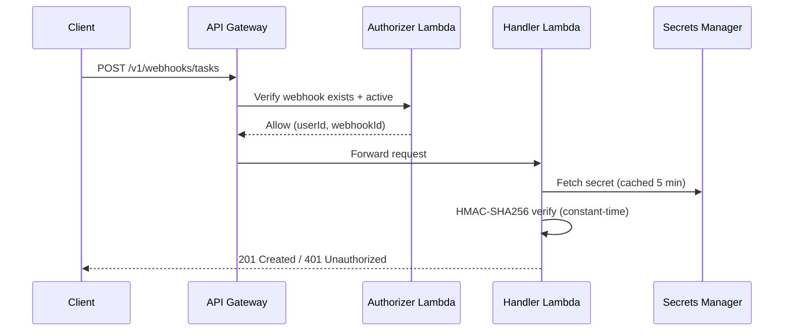

# API Contract

The REST API is the single entry point for all platform interactions. The CLI, webhook integrations, and any future clients use this API to submit tasks, check status, and manage integrations. This is a design-level specification; the source of truth for types is `cdk/src/handlers/shared/types.ts`.

- **Use this doc for:** endpoint paths, payload shapes, auth requirements, and error codes.
- **Related docs:** [INPUT_GATEWAY.md](./INPUT_GATEWAY.md) for the gateway's role, [ORCHESTRATOR.md](./ORCHESTRATOR.md) for the task state machine, [SECURITY.md](./SECURITY.md) for the authentication model.

## Base URL

| Environment | Base URL |
|---|---|
| Production | `https://{api-id}.execute-api.{region}.amazonaws.com/v1` |
| Custom domain | `https://api.{customer-domain}/v1` |

Versioning uses a path prefix (`/v1`). Breaking changes increment the version. New optional fields and endpoints do not require a version bump.

## Authentication

All endpoints require authentication. Two methods are supported:

| Channel | Method | Header |
|---------|--------|--------|
| CLI / REST | Cognito JWT | `Authorization: Bearer <token>` |
| Webhook | HMAC-SHA256 | `X-Webhook-Id` + `X-Webhook-Signature: sha256=<hex>` |

The gateway extracts `user_id` from the authenticated identity and attaches it to all internal messages. Downstream services never see raw tokens.

## Conventions

**Requests:** `application/json`, UTF-8, max 1 MB body. Clients may include an `Idempotency-Key` header on `POST` requests (24-hour TTL).

**Successful responses:**

```json
{ "data": { ... } }
```

**List responses** include pagination:

```json
{ "data": [ ... ], "pagination": { "next_token": "...", "has_more": true } }
```

**Error responses:**

```json
{ "error": { "code": "TASK_NOT_FOUND", "message": "Task abc-123 not found.", "request_id": "req-uuid" } }
```

**Standard headers:** `X-Request-Id` (ULID, all responses), `X-RateLimit-Limit`, `X-RateLimit-Remaining`, `X-RateLimit-Reset`.

## Endpoints

### Endpoint summary

| Method | Path | Auth | Description |
|--------|------|------|-------------|
| `POST` | `/v1/tasks` | Cognito | Create a task |
| `GET` | `/v1/tasks` | Cognito | List tasks (paginated) |
| `GET` | `/v1/tasks/{task_id}` | Cognito | Get task details |
| `DELETE` | `/v1/tasks/{task_id}` | Cognito | Cancel a task |
| `GET` | `/v1/tasks/{task_id}/events` | Cognito | Get task audit trail |
| `POST` | `/v1/webhooks` | Cognito | Create webhook integration |
| `GET` | `/v1/webhooks` | Cognito | List webhooks (paginated) |
| `DELETE` | `/v1/webhooks/{webhook_id}` | Cognito | Revoke webhook |
| `POST` | `/v1/webhooks/tasks` | HMAC | Create task via webhook |

### Create task

```
POST /v1/tasks
```

Creates a new task. The orchestrator runs admission control, context hydration, and starts the agent session.

**Request body:**

| Field | Type | Required | Description |
|---|---|---|---|
| `repo` | String | Yes | GitHub repository (`owner/repo`) |
| `issue_number` | Number | No | GitHub issue number. Title, body, and comments are fetched during hydration. |
| `task_description` | String | No | Free-text description (max 2,000 chars). At least one of `issue_number`, `task_description`, or `pr_number` required. |
| `task_type` | String | No | `new_task` (default), `pr_iteration`, or `pr_review` |
| `pr_number` | Number | No | PR to iterate on or review. Required when `task_type` is `pr_iteration` or `pr_review`. |
| `max_turns` | Number | No | Max agent turns (1-500, default 100) |
| `max_budget_usd` | Number | No | Cost ceiling in USD (0.01-100). If omitted, no budget limit. |
| `attachments` | Array | No | Multi-modal attachments (see below) |

**Attachments:**

| Field | Type | Required | Description |
|---|---|---|---|
| `type` | String | Yes | `image`, `file`, or `url` |
| `content_type` | String | No | MIME type (for inline data) |
| `data` | String | No | Base64-encoded content (max 10 MB decoded) |
| `url` | String | No | URL to fetch |
| `filename` | String | No | Original filename |

**Response: `201 Created`**

```json
{
  "data": {
    "task_id": "01HYX...",
    "status": "SUBMITTED",
    "repo": "org/myapp",
    "task_type": "new_task",
    "issue_number": 42,
    "branch_name": "bgagent/01HYX.../fix-auth-bug",
    "created_at": "2025-03-15T10:30:00Z"
  }
}
```

For PR tasks, `branch_name` is initially `pending:pr_resolution` and resolved to the PR's `head_ref` during hydration.

**Errors:** `400 VALIDATION_ERROR`, `400 GUARDRAIL_BLOCKED`, `401 UNAUTHORIZED`, `409 DUPLICATE_TASK`, `422 REPO_NOT_ONBOARDED`, `429 RATE_LIMIT_EXCEEDED`, `503 SERVICE_UNAVAILABLE`.

### Get task

```
GET /v1/tasks/{task_id}
```

Returns full details of a task. Users can only access their own tasks.

**Response: `200 OK`**

```json
{
  "data": {
    "task_id": "01HYX...",
    "status": "RUNNING",
    "repo": "org/myapp",
    "task_type": "new_task",
    "issue_number": 42,
    "task_description": "Fix the authentication bug in the login flow",
    "branch_name": "bgagent/01HYX.../fix-auth-bug",
    "session_id": "sess-uuid",
    "pr_url": null,
    "error_message": null,
    "error_classification": null,
    "max_turns": 100,
    "max_budget_usd": null,
    "cost_usd": null,
    "duration_s": null,
    "build_passed": null,
    "created_at": "2025-03-15T10:30:00Z",
    "updated_at": "2025-03-15T10:31:15Z",
    "started_at": "2025-03-15T10:31:10Z",
    "completed_at": null
  }
}
```

`error_classification` is a derived field computed at response time from `error_message`. When `error_message` is `null`, `error_classification` is `null`. When present, it contains:

| Field | Type | Description |
|---|---|---|
| `category` | String | One of: `auth`, `network`, `concurrency`, `compute`, `agent`, `guardrail`, `config`, `timeout`, `unknown` |
| `title` | String | Human-readable error title |
| `description` | String | Detailed explanation of what went wrong |
| `remedy` | String | Suggested action to resolve the error |
| `retryable` | Boolean | Whether retrying may succeed |

Example for a failed task:

```json
{
  "error_message": "User concurrency limit reached",
  "error_classification": {
    "category": "concurrency",
    "title": "Concurrency limit reached",
    "description": "The maximum number of concurrent tasks for this user has been reached.",
    "remedy": "Wait for an active task to complete, cancel a running task, or ask an admin to increase the limit.",
    "retryable": true
  }
}
```

**Errors:** `401 UNAUTHORIZED`, `403 FORBIDDEN`, `404 TASK_NOT_FOUND`.

### List tasks

```
GET /v1/tasks
```

Returns the authenticated user's tasks, newest first. Paginated.

**Query parameters:**

| Parameter | Type | Default | Description |
|---|---|---|---|
| `status` | String | all | Filter by status (comma-separated: `RUNNING,HYDRATING`) |
| `repo` | String | all | Filter by repository (`owner/repo`) |
| `limit` | Number | 20 | Page size (1-100) |
| `next_token` | String | - | Pagination token from previous response |

Returns a summary subset of fields. Use `GET /v1/tasks/{task_id}` for full details.

**Errors:** `400 VALIDATION_ERROR`, `401 UNAUTHORIZED`.

### Cancel task

```
DELETE /v1/tasks/{task_id}
```

Cancels a task. See [ORCHESTRATOR.md](./ORCHESTRATOR.md) for cancellation behavior by state.

**Response: `200 OK`** with `status: "CANCELLED"`.

**Errors:** `401 UNAUTHORIZED`, `403 FORBIDDEN`, `404 TASK_NOT_FOUND`, `409 TASK_ALREADY_TERMINAL`.

### Get task events

```
GET /v1/tasks/{task_id}/events
```

Returns the audit trail for a task: state transitions, hydration events, session events, and custom step events.

**Query parameters:** `limit` (default 50, max 100), `next_token`.

**Event types:** `task_created`, `admission_passed`, `admission_rejected`, `preflight_failed`, `hydration_started`, `hydration_complete`, `guardrail_blocked`, `session_started`, `session_ended`, `pr_created`, `task_completed`, `task_failed`, `task_cancelled`, `task_timed_out`. Custom blueprint steps emit `{step_name}_started`, `{step_name}_completed`, `{step_name}_failed`.

**Errors:** `401 UNAUTHORIZED`, `403 FORBIDDEN`, `404 TASK_NOT_FOUND`.

## Webhook integration

External systems (CI pipelines, GitHub Actions, custom automation) can create tasks via HMAC-authenticated requests. Webhook integrations are managed through Cognito-authenticated endpoints; task submission uses HMAC.

### Create webhook

```
POST /v1/webhooks
```

Creates a webhook and returns the shared secret (shown only once).

**Request:** `{ "name": "My CI Pipeline" }` (1-64 chars, alphanumeric + spaces/hyphens/underscores).

**Response: `201 Created`**

```json
{
  "data": {
    "webhook_id": "01HYX...",
    "name": "My CI Pipeline",
    "secret": "<64-hex-characters>",
    "created_at": "2025-03-15T10:30:00Z"
  }
}
```

Store the `secret` securely. It cannot be retrieved again.

**Errors:** `400 VALIDATION_ERROR`, `401 UNAUTHORIZED`.

### List webhooks

```
GET /v1/webhooks
```

Returns the authenticated user's webhooks. Paginated.

**Query parameters:** `include_revoked` (default `false`), `limit` (default 20), `next_token`.

**Errors:** `401 UNAUTHORIZED`.

### Revoke webhook

```
DELETE /v1/webhooks/{webhook_id}
```

Soft-revokes a webhook. The secret is scheduled for deletion with a 7-day recovery window. The revoked record is auto-deleted after 30 days.

**Errors:** `401 UNAUTHORIZED`, `404 WEBHOOK_NOT_FOUND`, `409 WEBHOOK_ALREADY_REVOKED`.

### Create task via webhook

```
POST /v1/webhooks/tasks
```

Same request body as `POST /v1/tasks`. Requires `X-Webhook-Id` and `X-Webhook-Signature` headers instead of Cognito JWT.

**Authentication flow:**



HMAC verification runs in the handler (not the authorizer) because API Gateway REST API v1 does not pass the request body to Lambda REQUEST authorizers. Authorizer caching is disabled since each request has a unique signature.

Tasks created via webhook record `channel_source: 'webhook'` with audit metadata (`webhook_id`, `source_ip`, `user_agent`).

**Errors:** `400 VALIDATION_ERROR`, `400 GUARDRAIL_BLOCKED`, `401 UNAUTHORIZED`, `409 DUPLICATE_TASK`, `503 SERVICE_UNAVAILABLE`.

## Rate limiting

| Limit | Value | Scope | Response |
|---|---|---|---|
| Request rate | 60 req/min | Per user, all endpoints | `429 Too Many Requests` |
| Task creation rate | 10 tasks/hour | Per user, task creation only | `429 RATE_LIMIT_EXCEEDED` |
| Concurrent tasks | Configurable (default 3-5) | Per user, running tasks | `409 CONCURRENCY_LIMIT_EXCEEDED` |

## Error codes

| Code | Status | Description |
|---|---|---|
| `VALIDATION_ERROR` | 400 | Invalid request body or parameters |
| `GUARDRAIL_BLOCKED` | 400 | Task description blocked by content screening |
| `UNAUTHORIZED` | 401 | Missing, expired, or invalid authentication |
| `FORBIDDEN` | 403 | Not authorized (e.g. accessing another user's task) |
| `TASK_NOT_FOUND` | 404 | Task ID does not exist |
| `WEBHOOK_NOT_FOUND` | 404 | Webhook does not exist or belongs to another user |
| `DUPLICATE_TASK` | 409 | Idempotency key matches existing task |
| `TASK_ALREADY_TERMINAL` | 409 | Cannot cancel a terminal task |
| `WEBHOOK_ALREADY_REVOKED` | 409 | Webhook is already revoked |
| `REPO_NOT_ONBOARDED` | 422 | Repository not registered (onboard via CDK, not runtime API) |
| `REPO_NOT_FOUND_OR_NO_ACCESS` | 422 | Repo onboarded but credentials cannot reach it |
| `PR_NOT_FOUND_OR_CLOSED` | 422 | PR does not exist, is closed, or is inaccessible |
| `INSUFFICIENT_GITHUB_REPO_PERMISSIONS` | 422 | GitHub token lacks required permissions for the task type |
| `GITHUB_UNREACHABLE` | 502 | GitHub API unreachable during pre-flight (transient) |
| `RATE_LIMIT_EXCEEDED` | 429 | User exceeded rate limit |
| `CONCURRENCY_LIMIT_EXCEEDED` | 409 | User at max concurrent tasks |
| `INVALID_STEP_SEQUENCE` | 500 | Blueprint step sequence misconfigured (CDK error) |
| `INTERNAL_ERROR` | 500 | Unexpected server error |
| `SERVICE_UNAVAILABLE` | 503 | Downstream dependency unavailable (retry with backoff) |

## Pagination

List endpoints use token-based pagination (consistent with DynamoDB's `ExclusiveStartKey`).

- `pagination.next_token` (opaque string) and `pagination.has_more` (boolean) in responses
- Pass `next_token` as query parameter for the next page
- Tokens are short-lived and should not be stored
- Results ordered by `created_at` descending (newest first)
