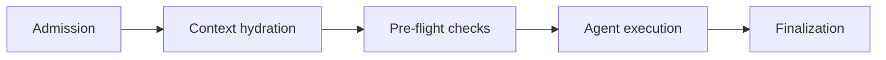

# Architecture

This document outlines the overall architecture of the platform. Each component has its own deep-dive document in this folder.

## Design principles

For long-term direction and review tenets, see [VISION.md](./VISION.md).

- **Extensibility** - Extend the system without modifying core code. Critical components are accessed through internal interfaces (ComputeStrategy, MemoryStore) so implementations can be swapped.
- **Flexibility** - This field moves fast. Components should be replaceable as better options emerge.
- **Reliability** - Long-running agents will fail. The platform must drive every task to a terminal state regardless of what happens to the agent.
- **Cost efficiency** - Agents burn hours of compute and inference tokens. Cost must be a first-class concern, not an afterthought.
- **Security by default** - Agents execute code with repo access. Isolated sandboxed environments, fine-grained access control, and least-privilege access are mandatory.
- **Observability** - Task lifecycle, agent reasoning, tool use, and outcomes should all be visible for monitoring, debugging, and improvement.

## How a task runs

Each task follows a **blueprint** - a hybrid workflow that mixes deterministic steps (no LLM, predictable, cheap) with one agentic step (LLM-driven, flexible, expensive).

1. **Admission** (deterministic) - The orchestrator validates the request, checks concurrency limits, and loads the repository's Blueprint configuration.
2. **Context hydration** (deterministic) - The platform fetches external data (GitHub issue body, PR diff, review comments), loads memory from past tasks, and assembles the full prompt. For PR tasks, the prompt is screened through Bedrock Guardrails.
3. **Pre-flight checks** (deterministic) - GitHub API reachability and repository access are verified. Doomed tasks fail fast with a clear reason before consuming compute.
4. **Agent execution** (agentic) - The agent runs in an isolated compute environment: clone repo, create branch, edit code, commit, run tests, create PR. The orchestrator polls for completion without blocking.
5. **Finalization** (deterministic) - The orchestrator infers the result (PR created or not), writes memory, updates task status, and releases concurrency.

The orchestrator and agent are deliberately separated. The orchestrator handles everything deterministic (cheap Lambda invocations); the agent handles everything that needs LLM reasoning (expensive compute + tokens). This separation provides reliability (crashed agents don't leave orphaned state), cost efficiency (bookkeeping doesn't burn tokens), security (the agent can't bypass platform invariants), and testability (deterministic steps are unit-tested without LLM calls).

For the full orchestrator design, see [ORCHESTRATOR.md](./ORCHESTRATOR.md). For the API contract, see [API_CONTRACT.md](./API_CONTRACT.md).

## Repository onboarding

Onboarding is CDK-based. Each repository is an instance of the `Blueprint` construct in the stack. The construct writes a `RepoConfig` record to DynamoDB; the orchestrator reads it at task time.

Blueprints configure how the orchestrator executes steps for each repo: compute strategy, model selection, turn limits, GitHub token, and optional custom steps. See [REPO_ONBOARDING.md](./REPO_ONBOARDING.md) for the full design.

## Model selection

Different tasks and repos may benefit from different models. The `model_id` field in the Blueprint config allows per-repo overrides:

| Task type | Suggested model | Rationale |
|---|---|---|
| `new_task` | Claude Sonnet 4 | Good balance of quality and cost |
| `pr_iteration` | Claude Sonnet 4 | Needs to understand review feedback and make code changes |
| `pr_review` | Claude Haiku | Fast and cheap - review is read-only analysis |
| Complex/critical repos | Claude Opus 4 | Highest quality, opt-in per repo |

## Cost model

The dominant cost is Bedrock inference + compute, not infrastructure. Memory, Lambda, DynamoDB, and API Gateway are a small fraction of total cost.

| Scale | Tasks/month | Estimated monthly cost |
|---|---|---|
| Low (1 developer) | 30-60 | $150-500 |
| Medium (small team) | 200-500 | $500-3,000 |
| High (org-wide) | 2,000-5,000 | $5,000-30,000 |

For the full breakdown, see [COST_MODEL.md](./COST_MODEL.md).

## Known architectural risks

Identified via external review (March 2026) and tracked in repository issues.

| Risk | Severity | Status |
|---|---|---|
| Agent vs. orchestrator DynamoDB race - agent writes terminal status without conditional expressions | High | Resolved - `ConditionExpression` guards added to agent state writes |
| No DLQ on orchestrator async invocation | High | Resolved - durable execution manages retries; CloudWatch alarm added |
| Concurrency counter drift on orchestrator crash | Medium | Resolved - `ConcurrencyReconciler` Lambda runs every 15 minutes |
| Single NAT Gateway (single AZ failure blocks egress) | Medium | Mitigated - configurable via `natGateways` prop |
| Dual-language prompt assembly (TypeScript + Python) | Medium | Mitigated - Python path retained only for local/dry-run mode |

## What ABCA is not

ABCA is not a construct library. There is no jsii compilation, no npm publishing, and no stable public API for external consumers. It is a deployable CDK application and a reference architecture for building agent platforms on AWS.

| Audience | How to use ABCA |
|---|---|
| **Operators** | Deploy the CDK app, onboard repos via Blueprint, submit tasks through CLI/API/webhooks. |
| **Platform developers** | Extend by implementing internal interfaces (ComputeStrategy, custom step Lambdas). |
| **Teams building their own platforms** | Study the architecture and design docs. Fork and adapt the patterns. |
