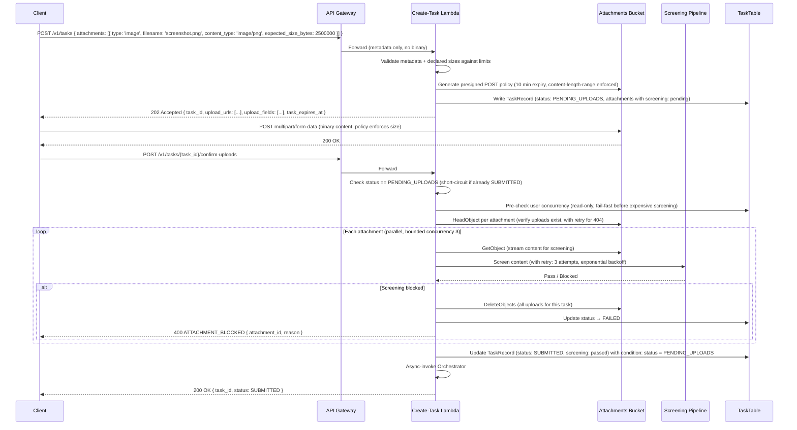
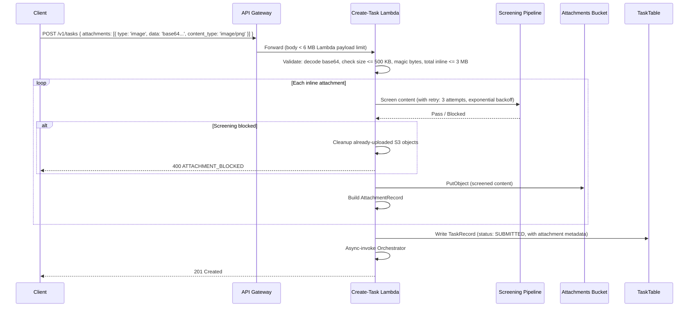
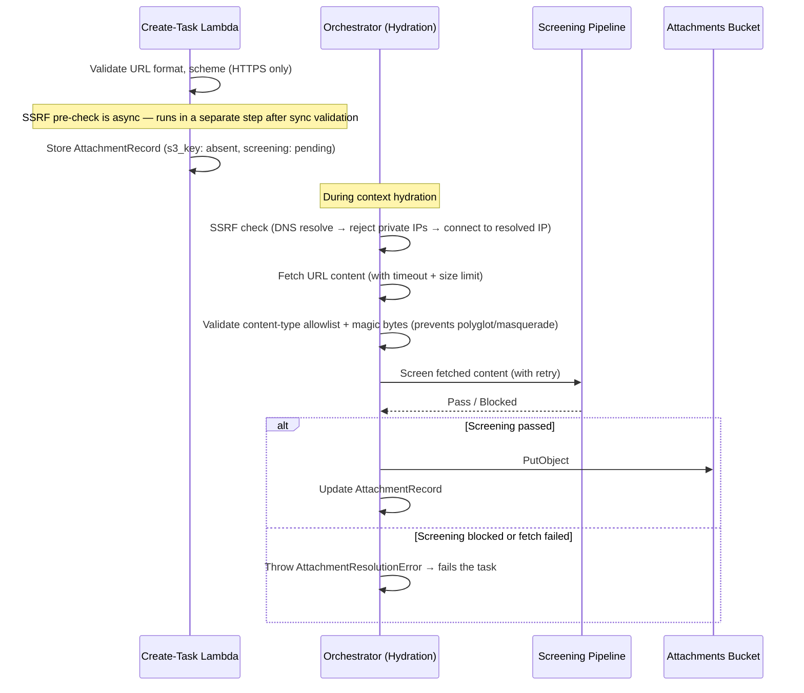
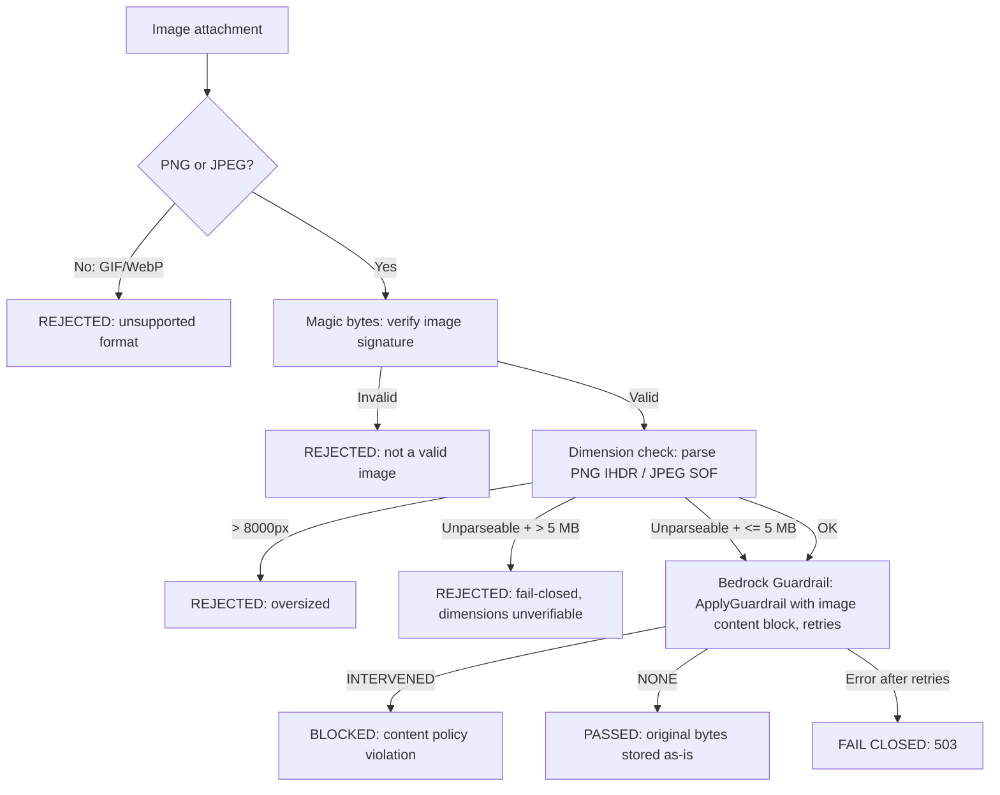
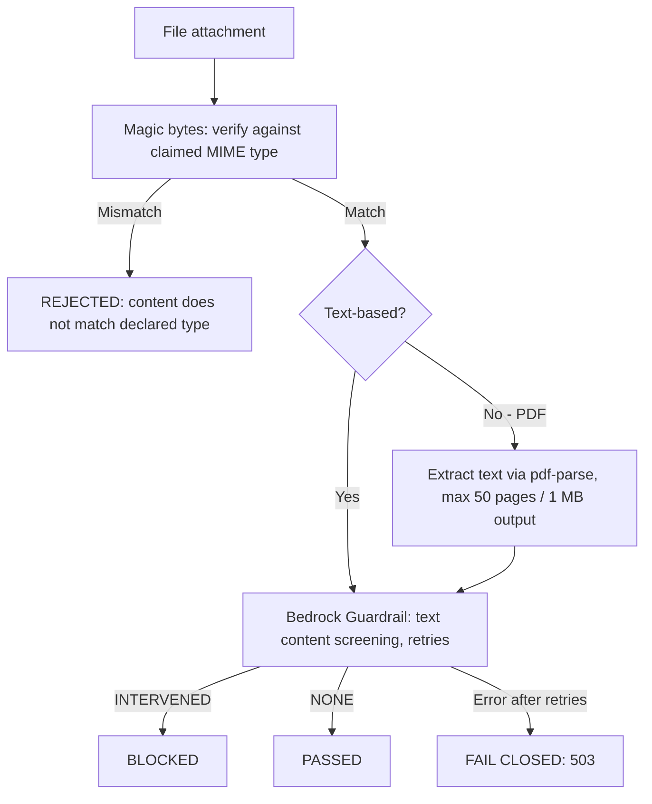
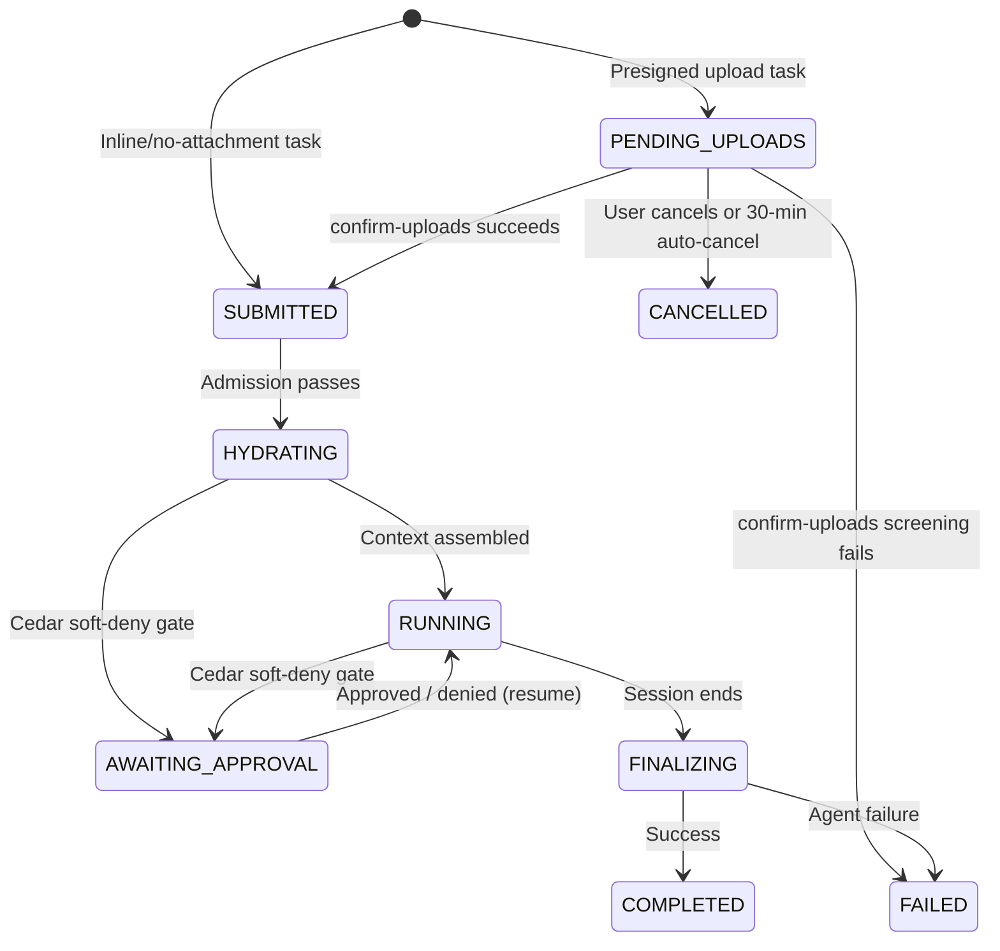

# Task Attachments (Multimodal)

End-to-end support for attaching files, images, and URLs to agent tasks. Attachments let users provide non-text context — screenshots of bugs, design mockups, CSV data, log files, code snippets — that the agent can reference during execution. Every channel (CLI, webhook, Slack, Linear) feeds the same schema; every attachment passes through security screening before reaching the agent.

- **Use this doc for:** understanding the attachment data model, upload flow, security screening pipeline, storage layout, agent consumption, and per-channel behaviour.
- **Related docs:** [API_CONTRACT.md](./API_CONTRACT.md) for the `attachments` request schema (must be updated in tandem — see [API contract sync](#api-contract-sync)), [ORCHESTRATOR.md](./ORCHESTRATOR.md) for the task lifecycle this extends, [SECURITY.md](./SECURITY.md) for guardrail and Cedar context, [ARCHITECTURE.md](./ARCHITECTURE.md) for the platform overview.

## Motivation

Today, task context is limited to text: a `task_description`, an `issue_number` (whose body is text), or a `pr_number`. Users cannot show the agent what they see. Common situations where text alone is insufficient:

1. **Bug reports with screenshots** — "The button is misaligned" means nothing without the screenshot. The user must upload the image to GitHub, create an issue, and reference it — friction that discourages use.
2. **Design mockups** — "Implement this design" requires a mockup image. Today the agent can only read text descriptions of designs.
3. **Log files and data** — A 500-line stack trace or CSV dataset is awkward to paste into a 10,000-char `task_description`.
4. **Code snippets from other repos** — "Port this function from repo X" requires the user to paste code into an issue.
5. **Integration payloads** — Linear issues or Slack threads may contain images, files, or links that are lost when only the text body is forwarded to the agent.

Attachments solve this by providing a unified carrier for all non-text task context.

## Design principles

1. **Store once, reference everywhere.** Binary data lives in S3. Every downstream consumer (orchestrator, agent, audit log) uses S3 references, never inline blobs. The primary upload path bypasses the API entirely (presigned POST policies with size enforcement); a convenience inline path exists for small attachments only.
2. **No unscreened binary content in S3.** Every attachment passes through security screening before its binary content is written to durable S3 storage. DynamoDB metadata (attachment ID, filename, pending status) may be written before screening completes, but the actual blob is gated on a passing screen result.
3. **Fail closed, fail loud.** If screening is unavailable, the task fails. If any attachment fails screening (inline, URL, or presigned), the task fails with a clear error — attachments are not silently dropped. Users can re-submit without the problematic attachment. This principle extends to the hydration fallback path — attachment resolution errors must propagate and fail the task, never be caught by the generic infrastructure fallback (see [Hydration error handling](#hydration-error-handling)).
4. **Channel-agnostic schema.** The `Attachment` type is the same whether the source is a CLI flag, a webhook JSON field, a Slack file upload, or a Linear issue image. Channel-specific adapters normalize to this schema before entering the shared path.
5. **Agent sees files, not infrastructure.** The agent receives attachments as local files in its workspace (images, documents) or as prompt content blocks (images for multimodal models). It does not interact with S3 directly.

## Data model

### Shared types

Extract a shared `AttachmentType` literal union, reused across all attachment-related interfaces (same pattern as `TaskType` and `ChannelSource`):

```typescript
/** Shared across all attachment interfaces. Add new types here (e.g., 'audio'). */
export type AttachmentType = 'image' | 'file' | 'url';
```

### Attachment schema (API layer)

The existing `Attachment` interface in `types.ts` is a flat union of optional fields. For deserialization from untrusted JSON this is fine, but downstream consumers benefit from a validated discriminated union. The design uses two layers:

**Wire format (deserialization):** The existing `Attachment` interface in `types.ts` (lines 283-289) is modified in-place — adding `expected_size_bytes` for presigned upload budget pre-checks. This is a non-breaking change (new optional field). All fields beyond `type` remain optional because the input is untrusted:

```typescript
/** Wire format — parsed from untrusted JSON. Validate before use. */
interface Attachment {
  readonly type: AttachmentType;
  readonly content_type?: string;
  readonly data?: string;          // Base64-encoded content (inline upload, max 500 KB decoded)
  readonly url?: string;           // URL to fetch (url type)
  readonly filename?: string;      // Original filename
  readonly expected_size_bytes?: number;  // Declared size for presigned uploads (required for budget pre-check)
}
```

**Validated format (post-validation):** After `validateAttachments()` succeeds, the result is a discriminated union that makes illegal states unrepresentable:

```typescript
/** Delivery mechanism — discriminant for the three upload paths.
 *  `type` alone cannot distinguish inline from presigned (both are 'image' | 'file'),
 *  so `delivery` provides the exhaustive three-way branch. */
type AttachmentDelivery = 'inline' | 'presigned' | 'url_fetch';

interface BaseAttachment {
  readonly filename: string;        // Required after validation (generated if absent)
  readonly content_type: string;    // Required after validation (detected from magic bytes if absent)
}

/** Inline image/file: data present, validated, decoded, magic-bytes checked */
interface InlineAttachment extends BaseAttachment {
  readonly delivery: 'inline';
  readonly type: 'image' | 'file';
  readonly data: string;            // Validated base64
  readonly url?: never;
  readonly decoded_size_bytes: number;
}

/** Presigned upload: metadata only, no data, no url */
interface PresignedAttachment extends BaseAttachment {
  readonly delivery: 'presigned';
  readonly type: 'image' | 'file';
  readonly data?: never;
  readonly url?: never;
  readonly expected_size_bytes: number;  // Declared by client for early budget validation
}

/** URL to fetch during hydration */
interface UrlAttachment extends BaseAttachment {
  readonly delivery: 'url_fetch';
  readonly type: 'url';
  readonly url: string;
  readonly data?: never;
}

/** Output of validateAttachments() — illegal combinations are unrepresentable */
type ValidatedAttachment = InlineAttachment | PresignedAttachment | UrlAttachment;
```

The `delivery` field is the primary discriminant for exhaustive `switch` statements: `switch (att.delivery)` branches into the three upload paths without nested `if ('data' in att)` checks. The `type` field (`'image' | 'file' | 'url'`) describes the content kind. The `never` fields prevent accidental inclusion of forbidden properties at compile time. Note: `never` only provides compile-time protection — the validation function must construct each variant explicitly (see [Validation changes](#validation-changes)) to guarantee forbidden fields are absent at runtime.

### Attachment record (persisted metadata)

After upload and screening, each attachment becomes an `AttachmentRecord` stored as part of the `TaskRecord` in DynamoDB. The `screening` field is a discriminated union that prevents nonsensical states (e.g., a `passed` record with blocking categories):

```typescript
/** Screening outcome — discriminated union prevents invalid combinations.
 *  `categories` uses a non-empty tuple type to make empty-array states unrepresentable. */
type ScreeningResult =
  | { readonly status: 'pending' }
  | { readonly status: 'passed'; readonly screened_at: string }
  | { readonly status: 'blocked'; readonly screened_at: string; readonly categories: [string, ...string[]] };

interface AttachmentRecord {
  readonly attachment_id: string;     // ULID
  readonly type: AttachmentType;
  readonly content_type: string;      // Resolved MIME type
  readonly filename: string;          // Original or generated filename
  readonly s3_key?: string;           // S3 object key — absent when pending (URL not yet fetched)
  readonly s3_version_id?: string;    // S3 object version — pinned at screening time (see S3 versioning)
  readonly size_bytes?: number;       // Decoded content size — absent when pending
  readonly screening: ScreeningResult;
  readonly source_url?: string;       // Original URL (for url type or channel-sourced)
  readonly checksum_sha256?: string;  // Lowercase hex-encoded SHA-256 (64 chars) — required when screening.status === 'passed' (enforced by factory)
  readonly token_estimate?: number;   // Estimated token cost (images only)
}
```

**Runtime validation note:** The `ScreeningResult` discriminated union and the `[string, ...string[]]` non-empty tuple provide compile-time safety, but data read from DynamoDB is untyped at runtime. The `createAttachmentRecord` factory (below) validates these invariants at construction time. For records read back from DynamoDB, a `parseScreeningResult(raw: unknown): ScreeningResult` function must validate: (a) `status` is one of the three allowed values, (b) `screened_at` is present when status is `passed` or `blocked`, (c) `categories` is a non-empty array when status is `blocked`. This parser is called in the DynamoDB → `AttachmentRecord` mapper (same pattern as the existing `toTaskDetail` mapper). Invalid data throws rather than silently returning a malformed object.

**Changes from prior version:** `s3_key` and `size_bytes` are now `undefined` when pending (not sentinel values `'pending'` and `0`). This is idiomatic TypeScript — the compiler forces null-checks on consumers instead of relying on documentation about magic values.

The `TaskRecord` gains an `attachments?: AttachmentRecord[]` field. This stores metadata only — binary content lives in S3.

**Construction (Phase 1 — ships with the type definitions):** A factory function `createAttachmentRecord(params)` centralizes construction validation, matching the codebase pattern of mapper functions like `toTaskDetail`. This ships in Phase 1 alongside the type definitions — not deferred — because cross-field invariants (`s3_key` required when screening passed, `checksum_sha256` required when screening passed, `token_estimate` required for images) are too dangerous to leave unenforced during 4 phases of development:

```typescript
function createAttachmentRecord(params: CreateAttachmentRecordParams): AttachmentRecord {
  // Validates invariants:
  // - s3_key and s3_version_id required when screening.status === 'passed'
  // - checksum_sha256 required when screening.status === 'passed'
  // - size_bytes required when screening.status === 'passed'
  // - categories non-empty when screening.status === 'blocked'
  // Note: token_estimate is best-effort for images (dimension parsing may fail on unusual formats),
  // so it is NOT enforced here. The budget check uses a conservative fallback when absent.
  if (params.screening.status === 'passed') {
    if (!params.s3_key || !params.s3_version_id || !params.checksum_sha256 || !params.size_bytes) {
      throw new Error('Passed screening requires s3_key, s3_version_id, checksum_sha256, and size_bytes');
    }
  }
  return params as AttachmentRecord;
}
```

### Agent payload type

A named TypeScript interface for the orchestrator → agent payload (not an anonymous `.map()` shape). This enables test contracts and prevents silent drift between the TypeScript producer and Python consumer:

```typescript
/** Attachment descriptor sent to the agent runtime. Exported for test assertions. */
export interface AgentAttachmentPayload {
  readonly attachment_id: string;
  readonly type: AttachmentType;
  readonly content_type: string;
  readonly filename: string;
  readonly s3_uri: string;           // s3://bucket/attachments/user/task/att/file.png
  readonly s3_version_id: string;    // Pinned S3 object version — prevents TOCTOU between screening and download
  readonly size_bytes: number;
  readonly source_url?: string;      // Original URL (for url type)
  readonly token_estimate?: number;  // Images only
  readonly checksum_sha256: string;  // Lowercase hex-encoded SHA-256 (64 chars) of screened content — agent verifies after download
}
```

A test should assert field-for-field parity between this interface and the Python `AttachmentConfig` Pydantic model.

### S3 key layout

```
attachments/<user_id>/<task_id>/<attachment_id>/<filename>
```

Example: `attachments/us-east-1:abc123/01J5X7.../01J5X8.../screenshot.png`

The `<attachment_id>` segment ensures uniqueness even if multiple attachments share the same filename. The `<filename>` suffix preserves the original name for human-readable S3 console browsing and for the agent (which receives the file under its original name).

## Limits

| Limit | Value | Rationale |
|---|---|---|
| Max attachments per task | 10 | Bounds screening cost and agent context size |
| Max size per attachment (decoded) | 10 MB | Bedrock image input limit; practical for screenshots/logs |
| Max inline data per attachment | 500 KB decoded | The Lambda synchronous invocation payload limit is **6 MB**. At 500 KB decoded (~667 KB base64) per attachment, even 5 inline attachments plus request JSON stays under 6 MB. The presigned path handles anything larger. |
| Max total inline data per request | 3 MB decoded | Hard cap on total base64-decoded bytes in a single request. Even with base64 overhead (~4 MB encoded) plus JSON fields, this stays under the 6 MB Lambda payload limit. |
| Max total size per task | 50 MB | Prevents abuse; bounds total screening and transfer time |
| Max task_description length | 10,000 chars | Increased from 2,000. **This is a standalone API change that affects all tasks** (not just attachment tasks). Rationale: (a) attachments need rich explanatory context ("implement this design per the attached mockup, paying attention to the header layout"), (b) multiple users have reported the 2K limit as a friction point for complex task descriptions even without attachments, (c) the guardrail screening cost increase is minimal (text screening is cheap), (d) DynamoDB item size impact is negligible (~8 KB vs ~2 KB for the description field). **Requires updating [API_CONTRACT.md](./API_CONTRACT.md) line 82 in tandem.** |
| Allowed image MIME types | `image/png`, `image/jpeg` | Bedrock-supported formats; GIF/WebP removed to eliminate native image processing dependency |
| Allowed file MIME types | `text/plain`, `text/csv`, `text/markdown`, `application/json`, `application/pdf`, `text/x-log` | Useful for code/data context; no executables |
| Max URL fetch size | 10 MB | Same per-attachment limit for fetched content |
| URL fetch timeout | 10 seconds | Prevent SSRF-style long-poll attacks |
| URL scheme | `https` only | No `http`, `file`, `ftp`, or custom schemes |

**Payload limit note:** The binding constraint for the inline path is **not** the API Gateway 10 MB body limit — it is the **Lambda synchronous invocation payload limit of 6 MB**. API Gateway REST API forwards the request body to Lambda as part of the invocation payload, which includes the body plus API Gateway metadata. The limits above are set conservatively to ensure the full payload stays under 6 MB.

## Upload flows

The design provides three upload paths, unified by a common screening + S3 storage backend. The presigned upload is the primary path for files > 500 KB; inline base64 is a convenience for small attachments; URL fetch handles remote resources.

### Primary path: Presigned URL upload

For attachments > 500 KB (or any attachment where the client prefers not to base64-encode), the client requests a presigned POST policy and uploads directly to S3. This bypasses the Lambda payload limit entirely. S3 enforces the `content-length-range` condition server-side, rejecting oversized uploads before storing them.



**Key details:**

- **New task status: `PENDING_UPLOADS`.** Tasks with presigned-upload attachments are created in `PENDING_UPLOADS` status. They do not enter the orchestration pipeline until uploads are confirmed. See [State machine changes](#state-machine-changes) for the full transition table.
- **Declared sizes for early budget validation.** Clients must include `expected_size_bytes` for presigned attachments. The create-task handler validates total declared size against the 50 MB limit immediately, preventing the user from uploading 100 MB only to be rejected at confirm-uploads.
- **Presigned POST policy generation.** S3 presigned POST policies (via `createPresignedPost` from `@aws-sdk/s3-presigned-post`) support **`content-length-range` conditions**, enforcing the 10 MB per-attachment limit at the S3 layer. This is preferred over presigned PUT URLs, which cannot enforce `Content-Length`. The presigned POST also fixes `Content-Type` and the S3 key. The 10-minute policy expiry bounds the upload window. Clients must use `multipart/form-data` POST (not PUT) to upload.
- **Confirm-uploads endpoint.** `POST /v1/tasks/{task_id}/confirm-uploads` triggers screening and transitions to `SUBMITTED`. See [Confirm-uploads concurrency](#confirm-uploads-concurrency) for the race-condition handling.
- **Parallel screening with bounded concurrency.** Attachments are screened in parallel (max 3 concurrent) to reduce wall time. Sequential screening of 10 large images can exceed the Lambda timeout; parallel processing with concurrency 3 keeps worst-case under the timeout budget (see [CDK construct changes](#cdk-construct-changes)).
- **Atomic failure.** If any attachment fails screening, the entire task fails. All uploaded objects are deleted. The user gets a clear error identifying which attachment was blocked and why.
- **HeadObject retry for incomplete uploads.** When `confirm-uploads` is called immediately after the client receives 200 from S3, there is a brief S3 eventual-consistency window where `HeadObject` may return 404. The handler retries `HeadObject` up to 3 times with 1-second delays before concluding the object is truly missing. After retries exhaust, the handler returns `400 ATTACHMENT_SIZE_MISMATCH` with message: "Upload for `{filename}` not found. Ensure the upload completed successfully before calling confirm-uploads." This differentiates "upload in progress" from "upload never happened" (the latter should not retry indefinitely).

### Confirm-uploads concurrency

Two concurrent `confirm-uploads` calls can race. The design prevents corruption through three mechanisms:

1. **Early short-circuit:** The handler reads the task status first. If status is not `PENDING_UPLOADS`, return the current task status immediately (idempotent success for `SUBMITTED`, error for `FAILED`/`CANCELLED`). This avoids redundant screening work.
2. **Conditional DynamoDB write:** The final status transition uses `ConditionExpression: 'status = :pending_uploads'`. Only one caller wins the write. The loser gets `ConditionalCheckFailedException`, which the handler maps to an idempotent success response (re-read the task and return current status).
3. **Safe cleanup via conditional write result:** On screening failure, the handler attempts a conditional DynamoDB write to `FAILED` (`ConditionExpression: 'status = PENDING_UPLOADS'`). If the write **succeeds**, this caller owns the failure — proceed with S3 cleanup. If the write **fails** (`ConditionalCheckFailedException`), another caller already transitioned to `SUBMITTED` — skip cleanup entirely (those objects are needed by the running agent). The conditional write result is the authoritative signal, eliminating the TOCTOU window that would exist with a separate "read status then delete" approach.

```typescript
// In confirm-uploads handler:
try {
  await dynamoClient.send(new UpdateCommand({
    TableName: TASK_TABLE,
    Key: { task_id },
    UpdateExpression: 'SET #s = :submitted, ...',
    ConditionExpression: '#s = :pending_uploads',
    ...
  }));
} catch (err) {
  if (err instanceof ConditionalCheckFailedException) {
    // Another caller already transitioned — return current state (idempotent)
    const current = await getTask(task_id);
    return toTaskDetailResponse(current);
  }
  throw err;
}
```

### Idempotency key interaction with PENDING_UPLOADS

When a client retries a task creation with the same idempotency key, the existing task may be in `PENDING_UPLOADS` with expired presigned POST policies. The idempotency check is special-cased:

| Existing task status | Presigned URLs expired? | Behaviour |
|---|---|---|
| `PENDING_UPLOADS` | No (< 10 min old) | Return existing response with original upload instructions (true idempotency) |
| `PENDING_UPLOADS` | Yes (> 10 min old) | Generate new attachment IDs + new S3 keys, generate new presigned POST policies, update AttachmentRecords in DynamoDB (conditional write: `ConditionExpression: 'status = PENDING_UPLOADS'` — prevents clobbering a concurrent `confirm-uploads` that transitioned to `SUBMITTED`), return updated response. If the conditional write fails, re-read the task and return current status. |
| `SUBMITTED` or later | N/A | Return existing task (standard idempotency) |
| `FAILED` / `CANCELLED` | N/A | Return existing task (standard idempotency) |

This prevents the deadlock where a client crash leaves an unreachable `PENDING_UPLOADS` task blocking retries for 30 minutes.

**Presigned POST policy expiry and clock skew:** The 10-minute policy expiry uses the server's clock (AWS SigV4 signing time). Clients with clock skew > 5 minutes may find policies expire earlier than expected. The 10-minute window provides ~5 minutes of effective skew tolerance. Clients that consistently fail uploads should check their system clock (AWS SDK requests also fail with > 15 minutes skew). The CLI should log the server's `Date` header on upload failure to help users diagnose clock issues.

**Why new S3 keys on retry:** Regenerating presigned POST policies for the same S3 keys creates a collision risk if the first client instance is still alive (e.g., network partition, not a crash). Both instances would upload to the same key, with one overwriting the other. Using new attachment IDs (and therefore new S3 key paths) ensures concurrent client instances cannot interfere. The orphaned objects from the original attempt are cleaned up by the auto-cancel rule or the 90-day lifecycle.

### Convenience path: Inline base64 (small attachments)

For attachments <= 500 KB decoded, clients can include base64-encoded content directly in the `POST /v1/tasks` body. This avoids the two-phase round trip for small files like cropped screenshots and short logs.



**Limit rationale:** The binding constraint is the **6 MB Lambda synchronous invocation payload limit** (not the 10 MB API Gateway body limit). The API Gateway forwards the full request body to Lambda as part of the invocation payload. At 500 KB decoded per inline attachment (~667 KB base64), with 3 MB total decoded (~4 MB base64), plus JSON overhead and API Gateway metadata, the total stays safely under 6 MB. In practice, most inline attachments are small screenshots (100-300 KB) where one or two are included alongside a task description.

### URL fetch (deferred download)

For `type: 'url'` attachments, the content is fetched during context hydration (not at submission time), because:

1. The URL may require the repo's GitHub token to access (e.g., private repo assets).
2. Fetching at submission time blocks the API response on external network calls.
3. The content should be fresh at agent execution time, not stale from hours-ago submission.



**Failure semantics:** A blocked or unfetchable URL attachment **fails the task** — same as inline attachments. The user chose the URL; they expect it to work. The error message identifies the problematic URL and reason (blocked content, fetch timeout, DNS failure, SSRF violation). The user can re-submit without the problematic URL.

**User notification for async failures:** URL fetch failures occur during hydration (minutes after submission). The user has already received a `201 Created` response. The failure surfaces through:
- Task status transitions to `FAILED` with `error_message` identifying the attachment and reason.
- A `task_failed` event is written to `TaskEventsTable`.
- Notifications (if configured): Slack reply, Linear comment, or webhook callback.
- The CLI `bgagent submit` with URL attachments should poll for the `HYDRATING → RUNNING` transition before returning, surfacing early failures inline.

**SSRF protections** (applied at fetch-time in the orchestrator Lambda):

1. **URL scheme:** Only `https` is allowed. No `http`, `file`, `ftp`, or custom schemes. Validated synchronously at submission time.
2. **DNS resolution pinning (prevents DNS rebinding):** The fetch implementation must: (a) resolve DNS manually (e.g., via `dns.resolve4`/`dns.resolve6`), (b) validate the resolved IP against private ranges (`10.0.0.0/8`, `172.16.0.0/12`, `192.168.0.0/16`, `169.254.0.0/16`, `127.0.0.0/8`, `::1`, `fd00::/8`), (c) connect to the validated IP directly using `undici`'s `connect` option or equivalent — **pinning** the connection to the resolved IP and preventing the HTTP library from doing a second DNS lookup that could return a different (malicious) IP. This technique is called "DNS resolution pinning" and it mitigates the DNS rebinding attack, where an attacker's DNS server returns a public IP on the first lookup (passing validation) then a private IP on the second lookup (reaching internal services).
3. **Redirect limits:** Follow at most 2 redirects. Re-validate the target URL and resolved IP after each redirect.
4. **Timeout and size:** 10-second timeout, 10 MB max response body. Stream the response and abort if the size limit is exceeded.
5. **No auth headers to non-GitHub URLs:** Only GitHub URLs (matching the repo's installation) receive the GitHub token. All other URLs are fetched without credentials.

**URL fetch policy (open fetch with SSRF protection):** The default policy allows fetching from any public HTTPS URL that passes SSRF validation. This supports real-world use cases (Figma exports, Google Docs, Confluence, etc.) without requiring per-deployment configuration. Repos can optionally restrict to a URL allowlist via blueprint config:

```json
{
  "attachments": {
    "url_allowlist": ["raw.githubusercontent.com", "*.figma.com", "docs.google.com"],
    "url_denylist": ["*.internal.company.com"]
  }
}
```

When `url_allowlist` is set, only matching URLs are allowed. When absent (default), any public HTTPS URL passing SSRF checks is permitted. `url_denylist` is always evaluated regardless of allowlist.

## Security screening pipeline

Every attachment passes through a type-specific screening pipeline before its binary content reaches durable S3 storage or the agent. The pipeline is fail-closed: if any screening step is unavailable after retries, the attachment (and the task) is rejected.

### Retry strategy

All Bedrock `ApplyGuardrailCommand` calls use exponential backoff before failing closed:

- **Max retries:** 3
- **Backoff:** 200ms, 400ms, 800ms
- **Retryable errors:** HTTP 429 (throttling), HTTP 5xx (transient service errors)
- **Non-retryable errors:** HTTP 4xx (except 429), validation errors, content policy violations (`INTERVENED`)

This prevents a single transient Bedrock hiccup from failing an entire task after the user waited for 10 attachments to upload.

### Image screening



**Supported formats:** Only `image/png` and `image/jpeg` are accepted. GIF and WebP are rejected at the validation layer. This eliminates the need for a native image processing library (sharp/libvips) — raw image bytes are passed directly to Bedrock for screening.

**Magic bytes validation:** Verify the first bytes against known image signatures before any further processing. A file claiming to be `image/png` must start with `\x89PNG\r\n\x1a\n`. This prevents polyglot files (e.g., an image header followed by executable code) from reaching the screening pipeline.

**Dimension checks:** Image dimensions are read from PNG IHDR chunks and JPEG SOF markers using pure buffer parsing (no native dependencies). Images exceeding 8000px on either side are rejected before the Bedrock call. For PNGs, a missing IHDR chunk is a hard failure (the file is corrupt or incomplete). For JPEGs, if the SOF marker cannot be found: files > 5 MB are rejected (fail-closed — an unparseable large JPEG is too risky to forward without dimension verification); smaller files are allowed through with a logged warning, relying on Bedrock's own validation to reject oversized images.

**Bedrock image screening:** The `ApplyGuardrailCommand` supports `image` content blocks with `png` and `jpeg` formats. Raw image bytes are passed directly — no re-encoding or format conversion needed.

**No EXIF stripping:** Images are stored as-is after screening passes. EXIF metadata (GPS, camera info) is not stripped since attachments are uploaded by the task submitter for their own agent. This trade-off eliminates the native `sharp`/`libvips` dependency, which caused cross-platform build issues and Lambda ARM64 decode failures.

### File screening



**Magic bytes validation:** Don't trust `content_type` from the client. Validate the first bytes of the content against known signatures for allowed types:

| MIME type | Expected magic bytes |
|---|---|
| `application/pdf` | `%PDF-` |
| `application/json` | Starts with `{`, `[`, or UTF-8 BOM + `{`/`[` |
| `text/*` | Valid UTF-8, no null bytes in first 8 KB |
| `image/png` | `\x89PNG\r\n\x1a\n` |
| `image/jpeg` | `\xFF\xD8\xFF` |

A file claiming to be `text/plain` but starting with `MZ` (PE executable) or `PK` (ZIP) is rejected immediately.

**Text content screening:** For text-based files (plain text, CSV, Markdown, JSON), the full content is screened through the same Bedrock Guardrail used for task descriptions. For PDFs, text is extracted first (using `pdf-parse`, capped at 50 pages and 1 MB extracted text output to prevent decompression bombs) and then screened.

**PDF extraction failure handling:** `pdf-parse` is wrapped in a try-catch with a 15-second timeout. Corrupt PDFs, deeply nested objects, or excessive embedded fonts can cause OOM before the page limit takes effect. On any `pdf-parse` failure (exception, timeout, or OOM), the attachment is **rejected** with `ATTACHMENT_INVALID_CONTENT` and message: "PDF could not be processed. It may be corrupt or use unsupported features. Try exporting to a simpler PDF format." Consider running `pdf-parse` in a child process with a memory limit to prevent Lambda OOM when the confirm-uploads Lambda is processing multiple PDFs concurrently.

**No executable content:** The MIME allowlist explicitly excludes executables, archives, and scripts. This is a hard boundary — there is no override. If a user needs to share a shell script, they should paste it as text in the task description or commit it to the repo.

### Screening result caching

Screening results are not cached. Each attachment is screened exactly once, at upload/fetch time. The `screening` field in `AttachmentRecord` records the outcome for audit purposes. Re-screening is not needed because:

- Attachments are immutable once stored (no update API).
- Guardrail policies may change, but retroactive re-screening of existing attachments is a separate concern (batch job, not inline).

## Storage: Attachments S3 bucket

A new CDK construct, `AttachmentsBucket`, following the same pattern as `TraceArtifactsBucket`:

```typescript
// cdk/src/constructs/attachments-bucket.ts

/** Props interface mirrors TraceArtifactsBucketProps for consistency. */
export interface AttachmentsBucketProps {
  readonly removalPolicy?: RemovalPolicy;     // Default: DESTROY (dev-friendly; override for prod)
  readonly autoDeleteObjects?: boolean;       // Default: true (matches removalPolicy: DESTROY)
}

export class AttachmentsBucket extends Construct {
  public readonly bucket: s3.Bucket;

  constructor(scope: Construct, id: string, props: AttachmentsBucketProps = {}) {
    super(scope, id);

    this.bucket = new s3.Bucket(this, 'Bucket', {
      encryption: s3.BucketEncryption.S3_MANAGED,
      blockPublicAccess: s3.BlockPublicAccess.BLOCK_ALL,
      enforceSSL: true,
      versioned: true,  // Required: pins object versions at screening time to prevent TOCTOU
      lifecycleRules: [
        {
          expiration: Duration.days(ATTACHMENT_TTL_DAYS),  // 90 days — matches task retention
          noncurrentVersionExpiration: Duration.days(7),   // Noncurrent versions kept 7 days (see rationale below)
          abortIncompleteMultipartUploadAfter: Duration.days(1),
        },
      ],
      removalPolicy: props.removalPolicy ?? RemovalPolicy.DESTROY,
      autoDeleteObjects: props.autoDeleteObjects ?? true,
    });
  }
}
```

**S3 versioning (TOCTOU prevention):** The bucket has versioning enabled. This prevents a class of attack where a client uploads benign content (passes screening), then replaces the S3 object with malicious content before the agent downloads it. The mitigation flow:

1. At `confirm-uploads` time, `HeadObject` records the `VersionId`.
2. `GetObject` for screening specifies `VersionId` — screens exactly the uploaded version.
3. After screening passes, the `VersionId` is stored in `AttachmentRecord.s3_version_id`.
4. The `AgentAttachmentPayload` includes `s3_version_id`. The agent downloads with `VersionId` pinned.
5. Even if the presigned URL is still valid and the client uploads a second version, the agent always downloads the screened version.
6. `noncurrentVersionExpiration: 7 days` — old versions are cleaned up after a safe window. The 7-day retention ensures that even the longest-running tasks (max_turns=500 with slow models, potentially 24-48 hours) can always access the screened version. After 7 days, any task still referencing a noncurrent version is either completed or stuck in a terminal state.

**Lifecycle:** 90 days, matching the task record TTL (confirmed: `TASK_RETENTION_DAYS` defaults to 90 in `task-api.ts`). When a task expires from DynamoDB, its attachments expire from S3 around the same time. No cross-resource cleanup needed.

**IAM grants:**

| Principal | Grant | Purpose |
|---|---|---|
| Create-task Lambda | `grantPut`, `grantDelete` | Upload inline attachments; delete on partial failure cleanup |
| Confirm-uploads Lambda | `grantRead`, `grantPut`, `grantDelete` | Read for screening; re-upload cleaned images; delete blocked content |
| Orchestrator Lambda | `grantReadWrite` | Fetch URL attachments during hydration; write screened content |
| Agent runtime (AgentCore / ECS) | `grantRead` | Download attachments into workspace via IAM role |

**Presigned POST policy generation:**

```typescript
import { createPresignedPost } from '@aws-sdk/s3-presigned-post';

const { url, fields } = await createPresignedPost(s3Client, {
  Bucket: ATTACHMENTS_BUCKET,
  Key: s3Key,
  Conditions: [
    ['content-length-range', 1, MAX_ATTACHMENT_SIZE_BYTES],  // 1 byte to 10 MB
    ['eq', '$Content-Type', declaredMimeType],
  ],
  Fields: {
    'Content-Type': declaredMimeType,
  },
  Expires: 600,  // 10 minutes
});
// Presigned POST policies enforce content-length-range at the S3 layer.
// S3 rejects uploads outside the declared range BEFORE storing the object.
// The Content-Type is fixed by the policy — mismatched uploads fail.
// Clients must POST with multipart/form-data (not PUT).
```

**Why presigned POST over presigned PUT:** Presigned PUT URLs (`getSignedUrl` with `PutObjectCommand`) **cannot enforce `Content-Length` conditions** — the only way to limit upload size with PUT is a bucket resource policy using `s3:content-length-range`, but this condition key is **not documented for `s3:PutObject` actions in bucket policies** and its behavior is unreliable. Presigned POST policies, in contrast, have `content-length-range` as a [documented, first-class condition](https://docs.aws.amazon.com/AmazonS3/latest/API/sigv4-HTTPPOSTConstructPolicy.html#sigv4-PolicyConditions) that S3 enforces server-side before writing the object. This provides reliable, documented size enforcement at the S3 layer.

**Client upload format:** Clients upload via `POST` with `multipart/form-data`, including the policy fields returned in the creation response. The CLI and webhook documentation include code examples. This is a minor ergonomic tradeoff (form-data POST vs raw PUT) for guaranteed size enforcement.

**Defense-in-depth:** Even with presigned POST size enforcement, the `confirm-uploads` handler still validates object sizes via `HeadObject` (defense-in-depth against implementation bugs). The auto-cancel cleanup Lambda also deletes ALL objects under a task's `attachments/<user>/<task>/` prefix (not just confirmed ones), catching objects from tasks that were never confirmed.

## Orchestrator integration

### Hydration error handling

The existing `hydrateContext()` has a broad infrastructure-failure catch block (context-hydration.ts lines 1157-1189) that returns minimal context (task_description only) and sets `fallback_error` — allowing the task to proceed with degraded context. This is acceptable for optional context (e.g., a memory lookup failure), but **not acceptable for attachments**.

If the user explicitly provided attachments, proceeding without them produces incorrect agent output. Attachment resolution errors must **propagate and fail the task**, not be caught by the generic fallback.

**Implementation (Phase 1, step 10 — ships before any code throws these errors):** Create an `AttachmentError` base class. All attachment-related errors (`AttachmentResolutionError`, `AttachmentBudgetExceededError`, `AttachmentDownloadError`, `AttachmentIntegrityError`) extend this base class. A single `instanceof AttachmentError` check in the hydration catch block covers all current and future attachment error types, avoiding a growing allowlist. This is wired into the catch block in Phase 1 (alongside the class definitions), not deferred — ensuring no deployment window exists where typed errors are thrown but not re-thrown:

```typescript
// Error class hierarchy:
export class AttachmentError extends Error { }
export class AttachmentResolutionError extends AttachmentError { }
export class AttachmentBudgetExceededError extends AttachmentError { }

// In hydrateContext() catch block:
} catch (err) {
  if (
    err instanceof GuardrailScreeningError ||
    err instanceof AttachmentError ||  // NEW: covers all attachment errors (budget, resolution, integrity)
    err instanceof TypeError ||
    err instanceof RangeError ||
    err instanceof ReferenceError
  ) {
    throw err;  // Do not swallow — these must fail the task
  }
  // Only non-critical infrastructure errors fall through to the fallback path
  ...
}
```

Using a base class instead of individual `instanceof` checks prevents the bug where a new error type (e.g., `AttachmentBudgetExceededError`) is added to `resolveAttachments()` but not to the re-throw list — causing it to be silently swallowed by the infrastructure fallback.

### Context hydration changes

The `hydrateContext()` function gains an attachment resolution step that runs in parallel with issue/PR/memory fetching:

```typescript
// In hydrateContext(), added to the parallel fetch block:
const resolvedAttachments = await resolveAttachments(
  task.attachments,       // AttachmentRecord[] from TaskRecord
  attachmentsBucket,
  githubToken,            // For URL fetches requiring auth
  bedrockClient,
  guardrailConfig,
);
```

`resolveAttachments()` handles:

1. **Inline/presigned attachments (already screened, already in S3):** Validate S3 key exists, compute `s3_uri` for the agent.
2. **URL attachments (not yet fetched):** Fetch (with SSRF protections), screen (with retry), upload to S3, compute `s3_uri`. On any failure, throw `AttachmentResolutionError` which fails the task.
3. **Token budget accounting:** Estimate token cost of image attachments and deduct from the available prompt budget (see [Token budget](#token-budget-accounting)).

### Payload changes

The orchestrator payload to the agent gains a top-level `attachments` field using the named `AgentAttachmentPayload` interface:

```typescript
const payload = {
  // ... existing fields ...
  attachments: resolvedAttachments.map(a => ({
    attachment_id: a.attachment_id,
    type: a.type,
    content_type: a.content_type,
    filename: a.filename,
    s3_uri: a.s3_uri,
    s3_version_id: a.s3_version_id,
    size_bytes: a.size_bytes,
    source_url: a.source_url,
    token_estimate: a.token_estimate,
    checksum_sha256: a.checksum_sha256,
  } satisfies AgentAttachmentPayload)),
};
```

**Top-level placement rationale:** Attachments are placed at the top level of the agent payload (alongside `repo_url`, `task_type`, etc.), **not** inside `HydratedContext`. This avoids:

- A `HydratedContext` version bump and the deployment ordering constraint it creates (agent image must deploy before orchestrator).
- Pydantic `extra="forbid"` rejection — `HydratedContext` uses `extra="forbid"` (models.py line 68), so adding a field there without updating the agent would crash it. The `TaskConfig` model (models.py line 94) uses only `validate_assignment=True` without `extra="forbid"`, so Pydantic v2's default behaviour (`extra="ignore"`) silently discards unrecognized top-level fields on old agents.
- Conflating raw inputs (attachments) with assembled prompt context (issue body, PR comments, memory).

### Agent capability check

While old agents silently ignore the `attachments` top-level field (due to Pydantic `extra="ignore"` default), this produces a bad user experience: the user's attachments have no effect, with no error or warning. To prevent this during incremental rollout:

**The orchestrator checks the agent's deployment version before including attachments in the payload.** The mechanism:

1. The agent container image is tagged with a version identifier (already tracked via `prompt_version` in the payload).
2. The orchestrator checks the `prompt_version` (or a new `agent_capabilities` field in the blueprint config) to determine attachment support.
3. If the agent does not support attachments AND the task has attachments, the orchestrator fails the task with: `"Agent runtime version does not support attachments. A deployment is required to enable this feature for repository {repo}."`.
4. If the task has no attachments, the orchestrator proceeds normally regardless of agent version.

This ensures users never silently lose their attachments during the rollout window.

### No HydratedContext version bump needed

Because attachments live at the top level of the payload (not inside `hydrated_context`), no version bump is required. The `HydratedContext` Pydantic model with `extra="forbid"` and `version: 1` remains unchanged. This eliminates the deployment ordering constraint.

### Token budget accounting

Images consume tokens when sent as multimodal content blocks. The system's `USER_PROMPT_TOKEN_BUDGET` (default 100K tokens, configured via environment variable) must account for image token costs.

**Image token estimation:**

Claude resizes images before tokenizing. The estimation must apply the same resizing rules. Per Anthropic's documentation (as of May 2025):

1. If either dimension exceeds 1568px, scale down proportionally to fit 1568px on the longest side.
2. Pad each dimension up to the next multiple of 28 pixels.
3. Apply: `ceil(resized_width * resized_height / 750)` tokens, capped at 1568 tokens.
4. Apply a **1.2x safety margin** to account for padding imprecision and API changes.

**Note:** The documentation describes a single resize step (fit 1568px longest side) and a hard token cap at 1568. An earlier version of this design included a separate 1.15 megapixel step; that has been removed to match the documented behaviour. If targeting Claude Opus 4.7 (which supports 2576px / 4784 tokens max), the constants should be made configurable.

```typescript
const MAX_IMAGE_SIDE = 1568;       // Standard models; Opus 4.7 uses 2576
const MAX_IMAGE_TOKENS = 1568;     // Standard models; Opus 4.7 uses 4784
const TOKEN_SAFETY_MARGIN = 1.2;
const TILE_SIZE = 28;

function estimateImageTokens(width: number, height: number): number {
  let w = width;
  let h = height;

  // Step 1: Scale to fit MAX_IMAGE_SIDE on longest side
  const maxSide = Math.max(w, h);
  if (maxSide > MAX_IMAGE_SIDE) {
    const scale = MAX_IMAGE_SIDE / maxSide;
    w = Math.round(w * scale);
    h = Math.round(h * scale);
  }

  // Step 2: Pad to next multiple of 28 pixels (tile alignment)
  w = Math.ceil(w / TILE_SIZE) * TILE_SIZE;
  h = Math.ceil(h / TILE_SIZE) * TILE_SIZE;

  // Step 3: Token calculation with safety margin, then capped to hard ceiling
  const rawTokens = Math.ceil((w * h) / 750);
  return Math.min(Math.ceil(rawTokens * TOKEN_SAFETY_MARGIN), MAX_IMAGE_TOKENS);
}
```

For standard image sizes (after resizing):

| Original dimensions | Resized to (pre-pad) | Padded to | Estimated tokens (with margin) |
|---|---|---|---|
| 1920x1080 (full screenshot) | 1568x882 | 1568x896 | ~1,568 (capped) |
| 3840x2160 (4K screenshot) | 1568x882 | 1568x896 | ~1,568 (capped) |
| 800x600 (cropped screenshot) | 800x600 (no resize) | 812x616 | ~800 |
| 4096x4096 (max-size design) | 1568x1568 | 1568x1568 | ~1,568 (capped) |

**Note:** The 4K screenshot and full HD screenshot produce the **same** token cost after resizing — both scale down to the same dimensions. The hard cap at MAX_IMAGE_TOKENS (1568) means very large or square images plateau rather than growing linearly.

**Budget enforcement in attachment resolution:**

```typescript
async function resolveAttachments(attachments, ...) {
  let attachmentTokenBudget = 0;

  for (const att of attachments) {
    if (att.type === 'image') {
      // estimateImageTokensFromBuffer parses PNG IHDR / JPEG SOF markers.
      // Returns undefined when dimensions cannot be determined (unusual JPEG
      // encoder, corrupt tail). This is non-fatal — use MAX_IMAGE_TOKENS as a
      // conservative fallback so budget enforcement still works (overestimates
      // rather than underestimates).
      const tokenCost = estimateImageTokensFromBuffer(att.content, att.content_type)
        ?? MAX_IMAGE_TOKENS;
      att.token_estimate = tokenCost;
      attachmentTokenBudget += tokenCost;
    }
  }

  // Reserve tokens for attachments; reduce available budget for text context
  const availableForText = USER_PROMPT_TOKEN_BUDGET - attachmentTokenBudget;

  if (availableForText < MIN_TEXT_TOKEN_BUDGET) {  // MIN_TEXT_TOKEN_BUDGET = 20,000
    throw new AttachmentBudgetExceededError(
      `Image attachments require ~${attachmentTokenBudget} tokens, ` +
      `leaving insufficient budget for task context (minimum ${MIN_TEXT_TOKEN_BUDGET} required). ` +
      `Reduce image count or dimensions.`
    );
  }

  return { resolvedAttachments, attachmentTokenBudget, availableForText };
}
```

**Policy:** If image attachments consume more than `USER_PROMPT_TOKEN_BUDGET - MIN_TEXT_TOKEN_BUDGET` tokens (i.e., they would leave fewer than 20K tokens for text context), the task fails with a clear error. The user can reduce image count or downscale images before resubmitting. When dimensions are unparseable, `MAX_IMAGE_TOKENS` (1568) is used as a conservative budget estimate — this may slightly overcount, but ensures the budget check never underestimates token cost due to parsing limitations.

**Token budget vs. payload size:** The token budget above measures **vision tokens** (based on pixel dimensions). This is separate from the **API payload size**, which is affected by base64 encoding overhead (~33% expansion). Image attachments are sent as multimodal content blocks with base64-encoded data, so a 10 MB image becomes ~13.3 MB in the API request. The Anthropic API has its own request size limits (separate from our Lambda payload limits). The `MAX_ATTACHMENT_SIZE_BYTES` (10 MB) is chosen to ensure that even after base64 expansion, individual images stay within the Anthropic API's per-image limits. For multiple large images, the total base64-encoded payload is bounded by the 50 MB total task limit (which produces ~67 MB base64), but in practice the vision token budget is the binding constraint — 10 full-resolution images would consume ~18,820 vision tokens (well within the 100K budget) but produce a very large API payload. The agent should stream images from local files rather than holding all base64 data in memory simultaneously.

The `availableForText` budget is passed to the existing text trimming logic (`enforceTokenBudget`), which trims issue comments and PR threads to fit within the remaining allocation.

## Agent consumption

The agent pipeline (`pipeline.py`) gains an attachment preparation step that runs after repo clone and before the agent session:

### Step 1: Download attachments from S3 with integrity verification

The agent runtime has an IAM role with `s3:GetObject` permission on the attachments bucket. It downloads attachments using the AWS SDK — no presigned URLs, no expiry concerns.

```python
async def prepare_attachments(
    attachments: list[AttachmentConfig],
    workspace_dir: Path,
    s3_client: S3Client,
) -> list[PreparedAttachment]:
    """Download attachments from S3 into the workspace with integrity checks."""
    attachments_dir = workspace_dir / ".attachments"
    attachments_dir.mkdir(exist_ok=True)

    prepared = []
    for att in attachments:
        # Unique subdirectory per attachment to avoid filename collisions
        dest_dir = attachments_dir / att.attachment_id
        dest_dir.mkdir(parents=True, exist_ok=True)
        local_path = dest_dir / att.filename

        bucket, key = parse_s3_uri(att.s3_uri)
        # Download the pinned version — prevents TOCTOU between screening and download
        response = s3_client.get_object(
            Bucket=bucket, Key=key, VersionId=att.s3_version_id,
        )
        content = response["Body"].read()

        # Verify integrity via SHA-256 checksum (always present — required by factory)
        # hexdigest() returns lowercase hex, matching the format enforced by AttachmentConfig validator
        actual_hash = hashlib.sha256(content).hexdigest()
        if actual_hash != att.checksum_sha256:
            raise RuntimeError(
                f"Attachment '{att.filename}' integrity check failed: "
                f"expected SHA-256 {att.checksum_sha256}, got {actual_hash}. "
                f"The file may have been tampered with."
            )

        prepared.append(PreparedAttachment(
            attachment_id=att.attachment_id,
            type=att.type,
            content_type=att.content_type,
            filename=att.filename,
            local_path=local_path,
            token_estimate=att.token_estimate,
        ))
    return prepared
```

**Error handling:** `AttachmentDownloadError` and `AttachmentIntegrityError` are fatal — the task fails with a clear error. The agent does not proceed with missing or corrupted attachments.

Attachments are downloaded to `.attachments/` in the workspace root. This directory is `.gitignore`d by the agent to prevent accidentally committing binary attachments.

**No presigned URL expiry problem:** Because the agent downloads via IAM role credentials (which auto-rotate via the instance metadata service or ECS task role), there is no expiry window. Whether the task starts immediately or after a 4-hour approval wait (Change Manifest `AWAITING_APPROVAL` state), the download works identically.

### Python models

```python
class AttachmentConfig(BaseModel):
    """Attachment descriptor from the orchestrator payload."""
    model_config = ConfigDict(frozen=True, extra="forbid")

    attachment_id: str
    type: Literal["image", "file", "url"]
    content_type: str
    filename: str
    s3_uri: str
    s3_version_id: str                       # Pinned S3 object version — prevents TOCTOU
    size_bytes: int
    source_url: str | None = None
    token_estimate: int | None = None
    checksum_sha256: str                     # Required — lowercase hex-encoded SHA-256 (64 chars, e.g., "a1b2c3...")

    @model_validator(mode="after")
    def _validate_invariants(self) -> Self:
        if self.type == "image" and self.token_estimate is None:
            raise ValueError("Image attachments must have token_estimate")
        # checksum_sha256 must be lowercase hex, exactly 64 characters
        import re
        if not re.fullmatch(r"[0-9a-f]{64}", self.checksum_sha256):
            raise ValueError(
                f"checksum_sha256 must be 64 lowercase hex characters, got: {self.checksum_sha256!r}"
            )
        return self


class PreparedAttachment(BaseModel):
    """Attachment downloaded to the local workspace."""
    model_config = ConfigDict(frozen=True, extra="forbid")

    attachment_id: str
    type: Literal["image", "file", "url"]
    content_type: str
    filename: str
    local_path: Path
    token_estimate: int | None = None

    @model_validator(mode="after")
    def _validate_path_exists(self) -> Self:
        if not self.local_path.exists():
            raise ValueError(f"Attachment file not found: {self.local_path}")
        return self
```

Both models use `frozen=True` and `extra="forbid"`, matching existing patterns in `models.py` (`HydratedContext`, `GitHubIssue`, `MemoryContext`).

`TaskConfig` gains an optional field:

```python
class TaskConfig(BaseModel):
    # ... existing fields ...
    attachments: list[AttachmentConfig] = Field(default_factory=list)
```

### Step 2: Inject into agent prompt

Attachments are referenced in the system prompt and optionally injected as multimodal content blocks in the user message:

**Image attachments → multimodal content blocks:**

```python
# In build_user_message():
content_blocks = [{"type": "text", "text": user_prompt}]

for att in prepared_attachments:
    if att.type == "image":
        image_data = att.local_path.read_bytes()
        content_blocks.append({
            "type": "image",
            "source": {
                "type": "base64",
                "media_type": att.content_type,
                "data": base64.b64encode(image_data).decode(),
            },
        })

# Append text listing all attachments
attachment_listing = build_attachment_listing(prepared_attachments)
content_blocks[0]["text"] += f"\n\n{attachment_listing}"
```

**File attachments → local file references:**

```
The following attachments are available in .attachments/:
- screenshot.png (image/png, 245 KB) — included as image content above
- error-log.txt (text/plain, 12 KB) — read with: Read .attachments/01J5X8_error-log.txt
- data.csv (text/csv, 1.2 MB) — read with: Read .attachments/01J5X9_data.csv
```

### Agent tool access

No new tools are needed. The agent uses its existing `Read` tool to access file attachments and sees image attachments directly in the conversation (multimodal content blocks). The `.attachments/` directory is within the workspace and already covered by the agent's filesystem access policy.

## Channel-specific behaviour

### CLI (`bgagent submit`)

New `--attachment` flag (repeatable):

```bash
# Local files (auto-detects inline vs presigned based on size)
bgagent submit --repo org/app --description "Fix this bug" \
  --attachment screenshot.png \
  --attachment error.log

# URL reference
bgagent submit --repo org/app --description "Implement this design" \
  --attachment https://figma.com/file/abc123/export.png
```

The CLI detects whether the argument is a local file path or URL:
- **Local file <= 500 KB:** Read, base64-encode, detect MIME type from extension/magic bytes, send inline as `{ type: 'image'|'file', data: '...', content_type: '...', filename: '...' }`
- **Local file > 500 KB:** Send metadata only (with `expected_size_bytes`) in task creation, receive presigned POST policy (URL + form fields), upload directly to S3 via multipart form POST, call confirm-uploads.
- **URL:** Send as `{ type: 'url', url: '...' }`

The CLI enforces size limits client-side (fail fast with a clear error rather than uploading 10 MB only to get a rejection). Progress bars show upload status for large files.

**URL attachment polling:** When the task includes URL attachments (fetched asynchronously during hydration), the CLI polls for the `HYDRATING → RUNNING` transition before returning. If the task fails during hydration (attachment fetch/screening failure), the error is surfaced inline to the user.

### Webhook

Same `attachments` array in the JSON body. For attachments > 500 KB, webhook callers must use the presigned upload flow (same two-phase pattern as CLI). The webhook documentation will include code examples in Python and Node.js.

### Slack

When a user mentions `@Shoof` in a message that contains file uploads or image attachments:

1. The `slack-events.ts` handler extracts `event.files[]` from the Slack event.
2. For each file, it calls the Slack API (`files.info` or uses the `url_private_download`) to get the file content.
3. Files are validated against size limits (10 MB per file). Oversized files are rejected with a Slack reply: "Attachment `{filename}` is too large (max 10 MB). Please reduce the file size or link to it instead."
4. Files are uploaded to S3 directly (the Slack handler Lambda has `grantPut`), screened, and converted to `AttachmentRecord` entries.
5. The records are passed to `createTaskCore()`.

**Slack error surface — atomic failure (consistent with design principle 3):** If any attachment fails validation, screening, or upload, the **entire task is rejected** — no partial attachment submission. This matches the behaviour of all other channels (CLI, webhook, API). The Slack reply lists all failures so the user can fix them in one re-submission:

| Failure | Slack reply |
|---|---|
| File too large | "Task not created. `{filename}` is too large ({size} MB, max 10 MB). Please reduce the file size or remove it and try again." |
| Screening blocked | "Task not created. `{filename}` was blocked by content screening ({categories}). Please remove this file and try again." |
| Unsupported MIME type | "Task not created. `{filename}` has unsupported type `{mime}`. Supported: images (png, jpeg) and text files (txt, csv, json, md, pdf, log)." |
| S3 upload failure | "Task not created. Failed to process `{filename}`. Please try again." |
| Multiple failures | "Task not created. 2 attachment errors: `{file1}` (blocked by content screening), `{file2}` (too large, 15 MB > 10 MB limit). Fix or remove these files and try again." |

**Note:** Slack files bypass the inline base64 path (they go directly from Slack's CDN to our S3 via the Lambda). This avoids the 500 KB inline limit.

### Linear

When a Linear issue triggers task creation and the issue body contains embedded images:

1. The `linear-webhook-processor.ts` extracts image URLs from the issue body markdown (pattern: ``).
2. Each image URL becomes `{ type: 'url', url: '...' }` in the attachments array.
3. Images are fetched and screened during context hydration, following the URL fetch flow.

Linear issue attachments (non-inline files) are not supported in v1, as the Linear API requires separate API calls to list attachments per issue. This can be added later.

## Validation changes

Validation is split into two steps to preserve the existing codebase pattern where validation functions are synchronous pure functions:

**Step 1 — Synchronous validation** (in `validation.ts`):

```typescript
const MAX_ATTACHMENTS_PER_TASK = 10;
const MAX_INLINE_ATTACHMENT_SIZE_BYTES = 500 * 1024;           // 500 KB
const MAX_TOTAL_INLINE_SIZE_BYTES = 3 * 1024 * 1024;           // 3 MB
const MAX_ATTACHMENT_SIZE_BYTES = 10 * 1024 * 1024;             // 10 MB
const MAX_TOTAL_ATTACHMENT_SIZE_BYTES = 50 * 1024 * 1024;       // 50 MB
const MAX_TASK_DESCRIPTION_LENGTH = 10_000;                     // Increased from 2,000

export function validateAttachments(
  attachments: unknown[] | undefined,
): { valid: true; parsed: ValidatedAttachment[] } | { valid: false; error: string } {
  if (!attachments) return { valid: true, parsed: [] };
  if (!Array.isArray(attachments)) return { valid: false, error: 'attachments must be an array' };
  if (attachments.length > MAX_ATTACHMENTS_PER_TASK) {
    return { valid: false, error: `Maximum ${MAX_ATTACHMENTS_PER_TASK} attachments per task` };
  }

  let totalInlineSize = 0;
  let totalDeclaredSize = 0;
  const parsed: ValidatedAttachment[] = [];

  for (const [i, att] of attachments.entries()) {
    // Type validation
    if (!att.type || !['image', 'file', 'url'].includes(att.type)) {
      return { valid: false, error: `attachments[${i}].type must be 'image', 'file', or 'url'` };
    }

    // Mutual exclusivity: data vs url
    if (att.type === 'url') {
      if (!att.url) return { valid: false, error: `attachments[${i}]: url required for type 'url'` };
      if (att.data) return { valid: false, error: `attachments[${i}]: data not allowed for type 'url'` };
      if (!isValidHttpsUrl(att.url)) return { valid: false, error: `attachments[${i}]: must be a valid HTTPS URL` };
      // NOTE: SSRF DNS check is async — runs in step 2, not here
    } else {
      if (att.data && att.url) {
        return { valid: false, error: `attachments[${i}]: provide data or url, not both` };
      }
    }

    // Decode inline data (hoisted to loop scope — used by size check, magic bytes, MIME detection, and variant construction)
    let decoded: Buffer | undefined;

    // Size validation (for inline data)
    if (att.data) {
      decoded = Buffer.from(att.data, 'base64');
      if (decoded.length > MAX_INLINE_ATTACHMENT_SIZE_BYTES) {
        return { valid: false, error: `attachments[${i}]: inline data exceeds 500 KB limit. Use presigned upload for larger files.` };
      }
      // Magic bytes validation
      if (!validateMagicBytes(decoded, att.content_type ?? att.type)) {
        return { valid: false, error: `attachments[${i}]: content does not match declared type` };
      }
      totalInlineSize += decoded.length;
    }

    // Declared size validation (for presigned uploads)
    if (!att.data && !att.url && att.type !== 'url') {
      // Presigned upload — expected_size_bytes required for early budget check
      if (typeof att.expected_size_bytes !== 'number' || att.expected_size_bytes <= 0) {
        return { valid: false, error: `attachments[${i}]: expected_size_bytes required for presigned uploads` };
      }
      if (att.expected_size_bytes > MAX_ATTACHMENT_SIZE_BYTES) {
        return { valid: false, error: `attachments[${i}]: expected size exceeds 10 MB limit` };
      }
      totalDeclaredSize += att.expected_size_bytes;
    }

    // MIME type resolution and validation
    // content_type is required after validation; detect from magic bytes if absent
    let resolvedContentType: string;
    if (att.content_type) {
      if (!isAllowedMimeType(att.content_type, att.type)) {
        return { valid: false, error: `attachments[${i}]: content_type '${att.content_type}' not allowed for type '${att.type}'` };
      }
      resolvedContentType = att.content_type;
    } else if (att.data && decoded) {
      // Auto-detect from magic bytes for inline attachments (decoded is set above)
      const detected = detectMimeTypeFromMagicBytes(decoded);
      if (!detected) {
        return { valid: false, error: `attachments[${i}]: could not determine file type. Please provide content_type explicitly.` };
      }
      resolvedContentType = detected;
    } else {
      // Presigned uploads and URLs must declare content_type
      return { valid: false, error: `attachments[${i}]: content_type is required for presigned uploads and URL attachments` };
    }

    // Filename resolution (required after validation; generate if absent)
    const resolvedFilename = att.filename ?? generateFilename(att.type, resolvedContentType, i);
    if (!isValidFilename(resolvedFilename)) {
      return { valid: false, error: `attachments[${i}]: invalid filename` };
    }

    // Construct validated variant explicitly — "parse, don't validate" pattern.
    // This ensures the discriminated union invariants hold at runtime, not just via a cast.
    if (att.type === 'url') {
      parsed.push({
        delivery: 'url_fetch',
        type: 'url',
        url: att.url,
        filename: resolvedFilename,
        content_type: resolvedContentType,
      } satisfies UrlAttachment);
    } else if (att.data && decoded) {
      parsed.push({
        delivery: 'inline',
        type: att.type,
        data: att.data,
        filename: resolvedFilename,
        content_type: resolvedContentType,
        decoded_size_bytes: decoded.length,  // decoded is hoisted and set in the size validation block above
      } satisfies InlineAttachment);
    } else {
      parsed.push({
        delivery: 'presigned',
        type: att.type,
        filename: resolvedFilename,
        content_type: resolvedContentType,
        expected_size_bytes: att.expected_size_bytes,
      } satisfies PresignedAttachment);
    }
  }

  // Total inline size check
  if (totalInlineSize > MAX_TOTAL_INLINE_SIZE_BYTES) {
    return { valid: false, error: `Total inline attachment size exceeds 3 MB limit. Use presigned upload for larger files.` };
  }

  // Total declared size check (inline + presigned)
  if (totalInlineSize + totalDeclaredSize > MAX_TOTAL_ATTACHMENT_SIZE_BYTES) {
    return { valid: false, error: `Total attachment size exceeds 50 MB limit` };
  }

  return { valid: true, parsed };
}

/** Reject filenames with path traversal, null bytes, or unusual characters */
function isValidFilename(filename: string): boolean {
  if (filename.length > 255) return false;
  if (filename.includes('/') || filename.includes('\\')) return false;
  if (filename.includes('\0')) return false;
  if (filename.startsWith('.') || filename.startsWith('-')) return false;
  if (filename === '.' || filename === '..') return false;
  return /^[a-zA-Z0-9][a-zA-Z0-9._\- ]{0,253}[a-zA-Z0-9._]$/.test(filename);
}
```

**Step 2 — Async pre-checks** (separate function, called after sync validation):

```typescript
/** Async validation step: SSRF DNS resolution for URL attachments. */
export async function validateAttachmentUrls(
  attachments: ValidatedAttachment[],
): Promise<{ valid: true } | { valid: false; error: string }> {
  for (const [i, att] of attachments.entries()) {
    if (att.type === 'url') {
      try {
        const ssrfCheck = await checkSsrf(att.url, { timeoutMs: 5000 });
        if (!ssrfCheck.safe) {
          return { valid: false, error: `attachments[${i}]: ${ssrfCheck.reason}` };
        }
      } catch (err) {
        // DNS lookup failure — fail closed. Differentiate transient vs security failures:
        return { valid: false, error: `attachments[${i}]: DNS resolution failed for the provided URL (transient network error, not a security block). Please check the URL is correct and try again.` };
      }
    }
  }
  return { valid: true };
}
```

This split preserves the existing pattern where `validation.ts` functions are synchronous pure functions (no I/O), while keeping the async SSRF check fail-closed with a 5-second timeout.

## Partial failure cleanup

When task creation fails after some attachments have already been uploaded to S3, orphaned objects must be cleaned up:

```typescript
async function cleanupOrphanedAttachments(uploadedKeys: string[]): Promise<void> {
  if (uploadedKeys.length === 0) return;
  try {
    const result = await s3Client.send(new DeleteObjectsCommand({
      Bucket: ATTACHMENTS_BUCKET,
      Delete: { Objects: uploadedKeys.map(Key => ({ Key })) },
    }));
    // DeleteObjectsCommand does NOT throw on individual object failures —
    // check the Errors array explicitly
    if (result.Errors && result.Errors.length > 0) {
      logger.error('Partial cleanup failure — some orphaned objects remain', {
        failedKeys: result.Errors.map(e => e.Key),
        errorCodes: result.Errors.map(e => e.Code),
      });
      emitMetric('OrphanedAttachmentCleanupPartialFailure', result.Errors.length);
    }
  } catch (err) {
    // Entire cleanup failed — log and emit metric, do NOT re-throw
    // (we are already in an error handler; the 90-day lifecycle is the safety net)
    logger.error('Cleanup failed entirely — all objects orphaned', {
      keys: uploadedKeys,
      error: String(err),
    });
    emitMetric('OrphanedAttachmentCleanupFailure', uploadedKeys.length);
  }
}
```

**Strategy:** The inline upload path accumulates S3 keys as it processes attachments. If any attachment fails screening (or any other error occurs), the error handler calls `cleanupOrphanedAttachments` before returning the error response. The function handles both partial and total cleanup failures gracefully — it never re-throws (we're already in an error handler), instead emitting metrics for operational visibility.

For the presigned upload path, cleanup happens in `confirm-uploads`: if screening fails for any attachment, the handler attempts a conditional DynamoDB write to `FAILED` (`ConditionExpression: 'status = PENDING_UPLOADS'`). Only if the write succeeds does the handler delete S3 objects. If the write fails (concurrent `confirm-uploads` already transitioned to `SUBMITTED`), cleanup is skipped — those objects are needed by the running agent.

**Lifecycle as safety net:** Even if cleanup fails, the 90-day lifecycle expiration ensures objects are eventually removed. The `OrphanedAttachmentCleanupFailure` metric tracks these cases for alerting.

**Pre-DynamoDB-write orphans:** If the inline upload path fails BEFORE the TaskRecord is written to DynamoDB (e.g., S3 PutObject succeeds for attachment 1, then screening crashes for attachment 2, and the task was never persisted), the orphaned S3 objects have no task record to correlate them with. The cleanup function still runs and emits `OrphanedAttachmentNoTask` (distinct from `OrphanedAttachmentCleanupFailure`). Structured logs include the S3 keys so operators can identify these objects. The 90-day lifecycle is the final safety net.

## State machine changes

Adding `PENDING_UPLOADS` requires updating `task-status.ts`. The full impact:

### New status

```typescript
// In cdk/src/constructs/task-status.ts:
export const TaskStatus = {
  // ... existing statuses ...
  PENDING_UPLOADS: 'PENDING_UPLOADS',
} as const;
```

### Valid transitions

```typescript
export const VALID_TRANSITIONS: Record<TaskStatusType, TaskStatusType[]> = {
  // ... existing transitions ...
  PENDING_UPLOADS: ['SUBMITTED', 'FAILED', 'CANCELLED'],
};
```

### Status classification

`PENDING_UPLOADS` is **neither active nor terminal**. It is a new category: **pre-active**. It does not count against user concurrency limits (no agent resources allocated), but it is visible in task lists and can be cancelled.

```typescript
export const ACTIVE_STATUSES: TaskStatusType[] = [
  // PENDING_UPLOADS is NOT here — does not count against concurrency
  'SUBMITTED', 'HYDRATING', 'RUNNING', 'AWAITING_APPROVAL', 'FINALIZING',
];

export const PRE_ACTIVE_STATUSES: TaskStatusType[] = [
  'PENDING_UPLOADS',
];

export const TERMINAL_STATUSES: TaskStatusType[] = [
  'COMPLETED', 'FAILED', 'CANCELLED', 'TIMED_OUT',
];
```

### State diagram



**Relationship to AWAITING_APPROVAL:** `PENDING_UPLOADS` and `AWAITING_APPROVAL` (Cedar HITL) are independent lifecycle stages with no transition path between them. `PENDING_UPLOADS` is pre-pipeline (no compute allocated, no concurrency slot consumed). `AWAITING_APPROVAL` is mid-pipeline (container alive, concurrency slot held, paused on a human decision). A task with presigned attachments may later hit an approval gate: `PENDING_UPLOADS → SUBMITTED → ... → RUNNING → AWAITING_APPROVAL → RUNNING → ...`. The agent's IAM-based attachment downloads are unaffected by approval wait time (no presigned URL expiry).

### Auto-cancel mechanism

Tasks in `PENDING_UPLOADS` for > 30 minutes are auto-cancelled via an **EventBridge scheduled rule** (not DynamoDB TTL — TTL would delete the record, losing audit trail). The rule:

1. Runs every 5 minutes.
2. Queries `TaskTable` for tasks with `status = PENDING_UPLOADS` and `created_at < (now - 30 minutes)`.
3. For each expired task, attempts a **conditional DynamoDB write**: `ConditionExpression: 'status = PENDING_UPLOADS'`. If the condition fails (task already transitioned to `SUBMITTED` by a concurrent `confirm-uploads` call), the Lambda skips that task — no cleanup, no overwrite.
4. On successful conditional write: transitions to `CANCELLED` with `error_message: "Upload window expired (30 minutes). Please re-submit the task."`.
5. Cleans up ALL S3 objects under the task's `attachments/<user>/<task>/` prefix (not just confirmed ones — catches oversized abuse uploads too).
6. Writes a `pending_upload_expired` event to `TaskEventsTable`.

**Race safety:** The conditional write ensures the auto-cancel Lambda and `confirm-uploads` cannot both succeed. If `confirm-uploads` wins the race (transitions to `SUBMITTED` first), the auto-cancel Lambda's conditional write fails harmlessly. If the auto-cancel Lambda wins, `confirm-uploads`'s conditional write fails and returns the current `CANCELLED` status to the client. There is no window where S3 objects are deleted from under a running task.

The task record is preserved with status `CANCELLED` — `bgagent status <task_id>` returns a clear explanation, not a 404.

### Impact on ORCHESTRATOR.md

`ORCHESTRATOR.md` must be updated to include `PENDING_UPLOADS` in the state diagram and describe the confirm-uploads → SUBMITTED transition. This is a documentation-only change (the orchestrator Lambda itself does not handle `PENDING_UPLOADS` — it only sees tasks that have already reached `SUBMITTED`).

### Concurrency tracking changes

The existing codebase increments user concurrency at task creation time (in `create-task-core.ts`), since tasks currently always start in `SUBMITTED`. With `PENDING_UPLOADS`, this must change:

- **Create-task handler (PENDING_UPLOADS path):** Skip concurrency increment. No agent resources are allocated; the task may never be confirmed.
- **Confirm-uploads handler (PENDING_UPLOADS → SUBMITTED):** Increment user concurrency. If the concurrency limit is reached at this point, the confirm-uploads call fails with `CONCURRENCY_LIMIT_EXCEEDED` (same as if the user tried to create a new task). The task remains in `PENDING_UPLOADS` and the user must wait for a slot or cancel another running task.
- **Auto-cancel Lambda (PENDING_UPLOADS → CANCELLED):** No concurrency decrement needed (was never incremented).

This ensures `PENDING_UPLOADS` tasks never count against the user's concurrency limit, while still enforcing the limit at the point where agent resources would actually be allocated.

### Impact on existing code that assumes binary status classification

The existing codebase uses `ACTIVE_STATUSES` and `TERMINAL_STATUSES` for filtering, concurrency counting, and dashboard queries. With the new `PRE_ACTIVE_STATUSES` category, code paths that assume `!isActive → isTerminal` must be updated:

| Code path | Current assumption | Required change |
|---|---|---|
| Concurrency counting | All non-terminal tasks are counted | Count only `ACTIVE_STATUSES` (excludes `PENDING_UPLOADS`) |
| `bgagent list` status filter | Filters by active vs terminal | Add `PRE_ACTIVE_STATUSES` to "all non-terminal" filter |
| Dashboard "active tasks" widget | Uses `ACTIVE_STATUSES` | No change needed (already correct) |
| Task cleanup / retention | Applies to `TERMINAL_STATUSES` | No change needed (PENDING_UPLOADS auto-cancels to CANCELLED first) |

### Impact on CLI

The CLI's status display and any status-based filtering must recognize `PENDING_UPLOADS`. The `bgagent list` command should show these tasks with a "[pending upload]" indicator.

## DynamoDB schema changes

The `TaskRecord` gains one new field:

```typescript
interface TaskRecord {
  // ... existing 39 fields ...
  attachments?: AttachmentRecord[];  // Array of attachment metadata
}
```

The `status` field gains the new `PENDING_UPLOADS` value (see [State machine changes](#state-machine-changes)).

No new DynamoDB tables are needed. The `AttachmentRecord[]` is stored as a nested attribute in the existing `TaskTable`. This is appropriate because:

- Attachments are always accessed with their parent task (never queried independently).
- The metadata is small (< 1 KB per attachment, max 10 attachments = < 10 KB total).
- No secondary index is needed on attachment fields.
- The TaskRecord with 39 fields + 10 attachment records stays well under DynamoDB's 400 KB item size limit.

## CDK construct changes

### New: `AttachmentsBucket`

New construct at `cdk/src/constructs/attachments-bucket.ts`. Follows `TraceArtifactsBucket` patterns (see [Storage](#storage-attachments-s3-bucket) above).

### New: `ConfirmUploadsFunction`

A separate Lambda for the `confirm-uploads` endpoint, with:
- **Memory:** 1024 MB (holds up to 10 MB raw image bytes in memory for Bedrock screening; no native image processing)
- **Timeout:** 180 seconds (3 minutes). Attachments are screened in **parallel with bounded concurrency of 3**. Worst-case: 4 batches of ~45s each (S3 read + Bedrock screen with retries + S3 write). The 180s budget accommodates Bedrock retry delays.
- **Internal deadline timer:** The handler sets a deadline at `Lambda timeout - 15 seconds` (165s). If the screening loop has not completed by this deadline, remaining unscreened attachments are aborted and the handler returns a 503 with `Retry-After: 30` header and body: "Attachment screening did not complete within the time limit. Reduce the number or size of attachments and try again, or retry after 30 seconds (already-screened attachments will be skipped on retry)." The `Retry-After` header enables clients to implement automatic backoff. On retry, the per-attachment screening state (above) ensures only unscreened attachments are re-processed, so retries make forward progress. This prevents opaque Lambda timeout errors.
- **Per-attachment screening state with atomic DynamoDB + S3 ordering:** Each attachment's screening pipeline follows a strict order: (1) screen content via Bedrock Guardrail, (2) PutObject to S3, (3) update the attachment's `screening` status to `passed` in DynamoDB (with `s3_version_id` from the PutObject response). The DynamoDB write is the **commit point** — if any prior step fails, the attachment remains in `pending` status. On retry (after a timeout or Lambda restart), the handler skips attachments with `screening.status === 'passed'` (already committed to both S3 and DynamoDB). Attachments still in `pending` are re-processed from step 1 — this is safe because S3 PutObject is idempotent and the version ID from the new put supersedes any orphaned partial upload.
- **Bundled dependencies:** `pdf-parse` (for PDF text extraction)

Separating this from the create-task Lambda keeps the common path (task creation without attachments) lean and fast.

### New: `PendingUploadCleanupRule`

EventBridge scheduled rule for auto-cancelling stale `PENDING_UPLOADS` tasks. Runs every 5 minutes, backed by a lightweight Lambda (256 MB, 30s timeout) that queries and transitions expired tasks.

### Modified: `CreateTaskFunction`

- **Memory:** 256 MB (increased from CDK default 128 MB — needed for base64 decode of inline attachments + screening + S3 upload)
- **Timeout:** 15 seconds (increased from CDK default 3s — inline screening of small attachments plus S3 operations)
- Pass the attachments bucket as `ATTACHMENTS_BUCKET` environment variable.
- Grant `grantPut` and `grantDelete` on the attachments bucket.

### Modified: `TaskOrchestrator`

- Grant `grantReadWrite` on the attachments bucket (for URL attachment fetch/screen/upload).
- Pass the bucket name as `ATTACHMENTS_BUCKET` environment variable.

### Modified: `TaskApi` (API Gateway)

- New resource: `POST /v1/tasks/{task_id}/confirm-uploads` → `ConfirmUploadsFunction`
- No body size limit changes needed (presigned uploads bypass the gateway entirely; inline bodies stay under the default limit).
- The `confirm-uploads` endpoint uses the same Cognito authorizer as other task endpoints.

## API response changes

The `TaskDetail` response gains an `attachments` summary:

```typescript
interface TaskDetail {
  // ... existing fields ...
  attachments?: AttachmentSummary[];
}

interface AttachmentSummary {
  readonly attachment_id: string;
  readonly type: AttachmentType;
  readonly filename: string;
  readonly content_type: string;
  readonly size_bytes: number;
  readonly screening_status: 'passed' | 'blocked' | 'pending';
}
```

Binary content is never returned in API responses. The `AttachmentSummary` is metadata only.

**New type for presigned upload response:**

```typescript
/** Returned in the creation response for PENDING_UPLOADS tasks only. */
interface AttachmentUploadInstruction {
  readonly attachment_id: string;
  readonly filename: string;
  readonly upload_url: string;           // Presigned POST URL
  readonly upload_fields: Record<string, string>;  // Form fields to include in multipart POST
  readonly upload_expires_at: string;    // Presigned POST policy expiry (10 min)
}
```

**New response for presigned upload tasks:**

```json
{
  "data": {
    "task_id": "01HYX...",
    "status": "PENDING_UPLOADS",
    "task_expires_at": "2025-03-15T11:00:00Z",
    "attachments": [
      {
        "attachment_id": "01HYX...",
        "filename": "screenshot.png",
        "upload_url": "https://s3.amazonaws.com/...",
        "upload_expires_at": "2025-03-15T10:40:00Z"
      }
    ]
  }
}
```

Note: `task_expires_at` (30-minute auto-cancel window) is distinct from `upload_expires_at` (10-minute presigned POST policy expiry). Both are communicated to the client.

The `upload_url` and `upload_expires_at` fields are only present in the initial creation response. They are not returned on subsequent `GET /v1/tasks/{task_id}` calls.

## API contract sync

This design introduces changes that conflict with the current [API_CONTRACT.md](./API_CONTRACT.md). The following updates must be made to API_CONTRACT.md in tandem with implementation:

| Section | Current value | New value |
|---|---|---|
| Conventions: max body | "max 1 MB body" | "max 1 MB body (6 MB for task creation with inline attachments)" |
| Create task: `data` field | "max 10 MB decoded" | "max 500 KB decoded (inline); use presigned upload for larger files (up to 10 MB)" |
| Create task: `task_description` | "max 2,000 chars" | "max 10,000 chars" (standalone API change — benefits all tasks, not just attachment tasks) |
| Endpoints table | — | Add `POST /v1/tasks/{task_id}/confirm-uploads` |
| Error codes | — | Add all `ATTACHMENT_*` error codes |

## CLI type sync

The CLI `types.ts` must be updated to match the server types. The CDK `CreateTaskRequest` already includes `attachments?: Attachment[]` (types.ts line 275), but the CLI mirror at `cli/src/types.ts` lacks it — a pre-existing sync gap that this implementation must close.

1. Add `attachments?: Attachment[]` to `CreateTaskRequest`.
2. Add `AttachmentType`, `AttachmentSummary`, `AttachmentUploadInstruction` types.
3. Add `attachments?: AttachmentSummary[]` to `TaskDetail`.
4. Add `PresignedUploadResponse` type for the two-phase flow.
5. Update `MAX_TASK_DESCRIPTION_LENGTH` to 10,000.

## Error codes

New error codes for attachment-related failures:

| Code | Status | Description |
|---|---|---|
| `ATTACHMENT_BLOCKED` | 400 | Attachment content blocked by security screening |
| `ATTACHMENT_TOO_LARGE` | 400 | Individual attachment exceeds 10 MB size limit |
| `ATTACHMENT_INLINE_TOO_LARGE` | 400 | Inline attachment exceeds 500 KB limit (use presigned upload) |
| `ATTACHMENTS_INLINE_TOTAL_TOO_LARGE` | 400 | Total inline attachment size exceeds 3 MB limit |
| `ATTACHMENTS_TOTAL_TOO_LARGE` | 400 | Total attachment size exceeds 50 MB limit |
| `ATTACHMENT_INVALID_TYPE` | 400 | MIME type not in allowlist |
| `ATTACHMENT_INVALID_CONTENT` | 400 | Content does not match declared MIME type (magic bytes mismatch) or image dimensions exceed limits |
| `ATTACHMENT_INVALID_FILENAME` | 400 | Filename contains invalid characters or path traversal |
| `ATTACHMENT_SIZE_MISMATCH` | 400 | Uploaded file size does not match declared `expected_size_bytes` (> 10% deviation) |
| `ATTACHMENT_FETCH_FAILED` | 422 | URL attachment could not be fetched (timeout, DNS, SSRF blocked) |
| `ATTACHMENT_BUDGET_EXCEEDED` | 422 | Image attachments exceed token budget (insufficient room for text context) |
| `ATTACHMENT_DOWNLOAD_FAILED` | 500 | Agent could not download attachment from S3 |
| `ATTACHMENT_INTEGRITY_FAILED` | 500 | Attachment checksum mismatch after download |
| `ATTACHMENT_UNSUPPORTED_AGENT` | 422 | Agent runtime version does not support attachments |
| `ATTACHMENT_SCREENING_UNAVAILABLE` | 503 | Screening service unavailable after retries (fail-closed) |
| `UPLOADS_NOT_CONFIRMED` | 409 | Task is in PENDING_UPLOADS but confirm-uploads not yet called |
| `UPLOADS_EXPIRED` | 410 | Upload window expired (> 30 minutes); re-submit the task |

## Observability

### New CloudWatch metrics

| Metric | Dimensions | Purpose |
|---|---|---|
| `AttachmentUploadCount` | Type (`image`/`file`/`url`), Path (`inline`/`presigned`/`url_fetch`) | Track attachment usage patterns |
| `AttachmentUploadSize` | Type | Size distribution |
| `AttachmentScreeningDuration` | Type, Outcome | Screening latency |
| `AttachmentScreeningOutcome` | Type, Outcome (`passed`/`blocked`) | Block rate |
| `AttachmentScreeningRetry` | RetryCount | How often retries are needed |
| `AttachmentFetchDuration` | — | URL fetch latency |
| `AttachmentFetchFailure` | Reason (`timeout`/`ssrf_blocked`/`too_large`/`dns_error`/`http_error`) | URL fetch failure breakdown |
| `AttachmentTokenBudgetUsed` | — | How much of the token budget images consume |
| `AttachmentBudgetExceeded` | — | Tasks failed due to image token budget overflow |
| `OrphanedAttachmentCleanupFailure` | — | Cleanup failures (orphaned S3 objects) |
| `OrphanedAttachmentCleanupPartialFailure` | — | Partial cleanup failures |
| `OrphanedAttachmentNoTask` | — | Objects uploaded before task was persisted to DynamoDB (pre-write failures); no task record to correlate |
| `PendingUploadExpired` | — | Tasks that expired in PENDING_UPLOADS (never confirmed) |
| `ConfirmUploadsRace` | — | Concurrent confirm-uploads detected (condition check failed) |
| `ScreeningDeadlineExceeded` | — | Confirm-uploads hit internal deadline timer before all attachments screened |

### Task events

New event types in `TaskEventsTable`:

| Event type | When | Metadata |
|---|---|---|
| `attachments_uploaded` | After inline attachments are stored in S3 | Count, total size, types |
| `uploads_confirmed` | After confirm-uploads succeeds | Count, total size, screening duration |
| `attachment_blocked` | Screening rejects an attachment | Attachment ID, screening categories |
| `attachment_fetch_failed` | URL attachment fetch fails | Attachment ID, URL (redacted), reason |
| `attachments_resolved` | All attachments ready for agent | Count, total size, token budget used |
| `pending_upload_expired` | Task auto-cancelled due to upload timeout | Task ID, pending attachment count |
| `attachment_unsupported` | Agent version does not support attachments | Agent version, attachment count |

## Security considerations

### Threat model

| Threat | Vector | Mitigation |
|---|---|---|
| Malicious image (steganography, exploit payload) | Inline upload or URL | Magic bytes validation; dimension checks; Bedrock Guardrail image screening (detects harmful visual content); only PNG/JPEG accepted (no executable formats) |
| Prompt injection via file content | Text file containing adversarial instructions | Magic bytes validation; Bedrock Guardrail text screening with retry (same as task descriptions); content trust tagging as `untrusted-external` |
| SSRF via URL attachment | URL pointing to internal network | HTTPS-only; DNS resolution with manual connect to resolved IP (prevents rebinding TOCTOU); redirect validation; private IP blocking; applied at fetch time; content-type allowlist + magic bytes validation after fetch (prevents attacker-controlled Content-Type header from bypassing type restrictions) |
| Data exfiltration via URL attachment | URL pointing to attacker-controlled server (leaks request headers/IP) | No auth headers sent to non-GitHub URLs; minimal request headers; no cookies |
| Denial of service via large attachments | Many large base64 payloads | 500 KB inline limit; 3 MB total inline; 10 MB per-attachment; 50 MB total; 10 count limit; 6 MB Lambda payload limit |
| Path traversal via filename | `filename: "../../etc/passwd"` | Filename sanitization regex; reject path separators, dots-prefix, null bytes; use `attachment_id` as primary path component |
| Zip bomb / decompression bomb | Compressed content that expands massively | No archive types in MIME allowlist; PDF text extraction capped at 50 pages and 1 MB output |
| Polyglot files | File with valid image header + appended executable | Magic bytes validation at upload; only PNG/JPEG image types accepted; Bedrock screens the actual image content |
| Presigned URL abuse | Leaked presigned POST policy used to upload different content | Content-Type fixed in presigned POST policy; `content-length-range` enforced by S3 (rejects > 10 MB before writing); 10-minute expiry; screening runs after upload regardless; size verified via HeadObject (defense-in-depth) |
| S3 object replacement (TOCTOU) | Client uploads benign content (passes screening), then replaces object with malicious content before agent downloads | S3 versioning enabled; `VersionId` pinned at screening time and stored in `AttachmentRecord`; agent downloads with pinned `VersionId`; `noncurrentVersionExpiration: 7 days` prevents storage bloat while allowing long-running tasks to complete |
| Upload slot exhaustion | Create many tasks in PENDING_UPLOADS, never confirm | 30-minute EventBridge auto-cancel with S3 cleanup; PENDING_UPLOADS does not count against concurrency; rate limiting on task creation already exists |
| Confirm-uploads race | Two concurrent confirm-uploads corrupt state | Early status check short-circuit; DynamoDB conditional write; safe cleanup skips if already SUBMITTED |
| DNS rebinding | DNS returns public IP at first lookup (passes validation), private IP at second lookup (reaches internal services) | DNS resolution pinning: resolve DNS manually, validate IP, connect directly to the validated IP (preventing a second DNS lookup); re-validate resolved IP after each redirect |

### Content trust

Attachment content inherits the `untrusted-external` trust level in the content trust framework. The agent's system prompt labels attachments accordingly:

```
Content trust levels:
- task_description: trusted (from authenticated user)
- issue_body: untrusted-external (from GitHub)
- attachments: untrusted-external (user-provided binary/text content, security-screened)
```

This is correct even for inline uploads from authenticated users. The content of a file is fundamentally different from the task description: a user might upload a file they received from an untrusted source (e.g., a customer's screenshot, a downloaded log file). Screening catches known-bad content; trust tagging handles the residual risk by ensuring the agent treats attachment content as context, not as instructions.

## Cost impact

| Component | Additional cost per task (with attachments) | Notes |
|---|---|---|
| S3 storage | ~$0.001 | 50 MB * $0.023/GB, 90-day retention |
| S3 PUT/GET | ~$0.00001 | 10 PUTs + 10 GETs |
| Bedrock Guardrail (image) | ~$0.01-0.05 per image | Depends on image size and guardrail config |
| Bedrock Guardrail (text) | ~$0.001-0.01 per file | Same as existing text screening |
| Lambda compute (confirm-uploads) | ~$0.005-0.03 | 30-180s at 1024 MB for screening (no image re-encoding) |
| Lambda compute (create-task, inline) | ~$0.001 | Additional 1-3s at 256 MB for small inline attachments |
| Lambda compute (auto-cancel rule) | ~$0.0001 | 5-minute schedule, mostly no-op |
| Data transfer (URL fetch) | ~$0.001 | Outbound fetch within region is free; cross-region is negligible |
| Claude vision (image in prompt) | ~$0.01-0.05 per image | Multimodal input token cost |

**Total additional cost per task with attachments:** ~$0.05-0.35, heavily dependent on attachment count and types. Tasks without attachments have zero additional cost.

## Implementation plan

The implementation is ordered to deliver value incrementally while maintaining system safety. Security protections ship with the attack vectors they defend against — not deferred to a later phase.

### Phase 1: Storage + validation + inline upload (small attachments)

1. Verify `@aws-sdk/client-bedrock-runtime` supports image content blocks in `ApplyGuardrail` (specifically `GuardrailImageBlock` with `format: 'png' | 'jpeg'`); upgrade if needed
2. Create `AttachmentsBucket` construct (with versioning enabled, props interface)
3. Extract `AttachmentType` shared type in `types.ts`; add `AttachmentDelivery` type
4. Add `ValidatedAttachment` discriminated union types (with `delivery` discriminant)
5. Add `AttachmentRecord` with discriminated `ScreeningResult` union (non-empty `categories` tuple, `s3_version_id` field)
6. Add `createAttachmentRecord` factory function (enforces cross-field invariants from day one)
7. Add `AttachmentSummary` and `AttachmentUploadInstruction` response types
8. Add `AgentAttachmentPayload` named interface (with `checksum_sha256` and `s3_version_id`)
9. Add `AttachmentError` base class hierarchy (`AttachmentResolutionError`, `AttachmentBudgetExceededError`)
10. Add `AttachmentError` base class to hydration catch block re-throw list (single `instanceof` check — ships with the error classes so the re-throw is in place before any code throws these errors in Phase 3)
11. Add attachment validation to `validation.ts` (sync: schema, limits, magic bytes, content_type detection, filename generation; async: SSRF DNS pre-check with differentiated error messages)
12. Increase `MAX_TASK_DESCRIPTION_LENGTH` to 10,000 (standalone API change — update API_CONTRACT.md)
13. Add Bedrock screening retry logic (3 retries, exponential backoff)
14. ~~Add GIF/WebP → PNG conversion~~ — Removed: only PNG/JPEG accepted (no native image dependency)
15. Add inline upload path to `create-task-core.ts` (base64 → magic bytes → dimension check → screen with retry → S3 with versioning)
16. Add SHA-256 checksum computation at upload time (stored in AttachmentRecord, required by factory)
17. Add partial failure cleanup with proper `DeleteObjects` error handling and metrics
18. Add `attachments` field to `TaskRecord`
19. Add `AttachmentSummary` to `TaskDetail` response
20. Sync CLI types (close the pre-existing sync gap)
21. Increase create-task Lambda memory to 256 MB (from CDK default 128 MB), timeout to 15s (from CDK default 3s)
22. Update `API_CONTRACT.md` (inline limit, task_description limit, note Bedrock format constraints)

**Security included in Phase 1:** magic bytes validation, dimension checks, filename sanitization, partial failure cleanup, Bedrock retry, S3 versioning (TOCTOU prevention), SHA-256 integrity.

### Phase 2: Presigned upload + state machine (large attachments)

23. Add `PENDING_UPLOADS` to `task-status.ts` (status, transitions, `PRE_ACTIVE_STATUSES` classification)
24. Update all code paths that assume binary status classification (active vs terminal) — see [Impact on existing code](#impact-on-existing-code-that-assumes-binary-status-classification)
25. Add `confirm-uploads` Lambda (1024 MB, 180s timeout) with parallel screening (concurrency 3), internal deadline timer, per-attachment screening state
26. Add `POST /v1/tasks/{task_id}/confirm-uploads` API endpoint with concurrent-call safety (early short-circuit, conditional DynamoDB write for both success and failure paths)
27. Move concurrency increment from create-task to confirm-uploads for presigned-upload tasks
28. Add presigned POST policy generation in create-task handler (with `content-length-range` enforcement, `expected_size_bytes` validation, S3 versioning)
29. Add idempotency key special-casing for `PENDING_UPLOADS` (new S3 keys + new attachment IDs on retry to prevent collision, conditional DynamoDB write)
30. Add `PendingUploadCleanupRule` EventBridge rule (5-minute schedule, conditional DynamoDB write for race safety, prefix-level S3 cleanup)
31. Add CLI two-phase upload flow for files > 500 KB (with progress bar, multipart form POST)
32. Update `ORCHESTRATOR.md` state diagram

### Phase 3: Agent delivery + token budget

33. Add `attachments` to top-level agent payload (in orchestrator) using `AgentAttachmentPayload` (includes `s3_version_id` and `checksum_sha256`)
34. Add `AttachmentConfig` and `PreparedAttachment` Pydantic models to agent `models.py` (with validators, `s3_version_id` required, `checksum_sha256` required as lowercase hex)
35. Add attachment download from S3 with pinned `VersionId` (via IAM role) and mandatory SHA-256 integrity verification
36. Add multimodal content blocks for image attachments in agent prompt
37. Add token budget accounting with resize-aware formula matching Anthropic docs (1568px cap, 28px tile padding, 1568 token cap, 1.2x safety margin), with conservative `MAX_IMAGE_TOKENS` fallback when dimensions are unparseable (non-fatal — avoids rejecting valid images with unusual JPEG encoders)
38. Add `AttachmentBudgetExceededError` (extends `AttachmentError` base class — already caught by hydration re-throw list from Phase 1 step 10)
39. Add agent capability check in orchestrator (fail task if agent doesn't support attachments)
40. Add parity test: `AgentAttachmentPayload` fields match `AttachmentConfig` fields (including `s3_version_id` and `checksum_sha256`)

### Phase 4: URL fetch + channels

41. Add URL fetch in orchestrator hydration with full SSRF suite (manual DNS resolve → IP check → connect to resolved IP via undici; differentiated error messages: "DNS failed" vs "SSRF blocked")
42. Add `--attachment` flag to `bgagent submit` (auto-detect file vs URL, size-based routing to inline vs presigned, URL attachment polling)
43. Add Slack file extraction in `slack-events.ts` with atomic failure semantics (consistent with design principle 3 — all-or-nothing)
44. Add Linear image URL extraction in `linear-webhook-processor.ts`

**Security included in Phase 4:** Full SSRF protection suite with DNS resolution pinning (TOCTOU mitigation).

### Phase 5: Observability + hardening

45. Add all CloudWatch metrics (including retry, race detection, cleanup failure, `OrphanedAttachmentNoTask` for pre-DynamoDB-write failures)
46. Add all task events
47. Add alerting on `OrphanedAttachmentCleanupFailure` and `PendingUploadExpired`
48. Add comprehensive integration tests (all upload paths, all failure modes, all channels, concurrent confirm-uploads, auto-cancel racing with confirm-uploads)
49. Add load testing for screening pipeline (sustained 10-attachment tasks at peak rate)
50. ~~Add monitoring for sharp native module health~~ — Removed: no native image dependencies
51. ~~Add monitoring for format conversion size expansion~~ — Removed: no format conversion
