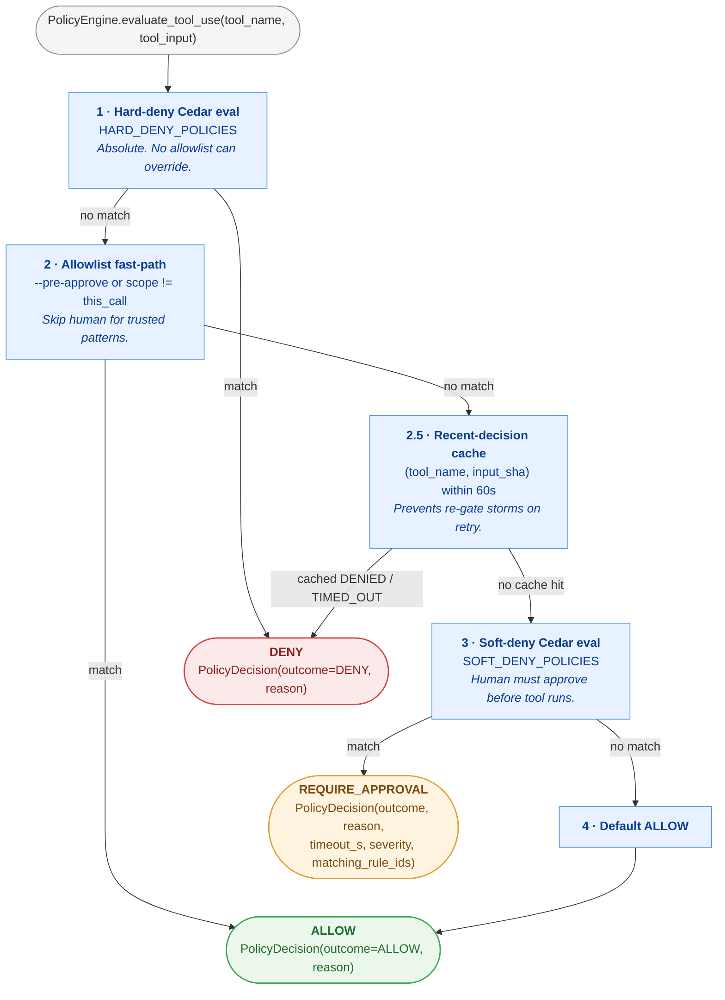
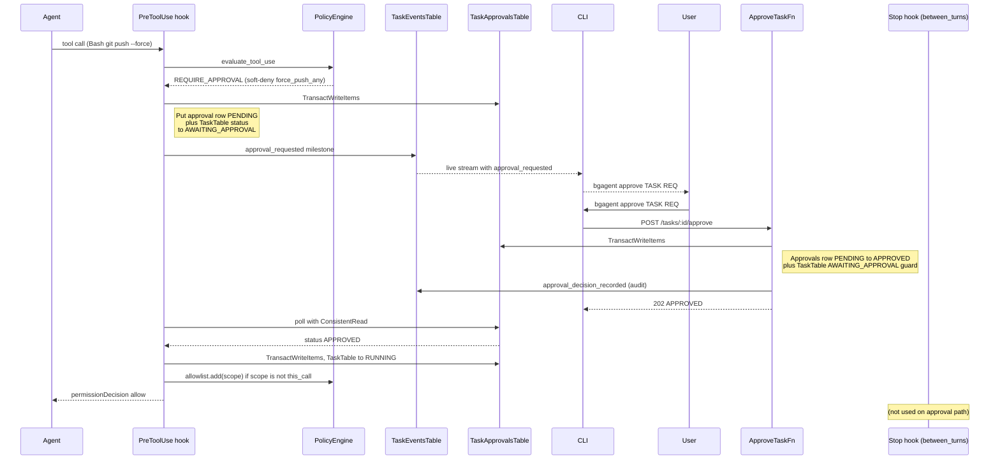
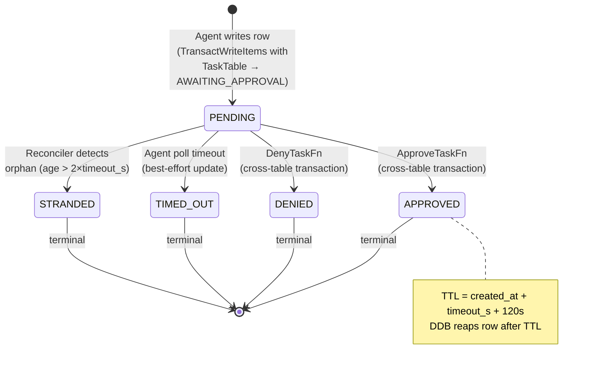
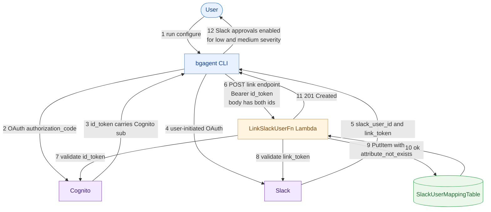
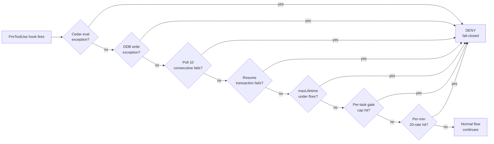
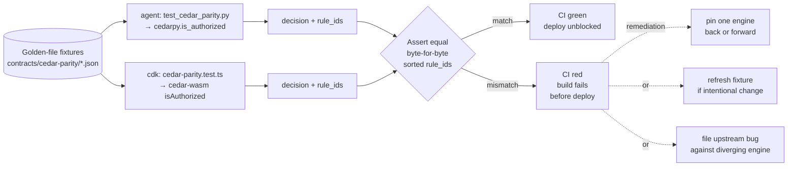

# Cedar HITL Approval Gates

> **Status:** Detailed design, pre-implementation.
> **Companion:** [`INTERACTIVE_AGENTS.md`](./INTERACTIVE_AGENTS.md) §9.3 (pointing here), §7 (state machine).
> **Visual:** [`../diagrams/phase3-cedar-hitl.drawio`](../diagrams/phase3-cedar-hitl.drawio) (12 pages; supplemented by inline Mermaid diagrams below).
> **Design locked:** 2026-04-23 (Sam ↔ assistant discussion).
> **Rev:** 5 (2026-05-06 — fold in parallel adversarial + advocate review of the timeout design: late-approval re-read on TIMED_OUT ConditionCheckFailed; user-visible timeout-cap milestones; ceiling-shrink milestone; Runtime JWT bound verified as auto-refreshed IAM; three new tuning metrics; explicit off-hours trade-off section; notification-delivery-failure boundary. IMPL-24 through IMPL-28 added.).
> **Implementation:** not started.

---

## 0. Contents

1. [What we are building, in one paragraph](#1-what-we-are-building-in-one-paragraph)
2. [The three-outcome model and why Cedar alone can't give it](#2-the-three-outcome-model)
3. [Design decisions (locked)](#3-design-decisions-locked)
4. [End-to-end request flow](#4-end-to-end-request-flow)
5. [Cedar policy authoring guide](#5-cedar-policy-authoring-guide)
6. [Engine implementation](#6-engine-implementation)
7. [REST API contract](#7-rest-api-contract)
8. [CLI UX](#8-cli-ux)
9. [State machine + concurrency](#9-state-machine--concurrency)
10. [Data model](#10-data-model)
11. [Observability and notification plane](#11-observability-and-notification-plane)
12. [Security model](#12-security-model)
13. [Failure modes + fail-closed posture](#13-failure-modes--fail-closed-posture) — includes §13.12 VM-throttle + late-approval race, §13.13 Runtime JWT expiry, §13.14 Notification delivery failure, §13.15 Fail-closed summary
14. [Sample scenarios](#14-sample-scenarios) — includes §14.6 VM-throttle race trace, §14.7 timeout-capped visibility, §14.8 Off-hours and unattended tasks (known trade-off)
15. [Implementation plan](#15-implementation-plan)
16. [Implementation notes (carry-forward tasks)](#16-implementation-notes-carry-forward-tasks)
17. [Future work (not in v1 scope)](#17-future-work-not-in-v1-scope) — includes §17.18 Off-hours escalation mode, §17.19 `bgagent pending --output json` schema stability

---

## 1. What we are building, in one paragraph

When the agent is about to call a tool (Bash, Write, Edit, WebFetch, etc.), our existing Cedar policy engine today decides **Allow** or **Deny**. This feature adds a third outcome — **Require-approval** — that pauses the tool call, writes an approval request to a new DynamoDB table **atomically with the task state transition**, notifies the user via a live stream marker, and awaits a human response via a new REST endpoint + CLI command. The agent polls DynamoDB for the user's decision with strongly-consistent reads; on approval it proceeds, on denial (or timeout) the decision text is best-effort injected into the agent's context via the validated Phase-2 Stop-hook mechanism so the agent adapts rather than spinning. At task-submit time the user can also *pre-approve* scopes (specific tools, bash patterns, rule IDs, path patterns, or `all_session`) so low-risk agents run without any interactive gates. The same Cedar policy language is reused with a new `@tier("soft")` annotation to mark rules that should trigger approval instead of absolute denial — no new language, broader semantics.

---

## 2. The three-outcome model

### Cedar's native model is binary

The [Cedar authorization engine](https://www.cedarpolicy.com/) answers exactly one question on every call: given a `(principal, action, resource, context)` tuple, is the action **Allowed**, **Denied**, or is there **NoDecision** (no policy matched)? Our existing engine in `agent/src/policy.py` treats `NoDecision` as deny (fail-closed) and returns a boolean `allowed` to callers. That's the baseline we're extending.

### What we add

We layer a **three-outcome abstraction** on top of Cedar by running up to **two Cedar evaluations per tool call** against two separate policy sets, interleaved with an in-process allowlist and a recent-decision cache:



Each Cedar evaluation is sub-millisecond. No network hop. No AWS API. The "approval wait" (step 3's downstream handling — polling DDB for the user's decision) is entirely inside our `PreToolUse` hook coroutine.

### SDK mapping

The Claude Agent SDK never sees `REQUIRE_APPROVAL`. After the approval wait resolves, the hook maps the three-outcome model back to the SDK's binary surface:

| Engine outcome | SDK-visible return |
|---|---|
| `ALLOW` (stages 2, 4) | `{"permissionDecision": "allow"}` |
| `DENY` (stage 1 hard-deny, stage 2.5 cache hit) | `{"permissionDecision": "deny"}` |
| `REQUIRE_APPROVAL` → user approves | `{"permissionDecision": "allow"}` |
| `REQUIRE_APPROVAL` → user denies / timeout | `{"permissionDecision": "deny"}` |

The three-outcome model is an internal engine abstraction; the SDK surface stays binary and unchanged.

### Why not a single policy set with a custom "require approval" outcome

Cedar doesn't have a `require_approval` effect. Options considered:

- **Cedar annotations without policy-set split**: mark some `forbid` rules with `@require_approval("true")` and let the engine introspect the matched policy. Works, but it means every `forbid` is a potential approval — a maintenance hazard (rule authors forgetting to mark approval rules, accidentally converting hard-denies into soft-denies). Rejected.
- **Context-encoded re-evaluation**: pass `context.allow_approval: bool` and check twice. Clever but opaque; policy authors write dual conditions. Rejected.
- **Two policy sets**: the chosen design. Physical split. Policy authors know exactly where a rule lives by which file it's in. `@tier("hard"|"soft")` annotation acts as a double-check.

The winning property: **policy authors can put on their "security-review-approved" hat and read the hard-deny file alone**, without being distracted by approval-eligible rules. Most review effort is on the hard-deny set because soft-deny rules have a human safety net.

---

## 3. Design decisions (locked)

Settled during the 2026-04-23 design discussion and extended after the 2026-04-24 and 2026-05-06 reviews. Each has detailed rationale in those conversations; summary here for implementers. **23 decisions**, all locked unless an adversarial review finding explicitly reopened a concern.

| # | Decision | Summary |
|---|---|---|
| 1 | **Cedar encoding: two policy sets** | Physical hard-deny vs soft-deny split, validated via `@tier(...)` annotation. |
| 2 | **Hook point: extend `PreToolUse`, not `can_use_tool`** | PreToolUse is already async-compatible, already wired to Cedar, and already owns the tool-governance boundary. |
| 3 | **Wait mechanism: DDB strongly-consistent polling, 2s → 5s backoff** | Initial 2s cadence for the first 30s, then 5s. `ConsistentRead=True` so the agent never misses an approval that already landed. |
| 4 | **Scope allowlist: in-process, seeded from persisted `initial_approvals`** | Runtime escalation lives in the `PolicyEngine` instance. Submit-time `--pre-approve` flags persist on TaskTable and seed the allowlist at container startup. Lost on restart (rare; reconciler fails stranded tasks). |
| 5 | **CLI UX: standalone `bgagent approve/deny` + `--pre-approve <scope>` + `bgagent policies list` + `bgagent pending`** | No inline interactive prompt in the streaming CLI for v1. Discovery + listing commands solve the request_id/rule_id copy problem. |
| 6 | **Timeouts: per-task default + per-rule Cedar annotation override, min wins, bounded floor + ceiling, fail-closed** | Per-task default: **300s** (5 min), overridable via `--approval-timeout` on submit and bounded by `[30, min(3600, maxLifetime - 300)]`. Floor: 30s (engine-enforced on both task default and rule annotations). Ceiling: `min(1h, maxLifetime_remaining - cleanup_margin)` — sized so the TTL on the approval row always covers the decision window. On timeout → deny (never auto-approve). See §14.8 for the off-hours trade-off this posture deliberately accepts. |
| 7 | **Concurrency slots: AWAITING_APPROVAL holds the slot** | Matches PAUSED semantics. Container is alive, consuming memory. |
| 8 | **Hard-deny is absolute** | No `--pre-approve` scope, and no blueprint `disable:` directive, can bypass it. CreateTaskFn validates and rejects `rule:<hard_deny_rule_id>`; blueprint loader rejects `disable:` entries that name built-in hard-deny rules. |
| 9 | **Submit-time scope cap: 20 entries, ≤128 chars each** | Keeps audit trail legible, bounds allowlist check cost, limits abuse-vector damage. |
| 10 | **Cedar annotations (verified working)** | `@rule_id(...)`, `@tier(...)`, `@approval_timeout_s(...)`, `@severity(...)`, `@category(...)`. Recoverable via `cedarpy.policies_to_json_str()` → JSON. Multi-match merging: min timeout wins (clamped by floor), max severity wins. |
| 11 | **Atomic state transitions via DDB TransactWriteItems** | The approval-request row write and the TaskTable status transition are a single atomic transaction. No partial-failure states. |
| 12 | **Ownership encoded in ConditionExpression, not fetch-then-check** | `ApproveTaskFn` / `DenyTaskFn` use `TransactWriteItems` with ConditionExpressions on both tables (ownership on TaskApprovalsTable, state on TaskTable). Authorization and state transition are atomic. |
| 13 | **Per-task approval-gate cap: default 50, per-blueprint configurable, fail-task on exceed** | Terminal circuit breaker against denial-loop storms and prompt-injection abuse. Default 50 is an order-of-magnitude estimate (not empirically derived); blueprints override via `security.approvalGateCap` (bounded 1 ≤ N ≤ 500). The cache-memory bound is decoupled: recent-decision cache is independently capped at 50 entries regardless of `approvalGateCap` (§12.8, §12.9). Re-evaluation criteria for the default codified as an IMPL item. |
| 14 | **Per-minute approval-creation rate limit: 20/task, per-container best-effort** | Agent-side throttle independent of per-task lifetime cap. Counter is in-process; on container restart the counter resets but the per-task approval-gate cap (decision #13) + reconciler still bound total damage (§6.5, §13.6). |
| 15 | **Recent-decision cache: deny an identical (tool, input) for 60s after DENIED/TIMED_OUT** | Prevents naïve retry-loop amplification on the same destructive action. Cache is session-scoped (in-process); container restart clears it. Accepted as a threat-model caveat. Cache memory is independently bounded at 50 entries regardless of `approvalGateCap` — decoupling cache sizing from UX cap (§12.8, §12.9). |
| 16 | **Denial reason sanitized in the Lambda, before persisting** | `DenyTaskFn` runs `output_scanner` on the reason before writing to DDB. The agent never sees unscanned text. |
| 17 | **`tool_input_preview` stripped of ANSI/control characters at agent-side write + CLI render** | Defense in depth against approver-confusion attacks where a prompt-injected tool input overwrites the CLI prompt with a different command. |
| 18 | **Deny-as-steering injected via Stop hook `between_turns_hooks`, NOT via `permissionDecisionReason` (best-effort)** | Reuses the validated Phase-2 nudge mechanism. `<user_denial>` XML block wrapped by the same `_xml_escape` utility. Because the denial hook runs AFTER the cancel-wins hook, denial injection is best-effort on cancelled tasks; `permissionDecisionReason` on the SDK return is the guaranteed surface (§4 step 25b, §6.5). |
| 19 | **`rule:` discovery via new endpoint** | `GET /v1/repos/{repo_id}/policies` + `bgagent policies list` surfaces the rule IDs + annotations + whether the rule is hard or soft. Solves the otherwise-undiscoverable `rule:X` pre-approval scope. Packaged via a Lambda layer (§15.6) so cedar-wasm isn't bundled per function. |
| 20 | **`write_path:<glob>` scope** | Added so users can pre-approve file writes under specific path patterns (e.g., `write_path:docs/**`) without needing to grant all Writes. Validation uses Python `fnmatch` at runtime; glob semantics are a Cedar-`like` superset (§6.4, §5.5). |
| 21 | **`tool_group:file_write` convenience scope** | Resolves to `{Write, Edit}`. Prevents the surprise of pre-approving `Write` and still getting gated on `Edit`. |
| 22 | **Pre-implementation spike: cedarpy annotation round-trip** | Day 1 of implementation validates that `policies_to_json_str()` returns annotations in the expected shape. If the API has changed, fall back to policy-ID prefix conventions. |
| 23 | **Cedar engine parity contract (Python `cedarpy` ↔ JS `cedar-wasm`)** | Both engines are pinned in `mise.toml`. A golden-file parity test runs in CI: for each `(policy, input)` fixture the test asserts Python and WASM return the same `decision` and the same set of matching rule IDs. Policy authors who upgrade either engine must refresh the golden file; drift fails the build. See §15.6 and Appendix B. |

---

## 4. End-to-end request flow

Narrative walk-through of the happy path. Sequence diagrams in [phase3-cedar-hitl.drawio pages 3-6](../diagrams/phase3-cedar-hitl.drawio), supplemented by the round-trip Mermaid below.

### Setup (task start)

1. User runs `bgagent run --repo my-org/my-app --task "rebase feature-x onto main and push" --approval-timeout 600 --pre-approve tool_type:Read --pre-approve bash_pattern:"git status*"`.
2. CLI validates each scope string client-side (format, ≤128 chars, cap 20). Rejects invalid syntax without round-trip.
3. CLI POSTs `/v1/tasks` with `{repo, task, initial_approvals: [...], approval_timeout_s: 600}`.
4. `CreateTaskFn` validates `initial_approvals`:
   - max 20 entries, ≤128 chars each
   - rejects `rule:<id>` where `<id>` names a hard-deny rule (resolved via shared policy-parsing library against the repo's blueprint; see §5.4)
   - rejects degenerate `bash_pattern`/`write_path` scopes that match too broadly (see §7.3)
   - honors `Blueprint.security.maxPreApprovalScope` (see §7.3)
   - normalizes scope strings (trim whitespace; case-sensitive as documented)
   - rejects blueprint whose combined `cedar_policies` text exceeds the 64 KB cap (§12.4) regardless of origin
   - resolves `approval_gate_cap` = `Blueprint.security.approvalGateCap ?? 50`; rejects if outside `[1, 500]` (decision #13)
5. Task persists. `approval_timeout_s`, `approval_gate_cap`, and `initial_approvals` become DDB attributes on the task row (cap is captured at submit time so mid-task blueprint edits do not shift the cap beneath a running task).
6. Container spawns on Runtime-JWT. `PolicyEngine.__init__` loads:
   - `HARD_DENY_POLICIES` (built-in + repo blueprint's `security.cedarPolicies.hard`; blueprint `disable:` may suppress non-built-in rules only, §5.1, §15.4)
   - `SOFT_DENY_POLICIES` (built-in + repo blueprint's `security.cedarPolicies.soft`; blueprint `disable:` may suppress soft-deny rules freely)
   - Annotation lookup table: `{policy_id: {annotation: value}}` built from `cedarpy.policies_to_json_str()` once, cached for the task lifetime
   - Rule-ID map: `{rule_id_annotation: policy_id}` to resolve `--pre-approve rule:<rule_id>` → internal Cedar policy ID
   - Allowlist seeded from `initial_approvals`
   - `initial_approvals` re-validation: every scope in `initial_approvals` is re-resolved against the freshly-loaded policy set. If a `rule:<id>` no longer resolves to a soft-deny rule (because the blueprint changed between submit and start), the task fails at HYDRATING with reason `"initial_approvals drift: rule <id> missing"` — see §5.4 and §13.10.
   - Annotation validation: `@rule_id` uniqueness enforced (duplicate = task fails to start); `@approval_timeout_s` must be integer ≥ 30 (malformed or below floor = task fails to start)
7. Container emits `agent_milestone("pre_approvals_loaded", {count: 2, scopes: ["tool_type:Read", "bash_pattern:git status*"]})` so Terminal A's stream shows the starting posture.
8. Agent begins normal work.

### First approval gate (soft-deny hit)

9. Agent decides to run `Bash(command="git push --force origin feature-x")`.
10. SDK fires `PreToolUse` hook with `tool_name="Bash"`, `tool_input={command: "..."}`.
11. Hook calls `PolicyEngine.evaluate_tool_use`:
    - Hard-deny eval: matches nothing → `allowed=True`
    - Allowlist fast-path: `tool_type:Bash`? no. `bash_pattern` matches `git push --force ...`? `git status*` doesn't match `git push --force ...` → skip
    - Recent-decision cache: no matching `(Bash, sha256(input))` in cache → skip
    - Soft-deny eval: policy `force_push_any` matches. `diagnostics.reasons == ["policy1"]`. Lookup: `policy1` → annotations `{rule_id: "force_push_any", approval_timeout_s: "300", severity: "medium"}`.
    - Returns `PolicyDecision(outcome=REQUIRE_APPROVAL, reason="Cedar soft-deny: force_push_any", timeout_s=300, severity="medium", matching_rule_ids=["force_push_any"])`.

    Effective timeout computation:
    ```
    effective = max(
        FLOOR_30S,
        min(
            rule_annotation_timeout_s or task_default,     # 300
            task_default,                                   # 600 from submit
            maxLifetime_remaining_s - CLEANUP_MARGIN_120S   # ~7h remaining
        )
    )
    → effective = 300s
    ```
    If `maxLifetime_remaining_s - CLEANUP_MARGIN_120S < FLOOR_30S`, hook returns DENY immediately with reason `"insufficient lifetime for approval"` (§13.7).

12. Hook checks per-task approval-gate cap (default 50, configurable per blueprint via `security.approvalGateCap`; §5.1) and per-minute rate limit (20/task, per-container). If either exceeded → DENY with reason `"approval-gate cap exceeded"` (fail-closed).
13. Hook mints `request_id = _ulid()` (26-char ULID).
14. Hook builds the approval row payload:
    ```python
    row = {
      "task_id": "01KPW...",
      "request_id": "01KPR...",
      "tool_name": "Bash",
      "tool_input_preview": strip_ansi("git push --force origin feature-x")[:256],
      "tool_input_sha256": "abc123...",
      "reason": "Cedar soft-deny: force_push_any",
      "severity": "medium",
      "matching_rule_ids": ["force_push_any"],        # list, not set — supports empty
      "status": "PENDING",
      "created_at": "2026-04-23T14:00:00Z",
      "timeout_s": 300,
      "ttl": 1734567890,  # created_at + timeout_s + CLEANUP_MARGIN_120S; always covers the decision window
      "user_id": "...",
      "repo": "my-org/my-app"
    }
    ```
15. **Atomic transition** — hook issues `TransactWriteItems` with two operations:
    - Put on `TaskApprovalsTable` (new row with status=PENDING)
    - ConditionalUpdate on `TaskTable`: `status = :awaiting, awaiting_approval_request_id = :rid WHERE status = :running`
    Both succeed or both fail. On `TransactionCanceledException` (most likely the TaskTable condition fails because another process moved the status), the hook emits `approval_write_failed` and returns DENY.
16. Hook emits `agent_milestone("approval_requested", {...})` to both `ProgressWriter` (DDB audit) and `sse_adapter` (live stream). Best-effort emission — transactional write has already committed; milestone failure is observability degradation, not state degradation.
17. Terminal A stream renders:
    ```
    [14:00:00]  ★ approval_requested: Bash "git push --force origin feature-x" (medium)
                reason: Cedar soft-deny: force_push_any
                bgagent approve <task_id> 01KPR... [--scope ...]
                bgagent deny <task_id> 01KPR... [--reason "..."]
                timeout 300s
    ```
    Severity colors the line (respecting `NO_COLOR` env var).
18. Hook enters poll loop with strongly-consistent reads:
    ```python
    async def _poll_for_decision(task_id, request_id, timeout_s):
        start = time.monotonic()
        interval = 2
        consecutive_failures = 0
        while True:
            elapsed = time.monotonic() - start
            if elapsed >= timeout_s:
                return TimedOut()
            if elapsed > 30:
                interval = 5  # backoff
            try:
                row = await _ddb_get_approval(task_id, request_id, ConsistentRead=True)
                consecutive_failures = 0
                if row is None:
                    # Row disappeared between write and poll — treat as stranded
                    return TimedOut(reason="approval row missing; fail-closed")
                if row["status"] != "PENDING":
                    return Decided(row)
            except Exception as exc:
                consecutive_failures += 1
                if consecutive_failures == 3:
                    log("WARN", f"approval poll degraded for {request_id}: {exc}")
                    emit_milestone("approval_poll_degraded", {...})
                if consecutive_failures >= 10:
                    return TimedOut(reason="approval poll consecutive failures")
            await asyncio.sleep(interval)
    ```
19. The approval CAP and local-timeout paths ALWAYS attempt to write the row to TIMED_OUT (best-effort conditional update `status = :pending`) before returning. This prevents orphan PENDING rows when the agent bails internally.

### User responds

20. User in Terminal B runs `bgagent approve <task_id> <req_id> --scope tool_type_session`.
21. CLI validates scope syntax client-side.
22. CLI POSTs `/v1/tasks/{task_id}/approve` with `{request_id, decision: "approve", scope: "tool_type_session"}`.
23. `ApproveTaskFn` (atomic cross-table transaction — see §7.1):
    - Validates Cognito JWT, extracts `sub` as `caller_user_id` (verbatim; no transformation, see §7.1 and decision #12).
    - Issues a single `TransactWriteItems` with:
      - ConditionalUpdate on `TaskApprovalsTable`: `#status = :pending AND user_id = :caller AND task_id = :task_id` → flip to APPROVED
      - ConditionalUpdate on `TaskTable`: `#status = :awaiting AND awaiting_approval_request_id = :rid` → (no-op update, pure state guard; keeps status AWAITING_APPROVAL until the agent's resume transaction flips it RUNNING)
      Both conditions must hold or the entire transaction is cancelled. No TOCTOU window, no "approved a cancelled task" 202 surprise.
    - On `TransactionCanceledException` with per-item `CancellationReasons`: distinguishes between (a) approvals row missing (404 `REQUEST_NOT_FOUND`), (b) approvals row wrong user (404 `REQUEST_NOT_FOUND` — don't leak existence), (c) approvals row wrong status (409 `REQUEST_ALREADY_DECIDED`), (d) task no longer AWAITING_APPROVAL (409 `TASK_NOT_AWAITING_APPROVAL`).
    - Records audit event to TaskEventsTable directly (`approval_decision_recorded`) so the 90-day audit trail is owned by the Lambda, not dependent on agent milestones.
    - Returns 202 `{task_id, request_id, status: "APPROVED", scope, decided_at}` or error.
24. Agent's poll reads the `APPROVED` row on next tick (within 2-5s).
25. Hook executes decision in this order:
    - a. **Atomic resume transition**: `TransactWriteItems` — TaskTable `status = :running, REMOVE awaiting_approval_request_id WHERE status = :awaiting AND awaiting_approval_request_id = :rid`. If this fails (likely because user cancelled during the poll gap), hook skips allowlist mutation and returns DENY with reason `"task no longer awaiting approval"`.
    - b. **Allowlist mutation** (only if `scope != "this_call"`): `PolicyEngine._allowlist.add(scope)`. Synchronously logged.
    - c. **Milestone emission** (best-effort): `approval_granted` to both writers.
    - d. **Return to SDK**: `{"permissionDecision": "allow"}`.
26. SDK runs the tool. Stream shows:
    ```
    [14:00:12]  ★ approval_granted: request_id=01KPR... scope=tool_type_session
    [14:00:12]  ▶ Bash: git push --force origin feature-x
    [14:00:14]  ◀ Bash: remote: Force pushed. New SHA abc123.
    ```

### Round-trip sequence (Mermaid)



### Continuation

27. Agent continues with its turn, hits another `Bash` call (say `git log --oneline -5`).
28. PreToolUse hook → PolicyEngine.evaluate_tool_use:
    - Hard-deny: no match
    - Allowlist: `tool_type:Bash` ← matches. Returns ALLOW fast-path.
29. No new approval request. Tool runs immediately.
30. Eventually agent reaches task completion, opens PR, writes memory, task → `COMPLETED`.

### Denial with steering text

If instead the user runs `bgagent deny <task_id> <req_id> --reason "use --force-with-lease instead"`:
- `DenyTaskFn` runs `output_scanner.scan(reason)` to redact any accidental secrets/PII from the reason **before** writing it to DDB.
- Flips row to DENIED with sanitized reason, via the same atomic cross-table `TransactWriteItems` pattern as approve (§7.1).
- Agent's poll reads DENIED row.
- Hook execution order:
  - a. Atomic resume transition to RUNNING (same as approve path).
  - b. **Best-effort denial injection** into agent context via the Phase-2 `between_turns_hooks` registry. The hook queues a synthetic `<user_denial nudge_id="..." timestamp="..." request_id="...">sanitized reason</user_denial>` block for the next Stop-seam injection. The `_denial_between_turns_hook` is registered AFTER `_nudge_between_turns_hook` (which itself runs after `_cancel_between_turns_hook`) — so on a task that is simultaneously denied and cancelled, the cancel short-circuits both the nudge and denial readers and the steering text does NOT reach the model. This is acceptable because:
    - The SDK's `permissionDecisionReason` on the hook return (step d) is the guaranteed steering surface — the model always sees a terse "User denied: see next turn context for details" hint even when the between-turns injection is pre-empted by cancel.
    - On a cancelled task, the agent turn terminates anyway; there is no "next turn" for the between-turns injection to act on.
    - Queued denial rows remain in DDB with status=DENIED for the 90-day audit window, so operators can retrospectively see what the user said even when the model didn't receive it.
  - c. Milestone emission: `approval_denied` (best-effort; the audit record in TaskEventsTable owned by `DenyTaskFn` is authoritative).
  - d. Return to SDK: `{"permissionDecision": "deny", "permissionDecisionReason": "<sanitized reason, truncated to 500 chars>"}`. This is the guaranteed surface — included directly as the SDK's rejection hint so the model sees the user's intent even when the Stop-seam injection is pre-empted.

Why the dual path: the Claude Agent SDK's `permissionDecisionReason` reaches the model as a tool-call-rejected system hint, which the model treats as a reason-to-retry-differently signal. The Phase-2 `between_turns_hooks` mechanism injects the denial as authoritative user context, which is richer and more steerable. We use both because neither alone is sufficient: `permissionDecisionReason` is always delivered but is a terse hint; the between-turns injection is richer but can be pre-empted by a concurrent cancel. Together they cover the matrix of (tool denied, task cancelled) × (next turn runs, next turn doesn't).

**Scenario (finding #2):** A user at 3:47 AM is fighting an agent that's spiraling on a bad merge. They mash `bgagent deny 01KPW... 01KPR... --reason "stop trying to rebase, just abandon the branch"` into Terminal B, hit enter, then immediately run `bgagent cancel 01KPW...` in Terminal C because the agent is clearly lost. DenyTaskFn's transaction lands first, flipping the approval to DENIED. The agent's PreToolUse hook is already deep in the poll loop. A microsecond later the cancel arrives — the `_cancel_between_turns_hook` fires on the next Stop seam and sets the cancel flag, which short-circuits every subsequent between-turns producer including our `_denial_between_turns_hook`. The user's reason text never reaches the model as an injected turn. If we relied only on the between-turns path, the agent would have seen a bare rejection with no reason. Because `permissionDecisionReason` is set independently (step 25d) with a truncated copy of the sanitized reason, the model still receives "User denied: stop trying to rebase, just abandon the branch" at the SDK boundary. The DenyTaskFn DDB write persists the full reason for the audit log regardless of which surface the model saw. No guaranteed-context surface is lost; the stronger between-turns injection is acknowledged as best-effort.

---

## 5. Cedar policy authoring guide

### 5.1 Policy file layout

Two physical files, each with exactly one tier:

- `agent/policies/hard_deny.cedar` — contains ONLY `@tier("hard")` policies
- `agent/policies/soft_deny.cedar` — contains ONLY `@tier("soft")` policies

Per-repo customization lives in `blueprint.yaml`:

```yaml
security:
  cedarPolicies:
    hard: |
      @tier("hard")
      @rule_id("block_prod_writes")
      forbid (principal, action == Agent::Action::"write_file", resource)
        when { context.file_path like "prod/**" };
    soft: |
      @tier("soft")
      @rule_id("deploy_staging")
      @approval_timeout_s("900")
      @severity("high")
      @category("destructive")
      forbid (principal, action == Agent::Action::"execute_bash", resource)
        when { context.command like "*terraform apply*" };
    disable:
      # Opt-out of specific soft-deny rules. May include built-in soft-deny
      # rule_ids OR blueprint-added rule_ids. MAY NOT include any built-in
      # hard-deny rule_id — blueprint loader rejects those at task start.
      - write_infrastructure          # example: repo has its own stricter rule
  maxPreApprovalScope: "tool_type_session"   # optional; caps what --pre-approve can grant
  approvalGateCap: 50                         # optional; per-task lifetime cap on gates (1 ≤ N ≤ 500, default 50). See §3 decision #13.
```

**`approvalGateCap` sizing guidance:**

- **Short, well-scoped tasks** (dependency bumps, small refactors): default 50 is generous — typical p99 is under 5 gates. No override needed.
- **Long-running migrations** (auth rewrites, schema migrations spanning days of agent work): raise to 100–200. The cap is a terminal circuit breaker, not a behavioral control; the per-minute rate limit (decision #14) and soft-deny policies still govern user-prompt frequency.
- **High-risk blueprints** (direct production access, customer-data handling): lower to 10–20. A blueprint that legitimately needs more than 20 user decisions in a single task probably has a policy-design problem (too many soft-deny rules, or missing pre-approval allowlist entries).
- **Hard upper bound: 500.** Anything past this indicates the task should be split, not allowed to accumulate more human decisions. The blueprint loader rejects values outside `[1, 500]` at task start.

`PolicyEngine.__init__` concatenates built-in + blueprint rules per tier, validates with a probe `cedarpy.is_authorized()` call. **Any** of the following cause task-start failure (not silent-fallback):

- Malformed policy syntax
- Duplicate `@rule_id` values across tiers
- `@approval_timeout_s` below floor (30s) or non-integer
- `@tier` value mismatches the file section (hard rules in soft file or vice versa)
- Missing `@rule_id` on a soft-deny rule
- `disable:` entry naming a built-in hard-deny rule_id (see §15.4 for the built-in list)
- `disable:` entry naming a rule_id that does not exist (blueprint drift safeguard)
- Combined `hard + soft` Cedar text larger than **64 KB** after concatenation (§12.4)

Fail-on-error is the right posture for blueprint misconfiguration — silent-fallback would let broken policies slip into production.

**Scenario (finding #9):** A platform operator adds a blueprint `disable: [rm_slash]` directive because a repo does dry-run `rm -rf /tmp/test-build-*` in its CI simulation suite and the built-in `rm_slash` rule is too broad (it matches `rm -rf /tmp/...`). If `disable:` allowed hard-deny suppression, the repo's agent could now execute actual `rm -rf /` commands with no safety net — and because hard-deny is evaluated before the allowlist fast-path, a prompt-injected agent could not be stopped by `--pre-approve`. The blueprint loader therefore rejects `disable: [rm_slash]` at task start with a clear error: "Cannot disable built-in hard-deny rule 'rm_slash'; hard-deny rules are absolute. If this rule is too broad, file a platform-team ticket to refine the built-in pattern." The repo must instead adjust their CI to not exercise `/tmp/` destructive paths, or the platform team must ship a refined built-in. `disable:` for soft-deny rules is always permitted; the human safety net is intact.

**Scenario (finding #12):** A malicious blueprint author commits a `security.cedarPolicies.soft:` block that is 8 MB of repeated noisy rules, attempting a DoS against the agent's 512 MB policy-engine budget. Without a hard cap, `PolicyEngine.__init__` would attempt to parse + compile all 8 MB at task start, potentially OOM-killing the container and leaving the task stranded in HYDRATING. With the 64 KB combined cap enforced at blueprint load (both at `CreateTaskFn` submit-time validation AND at `PolicyEngine.__init__` as a belt-and-suspenders check), the oversized blueprint is rejected with `VALIDATION_ERROR: cedar_policies exceeds 64 KB cap (8388608 bytes)`. 64 KB fits ~800 medium-complexity Cedar rules — orders of magnitude more than any realistic blueprint needs. The cap applies regardless of blueprint origin (CDK-deployed today, potentially user-uploadable in future §12.4) because future origin changes should not require re-validating every defense.

### 5.2 Annotation reference

| Annotation | Required? | Values | Purpose |
|---|---|---|---|
| `@rule_id("...")` | **Yes on soft-deny**, recommended on hard-deny | Kebab-case or snake_case identifier, unique across both tiers | Stable ID for `--pre-approve rule:X`, for audit trail, and for the `bgagent policies` discovery endpoint. `PolicyEngine.__init__` raises on duplicates. |
| `@tier("hard"\|"soft")` | **Yes** | Exactly one of "hard" or "soft" | Validates policy is in the correct file/section. Engine rejects mismatch at load time. |
| `@approval_timeout_s("N")` | No | Integer seconds ≥ 30 | Per-rule timeout. If absent, uses the task default (**300s** by default, overridable via submit-time `--approval-timeout`; see decision #6). Has no effect on hard-deny rules. Values below the floor are rejected at load time. Values below **120s** emit a blueprint-load WARN but are accepted down to the 30s floor — almost no human responds to an approval request in under 2 minutes, so sub-120s is usually a policy-authoring mistake (see IMPL-25). Loader policy: STRICT at the floor (30s, reject) and ADVISORY below 120s (warn, accept). |
| `@severity("low"\|"medium"\|"high")` | No | One of the three | Shown in CLI approval prompt, colored by severity. Default: "medium". |
| `@category("...")` | No | "destructive", "network", "filesystem", "auth", or free-form | UX grouping. CLI could filter approvals by category. Not enforced. |

### 5.3 Common policy patterns

**Block absolute dangers** (hard-deny):
```cedar
@tier("hard")
@rule_id("rm_slash")
forbid (principal, action == Agent::Action::"execute_bash", resource)
  when { context.command like "*rm -rf /*" };

@tier("hard")
@rule_id("write_git_internals")
forbid (principal, action == Agent::Action::"write_file", resource)
  when { context.file_path like ".git/*" };

@tier("hard")
@rule_id("write_git_internals_nested")
forbid (principal, action == Agent::Action::"write_file", resource)
  when { context.file_path like "*/.git/*" };

@tier("hard")
@rule_id("drop_table")
forbid (principal, action == Agent::Action::"execute_bash", resource)
  when { context.command like "*DROP TABLE*" };
```

**Gate destructive git ops** (soft-deny — part of the built-in starter set):
```cedar
@tier("soft")
@rule_id("force_push_any")
@approval_timeout_s("300")
@severity("medium")
@category("destructive")
forbid (principal, action == Agent::Action::"execute_bash", resource)
  when { context.command like "*git push --force*" };

@tier("soft")
@rule_id("force_push_main")
@approval_timeout_s("600")
@severity("high")
@category("destructive")
forbid (principal, action == Agent::Action::"execute_bash", resource)
  when { context.command like "*git push --force origin main*"
      || context.command like "*git push --force origin prod*"
      || context.command like "*git push -f origin main*"
      || context.command like "*git push -f origin prod*" };

@tier("soft")
@rule_id("push_to_protected_branch")
@approval_timeout_s("300")
@severity("medium")
@category("destructive")
forbid (principal, action == Agent::Action::"execute_bash", resource)
  when { context.command like "*git push origin main*"
      || context.command like "*git push origin prod*"
      || context.command like "*git push origin master*"
      || context.command like "*git push origin release/*" };
```

A force-push to any branch needs approval in 300s. A force-push to `main` or `prod` gives the user 600s with elevated severity. A non-force push to a protected branch (`main`/`prod`/`master`/`release/*`) also gates — catches the case where an agent directly pushes rather than opening a PR. If a command matches both `force_push_any` and `force_push_main`, multi-match merging picks `min(300, 600) = 300s` and `max(medium, high) = high`.

**Protect sensitive file paths** (soft-deny — part of the built-in starter set):
```cedar
@tier("soft")
@rule_id("write_env_files")
@approval_timeout_s("600")
@severity("high")
@category("filesystem")
forbid (principal, action == Agent::Action::"write_file", resource)
  when { context.file_path like "*.env" };

@tier("soft")
@rule_id("write_credentials")
@approval_timeout_s("300")
@severity("high")
@category("auth")
forbid (principal, action == Agent::Action::"write_file", resource)
  when { context.file_path like "*credentials*" };
```

**Optional patterns (not shipped by default — copy into your blueprint if your repo needs them):**
```cedar
// Gate writes under a conventional infrastructure/ directory. Not in the
// built-in set because the "infrastructure/" path is a repo convention,
// not a standard — many repos use cdk/, terraform/, deploy/, etc. Add to
// your blueprint if your repo uses this layout.
// @tier("soft")
// @rule_id("write_infrastructure")
// @approval_timeout_s("900")
// @severity("high")
// @category("filesystem")
// forbid (principal, action == Agent::Action::"write_file", resource)
//   when { context.file_path like "infrastructure/*" };

// Gate all outbound WebFetch. Not in the built-in set because DNS
// Firewall already restricts egress to an allowlist; gating every
// WebFetch produces high-volume approval requests on doc-heavy tasks.
// Add to your blueprint if your repo wants stricter scrutiny.
// @tier("soft")
// @rule_id("webfetch_any")
// @approval_timeout_s("300")
// @severity("medium")
// @category("network")
// forbid (principal, action == Agent::Action::"invoke_tool",
//         resource == Agent::Tool::"WebFetch");

// Gate writes to specific CI config. Example — tune paths per repo.
// @tier("soft")
// @rule_id("write_github_workflows")
// @approval_timeout_s("600")
// @severity("high")
// @category("filesystem")
// forbid (principal, action == Agent::Action::"write_file", resource)
//   when { context.file_path like ".github/workflows/*" };
```

Per the sentinel trick (see §6.2), `invoke_tool` matches on the real tool-name UID. The other actions (`write_file`, `execute_bash`) use a sentinel UID with the real value in `context`.

### 5.4 Policy discovery — shared parser

Because `CreateTaskFn` needs to validate `rule:<id>` pre-approvals against the target repo's actual policy set, we ship a **shared policy-parsing library** used in both places:

- `cdk/src/handlers/shared/cedar-policy.ts` — thin wrapper around `@cedar-policy/cedar-wasm@4.10.0` for TypeScript
- `agent/src/policy.py` — the full engine, using `cedarpy`

Both consume the blueprint's `security.cedarPolicies` section. `CreateTaskFn` loads the target repo's blueprint (via the existing `RepoTable` store), concatenates with the built-in policies, parses via `cedar.policyToJson()` (TypeScript; §15.6), and extracts `rule_id` + `tier` annotations. `--pre-approve rule:X` is validated:

- `X` exists as some rule's `@rule_id` → ok
- `X` refers to a hard-deny rule → 400 at submit time (hard-deny cannot be bypassed)
- `X` refers to a soft-deny rule → ok; passes through
- Blueprint `disable: [X]` where `X` is a built-in hard-deny rule → 400 at submit time (§5.1, §15.4)

Both engines' outputs must agree on the `(decision, matching_rule_ids)` for any input. This is enforced by the cross-engine parity test (§15.6 + decision #23). See §15.6 for the golden-file CI pattern.

Runtime enforcement is still the authoritative layer. Submit-time validation is a UX guard — any drift between submit-time and runtime-loaded policies (possible if blueprint changes between them) causes the task to fail at HYDRATING with a clear error, not silently misbehave. `initial_approvals` is re-validated on container start (§4 step 6); see §13.10 for the drift failure mode.

**Scenario (finding #11):** A user submits `bgagent submit ... --pre-approve rule:deploy_staging` at 9:00 AM against a blueprint that has `deploy_staging` as a soft-deny rule. `CreateTaskFn` validates; `deploy_staging` resolves to a soft-deny rule in the blueprint snapshot — 202 accepted. At 9:01 AM a platform engineer deploys an updated blueprint that removes the `deploy_staging` rule (perhaps it was consolidated under a broader `deploy_any` rule). At 9:03 AM the container spawns and `PolicyEngine.__init__` loads the NEW blueprint. The allowlist seeding step tries to resolve `rule:deploy_staging` → no matching rule_id → task fails at HYDRATING with reason `"initial_approvals drift: rule 'deploy_staging' missing from current blueprint"`. The user sees a clear failure and can resubmit with the new rule name. Without this drift re-validation, the task would silently run without the `deploy_staging` pre-approval — gating on what the user thought was already allowed, which is worse than failing: the user believes their policy was applied when it wasn't.

### 5.5 Gotchas for policy authors

**`like` is glob, not regex.** Only `*` (zero-or-more) and `?` (exactly-one-char) wildcards. If you need regex, write multiple `forbid` rules.

**Case sensitivity — Cedar vs allowlist.** Cedar `like` is case-sensitive. `*rm -rf*` won't match `*Rm -Rf*`. If case-insensitivity matters, write both variants. The `write_path:` and `bash_pattern:` allowlist scopes use Python `fnmatch` at runtime, which is richer than Cedar `like` (supports `[seq]` bracket expressions) and is case-sensitive on Linux but case-insensitive on macOS. Agent containers run Linux; dev-loop validation on macOS can produce inconsistent results. See finding #15 scenario below.

**Don't match `resource ==` for user-supplied values.** `Bash` commands and file paths go through the sentinel UID. Always use `context.command` / `context.file_path` in the `when` clause, never `resource == ...`.

**`@rule_id` must be globally unique.** Including across tiers. `PolicyEngine.__init__` raises on duplicates.

**Hard-deny rules shouldn't have `@approval_timeout_s`.** It has no effect. Engine logs WARN but doesn't reject (backward compatibility if someone moves a rule between tiers).

**The default ruleset is shared across all tasks.** Per-task overrides live in the Blueprint and are isolated to tasks on that repo. The engine never allows a task to loosen the default hard-deny set via Blueprint — only add to it. The `disable:` list may remove built-in soft-deny rules but may NOT remove built-in hard-deny rules.

**`@approval_timeout_s` values below 30 are rejected at load.** There is no way to configure unusably-short approval windows.

**Scenario (finding #15):** A user developing on a MacBook tests their `write_path:docs/**` pre-approval flow locally by running the agent in dev mode. They write a Bash script that creates `docs/INDEX.md` — Python `fnmatch` on macOS is case-insensitive by default, so `fnmatch("docs/INDEX.md", "docs/**")` returns True. Their local test passes. They deploy the task to the production Lambda-backed agent runtime (Linux). The agent tries to write `docs/INDEX.md` — `fnmatch` on Linux is case-sensitive, so the match still succeeds because both sides are `docs/`. Fine for this case. But on a different task the user writes `write_path:Docs/**` (capital D), tests locally where it matches `docs/readme.md`, and it silently breaks in production where `docs/readme.md` does NOT match `Docs/**`. To avoid this footgun: (a) documentation prominently notes the dev-vs-prod case-sensitivity mismatch in §5.5 and §6.4, (b) CLI `submit` command emits a WARN when `--pre-approve write_path:<glob>` contains any uppercase character (since Linux casing is canonical and uppercase dir names are unusual), (c) CI tests exercise both macOS and Linux so the drift is caught pre-merge. The alternative — restricting to the Cedar-`like` subset — would remove useful features like `[...]` bracket expressions that users will ask for. Documentation + telemetry is the pragmatic tradeoff.

---

## 6. Engine implementation

### 6.1 Extended `PolicyDecision` shape

```python
from dataclasses import dataclass
from enum import Enum

class Outcome(str, Enum):
    ALLOW = "allow"
    DENY = "deny"                      # absolute (hard-deny or upstream error or cap-exceeded)
    REQUIRE_APPROVAL = "require_approval"  # soft-deny hit

@dataclass(frozen=True)
class PolicyDecision:
    outcome: Outcome
    reason: str
    # Only populated when outcome == REQUIRE_APPROVAL:
    timeout_s: int | None = None
    severity: str | None = None
    matching_rule_ids: tuple[str, ...] = ()
    duration_ms: float = 0

    @property
    def allowed(self) -> bool:
        """Backward-compat shim for Phase 1a/1b callers."""
        return self.outcome == Outcome.ALLOW
```

### 6.2 `evaluate_tool_use` skeleton

```python
def evaluate_tool_use(self, tool_name: str, tool_input: dict) -> PolicyDecision:
    start = time.monotonic()
    base_context = {"task_type": self._task_type, "repo": self._repo}
    input_sha = _sha256(json.dumps(tool_input, sort_keys=True))

    # STEP 1 — Hard-deny (absolute)
    hard = self._eval_tier(self._hard_policies, tool_name, tool_input, base_context)
    if hard.decision == "deny":
        return PolicyDecision(outcome=Outcome.DENY,
                              reason=f"Hard-deny: {hard.rule_ids}",
                              duration_ms=_elapsed(start))

    # STEP 2 — Allowlist fast-path (covers tool_type, bash_pattern, write_path, all_session)
    if self._allowlist.matches(tool_name, tool_input):
        return PolicyDecision(outcome=Outcome.ALLOW,
                              reason="Pre-approved by allowlist",
                              duration_ms=_elapsed(start))

    # STEP 2.5 — Recent-decision cache (anti-retry-loop, 60s TTL, session-scoped)
    cached = self._recent_decisions.get((tool_name, input_sha))
    if cached is not None:
        return PolicyDecision(outcome=Outcome.DENY,
                              reason=f"Recent decision ({cached.decision}) within 60s: {cached.reason}",
                              duration_ms=_elapsed(start))

    # STEP 3 — Soft-deny (require approval)
    soft = self._eval_tier(self._soft_policies, tool_name, tool_input, base_context)
    if soft.decision == "deny":
        # Rule-scope allowlist check happens AFTER soft-deny eval (rule_ids
        # aren't known until Cedar tells us which policies matched)
        if any(rid in self._allowlist._rule_ids for rid in soft.rule_ids):
            return PolicyDecision(outcome=Outcome.ALLOW,
                                  reason=f"Allowlist rule: {soft.rule_ids}",
                                  duration_ms=_elapsed(start))

        annotations = self._merge_annotations(soft.rule_ids)
        return PolicyDecision(
            outcome=Outcome.REQUIRE_APPROVAL,
            reason=f"Soft-deny: {', '.join(annotations['rule_ids'])}",
            timeout_s=annotations["timeout_s"],
            severity=annotations["severity"],
            matching_rule_ids=tuple(annotations["rule_ids"]),
            duration_ms=_elapsed(start),
        )

    # STEP 4 — Default allow
    return PolicyDecision(outcome=Outcome.ALLOW, reason="permitted",
                          duration_ms=_elapsed(start))
```

The recent-decision cache is a simple `dict[(tool_name, input_sha), (decision, reason, inserted_at)]` with a 60-second sliding window. Entries are added by the PreToolUse hook whenever an approval resolves to DENIED or TIMED_OUT — not on APPROVED (we don't want to accidentally auto-deny a tool call the user just approved). Cache is in-process, **lost on container restart** — a re-gating of the same recently-denied action is possible if the container restarts mid-task. See §12.8 and finding #3 scenario below.

**Scenario (finding #3):** A developer submits `--task "clean up /tmp"` and the agent runs `Bash: rm -rf /tmp/build-cache-*`. The soft-deny rule `rm_rf_path` fires; the user clicks deny with reason "use the cache-clean target in the Makefile instead". The agent's recent-decision cache now holds `(Bash, sha256("rm -rf /tmp/build-cache-*"))` for 60 seconds. The agent tries the same command on its next turn (cached → auto-deny, no new approval request — this is the point). Now imagine a container restart at this moment (AWS spot interruption, OOM-kill, manual redeploy). The new container's `PolicyEngine` has an empty cache. The agent tries the same command again. The soft-deny fires again. The user gets the same prompt they denied 30 seconds ago. This is annoying but bounded: the persistent per-task `approvalGateCap` (decision #13, default 50) means even with worst-case restart + retry amplification, the user sees at most `approvalGateCap` prompts before the task is force-failed. We accept this as a threat-model caveat rather than persisting the cache to DDB because (a) container restarts are rare, (b) DDB persistence would add latency to every denied call's write path, and (c) the persistent gate cap provides the terminal safety regardless of cache state. An operator monitoring the `approval_cap_exceeded` dashboard widget will see anomalous retry patterns if they become systemic. A persistent decision cache is noted in §17 as future work, gated on actual restart telemetry justifying the complexity.

### 6.3 Annotation merging

When multiple soft-deny rules match a single tool call:

```python
def _merge_annotations(self, policy_ids: list[str]) -> dict:
    rule_ids, timeouts, severities = [], [], []
    for pid in policy_ids:
        ann = self._annotations[pid]
        rule_ids.append(ann.get("rule_id", pid))
        if "approval_timeout_s" in ann:
            try:
                t = int(ann["approval_timeout_s"])
                if t >= FLOOR_30S:
                    timeouts.append(t)
            except ValueError:
                log("WARN", f"malformed @approval_timeout_s on {ann.get('rule_id', pid)}")
        severities.append(ann.get("severity", "medium"))

    # Task default always eligible
    timeouts.append(self._task_default_timeout_s)

    raw_min_timeout = min(timeouts)
    return {
        "rule_ids": rule_ids,
        "timeout_s": max(FLOOR_30S, raw_min_timeout),  # floor enforcement
        "severity": _max_severity(severities),          # "high" > "medium" > "low"
    }
```

**Rationale for min/max choices**:
- **Timeout → min (above floor)**: multiple rules matching means multiple concerns. Users should have *less* time to decide when stakes are higher. Floor prevents unusable 5s windows.
- **Severity → max**: the most severe concern governs the UX coloring.

### 6.4 Allowlist data structure

```python
class ApprovalAllowlist:
    def __init__(self, initial_scopes: list[str]):
        self._all_session = False
        self._tool_types: set[str] = set()
        self._tool_groups: set[str] = set()         # file_write → {Write, Edit}
        self._rule_ids: set[str] = set()
        self._bash_patterns: list[str] = []         # glob patterns
        self._write_path_patterns: list[str] = []   # glob patterns, for Write/Edit file_path

        for scope in initial_scopes:
            self.add(scope)

    TOOL_GROUPS = {"file_write": {"Write", "Edit"}}

    def add(self, scope: str) -> None:
        if scope == "all_session":
            self._all_session = True
        elif scope.startswith("tool_type:"):
            self._tool_types.add(scope.split(":", 1)[1])
        elif scope.startswith("tool_group:"):
            group = scope.split(":", 1)[1]
            if group not in self.TOOL_GROUPS:
                raise ValueError(f"unknown tool_group: {group!r}")
            self._tool_groups.add(group)
        elif scope.startswith("rule:"):
            self._rule_ids.add(scope.split(":", 1)[1])
        elif scope.startswith("bash_pattern:"):
            self._bash_patterns.append(scope.split(":", 1)[1])
        elif scope.startswith("write_path:"):
            self._write_path_patterns.append(scope.split(":", 1)[1])
        else:
            raise ValueError(f"unknown scope: {scope!r}")

    def matches(self, tool_name: str, tool_input: dict) -> bool:
        if self._all_session:
            return True
        if tool_name in self._tool_types:
            return True
        for group in self._tool_groups:
            if tool_name in self.TOOL_GROUPS[group]:
                return True
        if tool_name == "Bash":
            cmd = tool_input.get("command", "")
            # fnmatch semantics: case-sensitive on Linux (production),
            # case-insensitive on macOS (dev-only); see §5.5 footgun note.
            # fnmatch supports richer globbing than Cedar `like` (e.g.
            # [seq] bracket expressions). Document as a Cedar-`like`
            # superset rather than restrict — users will want [0-9] et al.
            if any(fnmatch(cmd, pat) for pat in self._bash_patterns):
                return True
        if tool_name in ("Write", "Edit"):
            path = tool_input.get("file_path", "")
            if any(fnmatch(path, pat) for pat in self._write_path_patterns):
                return True
        # rule_ids matched after soft-deny eval — see evaluate_tool_use
        return False
```

### 6.5 PreToolUse hook changes

PreToolUse hook (compressed for doc; implementation will be richer):

```python
async def pre_tool_use_hook(hook_input, tool_use_id, ctx, *,
                            engine, task_id, user_id, progress, sse_adapter,
                            task_default_timeout_s):
    tool_name, tool_input = _extract(hook_input)
    decision = engine.evaluate_tool_use(tool_name, tool_input)

    if decision.outcome == Outcome.ALLOW:
        return _allow()
    if decision.outcome == Outcome.DENY:
        return _deny(decision.reason)

    # REQUIRE_APPROVAL path.
    # Cap + rate-limit check. Per-minute rate limit is per-container; on
    # container restart the counter resets. The per-task approvalGateCap
    # (blueprint-configurable, default 50) is persisted and bounds cumulative
    # damage across restarts (§13.6).
    if engine.approval_gate_count >= engine.approval_gate_cap:
        return _deny(f"approval-gate cap exceeded ({engine.approval_gate_cap}/task)")
    if engine.approvals_in_last_minute >= APPROVAL_RATE_LIMIT:
        return _deny("approval-gate rate limit exceeded (20/min)")

    # Compute effective timeout with floor/ceiling.
    remaining = _remaining_maxlifetime_s()
    effective_timeout = max(
        FLOOR_30S,
        min(decision.timeout_s or task_default_timeout_s,
            task_default_timeout_s,
            remaining - CLEANUP_MARGIN_120S),
    )
    if remaining - CLEANUP_MARGIN_120S < FLOOR_30S:
        return _deny(f"insufficient maxLifetime remaining ({remaining}s) for approval")

    request_id = _ulid()
    engine.approval_gate_count += 1

    row = {
        "task_id": task_id, "request_id": request_id,
        "tool_name": tool_name,
        "tool_input_preview": _strip_ansi(_preview(tool_input))[:256],
        "tool_input_sha256": _sha256(_serialize(tool_input)),
        "reason": decision.reason, "severity": decision.severity,
        "matching_rule_ids": list(decision.matching_rule_ids),
        "status": "PENDING",
        "created_at": _iso_now(),
        "timeout_s": effective_timeout,
        "ttl": int(time.time()) + effective_timeout + CLEANUP_MARGIN_120S,
        "user_id": user_id, "repo": engine.repo,
    }

    # ATOMIC: put approval row + transition TaskTable status in one transaction.
    try:
        await _transact_write_approval_request(task_id, request_id, row)
    except TransactionCanceledException as exc:
        # Either the task was concurrently cancelled, or status wasn't RUNNING.
        _emit("approval_write_failed", {"request_id": request_id, "reason": str(exc)})
        return _deny("approval system unavailable")

    _emit("approval_requested", {
        "request_id": request_id, "tool_name": tool_name,
        "input_preview": row["tool_input_preview"],
        "reason": decision.reason, "severity": decision.severity,
        "timeout_s": effective_timeout,
        "matching_rule_ids": list(decision.matching_rule_ids),
    })

    outcome = await _poll_for_decision(task_id, request_id, effective_timeout)

    # On TIMED_OUT, attempt to write the row to TIMED_OUT so future reads see
    # a terminal state (not orphaned PENDING). The conditional write is guarded
    # by `status = :pending` — if the user's APPROVE landed between our last
    # poll and this write, the condition fails. In that case we MUST re-read
    # the row and honor whatever terminal state won the race; otherwise local
    # `outcome.status = "TIMED_OUT"` is stale and we would deny a call the user
    # just approved ("I approved it" → agent denies). See §13.12 and the
    # scenario below.
    if outcome.status == "TIMED_OUT":
        wrote_timeout = await _best_effort_update_status(
            task_id, request_id, "TIMED_OUT",
            reason=outcome.reason,
            # Returns True on successful write, False on ConditionCheckFailed.
        )
        if not wrote_timeout:
            # Re-read the row with ConsistentRead — user's decision beat us.
            row = await _ddb_get_approval(task_id, request_id, ConsistentRead=True)
            if row is not None and row["status"] == "APPROVED":
                # Late-approve wins. Honor it. Rebuild the outcome so the
                # downstream allow flow (scope propagation, milestone emission,
                # resume transaction) runs identically to the normal approve
                # path.
                outcome = Decided(
                    status="APPROVED",
                    scope=row.get("scope"),
                    decided_by=row.get("user_id"),
                    decided_at=row.get("decided_at"),
                )
                _emit("approval_late_win", {
                    "request_id": request_id,
                    "outcome": "APPROVED",
                    "reason": "user decision landed during TIMED_OUT write",
                })
            elif row is not None and row["status"] == "DENIED":
                outcome = Decided(
                    status="DENIED",
                    reason=row.get("deny_reason") or "denied",
                    decided_at=row.get("decided_at"),
                )
            # If status is still PENDING (rare — concurrent reaper race) or
            # the row is gone (TTL reaped before we could read it), fall
            # through with the original TIMED_OUT outcome; fail-closed deny.

    # ATOMIC: resume TaskTable status RUNNING, conditional on awaiting_approval_request_id matching.
    try:
        await _transact_resume(task_id, request_id)
    except TransactionCanceledException:
        # User cancelled (or some other path) during poll; abandon gracefully.
        _emit("approval_resume_failed", {"request_id": request_id})
        return _deny("task no longer awaiting approval")

    if outcome.status == "APPROVED":
        if outcome.scope and outcome.scope != "this_call":
            engine._allowlist.add(outcome.scope)
        _emit("approval_granted", {"request_id": request_id,
                                   "scope": outcome.scope or "this_call",
                                   "decided_at": outcome.decided_at})
        return _allow()

    # DENIED or TIMED_OUT — cache for 60s + queue denial injection.
    engine._recent_decisions.record(
        tool_name, _sha256(_serialize(tool_input)),
        decision="DENIED" if outcome.status == "DENIED" else "TIMED_OUT",
        reason=outcome.reason,
    )
    # Truncated reason for guaranteed-surface permissionDecisionReason.
    # Best-effort richer injection via _denial_between_turns_hook; may be
    # pre-empted by _cancel_between_turns_hook on a concurrently-cancelled
    # task. See §4 "Denial with steering text" scenario.
    permission_decision_reason = _truncate(
        outcome.reason or f"User {outcome.status.lower()}", max_len=500
    )
    if outcome.status == "DENIED":
        # Queue steering injection via Stop hook's between_turns_hooks.
        engine._queue_denial_injection(
            request_id=request_id,
            reason=outcome.reason,  # already sanitized by DenyTaskFn
            decided_at=outcome.decided_at,
        )
    _emit("approval_denied" if outcome.status == "DENIED" else "approval_timed_out",
          {"request_id": request_id, "reason": outcome.reason})
    return _deny(permission_decision_reason)
```

`engine._queue_denial_injection` appends to a list consumed by `_denial_between_turns_hook` — registered **after** `_nudge_between_turns_hook` in the `between_turns_hooks` list (which itself runs after `_cancel_between_turns_hook`). At the next Stop hook fire, the denial is emitted as `<user_denial>…</user_denial>` XML (sanitized via `_xml_escape` from the shared utility introduced with Phase 2). If a `bgagent cancel` has landed between the deny and the next Stop seam, `_cancel_between_turns_hook` short-circuits the dispatcher and the denial text is NOT injected — in which case the guaranteed surface is `permissionDecisionReason` on the hook return. See finding #2 scenario in §4 for the cancel-vs-deny race reasoning.

**Scenario (§13.12 VM-throttle + late-approval race).** User Alice hits a soft-deny gate at t=0 with `timeout_s=300`. The AgentCore VM is evicted from its warm CPU share around t=285 due to noisy-neighbor pressure on the host; poll ticks stretch by ~400ms. Alice, seeing the approval prompt in Terminal A, types `bgagent approve 01KPW... 01KPR...` at t=294. The approve-transaction lands in DDB at t=294.7 (APPROVED). The agent's next poll-tick was due at t=290 but the VM throttle delayed it to t=295.1. The monotonic wall-clock already shows elapsed >300 (actual since-start ~300.3s), so `_poll_for_decision` returns `TimedOut()`. The hook runs `_best_effort_update_status("TIMED_OUT", ... WHERE status = :pending)` — the conditional fails because the row is APPROVED. **Without the re-read**, the hook would proceed with stale local `outcome.status = "TIMED_OUT"`, queue a denial injection, and return `{"permissionDecision": "deny"}` — Alice sees "I approved it" on Terminal B but the agent denies the tool call anyway. **With the re-read** (the `wrote_timeout` branch in the pseudocode above): the hook fetches the row with ConsistentRead, sees `status = APPROVED`, rebuilds `outcome` from the row (preserving `scope`, `decided_by`, `decided_at`), emits an `approval_late_win` milestone, runs the normal resume transaction + allow flow, and returns `{"permissionDecision": "allow"}`. Alice's tool runs. The cost is one extra strongly-consistent GetItem on the race path; the benefit is that user intent is authoritative. Without this fix, a timer design that is otherwise sound would produce a confounding and unrecoverable UX. See IMPL-24, §13.12, and §15.2 task #43 for the race test.

---

## 7. REST API contract

### 7.1 `POST /v1/tasks/{task_id}/approve`

**Request** (CLI → API Gateway → `ApproveTaskFn`):
```http
POST /v1/tasks/01KPW.../approve
Authorization: Bearer <cognito_id_token>
Content-Type: application/json

{
  "request_id": "01KPR...",
  "decision": "approve",
  "scope": "tool_type_session"
}
```

**Responses**:

| Status | Code | When | Body |
|---|---|---|---|
| 202 | — | Success | `{task_id, request_id, status: "APPROVED", scope, decided_at}` |
| 400 | `VALIDATION_ERROR` | Bad scope format, missing fields | `{error, message, field}` |
| 401 | `UNAUTHORIZED` | Missing/invalid JWT | — |
| 404 | `REQUEST_NOT_FOUND` | Row missing OR wrong user (both surfaces 404 to prevent enumeration) | — |
| 409 | `REQUEST_ALREADY_DECIDED` | Approvals row status != PENDING | `{error, message, current_status}` |
| 409 | `TASK_NOT_AWAITING_APPROVAL` | Task's current status is not AWAITING_APPROVAL | `{error, message, current_status}` |
| 429 | `RATE_LIMIT_EXCEEDED` | Per-user > 30 approve/min | — |
| 503 | `SERVICE_UNAVAILABLE` | DDB throttled or upstream failure | — |

**Authorization + state + ownership + task-state are a single atomic transaction**. Per finding #7, `ApproveTaskFn` uses `TransactWriteItems` across BOTH tables, not separate GetItem+UpdateItem. This closes the "202 approve on a cancelled task" race:

```typescript
// Pseudocode. See cdk/src/handlers/approve-task.ts.
await ddb.transactWriteItems({
  TransactItems: [
    {
      Update: {
        TableName: TASK_APPROVALS_TABLE,
        Key: { task_id, request_id },
        UpdateExpression:
          "SET #status = :approved, decided_at = :now, #scope = :scope",
        ConditionExpression:
          "#status = :pending AND user_id = :caller",
        ExpressionAttributeNames: { "#status": "status", "#scope": "scope" },
        ExpressionAttributeValues: {
          ":approved": "APPROVED",
          ":pending": "PENDING",
          ":now": nowIso,
          ":scope": scope,
          ":caller": cognitoSub,     // verbatim; see ownership note below
        },
      },
    },
    {
      Update: {
        TableName: TASK_TABLE,
        Key: { task_id },
        // No-op update; only purpose is to guard task state atomically.
        UpdateExpression: "SET last_decision_at = :now",
        ConditionExpression:
          "#status = :awaiting AND awaiting_approval_request_id = :rid",
        ExpressionAttributeNames: { "#status": "status" },
        ExpressionAttributeValues: {
          ":awaiting": "AWAITING_APPROVAL",
          ":rid": request_id,
          ":now": nowIso,
        },
      },
    },
  ],
});
```

On `TransactionCanceledException`, `ApproveTaskFn` inspects the per-item `CancellationReasons` to distinguish cases:
- ApprovalsTable condition failed with `OldImage` absent → 404 `REQUEST_NOT_FOUND`
- ApprovalsTable condition failed with `OldImage.user_id != caller` → 404 (same code, prevent existence oracle)
- ApprovalsTable condition failed with `OldImage.status != "PENDING"` → 409 `REQUEST_ALREADY_DECIDED`
- TaskTable condition failed (status changed) → 409 `TASK_NOT_AWAITING_APPROVAL`

This is symmetric with the agent-side `TransactWriteItems` pattern (§4 step 25a) used for the resume transition — Lambdas and agent speak the same atomic-update contract.

**Ownership**: `user_id` stored on TaskApprovalsTable and compared against `caller_user_id` in the ConditionExpression is the Cognito `sub` claim **verbatim**. The Lambda extracts `sub` from the validated JWT and uses it as-is: no prefix stripping, no tenant mapping, no format normalization. If we ever introduce per-tenant user ID namespacing, that transformation MUST happen at the **write** path (i.e. before the agent writes the row in §4 step 14) rather than at compare time, so the ConditionExpression always compares identical-shape identifiers. See finding #6 scenario below.

After successful transaction, `ApproveTaskFn` writes an audit event to `TaskEventsTable` (`approval_decision_recorded` event_type), ensuring the 90-day audit trail is owned by the Lambda path — not dependent on the agent's milestone emission.

**Scenario (finding #6):** Three months from now, a platform engineer adds a multi-tenant mode where Cognito `sub` becomes `tenant-abc:01JXZ...`. They update the agent's row-write path to prefix-strip: `user_id = sub.split(":", 1)[1]`, storing `01JXZ...` on TaskApprovalsTable. They forget to update `ApproveTaskFn`. Now the Lambda reads `sub = "tenant-abc:01JXZ..."` from the JWT and compares it against the stored `01JXZ...` — condition fails, 404 on every approve, all tasks stranded. The fix as written: "the Cognito sub is compared verbatim; any transformation must happen at write time, not at compare time" — if the agent writes the full `sub`, the Lambda compares the full `sub`; if either side transforms, both sides must. The CI assertion is a unit test that extracts `user_id` from a sample row and asserts it matches the `sub` claim of a sample JWT byte-for-byte. This test would fail on the prefix-strip refactor above and force the engineer to update both sides. Without this hard rule, ownership-in-condition silently breaks under any future identity refactor.

**Scenario (finding #7):** A user submits a risky task at 10:00 AM. At 10:05 AM the agent hits a soft-deny gate. At 10:05:30 AM the user on Terminal B runs `bgagent cancel 01KPW...`, which lands as CancelTaskFn writes `status=CANCELLING`. At 10:05:31 AM the user — forgetting they just cancelled, or running from a different terminal where they didn't see the cancel — runs `bgagent approve 01KPW... 01KPR...`. Without the cross-table transaction, the Lambda's GetItem on TaskTable (separate call) might read the stale RUNNING state, then UpdateItem on TaskApprovalsTable succeeds because the approvals row is still PENDING → 202 returned. The user sees "approved!" but the task is dying. With the TransactWriteItems pattern, both conditions must hold: the TaskTable guard `status = AWAITING_APPROVAL` fails (because it's now CANCELLING), the entire transaction rolls back, the Lambda returns 409 `TASK_NOT_AWAITING_APPROVAL` with `current_status: CANCELLING`. The user sees "cannot approve: task is already cancelling" and correctly understands state. The cost is one extra table in the transaction (two instead of one) — still within DDB's 100-item limit and nowhere near the 4 MB request size. Symmetric with the agent's resume transaction, which already does the cross-table guard.

### 7.2 `POST /v1/tasks/{task_id}/deny`

Identical shape with `decision: "deny"` and optional `reason`:

```json
{
  "request_id": "01KPR...",
  "reason": "use force-with-lease instead; force is too risky"
}
```

`DenyTaskFn`:
1. Auth check (Cognito JWT); extract `sub` verbatim as `caller_user_id`
2. Run `output_scanner.scan(reason)` — redacts AWS keys, GitHub PATs, API tokens, etc. from the reason text before persisting
3. Truncate sanitized reason to 2000 chars (matches Phase 2 nudge limit for consistency)
4. Atomic cross-table `TransactWriteItems` (same shape as approve — ApprovalsTable flip + TaskTable state guard)
5. Write audit event to TaskEventsTable

The agent reads the sanitized reason from DDB. It never sees unscanned user text.

### 7.3 `POST /v1/tasks` — new optional fields

Extended request shape:

```json
{
  "repo": "my-org/my-app",
  "task": "...",
  "task_type": "new_task",
  "approval_timeout_s": 600,
  "initial_approvals": [
    "tool_type:Read",
    "bash_pattern:git status*",
    "write_path:docs/**",
    "rule:safe_read_config",
    "tool_group:file_write"
  ]
}
```

New field reference:

| Field | Type | Required? | Default | Description |
|---|---|---|---|---|
| `approval_timeout_s` | integer seconds | No | **300** | Per-task default approval timeout. Bounded by `[30, min(3600, maxLifetime - 300)]`. Per-rule `@approval_timeout_s` annotations may clip this further (min-wins; see decision #6 and §6.3). Default matches the §10.2 `TaskTable.approval_timeout_s` default. |
| `initial_approvals` | list of scope strings | No | `[]` | Pre-approval allowlist scopes (≤20 entries, ≤128 chars each). Validated per §7.3 rules below. |

`CreateTaskFn` validations:
1. Length cap: ≤20 entries
2. Per-entry length cap: ≤128 chars
3. Scope format parsing: normalized to known shape; leading/trailing whitespace trimmed
4. Scope value validation:
   - `tool_type:X` — X must be in known tool set (Read, Bash, Write, Edit, Glob, Grep, WebFetch, ...)
   - `tool_group:X` — X must be in known group set (currently `file_write`)
   - `bash_pattern:X` — X ≤128 chars; reject if X is degenerate (`*`, `**`, `?*`, or patterns where wildcard-char ratio exceeds 50%) — see §7.4
   - `write_path:X` — same rules as bash_pattern
   - `rule:X` — X must exist in the (built-in + target repo's blueprint) soft-deny policy set per the shared policy-parsing library; hard-deny rule IDs rejected
   - `all_session` — rejected if `Blueprint.security.maxPreApprovalScope` forbids
5. `approval_timeout_s` within `[30, min(3600, maxLifetime - 300)]` — cap at 1 hour OR (maxLifetime - 5min), whichever is smaller. Prevents multi-hour slot-exhaustion attacks and keeps approval windows within the TTL budget.
6. Combined `hard + soft + disable + custom` Cedar text size ≤ 64 KB (§12.4); reject on overflow.

### 7.4 Degenerate-pattern detection

A pattern is considered degenerate if:
- Length ≤ 2, OR
- Consists only of `*`, `?`, and whitespace, OR
- Ratio of wildcard chars (`*` + `?`) to literal chars exceeds 50%

Degenerate `bash_pattern:` and `write_path:` scopes are rejected at submit with 400 `VALIDATION_ERROR`. Users wanting broad permission must use the explicit `all_session` scope (which is subject to `maxPreApprovalScope` blueprint cap).

Submit-time pattern validation uses Python-compatible `fnmatch` semantics. The runtime allowlist check in `ApprovalAllowlist.matches` (§6.4) uses `fnmatch` too. See finding #15 / §5.5 for the macOS-vs-Linux case-sensitivity footgun and mitigations.

### 7.5 `maxPreApprovalScope` ordering

Blueprint's `maxPreApprovalScope` is a partial order:

```
this_call  <  { tool_type_session, tool_group, bash_pattern, write_path, rule }  <  all_session
```

If `maxPreApprovalScope: "tool_type_session"`, `all_session` is rejected. All other scopes pass. Setting it to `"this_call"` (meaningless) is rejected at blueprint load. Blueprint absence defaults to unbounded (except `all_session` requires explicit `--yes` on CLI).

### 7.6 `GET /v1/repos/{repo_id}/policies`

New read-only endpoint for rule discovery and `bgagent policies list`:

**Response** (200):
```json
{
  "repo_id": "my-org/my-app",
  "policies": {
    "hard": [
      {"rule_id": "rm_slash", "category": "destructive",
       "summary": "Reject rm -rf / and similar"},
      ...
    ],
    "soft": [
      {"rule_id": "force_push_any", "severity": "medium",
       "category": "destructive", "approval_timeout_s": 300,
       "summary": "Force push to any branch"},
      {"rule_id": "write_env_files", "severity": "high",
       "category": "filesystem", "approval_timeout_s": 600,
       "summary": "Write to *.env files"},
      ...
    ]
  }
}
```

Loaded by the Lambda on demand from the target repo's blueprint + built-in policies. `summary` is a human-readable annotation `@summary("...")` if present, else falls back to the first line of the `when` clause rendered as text.

Rate-limited 30/min/user; cached 5min per repo in-Lambda.

**Onboarding gate (symmetric with `POST /v1/tasks`).** If the target repo is not onboarded in `RepoTable`, this endpoint returns **422 `REPO_NOT_ONBOARDED`** — the same response `POST /v1/tasks` would return on a task-submit attempt. The gate runs AFTER rate-limit so the 429 response doesn't leak onboarding-status via a 422-vs-200 timing oracle. Rationale: a user who discovers rules for a repo they can't actually submit tasks against has received misleading information; the 422 tells them the real blocker (onboard the repo first) rather than listing policies that will never fire. Decision documented and added 2026-05-11 as part of the E2E deploy-readiness hotfix.

### 7.7 `GET /v1/pending` — list pending approvals across user's active tasks

Returns all approvals with `status=PENDING` owned by the caller. Backing index: `user_id-status-index` GSI on `TaskApprovalsTable` (see §10.1).

**Request**: `GET /v1/pending` with Cognito auth.

**Response** (200):
```json
{
  "pending": [
    {
      "task_id": "01KPW...",
      "request_id": "01KPR...",
      "tool_name": "Bash",
      "tool_input_preview": "git push --force origin feature-x",
      "severity": "medium",
      "reason": "Cedar soft-deny: force_push_any",
      "created_at": "2026-04-23T14:00:00Z",
      "timeout_s": 300,
      "expires_at": "2026-04-23T14:05:00Z"
    },
    ...
  ]
}
```

**Rate limit**: 10 requests per minute per user. Backed by the GSI so the query is a single `Query` (not `Scan`) on `user_id = :caller AND status = :pending`. See §10.1 and finding #8 scenario below.

**Scenario (finding #8):** A power user has `watch -n1 bgagent pending` running in a tmux pane so they see incoming approvals. They also have a second terminal open and a shell script that polls `bgagent pending --output json` every 2 seconds. Without a GSI, each `GET /v1/pending` call translates to a DDB `Scan` with `FilterExpression user_id = :caller AND status = :pending` — a full table scan that touches every approval row for every task in the account, not just the caller's. At 3 calls per 2 seconds across both terminals, plus the 1-per-second `watch`, the user generates 4-5 Scans per second. TaskApprovalsTable has a burst capacity of some hundreds of RCUs; sustained Scans can exhaust it, starving actual agent poll-loops of capacity. Now imagine 20 concurrent power users in a 50-user org — the table throttles, agent polls start timing out, unrelated tasks stall in AWAITING_APPROVAL waiting for reads that never come. With the GSI, each query targets the user's partition and scans at most the user's own pending rows (typically 0-3 items). The 10/min/user rate limit is an additional belt-and-suspenders but the GSI makes it mostly unnecessary. Cost: one additional GSI on the table — an acceptable DDB cost at these volumes.

---

## 8. CLI UX

### 8.1 New commands

```bash
# Approve a specific pending request
bgagent approve <task_id> <request_id> [--scope <scope>] [--output text|json]

# Deny a specific pending request, optionally with a reason the agent sees (sanitized server-side)
bgagent deny <task_id> <request_id> [--reason "..."|--reason-file <path>] [--output text|json]

# List all pending approvals across the user's active tasks (solves request-id lookup)
bgagent pending [--output text|json]

# Discover policies for a repo (solves rule-id lookup)
bgagent policies list --repo <repo_id> [--tier hard|soft] [--output text|json]
bgagent policies show --repo <repo_id> --rule <rule_id> [--output text|json]
```

### 8.2 Extended `submit` / `run` flags

```bash
bgagent submit \
  --repo my-org/my-app \
  --task "..." \
  --approval-timeout 600 \
  --pre-approve tool_type:Read \
  --pre-approve write_path:"docs/**" \
  --pre-approve tool_group:file_write \
  --pre-approve rule:safe_file_read \
  --pre-approve-file ./approvals.yaml

# Shorthand for no approval gates (requires --yes):
bgagent submit --task "..." --pre-approve all_session --yes
```

`--pre-approve-file` reads a YAML/JSON array of scope strings — supports the 20-entry cap without command-line bloat.

`--approval-timeout` default (CLI and server): **300 seconds** (5 min), matching decision #6, §7.3, and the `TaskTable.approval_timeout_s` default in §10.2. Accepted range `[30, min(3600, maxLifetime - 300)]` — CLI validates client-side and the server re-validates. `bgagent submit --help` surfaces the default explicitly.

### 8.3 Streaming UX

Approval requests surface as:

```text
[14:00:00]  ★ approval_requested: Bash "git push --force origin feature-x" (severity=high)
            reason:   Cedar soft-deny: force_push_any
            respond:  bgagent approve <task-id> 01KPR... [--scope tool_type_session]
                      bgagent deny    <task-id> 01KPR... [--reason "..."]
            timeout:  300s   (or "bgagent pending" to list all)
```

Severity colors the line (respecting `NO_COLOR` env var). When `NO_COLOR` is set, severity is emitted as `[HIGH]` prefix.

No interactive prompts in `bgagent run` streaming — the user runs `bgagent approve / deny` in a second terminal.

### 8.4 Safety UX

When `--pre-approve all_session` is passed without `--yes`:

```bash
$ bgagent submit --task "apply terraform plan" --pre-approve all_session
WARNING: --pre-approve all_session disables Cedar soft-deny approval gates
         for this task. Hard-deny policies (rm -rf /, write to .git/, DROP
         TABLE, etc.) still apply.
         Add --yes to skip this prompt.
Continue? [y/N]
```

Hard-deny enforcement is clearly called out so users don't mistake `all_session` for root.

### 8.5 `bgagent pending` output

```text
Pending approvals (3):

  01KPW0...(task) / 01KPR0...(request)
  ├─ Bash: git push --force origin feature-x
  ├─ severity: high
  ├─ reason: Cedar soft-deny: force_push_any
  ├─ timeout: 4m 32s remaining
  └─ approve|deny

  01KPW1.../01KPR1...
  ├─ Write: /workspace/.../src/.env
  ├─ severity: high
  ├─ timeout: 9m 12s remaining
  ...
```

Picking one (`bgagent approve` or `bgagent deny` with the listed IDs) is straightforward. At ≥20 pending approvals the output becomes noisy and pagination or filtering is warranted — this is deferred to future work (§17) given that the per-task `approvalGateCap` (decision #13, default 50) and per-user 10-RPM rate-limit on the endpoint both bound expected volumes well below 20 simultaneous approvals per user in practice. See finding #16.

Shell completion (tab-complete task_id + request_id from `bgagent pending` output) is also future work.

---

## 9. State machine + concurrency

### 9.1 New state: AWAITING_APPROVAL

Transitions added (extending §7 of INTERACTIVE_AGENTS.md):

```
RUNNING → AWAITING_APPROVAL  (on REQUIRE_APPROVAL; via TransactWriteItems)
AWAITING_APPROVAL → RUNNING  (on approve OR deny OR timeout; via TransactWriteItems)
AWAITING_APPROVAL → CANCELLED (on explicit `bgagent cancel`)
AWAITING_APPROVAL → FAILED   (on reconciler detecting stranded approval; new edge)
HYDRATING → AWAITING_APPROVAL  (if a soft-deny gate fires during hydration; rare but possible)
```

No direct `AWAITING_APPROVAL → COMPLETED/FINALIZING` without RUNNING in between.

### 9.2 TaskApprovalsTable row state machine

TaskApprovalsTable rows are **terminal on first decision** — a row never re-opens after leaving PENDING. Separate requests (even for the same tool call) get distinct `request_id`s.



### 9.3 Orchestrator impact

- `waitStrategy` adds `AWAITING_APPROVAL` as non-terminal.
- `finalizeTask` recognizes `AWAITING_APPROVAL`.
- `ACTIVE_STATUSES` (used by `GET /tasks?status=active` and `reconcile-concurrency.ts`) gains `AWAITING_APPROVAL`.
- `task_state.py::write_terminal` condition expression accepts `AWAITING_APPROVAL` as a valid source state.

### 9.4 Concurrency slot semantics

**AWAITING_APPROVAL holds the user's concurrency slot.**

Rationale: the Docker container is alive. Memory allocated. The AgentCore microVM pool is committed. Releasing the slot while the resource is still held lies to accounting and opens a resource-exhaustion vector.

Concrete behavior:

```text
Bob's per-user cap: 10.
t=0:    Bob submits 10 tasks. count=10. 11th submit → 429.
t=2m:   Task #1 → AWAITING_APPROVAL. count still 10.
        Bob's 12th submit → 429. He must approve, cancel, or wait.
t=30m:  Bob approves task #1. task → RUNNING. count still 10.
t=45m:  Task #1 completes. count → 9. Bob can submit task #11.
```

### 9.5 `maxLifetime` clock does not pause

AgentCore Runtime's `maxLifetime = 28800s` (8h) is an absolute timer from session start. It does NOT pause during `AWAITING_APPROVAL`.

This has a concrete implication: the hook computes an `effective_timeout` bounded by `maxLifetime - remaining - CLEANUP_MARGIN_120S`. If the task has been running 7h55m and hits a soft-deny gate, the effective timeout might be clamped to a much shorter value than the task default. Below the 30s floor → immediate DENY with reason `"insufficient lifetime"`.

### 9.6 Stranded-approval reconciliation

`reconcile-stranded-tasks.ts` gains an AWAITING_APPROVAL-aware branch:

- Detects tasks in AWAITING_APPROVAL with `age > 2 * timeout_s`
- Best-effort conditional-updates TaskApprovalsTable row → `STRANDED` status
- Transitions TaskTable → `FAILED` with reason `"approval stranded (container eviction)"`
- Emits `approval_stranded` event to TaskEventsTable

This closes the container-eviction gap. Without this, a container restart mid-approval would leave the task hanging until the user manually cancelled.

`reconcile-concurrency.ts` (scheduled every 5 min) already scans for orphaned concurrency counters; with `AWAITING_APPROVAL` added to `ACTIVE_STATUSES` it correctly counts awaiting tasks as active.

### 9.7 Attended vs unattended mode

The design assumes a human is watching. For truly unattended tasks (scheduled automation, cron-driven runs) the `--pre-approve all_session` path skips soft-deny entirely. No additional mode flag needed — the set of scopes in `initial_approvals` dictates the attendance expectation.

---

## 10. Data model

### 10.1 New DynamoDB table: `TaskApprovalsTable`

```typescript
new dynamodb.Table(this, 'Table', {
  partitionKey: { name: 'task_id',   type: dynamodb.AttributeType.STRING },
  sortKey:      { name: 'request_id', type: dynamodb.AttributeType.STRING },  // ULID
  billingMode: dynamodb.BillingMode.PAY_PER_REQUEST,
  pointInTimeRecovery: true,
  timeToLiveAttribute: 'ttl',
  stream: dynamodb.StreamViewType.NEW_AND_OLD_IMAGES,  // (evaluated — may drop; see §11)
  removalPolicy: RemovalPolicy.RETAIN,
});

// v1 GSI — backs `GET /v1/pending` and `bgagent pending`.
// Required at v1 ship, not deferred — see finding #8 scenario in §7.7.
table.addGlobalSecondaryIndex({
  indexName: 'user_id-status-index',
  partitionKey: { name: 'user_id', type: dynamodb.AttributeType.STRING },
  sortKey:      { name: 'status',  type: dynamodb.AttributeType.STRING },
  projectionType: dynamodb.ProjectionType.INCLUDE,
  nonKeyAttributes: [
    'task_id', 'request_id', 'tool_name', 'tool_input_preview',
    'severity', 'reason', 'created_at', 'timeout_s',
    'matching_rule_ids',
  ],
});
```

**Projection is fixed at design time.** DynamoDB rejects in-place
updates to a GSI's `nonKeyAttributes` (the CloudFormation error
string is "Cannot update GSI's properties other than Provisioned
Throughput and Contributor Insights Specification"). Adding a new
attribute to the pending-view projection post-ship requires either
(a) dropping and recreating the table — destructive, invalidates
every in-flight approval row, acceptable only in dev, or (b)
creating a parallel GSI under a new name and cutting traffic
over — operationally heavy. Any future chunk that extends
TaskApprovalsTable with a field that needs to appear on
`GET /v1/pending` MUST add it to this list BEFORE ship. The list is
locked in by `cdk/test/constructs/task-approvals-table.test.ts` so a
silent regression fails the test run.

Attributes:

| Name | Type | Required | Description |
|---|---|---|---|
| `task_id` | S | Yes | PK; ULID matching TaskTable |
| `request_id` | S | Yes | SK; ULID minted by agent |
| `tool_name` | S | Yes | "Bash", "Write", etc. |
| `tool_input_preview` | S | Yes | First 256 chars of serialized tool input, ANSI/control-stripped |
| `tool_input_sha256` | S | Yes | Full-input hash for audit + recent-decision cache |
| `reason` | S | Yes | Cedar matching rule description |
| `severity` | S | Yes | "low" \| "medium" \| "high" |
| `matching_rule_ids` | L | Yes | List (not Set — can be empty) of soft-deny rule IDs |
| `status` | S | Yes | PENDING \| APPROVED \| DENIED \| TIMED_OUT \| STRANDED |
| `created_at` | S | Yes | ISO8601 |
| `decided_at` | S | No | Set when status != PENDING |
| `scope` | S | No | Set on APPROVED |
| `deny_reason` | S | No | Set on DENIED; sanitized user text |
| `timeout_s` | N | Yes | Resolved timeout for audit |
| `ttl` | N | Yes | `created_at_epoch + timeout_s + CLEANUP_MARGIN_120S` — always covers the decision window |
| `user_id` | S | Yes | Cognito `sub` **verbatim**; used in ownership check `ConditionExpression` (§7.1 finding #6) |
| `repo` | S | Yes | Denormalized for fan-out |

**TTL sizing**: the TTL is always `timeout_s + 120s`, so a 300s approval window has a 420s TTL, a 3600s window has a 3720s TTL. The row never expires during the decision window. After the decision + a short grace period, DDB's eventual-consistency TTL reaper cleans up.

**Why a list, not a StringSet, for `matching_rule_ids`**: DDB string sets cannot be empty. Pathological no-match soft-deny hits would fail to persist. Lists handle empty gracefully.

**Why the GSI ships in v1**: per finding #8, the `bgagent pending` and `GET /v1/pending` access pattern is `user_id = :caller AND status = :pending`. Without the GSI, this requires a full-table `Scan` per call and exhausts DDB burst capacity under `watch -n1`-style polling. The GSI adds a small per-write cost but makes list queries constant-time per user.

### 10.2 `TaskTable` additions

Five new attributes on the existing task row:

| Name | Type | Required | Description |
|---|---|---|---|
| `approval_timeout_s` | N | No | Default timeout for soft-deny gates. Default 300. |
| `initial_approvals` | L | No | List of scope strings from submit time |
| `awaiting_approval_request_id` | S | No | Set when status = AWAITING_APPROVAL; cleared on transition back (via joint `UpdateExpression`) |
| `approval_gate_count` | N | No | Running counter of approval gates fired on this task; used to enforce `approval_gate_cap` (decision #13) |
| `approval_gate_cap` | N | No | Per-task cap on total approval gates, resolved from the blueprint's `security.approvalGateCap` at submit time and **frozen** on the TaskRecord for the life of the task. When omitted (blueprint did not configure an override), the submit path falls back to the platform default of 50. Bounds `[1, 500]` — validated both at CDK synth time (blueprint construct) and at task-submit time (CreateTask handler). Frozen at submit so mid-task blueprint edits cannot retroactively shift the cap beneath a running task (§4 step 5). |

Joint updates on AWAITING_APPROVAL transitions always set/clear `awaiting_approval_request_id` in the same `UpdateExpression` as the status change — either within the TransactWriteItems Put+Update, or in the single UpdateItem on resume.

### 10.3 TaskTable status enum update

```typescript
export const TASK_STATUSES = [
  'SUBMITTED', 'HYDRATING', 'RUNNING', 'AWAITING_APPROVAL',
  'FINALIZING', 'COMPLETED', 'FAILED', 'CANCELLED', 'TIMED_OUT',
] as const;

export const ACTIVE_STATUSES = new Set([
  'SUBMITTED', 'HYDRATING', 'RUNNING', 'AWAITING_APPROVAL', 'FINALIZING',
]);

export const VALID_TRANSITIONS = {
  // ...existing...
  RUNNING:           ['FINALIZING', 'CANCELLED', 'TIMED_OUT', 'FAILED', 'AWAITING_APPROVAL'],
  AWAITING_APPROVAL: ['RUNNING', 'CANCELLED', 'FAILED'],  // FAILED via reconciler only
  HYDRATING:         ['RUNNING', 'FAILED', 'CANCELLED', 'AWAITING_APPROVAL'],  // rare but possible
  // ...
};
```

---

## 11. Observability and notification plane

### 11.1 New `agent_milestone` event types

Emitted to both `ProgressWriter` (DDB, 90d) and `sse_adapter` (live stream). Plus audit events emitted by the REST Lambdas directly to TaskEventsTable. `ApprovalMetricsPublisherFn` (consumer #2 of TaskEventsTable streams) mirrors these into CloudWatch metrics in namespace `ABCA/Cedar-HITL` for §11.3 dashboard widgets + future §11.5 alarms — see §11.3 for the metric schema. Naming is consistent: `approval_requested` → `approval_granted` / `approval_denied` / `approval_timed_out` / `approval_stranded` (never `approval_decided` — use the specific outcome). See finding #13.

| Event | Source | Metadata |
|---|---|---|
| `pre_approvals_loaded` | Agent | `{count, scopes[]}` |
| `approval_requested` | Agent | `{request_id, tool_name, input_preview, reason, severity, timeout_s, matching_rule_ids[]}` |
| `approval_granted` | Agent | `{request_id, scope, decided_at, created_at?}` — `created_at` propagated from the approval row (Chunk 8a) so the metrics publisher can compute `ApprovalDecisionLatencyMs = decided_at − created_at` without a round-trip GetItem. Optional with default omission so legacy callers still produce valid events; the publisher skips the latency emit + logs `METRICS_SCHEMA_MISMATCH` when absent rather than emitting `latency=0` (which would poison percentile widgets). |
| `approval_denied` | Agent | `{request_id, reason, decided_at, created_at?}` — see `approval_granted` for the `created_at` rationale. |
| `approval_timed_out` | Agent | `{request_id, timeout_s, created_at?, effective_timeout_s?, matching_rule_ids[]?}` — `created_at` (decision latency), `effective_timeout_s` (post-clip value used by `ApprovalTimeoutBreakdown` histogram), and `matching_rule_ids` (rule_id dimension, normalized against an allowlist so unknown rules collapse to `other`) are Chunk 8a additions to support §11.3 metrics. `timeout_s` retained for backward-compat; `effective_timeout_s` is a separate field (not a rename) so the schema is a pure superset. Missing-field branches skip the specific metric emit + fire `MetricEmitSkipped{reason}` rather than falling back to zero. |
| `approval_stranded` | Reconciler | `{request_id, age_s, reason}` |
| `approval_write_failed` | Agent | `{request_id?, error}` |
| `approval_resume_failed` | Agent | `{request_id, error}` |
| `approval_poll_degraded` | Agent | `{request_id, consecutive_failures}` |
| `approval_timeout_capped` | Agent | `{request_id, requested_timeout_s, effective_timeout_s, reason}` — emitted **per gate** when min-wins clips the effective timeout below what the task default or user-supplied value would have allowed. `reason ∈ {rule_annotation, maxLifetime_ceiling, runtime_jwt_ceiling}`. **User-visible** via `bgagent watch` and the live SSE stream (see §4 step 16; previously backend-only, promoted in Fix 4). Carries `matching_rule_ids` when `reason == "rule_annotation"`. |
| `approval_timeout_capped_at_submit` | CreateTaskFn | `{requested_timeout_s, effective_timeout_s, reason, clipping_rule_ids[]}` — emitted at task-submit time when the user's `--approval-timeout` value would be clipped by any rule in the blueprint (min of per-rule `@approval_timeout_s` annotations against the user's default). Lets the user see "your 600s will actually be 300s on rule write_credentials" before the task even starts. Written to `TaskEventsTable` by `CreateTaskFn` and returned on the POST `/v1/tasks` response body alongside `task_id`. |
| `approval_ceiling_shrinking` | Agent | `{request_id, maxLifetime_remaining_s, cleanup_margin_s, task_default_timeout_s}` — emitted **once per task** when `maxLifetime_remaining_s - cleanup_margin_s < 2 * task_default_timeout_s`, roughly: the task is in its last stretch of lifetime and future gates will have increasingly small windows. Surfaces in the live stream so the user understands why later gates show shorter timeouts. Idempotent per task (emit-once flag on the agent). |
| `approval_cap_exceeded` | Agent | `{request_id, count, cap}` — when `approval_gate_cap` fires (cap field reflects the configured value frozen on the TaskRecord at submit time). |
| `approval_rate_limit_exceeded` | Agent | `{request_id, rate, limit}` |
| `approval_late_win` | Agent | `{request_id, outcome, reason}` — emitted when `_best_effort_update_status("TIMED_OUT", ...)` ConditionCheckFailed and the re-read of the approval row returns APPROVED or DENIED (user's decision beat the agent's timer on a VM-throttle race; §13.12). `outcome` is the terminal state the user's decision established. |
| `approval_decision_recorded` | ApproveTaskFn / DenyTaskFn | `{request_id, status, scope?, reason?, decided_at, caller_user_id}` — authoritative audit record |

### 11.2 Fan-out plane interaction — Slack button → Cognito mapping

Approval events flow to the fan-out Lambda via TaskEventsTable Streams (the existing Phase 1b path). They are dispatched to Slack / GitHub / Email stubs.

**TaskApprovalsTable Streams are not consumed by the fan-out Lambda**. The approval row is working state; the audit trail is in TaskEventsTable. Enabling Streams on TaskApprovalsTable would be redundant and add noise. Final design: TaskApprovalsTable DOES NOT have Streams enabled. (Retains the `stream` attribute commented out for future use if needed.)

Fan-out dispatch rules (extending Phase 1b stubs):
- Slack: on `approval_requested` OR `approval_stranded` — "Agent @task_id requests approval for Bash: `git push --force`"
- Email: on `approval_requested` with `severity: high`
- GitHub: none

**Rate-limited per-user**: 10 approval-related fan-out messages per user per minute. Prevents notification-spam from malicious users driving up approval-gate count.

**Notification plane is observability, not state (see §13.14).** Notification delivery failures do NOT pause the approval timer — coupling the two creates a bypass where an adversary who takes down the webhook gets an unbounded approval window. The timer runs on the agent's local clock keyed to `created_at`; `bgagent pending` is the recovery path for users who suspect notifications are broken (backed by `user_id-status-index` GSI, §7.7). For the off-hours / unattended trade-off that this posture implies, see §14.8.

**Slack button → Cognito user mapping (critical trust boundary).** Per finding #4, Slack buttons that actually approve/deny need to know which Cognito user is clicking. The naive approach — have a Slack workspace admin configure `slack_user_id → cognito_sub` mappings — is broken: a compromised Slack admin can map their own Slack identity to a victim's Cognito sub, then approve any of the victim's pending gates by clicking a Slack button. The correct design is **user-initiated mapping via OAuth**:

1. Mapping is stored in a new `SlackUserMappingTable`:

   ```typescript
   new dynamodb.Table(this, 'Table', {
     partitionKey: { name: 'slack_user_id', type: dynamodb.AttributeType.STRING },
     // Only the mapped user's Cognito sub is stored; one row per Slack identity.
     billingMode: dynamodb.BillingMode.PAY_PER_REQUEST,
   });
   // GSI for reverse lookup (Cognito → Slack) is NOT provided;
   // the forward direction is the only trust-sensitive lookup.
   ```

2. Mapping is created **only** by the end user via OAuth:
   - User runs `bgagent notifications configure slack` (or uses web UI)
   - CLI opens Cognito OAuth flow → user authenticates → gets Cognito ID token
   - CLI POSTs `/v1/notifications/slack/link` with Cognito JWT + a short-lived Slack `link_token` obtained out-of-band
   - Lambda validates both tokens, writes `{slack_user_id, cognito_sub, created_at}` to `SlackUserMappingTable`
   - `MapSlackUserFn` IAM allows `PutItem` only — no admin bulk-write API
3. Slack app does **not** have `chat:write.admin` scope or any workspace-wide write capability. Only the per-user OAuth flow can create mappings.
4. When a Slack button fires: the fan-out Lambda receives the Slack `user_id` → looks up the mapping → obtains `cognito_sub` → impersonates the user for the approve/deny call. The fan-out Lambda's IAM role allows `sts:AssumeRole` into a dedicated `SlackApprovalProxyRole` that restricts approve/deny to ONLY `severity: low` or `severity: medium` approvals. `severity: high` gates **cannot** be approved via Slack — they require a CLI approve with a fresh Cognito JWT.
5. The Slack approval button payload is cryptographically signed (Slack's signing secret) and includes the `task_id`/`request_id`; the fan-out Lambda re-verifies on receipt.



> Admin has no API to create or rewrite mappings. Every row is user-signed (requires both the Cognito ID token AND a Slack OAuth token for the same user — the mapping is idempotent and write-once).

Severity-gated Slack approvals + user-initiated OAuth mapping means a Slack admin compromise cannot approve the victim's high-severity gates (they go through CLI with Cognito only), cannot create impersonation mappings (no admin write path), and cannot change an existing mapping (write is idempotent — `ConditionExpression: attribute_not_exists`). The worst case is the Slack admin deleting their own workspace's Slack app, which disables Slack approvals for all users but does not compromise any.

**Scenario (finding #4):** An attacker compromises the Slack admin account of `my-org`. They attempt to approve Alice's pending `rule:deploy_staging` gate. Under the naive design (admin-configured mapping table), the attacker could write `{slack_user_id: attacker_slack_id, cognito_sub: alice_cognito_sub}` and then click "Approve" on the Slack notification Alice received — the fan-out Lambda looks up attacker's Slack ID → sees Alice's Cognito sub → executes approve with Alice's identity. Game over. Under the described OAuth-user-initiated design: the attacker cannot write to `SlackUserMappingTable` because the only write path is `LinkSlackUserFn`, which requires a valid Cognito ID token from the user whose sub is being written AND a Slack user token from the `slack_user_id` being mapped. The attacker would need both Alice's Cognito credentials AND Alice's Slack login — at which point Slack approvals are the least of Alice's problems. Additionally, even if the attacker had mapped their Slack ID to Alice's sub somehow (via a prior legitimate compromise of Alice), severity-gating prevents them from approving `high` gates — those require a fresh CLI Cognito flow. For `deploy_staging` (typically medium) the attack is still bounded to gates the user considered low-enough risk to automate via Slack; high-severity decisions always round-trip through CLI.

### 11.3 Dashboard additions

Extend `TaskDashboard` (`cdk/src/constructs/task-dashboard.ts`). These are read-only CloudWatch widgets that surface approval behavior to operators; no notification channel or on-call action required:

- **Approval request rate** (line, 7d): count of `approval_requested` per hour, across all tasks.
- **Outcome distribution** (stacked bar, per hour): granted / denied / timed_out / stranded. Inverts quickly if notifications break.
- **Active AWAITING_APPROVAL tasks** (gauge): current count across the fleet.
- **Per-task approval-gate count distribution** (histogram): spot tasks approaching `approval_gate_cap`. Tracked against the configured cap value (not a hard-coded 50) so blueprints with elevated caps are correctly bucketed.
- **Top soft-deny rules by match frequency** (table): which rules are firing; informs rule tuning over time.

**New tuning metrics (Fix 6 / IMPL-28).** These exist so operators can distinguish between the four failure modes that all surface as "timeout" on naive dashboards (users slow vs default too tight vs ceiling clipping vs notifications broken). All metrics live in namespace `ABCA/Cedar-HITL` and are published by `ApprovalMetricsPublisherFn` — a dedicated Lambda that consumes `TaskEventsTable` streams as consumer #2 alongside the existing `FanOutConsumer` and emits CloudWatch EMF. This keeps `TaskEventsTable` the single source of truth; the metric schema is owned by the publisher Lambda so future dashboard iterations don't require agent redeploys.

- **`ApprovalTimeoutClipRate`** (percentage, MathExpression over two counters): rate of approvals whose effective timeout was clipped below the requested value, bucketed by `reason` dimension (`rule_annotation`, `maxLifetime_ceiling`, `runtime_jwt_ceiling`, plus an `unknown` surface-bucket for any future reason value the publisher hasn't been taught about). Computed as `IF(requested > 0, 100 * clipped / requested, 0)` so a period with zero approvals renders as 0 rather than NaN (silent gap). Backing EMF counters: `ClippedApprovalCount` (dim: `reason`) on `approval_timeout_capped`, `ApprovalRequestCount` on `approval_requested`. A sustained non-zero `rule_annotation` rate means blueprints are clipping user-supplied timeouts; a sustained `maxLifetime_ceiling` rate means tasks are hitting gates too late in their life.
- **`ApprovalTimeoutBreakdown`** (histogram, p50 / p90 / p99 of the raw `TimedOutEffectiveTimeout` metric, unit Seconds, dimension `rule_id`). On timed-out approvals only, the `effective_timeout_s` that was actually configured. Separates "the timeout was 30s, obviously the user couldn't respond" from "the timeout was 600s and the user really was unavailable". The `rule_id` dimension is normalized against an allowlist of well-known rules (e.g. `force_push_any`, `write_credentials`); unknown rules collapse to `other`, empty rule sets to `none` — bounding custom-metric cardinality cost. Sourced from `approval_timed_out` events (`created_at` + `effective_timeout_s` + `matching_rule_ids` all propagated onto the event in Chunk 8a so the publisher is stateless).
- **`ApprovalDecisionLatency`** (p50 / p90 / p99 of `ApprovalDecisionLatencyMs`, unit Milliseconds, dimension `outcome ∈ {approved, denied, timed_out}`): `decided_at − created_at`. Split by outcome so operators can see "users ARE responding, just slowly" vs "users aren't responding at all". When `created_at` is absent on an outcome event (legacy shape or a container predating Chunk 8a), the publisher skips the emit + counts a `MetricEmitSkipped{reason: missing_created_at}` rather than emitting `latency=0` (which would poison the percentile widgets).

**Observability-of-observability.** The publisher Lambda emits two meta-metrics so a silent failure in the publisher path is itself observable:

- `MetricsPublisherHeartbeat` (Count, no dimensions) — emitted once per successful batch. A flat-line here means the pipeline is broken (IAM drift, filter-pattern typo, log throttle), not that approval traffic has stopped. Gives operators an unambiguous "pipeline alive" signal independent of approval volume.
- `MetricEmitSkipped` (Count, dim: `reason`) — emitted when a specific metric branch is skipped due to schema mismatch (missing field on an outcome event), a parse anomaly (missing required keys on the stream record), or an unknown dimension value. Sustained non-zero rates indicate either stale agent containers during a deploy rollout, an agent-side regression dropping a required field, or a new value the allowlist hasn't been taught — all actionable.

**Dashboard widget layout (IMPL-28).** `ApprovalTimeoutClipRate` and `ApprovalTimeoutBreakdown` share a row side-by-side (12-wide each); `ApprovalDecisionLatency` occupies the next row full-width (24). Operators viewing the dashboard can see at a glance whether timeouts are a policy-authoring problem (clip rate on `rule_annotation`), a task-sizing problem (clip rate on `maxLifetime_ceiling`), a UX problem (decision latency high but within timeout), or a notification problem (decision latency absent, timeouts high).

**Stream consumer budget.** `TaskEventsTable` is consumed by two Lambdas (the fanout dispatcher for Slack/GitHub/email + the metrics publisher). DynamoDB Streams support up to 2 concurrent consumers per shard before throughput degrades; any future third consumer must migrate the table to **Kinesis Data Streams for DynamoDB** (opt-in, different API) rather than stacking a third `DynamoEventSource`. See the architectural comment in `cdk/src/constructs/task-events-table.ts`.

### 11.4 OTEL trace integration

Every `agent_milestone("approval_*")` event carries `trace_id` / `span_id`. A span `hitl.approval_wait` brackets the PreToolUse poll loop: `span.duration = decided_at - created_at`. `hitl.approval_race_loss` emitted when the agent's local timeout fired <5s before a late user decision (useful for tuning).

### 11.5 CloudWatch alarms — deferred (notification-channel gated)

Operator-facing CloudWatch alarms that would page on:
- High approval-timeout rate (users not responding, notifications broken)
- Tasks stuck in AWAITING_APPROVAL beyond `timeout_s + 60s` (reconciler failure)
- High approval-write failure rate (DDB throttled or IAM drift)
- Approval-gate cap hit (suspicious retry loop)
- Publisher / fanout DLQ non-empty (persistent consumer-side poison pills)
- `MetricEmitSkipped` sustained > 0 (publisher schema mismatch — agent / publisher version skew)
- `MetricsPublisherHeartbeat` flat-line (publisher pipeline broken)

…are **out of scope for v1** because the project does not yet have a notification channel (Slack / PagerDuty / SNS topic / email distribution list) configured for operational alerts. Adding alarms without a notification channel produces CloudWatch widgets that nobody sees — no safety benefit.

**Plumbing status (post-Chunk 8):** the supporting metric data now flows as native CloudWatch metrics in namespace `ABCA/Cedar-HITL` via `ApprovalMetricsPublisherFn` (§11.3). Alarm wiring becomes a per-threshold `cloudwatch.Alarm` + `SnsAction`; no additional metric-extraction infra is needed. The remaining gap is the SNS topic + subscriber wiring itself — when that lands, the alarms above are a small bounded follow-up (not a multi-PR metrics build-out as they were pre-Chunk-8).

---

## 12. Security model

### 12.1 Trust boundaries

- **Agent container ↔ TaskApprovalsTable**: IAM role on the runtime has `GetItem` / `PutItem` / conditional `UpdateItem` on the table. Agent writes pending, reads decisions, writes TIMED_OUT on internal timeout.
- **User CLI ↔ API Gateway**: Cognito JWT (same authorizer as `/tasks/*`). Cognito `sub` is the canonical caller identity, used **verbatim** in DDB `ConditionExpression` (§7.1, finding #6).
- **ApproveTaskFn/DenyTaskFn ↔ TaskApprovalsTable + TaskTable**: Lambda IAM policy allows `UpdateItem` on both tables under `TransactWriteItems`. Authorization is in the ConditionExpression (ownership AND state), not in a separate IAM boundary.
- **Blueprint origin**: blueprints are CDK-deployed constructs (see `cdk/src/constructs/blueprint.ts`). Platform operators deploy them. Users cannot upload arbitrary blueprint.yaml from the target repo. This property is load-bearing for the security model — if blueprint origin ever becomes user-uploaded, the blueprint-injection section (§12.4) must be re-evaluated. The 64 KB text cap (§5.1, finding #12) and `disable:` hard-deny rejection (finding #9) are applied regardless of origin as defense in depth.
- **Slack → ApproveTaskFn**: mediated by the fan-out Lambda + `SlackUserMappingTable` (§11.2). Slack admin cannot forge mappings; Slack approvals capped at `severity: low|medium` (finding #4).

### 12.2 Ownership encoded in ConditionExpression

No TOCTOU window. The `TransactWriteItems` (§7.1) encodes across two tables:

- TaskApprovalsTable: `#status = :pending AND user_id = :caller`
- TaskTable: `#status = :awaiting AND awaiting_approval_request_id = :rid`

Authorization + approvals-state + task-state transition all atomic. A compromised internal caller (Lambda with raw DDB access) or a logic bug in a future refactor that forgets the ownership check still can't flip rows without matching the `user_id`. The task-state guard additionally prevents the "approve succeeds on a cancelled task" race (finding #7).

`user_id` comparison is against Cognito `sub` **verbatim** — byte-for-byte equality. Any future identity transformation (per-tenant prefixing, namespacing) must apply to BOTH the write path (agent-side row write) AND the compare path (Lambda ConditionExpression) simultaneously, or the comparison silently fails under the new format. A unit test (§15.3) enforces this: given a sample JWT, extract `sub`, write a row, then assert the stored `user_id` equals `sub` byte-for-byte.

### 12.3 Race prevention

**Race 1 — user approves at T, agent times out at T+ε**:
- Agent's poll loop times out → best-effort conditional update `status = TIMED_OUT WHERE status = :pending`
- User's CLI writes `APPROVED WHERE status = :pending` (via TransactWriteItems)
- One wins atomically
- The loser:
  - If TIMED_OUT wins: user gets 409 `REQUEST_ALREADY_DECIDED`. User sees "approval expired".
  - If APPROVED wins: agent's poll reads APPROVED on next tick. Agent proceeds.

**Race 2 — double-approve**:
- Two concurrent CLI invocations. Second gets 409 `REQUEST_ALREADY_DECIDED`. Idempotent.

**Race 3 — cancel during AWAITING_APPROVAL**:
- Agent writes `RUNNING WHERE status = :awaiting AND awaiting_approval_request_id = :rid`
- User writes `CANCELLED WHERE status = :awaiting` (via `bgagent cancel`)
- If CANCELLED wins: agent's resume fails with TransactionCanceledException. Hook emits `approval_resume_failed` and returns DENY. Task is already CANCELLED; agent's turn is aborted. Queued denial injection via between-turns hook is pre-empted by the cancel hook (§4 finding #2 scenario).
- If RUNNING wins: `bgagent cancel` gets 409 `TASK_ALREADY_RUNNING` (or similar) — user sees "task resumed before cancel landed".

**Race 4 — cancel during approve Lambda**:
- User runs `bgagent cancel` and `bgagent approve` nearly simultaneously from different terminals.
- ApproveTaskFn's `TransactWriteItems` (§7.1) includes a TaskTable guard `status = :awaiting`. If the cancel landed first and set status to CANCELLING, the approve transaction fails with 409 `TASK_NOT_AWAITING_APPROVAL`.
- Previously (separate GetItem + UpdateItem) this race could produce a 202 approve on a dying task (finding #7 scenario).

### 12.4 Blueprint content safety

The blueprint trust model (§12.1) means blueprint Cedar policies are trusted by construction. Nonetheless the engine enforces, at ALL origin sources (CDK-deployed today; potentially user-uploadable in future):

- Cedar syntax validation at load → fail-on-error
- Duplicate `@rule_id` → fail-on-error
- `@tier` mismatch with physical file/section → fail-on-error
- `@approval_timeout_s < 30` → fail-on-error
- Missing `@rule_id` on soft-deny rule → fail-on-error
- `disable:` entry naming a built-in hard-deny rule_id → fail-on-error (finding #9)
- Combined `cedar_policies` text > **64 KB** → fail-on-error (finding #12)
- Per-`is_authorized` call timeout: 100 ms (protects against pathological backtracking Cedar expressions)

The 64 KB cap is enforced today regardless of blueprint origin. If the blueprint model ever changes to user-uploadable, additional safeguards needed: per-blueprint policy count cap (50 rules), per-user rate limit on blueprint submission, sandboxed Cedar evaluation memory caps.

### 12.5 `all_session` does not override hard-deny

Hard-deny is evaluated FIRST, before the allowlist fast-path (§6.2). No `initial_approvals` scope can bypass it. No blueprint `disable:` directive can remove a built-in hard-deny rule (§5.1). `CreateTaskFn` rejects `rule:<hard_deny_rule_id>` at submit. These guarantees are invariant across `all_session`, `tool_type:`, `rule:`, and every other scope type.

### 12.6 Denial reason sanitization in the Lambda

`DenyTaskFn` runs `output_scanner.scan(reason)` — the existing agent-side scanner that redacts AWS keys, GitHub PATs, OAuth tokens, and common secrets — **before** persisting to DDB.

Sanitization at the Lambda layer means:
- TaskApprovalsTable stores only sanitized text (visible to operators with DDB read)
- TaskEventsTable audit record stores only sanitized text (90d retention)
- Fan-out Slack/email notifications only see sanitized text
- Agent reads sanitized text verbatim; no secondary scanning needed

Additionally, both CLI and Lambda log `message_length` not `reason` in CloudWatch logs (matching Phase 2 nudge logging discipline). The truncated reason propagated as `permissionDecisionReason` to the SDK (§4 step 25d) is sanitized + truncated to 500 chars.

### 12.7 `tool_input_preview` terminal-escape sanitization

`_strip_ansi` removes:
- ANSI CSI sequences (`\x1b[...m`, etc.)
- OSC sequences (`\x1b]...\x07`)
- Control characters below 0x20 except `\t\n`
- DEL (0x7F)

Applied at two layers:
- **Agent-side at write**: `tool_input_preview` is sanitized before DDB Put
- **CLI-side at render**: `bgagent pending`, `bgagent approve` output, and the live stream renderer all pass preview text through `_strip_ansi` before display

Defense in depth: rows written before the agent-side sanitization landed (if any) are still rendered safely.

### 12.8 Recent-decision cache blocks verbatim retry loops (session-scoped)

After a DENIED or TIMED_OUT outcome, the engine caches `(tool_name, tool_input_sha256)` for 60s. The agent's next identical tool call auto-denies without a new approval request. This blocks the naïve retry-loop case where an agent receives a deny and immediately re-invokes the identical command.

**Honest framing of what the cache does and does not defend:**
- **Does block:** verbatim retry loops (agent sees deny, retries identical command within 60s).
- **Does not block:** input-variation attacks. Whitespace differences, flag reordering, trailing slashes, or path equivalents all produce different SHA-256 keys. A motivated adversary (or a model whose sampling varies retries for unrelated reasons) bypasses the cache trivially. v1 does NOT normalize inputs — exact-match only, to avoid the bug surface a normalizer introduces.
- **Does not block:** legitimate retries. If the user denies at turn 3 with "build the Makefile target first" and the agent legitimately needs the same command at turn 5 after doing so, the cache still returns DENY. The agent has no way to distinguish cache-deny from Cedar-deny in v1. This is an accepted UX tradeoff; the 60s TTL keeps the penalty short.

Cache is NOT populated on APPROVED (don't want to cache-block a just-approved call).

Cache is **session-scoped (in-process)**: on container restart the cache is cleared and a same-input tool call will re-gate. This is accepted as a threat-model caveat rather than adding DDB persistence because:

- Container restarts are rare (spot interruption, OOM-kill, manual redeploy). Per-restart telemetry has not justified the additional complexity.
- Cumulative damage across restarts is bounded by the persistent per-task `approvalGateCap` (decision #13) — the absolute terminal safety, independent of cache state.
- A DDB-backed cache adds write latency to every denied call and introduces a new consistency surface (cache invalidation across approve/deny paths).

**Observability note:** cache hits emit a `policy_decision` event to `TaskEventsTable` with `decision_source="recent_decision_cache"` so the event stream remains complete. A cache hit does NOT write a new row to `TaskApprovalsTable` (by design — no new pending approval) and does NOT increment `approval_gate_count` (the original gate already counted). Without this event emission, cache-driven denies would be invisible in logs and the `approval_cap_exceeded` correlation analysis below would be impossible.

See finding #3 scenario in §6.2 for the concrete failure pattern. If operator telemetry shows `approval_cap_exceeded` correlating with container restarts in production, persistent cache is tracked in §17 as future work.

### 12.9 Per-task + per-rate caps

- Per-task hard cap: **default 50 approval gates, per-blueprint configurable via `security.approvalGateCap` (bounded 1 ≤ N ≤ 500, §5.1)**. Exceeded → task → FAILED with reason `"approval-gate cap exceeded"`.
- Recent-decision cache memory bound: hard 50 entries (LRU eviction on overflow). **Decoupled from `approvalGateCap`** — a blueprint that raises the gate cap to 200 does not get a larger cache. Two concerns, two bounds:
  - `approvalGateCap` = UX/safety ceiling (how many decisions can a human reasonably be asked to make in one task).
  - Cache memory bound = engine resource limit (how much memory can the cache consume). These were conflated in earlier revisions (cache was "bounded by the 50-gate cap"); the coupling was coincidental and fragile. Decoupling them means raising one knob does not silently scale the other.
- Per-minute rate limit: 20 approval-row writes, **per-container best-effort** (counter resets on restart; see §13.6). Exceeded → fail-closed deny on the gate that tripped it.
- Fan-out notification cap: 10 approval-related messages per user per minute. Exceeded → messages dropped (logged).
- `GET /v1/pending`: 10 requests/min/user (§7.7, finding #8).

These caps bound the worst-case behavior of a compromised account or prompt-injected agent. See finding #10 scenario (§13.6) for the per-minute rate limit's behavior under container restart.

**Re-evaluation criteria for `approvalGateCap` default:** the default of 50 is an order-of-magnitude estimate, not empirically derived. Revisit the default when any of the following v1 telemetry conditions hold:
- p99 task gate count exceeds 30 on legitimate tasks → raise default (current 50 is too close to the wall for real work).
- Sustained `approval_cap_exceeded` events on tasks that were trending toward success (high commit count, high tool diversity, reasonable per-minute rate) → raise default.
- Prompt-injection incidents observed reaching 40+ gates before cap fires → lower default.
- p50 blueprint override setting diverges sharply from default → realign default to observed reality.
Tracked as IMPL-22. Without these telemetry-driven re-evaluations, 50 will ossify as a magic number.

### 12.10 JWT replay

Cognito JWT with signature + expiry validation on API Gateway. Approval row conditional-update prevents replay from mutating state. Slack button replays similarly mediated by `SlackUserMappingTable` (§11.2) + Slack's own request signing.

---

## 13. Failure modes + fail-closed posture

### 13.1 DDB write failure at approval creation

TransactWriteItems fails → hook emits `approval_write_failed` and returns DENY. No partial-state leakage.

### 13.2 Poll read failures

- Single failed GetItem: log WARN, continue polling
- After 3 consecutive failures: emit `approval_poll_degraded` event
- After 10 consecutive failures: treat as TIMED_OUT, best-effort UpdateItem to TIMED_OUT, fail-closed deny to SDK

### 13.3 Ownership mismatch

ApproveTaskFn sees JWT whose `sub` doesn't match row's `user_id`: atomic `TransactWriteItems` fails → returns 404 `REQUEST_NOT_FOUND` (no existence oracle).

### 13.4 Cedar engine crash mid-evaluation

`evaluate_tool_use` catches all exceptions from `cedarpy.is_authorized` and returns `Outcome.DENY` with reason `"fail-closed: <exception_type>"`. Matches existing behavior. Agent-side (cedarpy) and Lambda-side (cedar-wasm) crashes are mutually independent — a crash in one is not a signal the other has the same bug, but CI parity tests (§15.6, decision #23) ensure the two engines produce the same decisions on the same inputs before deploy.

### 13.5 Multiple matching rules with conflicting annotations

Covered in §6.3 (min timeout clamped by floor; max severity).

### 13.6 Container restart mid-approval and per-container rate-limit reset

Detected by `reconcile-stranded-tasks.ts` (§9.6). Transitions task to FAILED with reason `"approval stranded (container eviction)"`. User sees clear failure, can resubmit. No silent hang.

On container restart, two in-process counters reset:
- Per-minute rate limit (decision #14): the 20/min counter restarts from 0 in the new container.
- Recent-decision cache (decision #15, §12.8): same-input cached denies are cleared.

The per-task `approvalGateCap` (decision #13; default 50, configurable) is **persisted** on TaskTable (`approval_gate_count` + `approval_gate_cap` captured at task start), so it survives restarts — this is the terminal bound on cumulative approval-gate damage. In the worst case with a cap of 50, a container restart after 40 gates leaves 10 more before the task force-fails.

**Scenario (finding #10):** An attacker submits a task and attempts to flood the user with approval requests. Without the rate limit, a prompt-injected agent could trigger 1000 soft-deny gates per minute, producing 1000 Slack notifications and 1000 pending approvals on the user's screen. The 20/min rate limit caps this at 20 notifications per minute per container. After roughly `approvalGateCap / 20` minutes of sustained attack (~2.5 min at the default cap of 50), the per-task cap fires and the task is force-failed. Now consider a container restart mid-attack (say AgentCore evicts the container due to memory pressure). The new container's rate-limit counter resets to 0. The attacker's prompt-injection retries — in principle another 20 gates per minute for several minutes before the persistent cap fires. So the worst-case total (before reconciler intervention) is `20/min * restart_count_in_window + trailing_gates_until_cap`. In practice restart-rate is bounded by AgentCore's own eviction rate-limit (at most a few per hour), so the amplification factor is small. If production telemetry shows sustained high restart rates, the per-minute counter can be promoted to DDB-persisted like `approval_gate_count` — that's tracked in §17. For v1 the persistent per-task cap provides the terminal safety regardless of restart count.

### 13.7 Insufficient lifetime remaining for approval

If `remaining_maxLifetime - CLEANUP_MARGIN_120S < FLOOR_30S`, hook immediately returns DENY with reason `"insufficient maxLifetime for approval"`. Task continues without a gate — or, if the gate was load-bearing, fails gracefully in RUNNING state.

### 13.8 PreToolUse hook itself crashes

Existing behavior: hook's outer try/except returns fail-closed deny. Extended to log hook crash with context (request_id if available) for triage.

### 13.9 Resume transition fails (user cancelled during poll)

Hook emits `approval_resume_failed` and returns DENY. Task is already in its new state (CANCELLED); hook doesn't attempt to resume. Between-turns denial injection is pre-empted by the cancel hook (§4 finding #2 scenario).

### 13.10 `initial_approvals` drift at container start

`CreateTaskFn` validates `rule:<id>` scopes against the blueprint at submit time (§5.4). If the blueprint changes between submit and container spawn, the allowlist seeding in `PolicyEngine.__init__` (§4 step 6) re-validates each `initial_approvals` entry. Drift failure mode:

- If a `rule:<id>` no longer resolves to a valid soft-deny rule → task fails at HYDRATING with reason `"initial_approvals drift: rule '<id>' missing"`. User sees clear failure and can resubmit with updated scopes.
- If a `tool_type:X` or `tool_group:X` references a type that's been removed from the tool catalog → same failure.
- `bash_pattern:`/`write_path:`/`all_session` scopes have no schema drift; they pass unconditionally.

This is preferred over a silent WARN-skip because silently dropping a pre-approval means the user expects a gate to not fire and it does, which is UX-confusing and violates the principle of least surprise. See finding #11 scenario (§5.4). Drift is tracked in telemetry (new milestone `initial_approvals_drift` emitted on the failure).

### 13.11 Cross-engine policy disagreement (cedarpy vs cedar-wasm)

Addressed by the parity contract (decision #23, §15.6). Golden-file CI test runs every build; divergence fails the build before deploy. Runtime divergence would manifest as `CreateTaskFn` accepting `rule:X` that the agent's engine doesn't recognize (same class as §13.10), or vice versa — both paths fail HYDRATING with a clear drift message.

### 13.12 VM-throttle + late-approval race

The agent's poll loop computes a local timeout wall-clock (`timeout_s` worth of elapsed monotonic time). If the VM is throttled by the hypervisor — either an AgentCore noisy-neighbor eviction window, or a CPU-throttle under memory pressure — poll ticks can stretch past their nominal cadence. In the worst case, the user's APPROVE transaction lands in DDB a few hundred milliseconds before the agent's local clock trips past `timeout_s` and the agent attempts to write `status = TIMED_OUT WHERE status = :pending`. The ConditionCheckFailed path fires (APPROVED already won), but without a re-read the agent's local state is stale: `outcome.status == "TIMED_OUT"` locally while DDB holds APPROVED. The agent would return DENY, the user sees "I approved it" and the agent still blocks — a confounding experience that also violates the design principle that user-observed state is authoritative.

**Mitigation**: the §6.5 pseudocode re-reads the approval row with `ConsistentRead=True` whenever `_best_effort_update_status("TIMED_OUT", ...)` returns ConditionCheckFailed, and honors whatever terminal state the row carries:
- If `status == "APPROVED"`: rebuild the local `outcome` to reflect APPROVED, preserving `scope`, `decided_by`, `decided_at`, and proceed through the normal allow flow (scope-propagation, `approval_granted` milestone, resume transaction, return `{"permissionDecision": "allow"}`). Emit a `approval_late_win` milestone so operator telemetry can count races.
- If `status == "DENIED"`: honor the denial text the user submitted. Agent returns DENY with the user's sanitized reason as `permissionDecisionReason` (same surface as normal deny).
- If `status` is still PENDING (rare — concurrent reaper race) or the row is gone (TTL reaped): fall through with the original TIMED_OUT outcome; fail-closed deny.

The scenario is bounded by the polling cadence (2-5s ticks) and DDB's strongly-consistent read latency (tens of ms), so the re-read adds at most one extra GetItem to the racing path — acceptable cost for honoring user intent. See IMPL-24 and §15.2 task #43 (race tests).

### 13.13 Runtime JWT expiry during approval wait

**Context in this codebase (verified 2026-05-06).** The AgentCore Runtime container authenticates outbound AWS API calls (DynamoDB, Secrets Manager, etc.) via the container's IAM role, which the SDK resolves through the instance-metadata-service equivalent and auto-refreshes transparently. There is no user-presented JWT with a short rolling expiry consumed by the container's own API calls — `grep -rn -iE 'runtime.jwt|jwt.refresh|token_expiry' agent/src/` returns nothing (only `token_usage` for LLM billing and `GITHUB_TOKEN` for git operations). AgentCore Runtime invocation on the Lambda side uses sigv4 via `InvokeAgentRuntimeCommand` (see `cdk/src/handlers/shared/strategies/agentcore-strategy.ts`) — also auto-refreshed AWS credentials, not a user JWT. The "Runtime-JWT" label in §4 step 6 and the phase3-cedar-hitl.drawio diagrams refers to the **caller-facing SSE auth** (Terminal A's Cognito ID token presented to API Gateway to stream task events) — it does not authenticate the container's own DDB writes.

**Therefore, for v1: no separate Runtime JWT expiry term is required in the ceiling computation.** The `maxLifetime` term (AgentCore's hard lifetime of 8h) is the only upper bound we control; IAM credentials refresh automatically within that window. The ceiling definition in decision #6 stands as `min(1h, maxLifetime_remaining - cleanup_margin)`.

**If the auth model changes** (e.g. a future design introduces a container-held user JWT to authenticate `permissionDecisionReason` attribution, or to carry the caller's Cognito `sub` end-to-end for per-user DDB conditions), the ceiling MUST be extended to `min(1h, maxLifetime_remaining - 120s, runtime_jwt_expiry - 120s)` and this section updated. Tracked as IMPL-27 so the contract is reviewed whenever the auth shape changes. The failure signature if this bound is missed: the container's IAM calls succeed but some JWT-gated channel (e.g. Terminal A's SSE stream) quietly 403s mid-approval-wait; the user's decision lands in DDB but the agent's poll fails to deliver `approval_granted` to the live stream. Today that channel is best-effort observability, not state — but a future state-bearing channel would need the ceiling term.

### 13.14 Notification delivery failure

Fan-out delivery failures (Slack down, email bounce, webhook 5xx) do **NOT** pause the approval timer. The timer runs on the agent's local clock, keyed to the `created_at` timestamp on the DDB row — it is independent of whether any notification channel succeeded in alerting the human.

**Rationale (security):** coupling the timer to notification-plane availability creates a bypass. An adversary who takes down the webhook (or poisons the Slack rate limit) would get an unbounded approval window; worse, a compromised tenant could deliberately suppress their own notifications to escape gates. Fail-closed on timer expiry is invariant; delivery is best-effort observability.

**Recovery path for the user:** `bgagent pending` queries `TaskApprovalsTable` directly via the `user_id-status-index` GSI (§7.7, §10.1) — it does not depend on notification delivery. A user who suspects notifications are broken can poll `bgagent pending` at any time to see all live approvals. If the notification never landed and the user finds a gate via `bgagent pending`, they can `bgagent approve/deny` normally; the timer is still running against the original `created_at`, not against when the user found it.

**Operational signal:** `approval_timed_out` events carry `timeout_s` and the `created_at`/`decided_at` delta. A rising `approval_timed_out` rate with flat `approval_requested` rate (measured via `ApprovalTimeoutClipRate` and `ApprovalDecisionLatency` in §11.3) is the telemetry that indicates notification breakage, not an unresponsive user.

**The fail-closed posture on timer expiry remains unchanged.** Delivery-availability-aware scheduling is the notification plane's job (see §14.8 and INTERACTIVE_AGENTS.md notification-plane design); the timer does not reason about it.

### 13.15 Fail-closed summary



Every exceptional branch terminates in DENY. The only path to ALLOW is the happy path through a valid approval or pre-approval — no failure mode accidentally approves.

---

## 14. Sample scenarios

### 14.1 Scenario A: force-push with per-rule timeout

Setup: repo `my-org/my-app` blueprint extends soft-deny with `force_push_main` (@approval_timeout_s=600). Task default is 300s.

```bash
$ bgagent run --repo my-org/my-app \
    --task "rebase feature-x onto main and push" \
    --approval-timeout 300
```

Agent force-pushes. Both `force_push_any` and `force_push_main` match. Annotation merge: `min(300, 600, 300) = 300s`, `max(medium, high) = high`.

```
[14:00:00]  ★ approval_requested: Bash "git push --force origin main" (severity=high)
            reason: Cedar soft-deny: force_push_any, force_push_main
            respond: bgagent approve <task-id> 01KPR... [--scope tool_type_session]
            timeout: 300s
```

User approves with `tool_type_session`. Stream:

```
[14:00:08]  ★ approval_granted: request_id=01KPR... scope=tool_type_session
[14:00:08]  ▶ Bash: git push --force origin main
[14:00:10]  ◀ Bash: remote: Force pushed.
```

Later `git status` call → allowlist fast-path → no new approval.

### 14.2 Scenario B: DROP TABLE hits hard-deny

Agent proposes `Bash: psql -c "DROP TABLE test_users;"`. Hard-deny rule `drop_table` matches → immediate DENY with reason `"Hard-deny: drop_table"`. No approval request. Task stays in RUNNING.

Recent-decision cache now has `(Bash, sha256(DROP TABLE ...))` for 60s — a retry would auto-deny without re-running Cedar.

Agent adapts, proposes `Bash: psql -c "DELETE FROM test_users; VACUUM test_users;"`. No rule matches. Tool runs.

### 14.3 Scenario C: Trusted automation with `all_session`

```bash
$ bgagent submit --repo my-org/infra \
    --task "apply approved terraform plan for staging-v2" \
    --pre-approve all_session --yes
```

Blueprint on `my-org/infra` allows `maxPreApprovalScope: "all_session"`. Task runs fully autonomously. Zero approval gates. Hard-deny still enforces.

Stream shows `[14:20:00]  ★ pre_approvals_loaded: count=1 scopes=[all_session]` at startup so operators see the starting posture.

### 14.4 Scenario D: Denying with steering reason

```bash
$ bgagent run --repo my-org/my-app \
    --task "Delete the old user dashboard; replace with redesigned v2" \
    --approval-timeout 600
```

Agent tries `Bash: rm -rf src/dashboard/v1`. Soft-deny rule `rm_rf_path` hits. `approval_requested` → user:

```bash
$ bgagent deny 01KPW... 01KPR... \
    --reason "move it to src/dashboard/v1.deprecated instead of deleting; we may need to reference it in migrations"
```

`DenyTaskFn` sanitizes (no secrets in this reason, passes through unchanged), writes to DDB. Agent's poll reads DENIED.

Hook executes: atomic resume to RUNNING → queue denial injection via `between_turns_hooks` → return to SDK with `permissionDecisionReason = "move it to src/dashboard/v1.deprecated..."` (truncated, guaranteed surface).

Next Stop seam fires. The between-turns injector emits (best-effort; pre-empted if cancel hook short-circuits first):

```xml
<user_denial request_id="01KPR..." timestamp="2026-04-23T14:30:08Z">
move it to src/dashboard/v1.deprecated instead of deleting; we may need to reference it in migrations
</user_denial>
```

Agent reads the denial on its next turn, adapts:

```
[14:30:12]  ▶ Bash: git mv src/dashboard/v1 src/dashboard/v1.deprecated
[14:30:13]  ◀ Bash: (success)
```

Task proceeds. If the user had concurrently cancelled, the `permissionDecisionReason` surface still carries the reason — the agent sees enough context to not blindly retry; the richer XML injection is best-effort.

### 14.5 Scenario E: AI-DLC phased pre-approvals

Three-phase workflow with escalating trust:

```bash
# Phase 1 — analysis only
$ bgagent submit --repo my-org/new-feature \
    --task "analyze the existing auth module and produce a design doc" \
    --pre-approve tool_type:Read \
    --pre-approve tool_type:Glob \
    --pre-approve tool_type:Grep \
    --pre-approve bash_pattern:"ls *" \
    --pre-approve bash_pattern:"find *"

# Phase 2 — documentation writes
$ bgagent submit --repo my-org/new-feature \
    --task "update docs/auth.md per the approved design doc" \
    --pre-approve tool_type:Read \
    --pre-approve write_path:"docs/**" \
    --pre-approve tool_group:file_write \
    --pre-approve bash_pattern:"git add docs/**" \
    --pre-approve bash_pattern:"git commit *"

# Phase 3 — full implementation
$ bgagent submit --repo my-org/new-feature \
    --task "implement the auth module per approved design + docs" \
    --pre-approve all_session --yes
```

Each phase has explicit scope. Matches real-world review workflows. Visible in audit via `pre_approvals_loaded` event.

### 14.6 Scenario F: VM-throttle + late-approval race (trace)

Setup: task default 300s; force-push gate fires. User Alice approves at the very edge of the timeout window while the VM is throttled.

```
t=0.00s    PreToolUse hook fires: Bash "git push --force origin feature-x"
t=0.01s    PolicyDecision(outcome=REQUIRE_APPROVAL, timeout_s=300)
t=0.02s    TransactWriteItems: approval row PENDING + TaskTable AWAITING_APPROVAL
t=0.03s    agent_milestone: approval_requested → Terminal A stream
t=0.04s    _poll_for_decision begins; interval=2s for first 30s, then 5s

... (poll ticks every 5s from t=30 to t=295) ...

t=285.0s   host hypervisor evicts VM from warm CPU share (noisy neighbor).
           Next scheduled poll was t=290.0s; actual scheduling delay ~5.1s.
t=294.7s   Alice's bgagent approve lands at API Gateway.
           ApproveTaskFn TransactWriteItems:
             ApprovalsTable: PENDING → APPROVED (user_id matches, status was PENDING)
             TaskTable: state guard holds (still AWAITING_APPROVAL, rid matches)
           → 202 returned to CLI; Alice sees "approved!" in Terminal B
t=295.1s   agent's delayed poll tick fires. Elapsed wall-clock = 295.1s.
           Monotonic elapsed is 295.1 > timeout_s=300? NO — but the poll
           function computes `elapsed >= timeout_s` and on the NEXT tick
           (t=300.2s) it will exceed.
t=300.2s   next tick: elapsed=300.2 ≥ timeout_s=300 → TimedOut() returned.
           (Alice's APPROVED write at t=294.7s was MISSED — the previous
           poll was due at t=295.0 but the VM throttle stretched it past.)
t=300.3s   _best_effort_update_status("TIMED_OUT", ... WHERE status = :pending)
           → ConditionCheckFailed (row is APPROVED, not PENDING)
           → wrote_timeout = False
t=300.4s   [NEW] re-read row with ConsistentRead=True
           → row["status"] == "APPROVED", scope="tool_type_session"
t=300.5s   outcome rebuilt: Decided(status=APPROVED, scope=..., decided_at=...)
t=300.5s   agent_milestone: approval_late_win {outcome: APPROVED,
                               reason: "user decision landed during TIMED_OUT write"}
t=300.6s   _transact_resume: TaskTable AWAITING_APPROVAL → RUNNING (atomic)
t=300.7s   allowlist.add("tool_type_session"); milestone approval_granted
t=300.8s   return {"permissionDecision": "allow"} to SDK
t=300.9s   SDK runs Bash: git push --force origin feature-x
t=302.5s   ◀ Bash: remote: Force pushed. New SHA abc123.
```

Without the re-read at t=300.4s, the agent would have returned DENY at t=300.5s and Alice would see a confounding "I approved it" → agent denied experience. The mitigation cost is one extra GetItem on the race path; the `ApprovalDecisionLatency` p99 metric (§11.3) includes this re-read and any operator can see the late-win rate via the new `approval_late_win` events (§11.1). See §13.12 for the full failure-mode description; §15.2 task #43 for the race test.

### 14.7 Scenario G: timeout clipped by a tighter rule annotation

Setup: Bob submits with `--approval-timeout 600`. The blueprint has a `write_credentials` soft-deny rule annotated `@approval_timeout_s("300")`. Agent tries `Write: /etc/aws/credentials`.

```
[16:00:00]  ★ approval_timeout_capped_at_submit: requested=600, effective=300, reason=rule_annotation (write_credentials)
            — emitted at CreateTaskFn submit time; user sees on first POST response and in task metadata.

[16:03:42]  ★ approval_requested: Write "/etc/aws/credentials" (severity=high)
            reason: Cedar soft-deny: write_credentials
            timeout: 300s   (clipped from --approval-timeout=600 by rule annotation)
            respond: bgagent approve <task> 01KPR... [--scope tool_type_session]
            bgagent deny    <task> 01KPR... [--reason "..."]

[16:03:42]  ★ approval_timeout_capped: requested=600, effective=300, reason=rule_annotation
```

Bob sees both the pre-submit warning (`approval_timeout_capped_at_submit`) and the per-gate cap event (`approval_timeout_capped`) so he understands why his 600s didn't apply. Without these milestones, the user sees only `timeout: 300s` in the approval banner and may think the CLI dropped their setting. Both events are captured in the event stream and surface via `bgagent watch`. See §11.1, §11.3 (`ApprovalTimeoutClipRate`), and Fix 4 / IMPL-26 in §16.

### 14.8 Off-hours and unattended tasks (known trade-off)

**Known trade-off: off-hours failure.** Because timeouts are fail-closed (decision #6), a task running overnight with pending approvals will fail if no approver responds in time. This is deliberate — auto-approve on timeout would make "wait the reviewer out" the attacker's winning strategy; see decision #6 and §13.15 fail-closed summary.

**For overnight / unattended runs, choose one of:**
- `--pre-approve all_session --yes` to bypass gates entirely for that task (accept the broader trust grant; see §7.3).
- Configure escalation on the `approval_requested` event via the notification plane (see `docs/design/INTERACTIVE_AGENTS.md` for channel configuration). Route to whoever is on-call; escalation schedule is the tenant's responsibility, not the timeout engine's.
- Schedule the task during business hours.

The `approvalGateCap` (decision #13) will force-fail the task after approximately `cap × task_default_timeout_s` of unanswered gates — default worst case ~4h at cap=50 / timeout=300s. Plan accordingly.

**Why the timer itself is timezone-unaware:** Business-hours logic belongs in the notification plane, not the authorization engine. Baking calendars or on-call rotations into the timer couples the security boundary to a scheduling system it doesn't own. Same rule evaluated at 9am and 3am because the security property (adversary cannot wait out review) is time-invariant. Delivery-availability-aware scheduling is the notification plane's job via subscribed-channel health and escalation policies.

See §17.18 for the off-hours escalation future-work primitive, and §13.14 for the notification-delivery-failure boundary.

---

## 15. Implementation plan

### 15.1 Milestone structure

**v1 — core feature (3-4 weeks of work):**
- Day 1: commit the cedarpy annotation round-trip test (agent side, `agent/tests/test_cedarpy_annotations_contract.py`) + the `@cedar-policy/cedar-wasm` parse test (Lambda side, `cdk/test/handlers/shared/cedar-policy.test.ts`) + the cross-engine parity golden-file test (`agent/tests/test_cedar_parity.py` + `cdk/test/handlers/shared/cedar-parity.test.ts` sharing a fixture dir). Both packages already spiked 2026-04-24: `cedarpy.policies_to_json_str()` returns annotations verbatim under `staticPolicies.<id>.annotations`; `@cedar-policy/cedar-wasm/nodejs` exports `policySetTextToParts` + `policyToJson(text)` which together expose the same data (see §15.6).
- Engine refactor (hard + soft + annotations + allowlist + recent-decisions)
- New DDB table + GSI, new Lambdas (with cedar-wasm Lambda layer), new CLI commands
- PreToolUse hook extension (atomic transitions)
- `bgagent policies list` + `bgagent pending` (support UX that unblocks real usage)
- Happy path + fail-closed tests + cross-engine parity tests
- E2E on `backgroundagent-dev`

**Future work — polish (tracked in §17):**
- CLI inline streaming prompt (UX research first)
- `approve --defer` / allowlist revocation (`bgagent revoke-approval`)
- CloudWatch alarm plumbing (§11.5) — deferred until an operational notification channel is available
- More soft-deny policies in the default set based on real usage
- Persistent recent-decision cache (if container-restart telemetry justifies it)
- Persistent per-minute rate limit (if restart amplification becomes significant)

### 15.2 v1 task list

~37 focused items. Ordered by dependency.

| # | Package | File | Change |
|---|---|---|---|
| 1 | agent | Spike | Validate cedarpy.policies_to_json_str() returns annotations. Confirm `diagnostics.reasons` shape for multi-match. If API diverges, update §6 before proceeding. |
| 2 | mise + agent + cdk | `mise.toml`, `agent/pyproject.toml`, `cdk/package.json` | Pin `cedarpy==<version>` (agent) and `@cedar-policy/cedar-wasm==4.10.0` (cdk). Both pinned exactly, not `^` or `~` — decision #23 / finding #1. |
| 3 | agent + cdk | `contracts/cedar-parity/*.json` (shared fixture dir; follows precedent set by `contracts/memory-hash-vectors.json`) | Golden-file parity fixtures: `(policy_set, input) → {decision, matching_rule_ids}`. Agent side loads via `cedarpy`; Lambda side via `cedar-wasm`. Divergence fails CI. |
| 4 | agent | `src/policy.py` | Extend `PolicyDecision` (outcome/timeout_s/severity/matching_rule_ids/allowed-property). Split `_DEFAULT_POLICIES` into hard + soft. Add annotation parsing. Implement `ApprovalAllowlist` + `RecentDecisionCache` (50-entry LRU cap, independent of `approvalGateCap`). Load-time validation (rule_id uniqueness, tier mismatch, annotation floor, 64 KB cap, disable-list hard-deny rejection, `approvalGateCap` bounds check `1 ≤ N ≤ 500`). `PolicyEngine.__init__` accepts `approval_gate_cap` sourced from blueprint (default 50). |
| 5 | agent | `policies/hard_deny.cedar` (new) | Migrate current hard-deny rules + add DROP TABLE. Annotations. |
| 6 | agent | `policies/soft_deny.cedar` (new) | force-push, *.env, infrastructure/**, credentials. Annotations. |
| 7 | agent | `tests/test_policy.py` | Three-outcome, annotation merging, allowlist (incl. write_path, tool_group), recent-decision cache, pre-approval seeding, annotation round-trip, 64 KB cap rejection, disable-list hard-deny rejection. |
| 8 | agent + cdk | `tests/test_cedar_parity.py` + `cdk/test/.../cedar-parity.test.ts` | Golden-file parity test. Both sides load the shared fixture, run their respective engine, assert equal `(decision, rule_ids)`. Runs in CI on every commit. |
| 9 | cdk | `src/constructs/task-approvals-table.ts` (new) | Table + GSI (`user_id-status-index`) + TTL + PITR (no Streams). |
| 10 | cdk | `src/constructs/cedar-wasm-layer.ts` (new) | Lambda layer packaging `@cedar-policy/cedar-wasm`. Shared across policy Lambdas. Memory ≥ 512 MB per Lambda. |
| 11 | cdk | `src/handlers/shared/cedar-policy.ts` (new) | Shared policy-parsing library for Lambda-side rule-id validation (consumes cedar-wasm layer). |
| 12 | cdk | `src/handlers/approve-task.ts` (new) | POST /approve with cross-table `TransactWriteItems` (ownership + task-state) + audit event (finding #7). |
| 13 | cdk | `src/handlers/deny-task.ts` (new) | POST /deny with output_scanner sanitization + cross-table `TransactWriteItems` + audit event. |
| 14 | cdk | `src/handlers/get-policies.ts` (new) | GET /v1/repos/{repo}/policies. |
| 15 | cdk | `src/handlers/get-pending.ts` (new) | GET /v1/pending with GSI-backed Query + 10 RPM rate limit. |
| 16 | cdk | `src/handlers/shared/types.ts` | ApprovalRequest/Response/DenyRequest + Scope union + extended CreateTaskRequest. |
| 17 | cdk | `src/handlers/shared/response.ts` | New error codes (REQUEST_NOT_FOUND, REQUEST_ALREADY_DECIDED, TASK_NOT_AWAITING_APPROVAL). |
| 18 | cdk | `src/constructs/task-api.ts` | Wire /approve, /deny, /repos/{}/policies, /pending routes. Grants. |
| 19 | cdk | `src/stacks/agent.ts` | Instantiate TaskApprovalsTable (+ GSI). CedarWasmLayer + layer attachment to CreateTaskFn, ApproveTaskFn, DenyTaskFn, GetPoliciesFn. Env var on runtimes. |
| 20 | cdk | `src/constructs/task-status.ts` | AWAITING_APPROVAL enum + transitions. |
| 21 | cdk | `src/handlers/create-task.ts` | Validate initial_approvals + approval_timeout_s with all safeguards (degenerate patterns, hard-deny rule rejection, maxPreApprovalScope ceiling, blueprint-resolved rule lookup, 64 KB cap). |
| 22 | cdk | `src/handlers/orchestrate-task.ts` | waitStrategy + finalizeTask handle AWAITING_APPROVAL. |
| 23 | cdk | `src/constructs/stranded-task-reconciler.ts` | Detect + transition stranded AWAITING_APPROVAL tasks. |
| 24 | cdk | `src/handlers/fanout-task-events.ts` | Dispatch rules for approval_* events + per-user notification rate limit. |
| 25 | cdk | `src/constructs/slack-user-mapping-table.ts` (new) | SlackUserMappingTable with user-initiated-only write path (§11.2, finding #4). Includes `link-slack-user.ts` Lambda for OAuth-signed mapping creation. |
| 26 | agent | `src/hooks.py` | PreToolUse REQUIRE_APPROVAL path: atomic transitions, caps, poll, resume, denial-injection queue. Include `permissionDecisionReason` guaranteed-surface on deny return. |
| 27 | agent | `src/hooks.py` | `_denial_between_turns_hook` registered AFTER `_nudge_between_turns_hook` (cancel-wins semantics preserved; denial is best-effort on cancelled tasks — finding #2). Shared `_xml_escape`. |
| 28 | agent | `src/task_state.py` | AWAITING_APPROVAL in transition helpers (TransactWriteItems primitive). |
| 29 | agent | `src/progress_writer.py` | `write_approval_*` convenience methods over `write_agent_milestone`. |
| 30 | cli | `src/commands/approve.ts` (new) | + 429 handling, `NO_COLOR` check. |
| 31 | cli | `src/commands/deny.ts` (new) | + `--reason-file` support. |
| 32 | cli | `src/commands/pending.ts` (new) | `bgagent pending` listing across active tasks (uses `GET /v1/pending` endpoint). |
| 33 | cli | `src/commands/policies.ts` (new) | `bgagent policies list` + `policies show`. |
| 34 | cli | `src/commands/submit.ts` + `run.ts` | --approval-timeout, --pre-approve (repeatable), --pre-approve-file, all_session confirmation with --yes bypass. Emit WARN on uppercase-in-glob `write_path:` scopes (finding #15). |
| 35 | cli | `src/api-client.ts` | approveTask, denyTask, listPending, listPolicies, extended createTask. |
| 36 | cli | `src/types.ts` | Mirror CDK types. Scope union + validator. |
| 37 | cdk | `test/handlers/approve-task.test.ts` (new) | Happy path, race, cross-table transaction (ownership + task-state), scope validation, 409/404 distinction, cancel-during-approve race (finding #7). |
| 38 | cdk | `test/handlers/deny-task.test.ts` (new) | Same shape + output_scanner integration. |
| 39 | cdk | `test/handlers/get-policies.test.ts` (new) | Discovery endpoint tests. |
| 40 | cdk | `test/handlers/get-pending.test.ts` (new) | GSI query coverage + rate-limit assertion. |
| 41 | cdk | `test/handlers/create-task.test.ts` | initial_approvals validation (degenerate patterns, hard-deny rule rejection, blueprint resolution, 64 KB cap). |
| 42 | cli | `test/commands/*.test.ts` | CLI command tests. |
| 43 | agent | `tests/test_hooks.py` | REQUIRE_APPROVAL path, atomic transitions, caps, recent-decision cache, denial injection (including cancel-wins short-circuit verification), permissionDecisionReason fallback surface. **Race test (IMPL-24)**: simulate VM-throttle + late-approval — user's APPROVE transaction lands <200ms before the agent's local poll decides TIMED_OUT; `_best_effort_update_status("TIMED_OUT")` must return ConditionCheckFailed; the hook must re-read with ConsistentRead and honor the APPROVED state (allow flow, `approval_late_win` milestone, resume transaction). Also cover the DENIED variant and the "still PENDING" rare-race fall-through. |
| 44 | agent | `tests/test_policy.py` | Annotation loader sub-120s WARN (IMPL-25): confirm `@approval_timeout_s("90")` loads with WARN log, `@approval_timeout_s("29")` is rejected (below floor), `@approval_timeout_s("120")` and above load silently. |
| 45 | agent | `tests/test_hooks.py` | Milestone emission tests (IMPL-26): assert `approval_timeout_capped` is emitted on clip with correct `reason`, `approval_ceiling_shrinking` is emitted once per task at threshold, `approval_timeout_capped_at_submit` is returned on POST `/v1/tasks` response body when applicable. |
| 46 | cdk | `test/constructs/task-dashboard.test.ts` + `test/handlers/approval-metrics-publisher.test.ts` + `test/handlers/shared/approval-metrics.test.ts` + `test/constructs/approval-metrics-publisher-consumer.test.ts` | Dashboard + publisher wiring tests (IMPL-28): assert `ApprovalTimeoutClipRate`, `ApprovalTimeoutBreakdown`, and `ApprovalDecisionLatency` widgets exist backed by native `ABCA/Cedar-HITL` metrics; EMF builder classifier correctness including schema-mismatch skip path and unknown-dim cardinality cap; event-source filter pattern structurally validated; DLQ + `reportBatchItemFailures` poison-pill isolation. |
| 47 | docs | `docs/design/INTERACTIVE_AGENTS.md` | Update §7 if needed. Confirm §9.3 cross-link. |

### 15.3 Testing strategy

- **Unit**: ~80% coverage target, matching Phase 2.
- **Integration**:
  - Cedar annotation round-trip test (write, parse, recover all 5 annotations)
  - Full PreToolUse → PolicyDecision → DDB pipeline
  - Allowlist seeding from initial_approvals (incl. drift failure on container start)
  - Shared policy-parsing library consistency (Lambda side == agent side)
  - **Cross-engine parity** (decision #23, finding #1): golden-file test in both packages, same fixtures, divergence fails CI
  - Ownership-in-condition byte-equality test: sample JWT `sub` compared verbatim against written `user_id` (finding #6)
- **E2E** on `backgroundagent-dev`: 5 scenarios (A-E from §14). Both RuntimeJwt and Runtime-IAM paths.
- **Race tests**:
  - Approve vs. timeout concurrent
  - Deny vs. timeout concurrent
  - Double-approve
  - Cancel during AWAITING_APPROVAL (agent-side resume race)
  - Cancel during approve Lambda (cross-table transaction catches it — finding #7)
  - Cancel during deny with queued denial injection (between-turns hook pre-empted; `permissionDecisionReason` still delivered — finding #2)
  - Late approval after TIMED_OUT (expect 409)
  - **VM-throttle + late-approve race (IMPL-24, §13.12)**: user's APPROVE lands in DDB before `_best_effort_update_status("TIMED_OUT")` can claim the row; agent must re-read with ConsistentRead and honor APPROVED (not return stale TIMED_OUT). Includes the DENIED variant and the "still PENDING" fall-through where neither side wins.
- **Chaos tests**:
  - Container restart mid-approval (simulated via kill + reconciler)
  - Container restart mid-recent-decision-cache (verify cache reset + `approvalGateCap` fires correctly at configured value — finding #3)
  - DDB throttle during poll (simulated via mock)
  - Bash retry loop after DENIED (expect recent-decision cache auto-deny)
- **Security tests**:
  - Wrong user JWT → 404 (not 403)
  - ANSI-injected tool_input_preview → stripped at both layers
  - Malformed Cedar annotations → task fails to start
  - Degenerate bash_pattern → 400 at submit
  - Sanitizer-removing-secret test (OUTPUT_SCANNER integration)
  - 64 KB blueprint cap rejection (finding #12)
  - `disable: [rm_slash]` blueprint rejection (finding #9)
  - Slack-user-mapping write without Cognito JWT → 401 (finding #4)
  - Slack approval on `severity: high` request → rejected (finding #4)
- **Lambda memory/size tests**:
  - Each policy Lambda (CreateTaskFn, ApproveTaskFn, DenyTaskFn, GetPoliciesFn) must fit within Lambda unzipped limit with cedar-wasm via layer (finding #5)
  - Under 100-concurrent invocation burst each Lambda uses < 80% of allocated memory

### 15.4 Rollout — no feature flag

Cedar-HITL is shipped as standard functionality — no per-repo enable/disable flag. The safety posture of a given task is determined entirely by the content of the loaded policy set (built-in + blueprint) and the user's `--pre-approve` scopes at submit time.

Built-in policies shipped with the agent:

**Hard-deny (absolute, cannot be disabled by blueprint)**: `rm_slash`, `write_git_internals`, `write_git_internals_nested`, `drop_table`. Absolute; no scope bypasses them; blueprint `disable:` cannot remove them (§5.1, finding #9).

**Soft-deny starter set (require approval by default, may be disabled by blueprint)**:
- `force_push_any` — `like "*git push --force*"` — medium, 300s
- `push_to_protected_branch` — pushes to `main`/`master`/`prod`/`release/*` (non-force) — medium, 300s
- `force_push_main` — force-push specifically to `main`/`prod` — high, 600s
- `write_env_files` — `like "*.env"` — high, 600s
- `write_credentials` — `like "*credentials*"` — high, 300s

Users who want fully autonomous execution (no approval gates) pass `--pre-approve all_session --yes` at submit. Repos that want additional gates add them via `Blueprint.security.cedarPolicies.soft`. Repos that want a different policy set can override specific built-in **soft-deny** rules by `@rule_id` via the blueprint's `security.cedarPolicies.disable` list. The `disable:` mechanism is restricted: it may NOT include any built-in hard-deny rule_id, and the blueprint loader rejects such configurations at task start.

Rollout steps:

1. **Implement + merge to main.** Built-in soft-deny ships with the 5-rule starter set above. No flag, no global kill switch. Any task on any repo instantly has the gate behavior for rules in the starter set; any task with `--pre-approve all_session` bypasses soft-deny as it always has.
2. **`backgroundagent-dev` validation.** Deploy merged code. Run E2E scenarios A–E:
   - A: force-push gated + approved via CLI
   - B: hard-deny path (DROP TABLE blocked, not gated)
   - C: `--pre-approve all_session` bypasses soft-deny
   - D: deny-with-reason steers agent via `<user_denial>` injection (plus `permissionDecisionReason` fallback)
   - E: AI-DLC-style phased pre-approvals
   Confirm Phase 1a/1b/2 regressions still pass. Confirm dashboards render.
3. **Pilot period (2 weeks).** Designate `scoropeza/agent-plugins` as the pilot repo (non-critical, active usage). Monitor:
   - Any stranded tasks → indicates reconciler gap
   - Timeout rate on approval_requested
   - Per-task approval-gate count distribution — spot anomalous retry loops
   - Cross-engine parity: CI must remain green across any dependency updates
   - User-reported friction: "is the gate firing on things it shouldn't?"
   If the starter set is too noisy, tune. If reliability is solid, proceed.
4. **Default for all repos.** Once the pilot is stable, the starter set is already live for everyone — no "flip the switch" step because there was no flag. Ongoing tuning happens by modifying built-in policies in code or via repo blueprints.

**Rollback mechanism.** If the pilot surfaces a bug: remove the problem rule from `soft_deny.cedar` and redeploy (~5 min). No flag to flip. If the bug is more fundamental (engine regression), `git revert` the HITL merge and redeploy — Phase 2 tests continue to pass because the backward-compat shim on `PolicyDecision.allowed` preserves the hook contract.

**Success criteria for "pilot done":**
- Zero stranded tasks in 2 weeks
- <10% timeout rate on `approval_requested`
- Zero `approval_cap_exceeded` events (if any fire, either the cap is wrong or adversarial traffic to investigate)
- Zero cross-engine parity test failures (decision #23, finding #1)
- No regressions in Phase 1a/1b/2 tests (CI enforced on every commit)
- User-initiated gates that work: every soft-deny match produces a visible `★ approval_requested` in the stream and a responsive `bgagent approve/deny` cycle

### 15.5 Backward compatibility

- Existing tasks without `initial_approvals` → empty list → no pre-approvals, default `approval_timeout_s = 300`
- Existing policies without `@rule_id` / `@tier` → engine fails to start (fail-closed). Blueprint authors must add annotations explicitly during migration.
- `PolicyDecision.allowed` property provides backward compat for existing `if not decision.allowed` callers
- Hook return shape unchanged — Phase 1a/1b tests continue to pass

### 15.6 Shared Cedar parsing — cross-engine parity contract

The agent runtime uses Python [`cedarpy`](https://pypi.org/project/cedarpy/); the Lambda side (`CreateTaskFn`, `ApproveTaskFn`, `DenyTaskFn`, `GetPoliciesFn`) uses [`@cedar-policy/cedar-wasm@4.10.0`](https://www.npmjs.com/package/@cedar-policy/cedar-wasm) — AWS's official WASM-compiled Cedar engine. Same Rust core, two bindings. Because these engines evolve independently, we ship a **parity contract** (decision #23, finding #1) to catch drift before deploy.

**Version pinning.** Both engines are pinned exactly (not `^` or `~`) in the monorepo's canonical manifest files:
- `agent/pyproject.toml`: `cedarpy==<version>`
- `cdk/package.json`: `"@cedar-policy/cedar-wasm": "4.10.0"`
- `mise.toml` documents the pinned versions in a comment for operator visibility

**Lambda layer packaging** (finding #5). The cedar-wasm package is 4.1 MB unzipped. Shipping it in the deployment bundle of each of the 4 policy Lambdas would consume ~16 MB of unzipped bundle size — manageable on its own but leaves little room for AWS SDK + other deps as the codebase grows, and threatens the Lambda 250 MB unzipped limit under realistic growth. Solution: package cedar-wasm as a **Lambda layer** (`cedar-wasm-layer.ts`, task #10 in §15.2), attached to each policy Lambda. This reduces each Lambda's deployment bundle to just the handler code + thin wrapper around the layer import. Policy Lambdas are configured with ≥ 512 MB memory to accommodate WASM module instantiation under concurrent invocation (measured under 100-concurrent bursts in §15.3 Lambda memory tests).

**Golden-file parity test.** A shared fixture dir (`contracts/cedar-parity/`) contains JSON files of the form. The `contracts/` location follows the precedent set by `contracts/memory-hash-vectors.json` — a neutral directory that neither `agent/` nor `cdk/` owns, so both test suites reach into it symmetrically. The sibling `README.md` under `contracts/cedar-parity/` documents the fixture shape and update workflow.

```json
{
  "name": "multi-match-force-push-main",
  "policies": "@tier(\"soft\") @rule_id(\"force_push_any\") ...\n@tier(\"soft\") @rule_id(\"force_push_main\") ...",
  "input": {
    "principal": {"type": "Agent", "id": "a"},
    "action": {"type": "Agent::Action", "id": "execute_bash"},
    "resource": {"type": "Agent::Sentinel", "id": "sentinel"},
    "context": {"command": "git push --force origin main"}
  },
  "expected": {
    "decision": "Deny",
    "matching_rule_ids": ["force_push_any", "force_push_main"]
  }
}
```

Both `tests/test_cedar_parity.py` (agent side, uses `cedarpy`) and `cdk/test/handlers/shared/cedar-parity.test.ts` (Lambda side, uses `cedar-wasm`) load each fixture, run their respective engine, and assert the decision + sorted rule_ids match `expected`. Any divergence fails the build BEFORE deployment. This catches:
- Syntax that one engine accepts but the other rejects (e.g. a new Cedar feature in a minor release)
- Annotation parsing differences
- Multi-match diagnostics divergence (does `diagnostics.reasons` contain policy IDs or rule IDs? both must agree)
- Any bug fix in one engine that hasn't landed in the other



When policy authors upgrade either engine, the parity fixture must be re-generated (a small helper script dumps decisions from both engines; the human confirms the change is intentional).

**Scenario (finding #1):** A platform engineer runs `mise run deps:update` which bumps cedarpy from 4.10.1 to 4.11.0. They notice cedar-wasm is still 4.10.0 but assume it's fine because both say "4.x". Between these versions, cedarpy added support for a new `context has` operator that cedar-wasm doesn't yet have. A new blueprint soft-deny rule uses `context has "approved_context"`. On deploy:
- Agent-side `PolicyEngine.__init__` parses the rule successfully; engine loads normally.
- `CreateTaskFn` on the Lambda side calls cedar-wasm `policyToJson()` — it throws: `ParseError: unknown operator 'has' at line 3`.
- User submits a task against that repo. `CreateTaskFn` crashes mid-validation. Error message: "500 Internal Server Error" (because the Lambda didn't handle the upstream parse error gracefully).
- Users cannot submit any task on the affected repo until someone notices.

Under the parity-contract regime, the `mise run deps:update` → CI build runs the parity test, which loads a fixture using `context has` — the cedar-wasm side throws; the test fails; CI is red. The engineer sees the failure BEFORE deploying, pins both engines to the same minor, and files an upstream ticket to track the cedar-wasm feature gap. Users never experience the broken deploy. The parity contract caught a class of bug that unit tests can't, because unit tests test each engine in isolation. Version pinning alone would not have helped — the engineer had to notice the version mismatch manually, and humans miss things during dependency updates. The golden file is the forcing function.

**Core `cedar-wasm` functions used by the design:**

| Function | Purpose |
|---|---|
| `policySetTextToParts(text: string)` | Split a multi-policy Cedar text into an array of individual policy texts. Returns `{type: "success", policies: string[]}` or `{type: "failure", errors: [...]}` |
| `policyToJson(text: string)` | Parse a single policy text into structured JSON. Returns `{type: "success", json: {annotations, effect, principal, action, resource, conditions}}` — annotations preserved verbatim under `json.annotations` as a `Record<string, string>` |
| `isAuthorized({principal, action, resource, context, policies: {staticPolicies: string}, entities: []})` | Main authorization call. Entity references are `{type, id}` objects, **not** string literals. Returns `{type, response: {decision, diagnostics: {reason: string[]}}}` — `diagnostics.reason` is the list of matching policy IDs (e.g. `["policy1", "policy2"]`) for multi-match |

**Minimal annotation-extraction pattern (the only thing `CreateTaskFn` needs for rule validation):**

```typescript
// cdk/src/handlers/shared/cedar-policy.ts (sketch)
import * as cedar from '@cedar-policy/cedar-wasm/nodejs';   // from Lambda layer

export interface ParsedRule {
  ruleId: string;
  tier: 'hard' | 'soft';
  severity?: 'low' | 'medium' | 'high';
  category?: string;
  approvalTimeoutS?: number;
}

export function parseRules(policiesText: string): ParsedRule[] {
  const splitResult = cedar.policySetTextToParts(policiesText);
  if (splitResult.type !== 'success') {
    throw new Error(`Cedar policy parse failed: ${JSON.stringify(splitResult.errors)}`);
  }
  const rules: ParsedRule[] = [];
  for (const policyText of splitResult.policies ?? []) {
    const jsonResult = cedar.policyToJson(policyText);
    if (jsonResult.type !== 'success') continue;
    const annotations = jsonResult.json.annotations ?? {};
    const tier = annotations.tier;
    const ruleId = annotations.rule_id;
    if (tier !== 'hard' && tier !== 'soft') {
      throw new Error(`Missing or invalid @tier annotation on policy (rule_id=${ruleId})`);
    }
    if (!ruleId) {
      throw new Error(`Missing @rule_id annotation on ${tier}-deny policy`);
    }
    rules.push({
      ruleId,
      tier,
      severity: annotations.severity as ParsedRule['severity'],
      category: annotations.category,
      approvalTimeoutS: annotations.approval_timeout_s ? parseInt(annotations.approval_timeout_s, 10) : undefined,
    });
  }
  return rules;
}

export function isHardDenyRule(rules: ParsedRule[], ruleId: string): boolean {
  return rules.some(r => r.ruleId === ruleId && r.tier === 'hard');
}
```

**API differences from Python cedarpy to be aware of during implementation:**

1. Results are always wrapped in `{type: "success" | "failure", ...}`. Always check `.type` before accessing payload.
2. `isAuthorized` takes a single call object (not 3 positional args). Entities are `{type, id}` objects.
3. The Lambda cold-start penalty is ~30ms for the first `require()` (WASM module instantiation). Keep the import at module scope — not inside the handler — so subsequent invocations reuse the already-instantiated module. The Lambda layer attachment (task #10 in §15.2) ensures the `.wasm` file is loaded once per container init, not per invocation.
4. The Node binding is CJS; the Lambda bundler (esbuild) treats the `.wasm` file as an external asset handled by the layer. No custom esbuild loader needed.

---

## 16. Implementation notes (carry-forward tasks)

Items from the design reviews not captured above as design changes — to be addressed during implementation and removed from this list once completed. These are P1-P2 findings; P0s have been integrated into the main design body.

**IMPL-1** (data-flow P1-5): Scope string normalization. CLI + Lambda must agree. Document: trim whitespace, preserve case on `tool_type:` (Bash/Read/Write are canonical; reject case-shifted variants).

**IMPL-2** (data-flow P1-7): Dual-write ordering between `progress_writer` and `sse_adapter` is best-effort; canonical source is TaskEventsTable. Document this in the implementation guide alongside Phase 2.

**IMPL-3** (data-flow P2-1): Catch `ValueError` in `_merge_annotations` on malformed `@approval_timeout_s`; skip the annotation, log WARN. Engine already fails the task at load time if below floor, so this is a belt-and-suspenders.

**IMPL-4** (data-flow P2-4): Test constraint — tests MUST NOT assert specific positional Cedar policy IDs. Use `@rule_id` annotations exclusively.

**IMPL-5** (security SA-11 residual): Both the Lambda (audit event) and the agent (milestone) write approval decisions. The Lambda's write is canonical; the agent's is observational. Tests should verify the Lambda write completes even if agent milestone fails.

**IMPL-6** (security P1-8): Audit trail ownership. `ApproveTaskFn` / `DenyTaskFn` write `approval_decision_recorded` to TaskEventsTable directly (not via agent milestone). Implement as part of the Lambda request flow.

**IMPL-7** (security blind-spot #5): PolicyEngine MUST be instantiated per task, NOT per container. Verify in server.py bootstrap that a new instance is created on each task invocation (even when attach-don't-spawn logic reuses the container).

**IMPL-8** (security blind-spot #6): TaskApprovalsTable Streams — confirmed off (§11.2). Do not subscribe any consumer.

**IMPL-9** (functional P1-3): Runtime allowlist revocation. Not shipped in v1. Placeholder: `bgagent revoke-approval <task_id> <scope>` noted in §17.

**IMPL-10** (functional P1-12): `approval_timeout_s` default 300 documented consistently in §3 #6, §7.3 table, §10.2 attribute description.

**IMPL-11** (functional P2-8): CLI `run.ts` command exists from Phase 1b. `submit.ts` also exists. `--pre-approve` / `--approval-timeout` flags added to both.

**IMPL-12** (functional P2-9): Poll cadence in §3 #3 reconciled — describe as "initial 2s for 30s, then 5s" without specific call count math (it varies with timeout_s).

**IMPL-13** (functional FC-5): `bgagent status <task_id> --allowlist` — inspects current in-process allowlist state. Useful for debugging "why is this tool being gated again?". Low priority; add to `bgagent status` if cheap.

**IMPL-14** (functional FC-6): Tool_use_id correlation. SDK handles internally. No hook-side changes needed; tests should verify the hook does not echo tool_use_id in its response.

**IMPL-15** (functional FC-9): Recent-decision cache 60s window — tune after observation. Default 60s is a reasonable starting point.

**IMPL-16** (CLI UX): ULID length is 26 chars, not 33. Update all CLI help text and error messages.

**IMPL-17** (CLI UX): Shell completion (tab-complete task_id + request_id from `bgagent pending`). Deferred; document in §17.

**IMPL-18** (FC-7): PolicyEngine freezing is implicit (single `__init__` call, no reload path). Add a test: assert that no code path calls `load_policies` after `__init__` completes.

**IMPL-19** (review 2026-05-06 finding #14): Locked decisions table in §3 previously said "22 locked decisions" while the table had 23 rows. Count corrected to 23; decision #23 (cross-engine parity contract) is the formalization of the existing implicit assumption. No design change — just an accurate count.

**IMPL-20** (review 2026-05-06 finding #13): Milestone naming — avoid `approval_decided` as an umbrella event. Use the specific outcome names (`approval_granted` / `approval_denied` / `approval_timed_out` / `approval_stranded`). The authoritative audit event from Lambda is `approval_decision_recorded` (not "decided") and remains unique. `approval_decision_recorded` ≠ `approval_decided`; they are distinct events serving different purposes (Lambda audit vs agent milestone). Implementation should grep to confirm no stale `approval_decided` references exist in code or docs.

**IMPL-21** (review 2026-05-06 finding #16): `bgagent pending` UX at ≥20 pending approvals (pagination, filtering, interactive selector) is future work. Current tree output with 10 RPM endpoint rate limit + `approvalGateCap` (decision #13, default 50) bounds expected pending count well below 20 per user in practice. Track in §17.

**IMPL-22** (review 2026-05-07 gate-cap tightening): Emit telemetry to enable re-evaluation of the `approvalGateCap` default. Required signals:
- CloudWatch metric: `ApprovalGateCount` (per-task histogram, dimension: blueprint_id).
- CloudWatch metric: `ApprovalCapExceededCount` (counter, dimension: blueprint_id + task_outcome_at_time_of_cap). Split by whether the task was trending toward success (≥3 tool_uses since last `approval_denied`, no `guardrail_blocked` events) or appears adversarial (dense retry pattern).
- Dashboard widget: p50/p90/p99 of `ApprovalGateCount` bucketed per blueprint, plus count of tasks exceeding 80% of their configured cap.
- Quarterly review of the default: if any of the re-evaluation criteria in §12.9 hold, propose a new default in a design-doc patch. Without this process, the number 50 will ossify.
The intent here is to make 50 a **measurable** default, not a frozen one.

**IMPL-23** (review 2026-05-07 cache observability): Recent-decision cache hits MUST emit `policy_decision` events to TaskEventsTable with `decision_source="recent_decision_cache"` (§12.8). Without this, cache-driven denies are invisible in the event stream and cache/restart correlation analysis is impossible. The event carries `{tool_name, tool_input_sha256, cached_decision, original_decision_ts}` — enough to reconstruct why the cache fired without persisting the raw input a second time.

**IMPL-24** (review 2026-05-06 timeout adversarial review, Fix 1): Re-read the approval row with `ConsistentRead=True` when `_best_effort_update_status("TIMED_OUT", ... WHERE status = :pending)` returns ConditionCheckFailed. Do NOT proceed with stale local `outcome.status = "TIMED_OUT"`. If the re-read returns APPROVED, honor it (rebuild outcome, preserve scope/decided_by/decided_at, run normal allow flow, emit `approval_late_win`). If DENIED, honor that. If still PENDING or row gone, fall through with TIMED_OUT (fail-closed). See §6.5 pseudocode, §13.12 VM-throttle + late-approval race, §14.6 trace, and §15.2 task #43 race-test row.

**IMPL-25** (review 2026-05-06 timeout adversarial review, Fix 3): Blueprint loader treats `@approval_timeout_s` below **120s** as ADVISORY: emits a WARN at task-start but ACCEPTS the annotation down to the 30s floor. Below the floor (30s) the loader is STRICT and rejects (existing behavior, unchanged). Rationale: almost no human responds to an approval request in under 2 minutes, so sub-120s is usually a policy-authoring mistake, but there are legitimate exceptions (e.g. machine-driven CI approvers). A future `bgagent lint-policies` command (§17.14) will surface the same WARN pre-submit so blueprint authors catch the mistake before deploy. See §5.2 annotation reference.

**IMPL-26** (review 2026-05-06 timeout adversarial review, Fix 4): Promote `approval_timeout_capped` from backend-only to user-visible via the live SSE stream and `bgagent watch` (§11.1). Add two new milestones: `approval_timeout_capped_at_submit` (emitted by `CreateTaskFn` when the user's `--approval-timeout` would be clipped by any rule in the blueprint; returned on the POST `/v1/tasks` response body so the user sees it on submit) and `approval_ceiling_shrinking` (emitted once per task when `maxLifetime_remaining - cleanup_margin < 2 * task_default_timeout_s`, signaling to the user why later gates will have small windows). All three events carry `{requested_timeout_s, effective_timeout_s, reason}` with `reason ∈ {rule_annotation, maxLifetime_ceiling, runtime_jwt_ceiling}`. Without these milestones users see only "timeout: 30s" in the approval banner and think the CLI dropped their setting.

**IMPL-27** (review 2026-05-06 timeout adversarial review, Fix 5): The container's AWS API calls authenticate via IAM role (auto-refreshed by the SDK), not a separate user-presented JWT. No Runtime JWT expiry term is required in the ceiling computation for v1 (verified by `grep -rn -iE 'runtime.jwt|jwt.refresh|token_expiry' agent/src/` returning no results; AgentCore Runtime invocation uses sigv4 via `InvokeAgentRuntimeCommand`, also auto-refreshed). If the auth model changes (e.g. a future design introduces a container-held user JWT for end-to-end caller attribution), the ceiling MUST be extended to `min(1h, maxLifetime_remaining - 120s, runtime_jwt_expiry - 120s)`. Review this IMPL whenever the container's auth shape changes. See §13.13.

**IMPL-28** (review 2026-05-06 timeout adversarial review, Fix 6; updated 2026-05-08 with Chunk 8 Option E architecture): Add three new CloudWatch metrics to `TaskDashboard` in namespace `ABCA/Cedar-HITL` to distinguish between the four failure modes that all surface as "timeout": `ApprovalTimeoutClipRate` (percentage, dimension: `reason`), `ApprovalTimeoutBreakdown` (histogram of `effective_timeout_s` on timed-out approvals, dimension: `rule_id`), and `ApprovalDecisionLatency` (p50/p90/p99, dimension: `outcome ∈ {approved, denied, timed_out}`). Metrics are published by `ApprovalMetricsPublisherFn` — a dedicated Lambda consumer of `TaskEventsTable` streams that emits CloudWatch EMF on every approval milestone. `TaskEventsTable` remains the single source of truth; the publisher owns the metric schema so future dashboard iterations do not require agent redeploys. Dashboard widget layout: ClipRate + Breakdown side-by-side above DecisionLatency (full row), so operators can tell at a glance whether "timeout" is a policy problem, a sizing problem, a UX problem, or a notification problem. See §11.3.

**IMPL-29** (Chunk 1 spike finding, 2026-05-07): The two Cedar engines expose matching policy IDs under asymmetrically-named fields: `cedarpy` uses `result.diagnostics.reasons` (plural list) while `cedar-wasm` uses `result.response.diagnostics.reason` (singular-named list). Both return the same data (a list of positional policy IDs). The shared policy-parsing library (Chunk 5, `cdk/src/handlers/shared/cedar-policy.ts`) and the agent engine (Chunk 2, `agent/src/policy.py`) must each normalize against their own engine's spelling; the parity fixtures under `contracts/cedar-parity/` are the authoritative test for whether the normalization stays correct across engine upgrades. Do not "fix" this asymmetry inside the engines — both names are stable upstream APIs and the normalization is cheap.

---

## 17. Future work (not in v1 scope)

These items are tracked for a possible follow-on release but are NOT required for v1 shipment. Items are prioritized by observed usage signal (once v1 ships) rather than speculative need.

### 17.1 Multi-user approval

Future: multi-user approval (e.g., two of three reviewers must approve for `rule:deploy_prod`). Scope: §9.8 INTERACTIVE_AGENTS.md, Iteration 5.

### 17.2 Per-rule auto-approve on timeout

`@on_timeout("allow")` annotation sketched. Safety footgun. Revisit if demand.

### 17.3 Interactive streaming prompts

UX research first (Phase 2 deferred the same question).

### 17.4 Persistent allowlist across container restarts

Today: in-process; reconciler fails stranded tasks. Future could persist to TaskTable + hydrate on restart. Not critical given rare restarts.

### 17.5 Persistent recent-decision cache

Today: in-process, 60s TTL, cleared on container restart (§6.2, finding #3). If operational telemetry from v1 shows significant `approval_cap_exceeded` events correlated with container restarts, persist the cache to `TaskApprovalsTable` with a `decision_cache` attribute read at engine load.

### 17.6 Persistent per-minute rate limit

Today: per-container best-effort counter (§6.5, finding #10). Bounded by persistent per-task `approvalGateCap` (decision #13). If restart-amplification becomes significant in practice, promote to DDB-persisted counter with a per-minute sliding window.

### 17.7 `bgagent approve --defer`

Escape hatch: "cancel + release slot". Clearer than silent timeout.

### 17.8 Policy hot-reload

Today: policies frozen at task start. A long-running task can't benefit from a fresh soft-deny rule added mid-task. Probably fine; submission is the authoritative moment.

### 17.9 Severity-based routing

CLI: `bgagent approve --severity high` auto-approves high only, leaves medium/low.

### 17.10 Runtime allowlist revocation

`bgagent revoke-approval <task_id> <scope>`. User realization "oh wait, I didn't mean to approve ALL Bash". Implementation is straightforward (remove from in-process allowlist + emit `approval_revoked` milestone).

### 17.11 Bulk approve

`bgagent approve --all-pending` to approve everything pending. Power-user. Low priority; users WILL ask.

### 17.12 Shell completion for task_id / request_id

Tab-complete from `bgagent pending`.

### 17.13 `bgagent pending` pagination and filtering

At ≥20 pending approvals per user the current tree output becomes noisy (§8.5, finding #16). Add `--limit/--offset`, `--severity`, `--task` filters, or an interactive TUI selector when observed pending counts justify the complexity.

### 17.14 Policy linting

`bgagent lint-policies --repo <repo>` to validate blueprint Cedar before submission. Catches annotation errors in development rather than at container start.

### 17.15 Richer approval annotations

`@approval_requires_mfa("true")`, `@approval_channel("slack")` for enterprise workflows (step-up auth, audit channel). Good ideas; deferred.

### 17.16 Cross-task scope inheritance

"Apply the same pre-approvals I used on my last task." Convenience.

### 17.17 Soft-fail on `approvalGateCap` exceed (bump-or-cancel)

Today (v1): exceeding `approvalGateCap` force-fails the task (§12.9). All in-progress work — agent reasoning, partial edits, git state — is discarded. This is the simplest terminal circuit breaker and the right default posture, but it's harsh on long-running tasks that hit the cap legitimately (e.g. a migration that turned out to need 55 soft-deny decisions instead of 50).

Future work: at cap, transition the task to `AWAITING_APPROVAL` with a special event `approval_cap_reached`. Notify the user via all configured channels. The user chooses:
- **Bump** — raise the session-scoped cap by 50 (or to the blueprint max) and resume. Logs the decision as `approval_cap_bumped` with `new_cap` + `reason`. Capped at the blueprint's `approvalGateCap` hard upper bound (500).
- **Cancel** — transition to FAILED with reason `"user cancelled after approval-cap reached"`, preserving the reason field for telemetry.
- **Timeout** — if no decision within 24h, transition to FAILED (same as today's behavior but with a fully audited reason).

This preserves in-progress work for legitimate long-running tasks without weakening the circuit breaker — the user must still make an explicit decision at the cap. Deferred because (a) it adds a new task-state transition, (b) requires new endpoints (`POST /v1/tasks/{id}/bump-cap`), (c) needs UX in CLI + Slack, and (d) the v1 hard-fail behavior is safer by default. Promote to v1 scope if user feedback shows legitimate tasks frequently hit the cap.

### 17.18 Off-hours escalation mode

Optional blueprint field `security.offHoursEscalation` configuring a pluggable on-call webhook. When set, the fan-out Lambda routes `approval_requested` events past the primary Slack/email channel to a tenant-configured escalation webhook (PagerDuty, Opsgenie, custom). Out of scope for v1 because:

- (a) Escalation-routing semantics depend on each tenant's existing on-call tooling (schedules, rotations, fall-back paths). Baking a one-size-fits-all escalation policy into the fan-out Lambda would always be wrong for some tenant.
- (b) v1 already delivers the `approval_requested` event cleanly to TaskEventsTable Streams. Tenants who need escalation today can subscribe via their own EventBridge rule, filter on `approval_requested`, and dispatch to whatever on-call tool they already use. v1 ships the primitives; a declarative escalation field is UX polish.

v1 design note: the primitives are here (§11.2 fan-out plane, §13.14 notification-delivery-failure boundary, §14.8 off-hours trade-off); the policy isn't. A future design patch should specify the blueprint schema, escalation-attempt retry semantics, and how escalation interacts with the timer (it doesn't — same as §13.14).

### 17.19 `bgagent pending --output json` schema stability

Stability guarantee for the `--output json` schema on `bgagent pending` (and related list endpoints) as a foundation for scripted bulk-approve wrappers until native `bgagent approve --all-pending` (§17.11) ships. The contract:

- Additive changes only (new optional fields OK).
- No field removal or rename without a `v` bump in the output envelope.
- The current schema is documented in `cli/src/types.ts` and mirrored in an auto-generated JSON-schema file checked into the CLI repo so consumers can codegen against it.
- Changes to the schema require an entry in `CHANGELOG.md` under a dedicated `cli:json-output` section.

Users who ship their own bulk-approve scripts get a stable contract; the project gets a testable promise so integrations don't silently break on a CLI upgrade. This is lightweight — no new endpoints, no new Lambdas. Tracked here (not in v1) because the guarantee has not yet been exercised by real scripted consumers; the shape will be firmed up after v1 ships and users start writing wrappers.

---

## Appendix A — Key file change map

See §15.2. Net new files: ~15. Net modified files: ~15. Total LOC estimate: ~4000 production + ~2500 test = ~6500 lines. Larger than Phase 2 (+2950 / -34) because of the new Lambda × 4 (adding `get-pending.ts`) + discovery endpoint + shared parser + state machine + reconciler updates + Slack mapping table + cross-engine parity fixtures + cedar-wasm Lambda layer.

## Appendix B — Review checklist (pre-merge)

- [ ] Day-1 cedarpy spike run; annotation round-trip confirmed
- [ ] All 5 Cedar annotations parse + recover via `policies_to_json_str()` round-trip test
- [ ] Cross-engine parity golden-file test present in both `agent/tests/test_cedar_parity.py` AND `cdk/test/handlers/shared/cedar-parity.test.ts` (finding #1, decision #23)
- [ ] cedarpy + cedar-wasm versions pinned EXACTLY (no `^`/`~`) in `agent/pyproject.toml` + `cdk/package.json`; `mise.toml` documents the versions
- [ ] cedar-wasm packaged as Lambda layer (not per-Lambda bundled); each policy Lambda ≥ 512 MB memory; concurrent-burst memory test passes (finding #5)
- [ ] Every hard-deny rule has `@tier("hard")` + `@rule_id`
- [ ] Every soft-deny rule has `@tier("soft")` + `@rule_id` + `@severity` (default medium if missing)
- [ ] `@rule_id` uniqueness enforced at engine load (fail-on-error, not fall-back)
- [ ] `@approval_timeout_s < 30` rejected at load
- [ ] Blueprint `disable:` list rejects any built-in hard-deny rule_id at task start (finding #9)
- [ ] Blueprint combined `cedar_policies` text > 64 KB rejected at task start AND at submit (finding #12)
- [ ] `initial_approvals` re-validated at container start; `rule:<id>` drift fails HYDRATING with clear error (finding #11)
- [ ] Atomic cross-table `TransactWriteItems` for approval-request creation, ApproveTaskFn, DenyTaskFn, and resume transitions (findings #7, #12 of decisions)
- [ ] Ownership encoded in ConditionExpression on ApproveTaskFn / DenyTaskFn, with `user_id` == Cognito `sub` compared **verbatim** (finding #6); unit test enforces byte-for-byte equality
- [ ] Scope validation: rejects `rule:<hard_deny_id>`, degenerate patterns, blueprint-maxPreApprovalScope violations
- [ ] `write_path:` / `bash_pattern:` fnmatch semantics documented as Cedar-`like` superset; uppercase-in-glob emits WARN in CLI (finding #15)
- [ ] ANSI/control-char stripping in `tool_input_preview` (both layers)
- [ ] `output_scanner.scan` runs in DenyTaskFn before persisting `reason`; truncated sanitized copy propagated as `permissionDecisionReason` (finding #2 guaranteed surface)
- [ ] Recent-decision cache blocks 60s retries; session-scoped with documented restart caveat (finding #3)
- [ ] Per-task `approvalGateCap` (default 50, blueprint-configurable, validated 1 ≤ N ≤ 500, persisted on TaskTable) + per-minute rate limit (20, per-container best-effort) + per-user notification cap (10/min) + `/v1/pending` rate limit (10 RPM/user) + recent-decision cache 50-entry LRU (decoupled from `approvalGateCap`)
- [ ] `user_id-status-index` GSI on TaskApprovalsTable ships in v1 backing `GET /v1/pending` (finding #8)
- [ ] Denial injection via Stop hook `between_turns_hooks` registered AFTER `_nudge_between_turns_hook` AFTER `_cancel_between_turns_hook` — preserves cancel-wins; denial injection is best-effort on cancelled tasks (finding #2); `permissionDecisionReason` carries guaranteed surface
- [ ] Stranded-task reconciler transitions AWAITING_APPROVAL > 2×timeout_s to FAILED
- [ ] Race tests pass: approve+timeout, deny+timeout, double-approve, cancel-during-awaiting (agent-side), cancel-during-approve (Lambda-side, cross-table transaction catches it — finding #7), cancel-during-deny (denial between-turns pre-empted, fallback reason delivered — finding #2), late-approval-after-TIMED_OUT
- [ ] SlackUserMappingTable write path requires Cognito OAuth flow; admin has no bulk-write API; Slack approvals capped at `severity: low|medium` (finding #4)
- [ ] Milestone naming consistent: `approval_requested → approval_granted|denied|timed_out|stranded`; no `approval_decided` umbrella event; `approval_decision_recorded` reserved for Lambda audit (finding #13)
- [ ] Locked-decisions table in §3 has exactly 23 rows and prose says "23" (finding #14)
- [ ] E2E on `backgroundagent-dev`: Scenarios A-E, both runtime paths
- [ ] `bgagent pending` + `bgagent policies list` functional
- [ ] Dashboard widgets emitting all approval-* metrics
- [ ] `bgagent status <task_id> --allowlist` (if IMPL-13 shipped)
- [ ] Built-in starter soft-deny set loaded (5 rules: force_push_any, force_push_main, push_to_protected_branch, write_env_files, write_credentials)
- [ ] No feature flag — Cedar-HITL is standard functionality; `--pre-approve all_session --yes` is the opt-out
- [ ] Backward compat: Phase 1a/1b tests pass without modification
- [ ] ULID length references are 26 chars throughout CLI + docs
- [ ] **Re-read approval row on TIMED_OUT ConditionCheckFailed (IMPL-24)**: `_best_effort_update_status("TIMED_OUT")` failure path re-reads with ConsistentRead and honors APPROVED/DENIED if the user's decision beat the agent's timer; emits `approval_late_win` milestone. See §6.5 pseudocode, §13.12 VM-throttle race, §14.6 trace, §15.2 task #43.
- [ ] **Default `--approval-timeout` is 300s** documented consistently in decision #6, §5.2, §7.3 field table, §8.2 CLI flags, and §10.2 TaskTable schema.
- [ ] **Sub-120s `@approval_timeout_s` emits WARN (IMPL-25)** at blueprint load; sub-30s still rejected. `bgagent lint-policies` (§17.14) surfaces the same WARN pre-submit.
- [ ] **User-visible timeout milestones (IMPL-26)**: `approval_timeout_capped` (per-gate, on SSE stream), `approval_timeout_capped_at_submit` (on `POST /v1/tasks` response), `approval_ceiling_shrinking` (once per task at lifetime threshold). All carry `{requested_timeout_s, effective_timeout_s, reason}`.
- [ ] **Runtime JWT ceiling (IMPL-27)**: no separate JWT expiry term required in v1 — container uses auto-refreshed IAM credentials (verified by grep of `agent/src/`). Ceiling stays `min(1h, maxLifetime_remaining - cleanup_margin)`. Review if container auth shape changes (see §13.13).
- [ ] **Timeout-tuning metrics (IMPL-28)**: `ApprovalTimeoutClipRate` (dim: reason, with `unknown` surface-bucket), `ApprovalTimeoutBreakdown` (p50/p90/p99 on `TimedOutEffectiveTimeout`, dim: `rule_id` with allowlist + `other`/`none` collapse), `ApprovalDecisionLatency` (p50/p90/p99 on `ApprovalDecisionLatencyMs`, dim: outcome) wired into `TaskDashboard`. Native CloudWatch metrics in namespace `ABCA/Cedar-HITL`, published by `ApprovalMetricsPublisherFn` (consumer #2 of `TaskEventsTable` streams). Heartbeat + skip meta-metrics for observability-of-observability. See §11.3.
- [ ] **Off-hours trade-off documented (§14.8)**: overnight / unattended task failure modes called out explicitly; notification plane responsibility boundary stated; `--pre-approve all_session --yes` and tenant-side escalation hooks noted as the only workarounds.
- [ ] **Notification delivery failure does NOT pause timer (§13.14)**: bypass-prevention rationale documented; `bgagent pending` GSI-backed path confirmed independent of notification plane.
- [ ] Off-hours escalation noted in §17.18 as future-work primitive (not v1); `bgagent pending --output json` stability guarantee noted in §17.19.

---

*End of Cedar HITL design doc, rev 5.*
