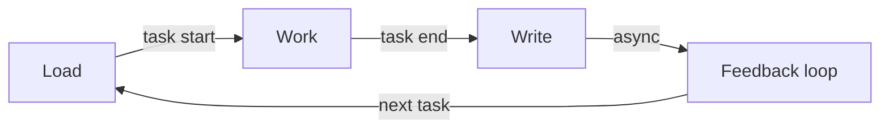
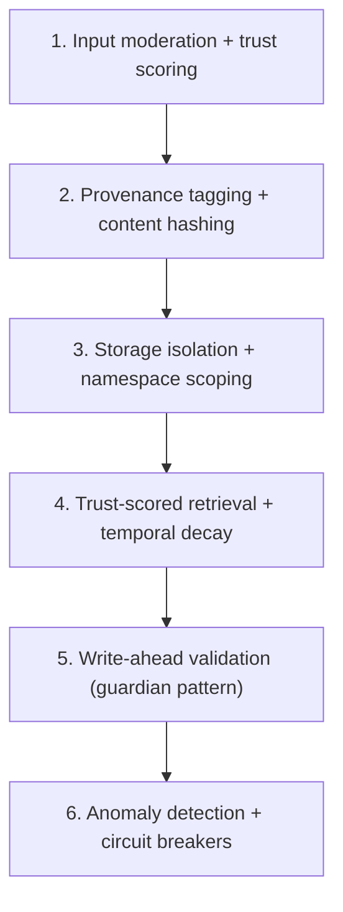

# Memory

Agents are stateless by default: each task starts from scratch with no knowledge of what happened before. The memory system fixes this by giving agents access to repository knowledge, past task episodes, and review feedback across sessions. A well-configured `CLAUDE.md` in the repository is often more impactful than any external memory, but external memory fills gaps the repo cannot: execution history, reviewer preferences, operational quirks, and cross-task patterns.

- **Use this doc for:** understanding what memory stores, how it flows through the pipeline, the security threat model, and the tiered implementation plan.
- **Related docs:** [SECURITY.md](./SECURITY.md) for prompt injection and memory poisoning mitigations, [EVALUATION.md](./EVALUATION.md) for how memory quality is measured, [ORCHESTRATOR.md](./ORCHESTRATOR.md) for context hydration.

## Design principles

- **Fail-open** - Memory failures never block task execution, PR creation, or finalization. Memory is enrichment, not a prerequisite.
- **Repo-scoped** - All memory is namespaced per repository. Cross-repo knowledge sharing is opt-in, not default.
- **Lightweight writes** - Memory writes happen at task end and must not delay finalization.
- **Swappable backend** - The core uses a `MemoryStore` interface so implementations can be swapped (AgentCore Memory today; DynamoDB, vector store, or others later).

## What the repo already provides

Before designing external memory, recognize that the repository itself is a rich memory source:

| Source | What it provides |
|---|---|
| `CLAUDE.md` / `AGENTS.md` / `.cursor/rules/` | Team-maintained instructions for AI agents |
| Code, tests, CI config | Architecture, patterns, conventions, build pipeline |
| README, CONTRIBUTING.md | Setup, workflow, standards |
| Past PR descriptions and commit messages | How changes are documented |

External memory should provide what the repo cannot tell the agent.

## What external memory fills

| Category | Question it answers | Example |
|---|---|---|
| Execution history | "What happened last time?" | Agent tried approach X on this repo and the PR was rejected |
| Review feedback | "What did the reviewer say?" | "@alice always requests explicit TypeScript types, never `any`" |
| Operational learnings | "What breaks the build?" | "CI times out if >3 integration test files run in parallel" |
| User preferences | "How does this user want things done?" | "@bob prefers small atomic PRs; @carol prefers comprehensive ones" |
| Cross-task patterns | "What works for this repo?" | "API changes always require updating the OpenAPI spec" |

## Memory lifecycle

Memory flows through four phases in the task pipeline:

### Phase 1: Load (context hydration)

Before the agent touches code, the orchestrator loads external memory via two parallel `RetrieveMemoryRecordsCommand` calls (semantic + episodic, 5-second timeout). Results are trimmed to a 2,000-token budget and injected into the agent's system prompt.

| Retrieval | Strategy | Namespace | What it returns |
|---|---|---|---|
| Repository knowledge | Semantic search | `/{repo}/knowledge/` | Codebase patterns and conventions relevant to the task description |
| Past task episodes | Episodic search | `/{repo}/episodes/` | Summaries of similar past tasks on this repo |
| Review-derived rules | Custom (planned) | `/{repo}/review-rules/` | Persistent rules extracted from PR reviews |
| User preferences | User preference (planned) | `users/{username}` | Per-user execution preferences |

### Phase 2: Work (agent execution)

The agent operates with its loaded context. No additional memory reads are needed for most tasks. For complex tasks, the agent may query memory mid-execution.

### Phase 3: Write (task end)

After the PR is opened, the agent writes:

1. **Task episode** - Structured summary: approach, files changed, PR number, difficulties, outcome
2. **Repo learnings** - New knowledge discovered about the codebase
3. **Self-feedback** - What context was missing that would have helped (see [EVALUATION.md](./EVALUATION.md))

If the agent crashes before writing memory, the orchestrator writes a minimal episode as fallback (also fail-open).

All writes use `actorId = "owner/repo"` and `sessionId = taskId`. The extraction pipeline places records at the configured namespace paths.

### Phase 4: Feedback loop (async)

Triggered by GitHub webhooks, not by agent execution:

- **PR review events** - Extract actionable rules via LLM, write to review feedback memory
- **PR close/merge events** - Record outcome signal (positive/negative) on the task episode

## Memory components

### Short-term memory

Session-scoped context (conversation, reasoning, tool results) that is lost when the session ends. Backed by AgentCore Memory within the MicroVM. Anything that must outlive the session is explicitly written to long-term memory.

### Long-term memory

Cross-session, durable memory with semantic search. The agent writes after each task; the orchestrator retrieves during context hydration.

### Code attribution

Every agent commit carries `Task-Id:` and `Prompt-Version:` trailers (via a git hook installed during `setup_repo()`). The prompt version is a SHA-256 hash of deterministic prompt parts only (memory context is excluded because it varies per run). This enables queries like "what prompt led to this code change?" and supports the evaluation pipeline.

### Review feedback memory

The most novel component and the primary feedback loop between human reviewers and the agent. No shipping coding agent autonomously learns from PR reviews today.

**How it works:** A GitHub webhook fires on PR review events. A Lambda fetches the comments, calls Bedrock to extract generalizable rules (not one-off corrections), and writes them to memory namespaced per repository. At task start, these rules are retrieved and injected into the prompt.

**Design considerations:**

- **Reviewer authority** - Maintainer feedback should carry more weight than contributor feedback
- **Rule expiry** - Rules not relevant in N tasks may be stale. Consider TTL or relevance checks.
- **Extraction quality** - The LLM prompt that extracts rules is critical. Vague extraction produces vague rules that match poorly on retrieval.
- **Security** - PR review comments are attacker-controlled input. See [SECURITY.md](./SECURITY.md).

### User preference memory

Per-user preferences extracted from task descriptions (explicit) and review patterns (implicit). Lower priority than repo knowledge and review feedback.

## AgentCore strategy mapping

| Component | Strategy | Namespace | Read | Write |
|---|---|---|---|---|
| Repo knowledge | Semantic (`SemanticKnowledge`) | `/{actorId}/knowledge/` | Task start | Task end |
| Task episodes | Episodic (`TaskEpisodes`) | `/{actorId}/episodes/{sessionId}/` | Task start | Task end |
| Review feedback | Custom (planned) | `/{actorId}/review-rules/` | Task start | PR review webhook |
| User preferences | User preference (planned) | `users/{username}` | Task start | Extracted from patterns |
| Self-feedback | Semantic (`SemanticKnowledge`) | `/{actorId}/knowledge/` | Task start | Task end |

Namespace conventions:
- `{actorId}` and `{sessionId}` are the only valid AgentCore template variables. Templates are set on extraction strategies at resource creation.
- `actorId = "owner/repo"` for all writes. `sessionId = taskId` for episodic partitioning.
- Changing namespace templates requires recreating the Memory resource (breaking infrastructure change).
- Reads use the `namespacePath` field on [`RetrieveMemoryRecords`](https://docs.aws.amazon.com/bedrock-agentcore/latest/APIReference/API_RetrieveMemoryRecords.html) for hierarchical retrieval — episodic records live one level below the parent path so a hierarchical query is required to surface them.

## Memory consolidation

Over time, memory accumulates contradictory records (e.g. "team uses Jest" from task #10, "team migrated to Vitest" from task #25). Without resolution, the agent receives conflicting guidance.

**Strategy:**
- **Favor recency** as baseline. Newer records supersede older contradictory records within the same scope.
- **Scope-aware** - Contradictions within the same module favor recency. Contradictions across scopes coexist (both may be correct).
- **Explicit supersession** for review rules - When a new rule contradicts an existing one, mark the old as superseded.
- **Episodic reflection** - After every N tasks on a repo, AgentCore's episodic reflection generates higher-order patterns from episodes.

## Error handling

| Failure | Severity | Behavior |
|---|---|---|
| Memory load fails at task start | Non-fatal | Agent proceeds with repo-intrinsic knowledge only. Warning logged. |
| Memory write fails at task end | Retry | Exponential backoff (3 attempts). If still failing, log and proceed. Learnings are lost but task outcome is unaffected. |
| Feedback extraction Lambda fails | Retry | GitHub webhook delivery retries. Manual re-processing via `start_memory_extraction_job`. |
| Empty results (new repo) | Expected | First 5-10 tasks will have sparse memory. Agent falls back to code exploration. Normal cold-start behavior. |

## Tiered implementation

Memory components are validated incrementally. Each tier must demonstrate measurable improvement before proceeding.

| Tier | Components | Status | What it tests |
|---|---|---|---|
| 0 | No external memory (baseline) | Complete | Control group: repo-intrinsic context only |
| 1 | Repo knowledge + task episodes | **Implemented** | Does remembering across tasks improve work over time? |
| 2 | Review feedback loop | Planned | Does learning from PR reviews reduce revision cycles? |
| 3 | User preferences + episodic reflection | Planned | Do per-user prefs and cross-task patterns improve PR quality? |
| 4 | Structured knowledge graph | Speculative | Only if semantic search proves insufficient for specific query patterns |

## Security

The memory system is an attack surface. OWASP classifies memory poisoning as **ASI06** (2026 Top 10 for Agentic Applications), recognizing that persistent memory attacks are fundamentally different from single-session prompt injection: a single poisoned entry can affect all future tasks on a repository.

### Threat model

**Intentional attacks:**

| Vector | Entry point | Severity |
|---|---|---|
| Query-based injection (MINJA) | Task descriptions / issue content stored as legitimate memory | Critical |
| Indirect injection via tool outputs | GitHub issues, PR comments flowing through hydration into memory | Critical |
| Experience grafting | Manipulated task episodes inducing behavioral drift | High |
| Poisoned RAG retrieval | Content engineered to rank highly for specific queries | High |
| Review comment injection | Malicious PR comments extracted as persistent rules | High |

**Emergent corruption (no external attacker):**

| Pattern | Description | Severity |
|---|---|---|
| Hallucination crystallization | Agent hallucinates a fact and writes it as a learning. Future tasks retrieve and reinforce it. | High |
| Error feedback loops | Bad episode retrieved by similar task, error repeated, new bad episode amplifies mistake | High |
| Stale context | Without temporal decay, 6-month-old memories carry equal weight to yesterday's | Medium |
| Contradictory accumulation | Conflicting records degrade decision quality (see Memory consolidation) | Medium |

### Defense layers

No single layer is sufficient. The target architecture follows six layers:

| Layer | Status | What it does |
|---|---|---|
| 1. Input moderation | **Implemented** | `sanitizeExternalContent()` strips HTML, injection patterns, control chars, bidi overrides. Content trust metadata tags each source. |
| 2. Provenance tagging | **Implemented** | Source type, SHA-256 hash, and schema version on every write. Hash is audit trail (AgentCore transforms content, so read-path sanitization is the real defense). |
| 3. Storage isolation | **Partial** | Per-repo namespace isolation. Token budget limits blast radius. Repo format validation prevents namespace confusion. |
| 4. Trust-scored retrieval | Open | Planned: temporal decay, source reliability weighting, threshold filtering |
| 5. Write-ahead validation | Open | Planned: separate model evaluates proposed memory updates before commit |
| 6. Anomaly detection | Open | Planned: write pattern monitoring, behavioral drift detection, automatic halt |

See [ROADMAP.md](../guides/ROADMAP.md) for the phased implementation plan and [SECURITY.md](./SECURITY.md) for the broader security context.
