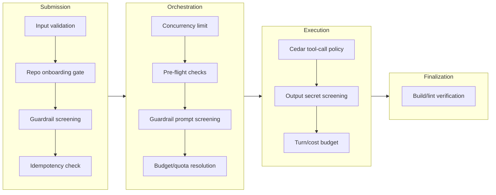

# Security

ABCA agents execute code with repository access. This document describes how the platform contains that risk: isolated sessions, scoped credentials, input screening, policy enforcement, and memory integrity controls. The design aligns with [AWS prescriptive guidance for agentic AI security](https://docs.aws.amazon.com/prescriptive-guidance/latest/agentic-ai-security/best-practices.html).

- **Use this doc for:** understanding the security boundaries, what can go wrong, and how the platform mitigates each threat.
- **Related docs:** [COMPUTE.md](./COMPUTE.md) for runtime isolation details, [MEMORY.md](./MEMORY.md) for memory threat analysis, [REPO_ONBOARDING.md](./REPO_ONBOARDING.md) for per-repo security configuration, [INPUT_GATEWAY.md](./INPUT_GATEWAY.md) for authentication flows.

## Design principle

**Security by default.** Isolated sandboxed environments, least-privilege credentials, and fine-grained access control are non-negotiable. The blast radius of any agent mistake is limited to one branch in one repository.

## Session isolation

Each task runs in its own isolated session with dedicated compute, memory, and filesystem (a MicroVM). No storage or context is shared between sessions, which prevents data leakage between users and tasks and contains compromise to a single session.

- **Lifecycle** - Sessions are created per task and destroyed when the task ends. Temporary resources are discarded on termination.
- **Identifiers** - Session and task IDs partition all state. The runtime encapsulates conversation history, reasoning state, and retrieved knowledge per session.
- **Timeouts** - Duration and idle timeouts prevent resource leaks and unbounded sessions.

## Blast radius

The agent runs with full permissions inside the sandbox but cannot escape it. The security boundary is the isolated runtime (MicroVM), not in-agent permission prompts.

- **Worst case** - A compromised agent can affect one branch in one repo. It can create or modify code and open a PR. It cannot touch other repos, other users' tasks, or production.
- **Human review** - PR review is the final gate before merge. The agent cannot merge its own PRs.
- **No shared state** - Tasks do not share memory or storage. One compromised session cannot corrupt another.

## Authentication and authorization

Two authentication mechanisms protect the platform, matching the two input channels:

| Channel | Mechanism | Details |
|---------|-----------|---------|
| CLI / REST API | Amazon Cognito JWT | Users authenticate and receive tokens. The input gateway verifies every request. |
| Webhooks | HMAC-SHA256 | Per-integration shared secrets stored in Secrets Manager. Secrets are shown once at creation and scheduled for deletion with a 7-day recovery window on revocation. |

**Authorization** is user-scoped: any authenticated user can submit tasks, but users can only view and cancel their own tasks (`user_id` enforcement). Webhook management enforces ownership with 404 (not 403) to avoid leaking webhook existence.

**Agent credentials** - GitHub access currently uses a PAT stored in Secrets Manager. The orchestrator reads the secret at hydration time and passes it to the agent runtime. The model never receives the token in its context. Planned: replace the shared PAT with a GitHub App via AgentCore Identity Token Vault, providing per-task, repo-scoped, short-lived tokens (see [ROADMAP.md](../guides/ROADMAP.md)).

## Input validation and guardrails

Input screening happens at two points in the pipeline, forming a defense-in-depth chain. Content that passes submission screening is screened again during hydration when external data (GitHub issues, PR comments) is added to the prompt.

### Submission-time screening

- **Input validation** - Required fields, types, and size limits are enforced before any processing. Task descriptions are capped at 2,000 characters.
- **Bedrock Guardrails** - A `PROMPT_ATTACK` content filter at `HIGH` strength screens task descriptions for prompt injection.
- **Fail-closed** - If the Bedrock API is unavailable, submissions are rejected (HTTP 503). Unscreened content never reaches the agent.

### Hydration-time screening

- **PR tasks** (`pr_iteration`, `pr_review`) - The assembled prompt (PR body, review comments, diff, task description) is screened through Bedrock Guardrails before the agent receives it.
- **`new_task` with issue content** - The assembled prompt (issue body, comments, task description) is screened. When no issue content is present, hydration-time screening is skipped because the task description was already screened at submission.
- **Fail-closed** - A Bedrock outage during hydration fails the task. A `guardrail_blocked` event is emitted when content is blocked.

### Tool access control

The agent's tools are allowlisted. An unrestricted tool surface increases the risk of confused deputy attacks and unintended data exfiltration. ABCA follows a tiered model:

| Tier | Scope | Tools |
|------|-------|-------|
| Default (all repos) | Minimal, predictable | Bash (allowlisted subcommands), git (limited), verify (formatters, linters, tests), filesystem (within sandbox) |
| Extended (opt-in per repo) | Additional capabilities | MCP servers, plugins, code search, documentation lookup |

Per-repo tool profiles are stored in onboarding config and loaded during context hydration. AgentCore Gateway enforces which tools are reachable at the platform level (not a prompt-level suggestion). For tools not mediated by the Gateway (bash, filesystem), enforcement relies on sandbox permissions, network egress rules, and the bash allowlist.

## Blueprint custom steps

The blueprint framework ([REPO_ONBOARDING.md](./REPO_ONBOARDING.md)) allows per-repo custom Lambda steps in the orchestrator pipeline. These are a trust boundary that requires specific attention.

**Deployment control** - Custom steps are defined in the `Blueprint` CDK construct and deployed via `cdk deploy`. Only principals with CDK deployment permissions can add or modify them. There is no runtime API for custom step CRUD.

The **same deploy-only property extends to `Blueprint.security.cedarPolicies`** — user-authored Cedar policies live in the CDK source, are typed as `readonly string[]` on the construct, and reach `RepoTable` only through a CloudFormation custom resource invoked at deploy time. Phase 3 (Cedar-driven HITL approval gates — see [`PHASE3_CEDAR_HITL.md`](./PHASE3_CEDAR_HITL.md)) is load-bearing on this property: the engine treats Cedar policies loaded at task start as trusted content. If the blueprint model ever changes to accept user-uploaded policy text via an API path, Phase 3's §12 trust model must be re-evaluated (add per-blueprint policy count cap, per-eval timeout, size cap).

**Input filtering** - The framework strips credential ARNs (`github_token_secret_arn`) and networking configuration (`egress_allowlist`) from the config before passing it to custom Lambda steps. If a custom step needs secrets, it must declare them explicitly and the operator must grant IAM permissions.

**What a custom step can do:**
- Fail or delay the pipeline (up to its timeout)
- Return misleading metadata that influences later steps

**What a custom step cannot do:**
- Skip framework invariants (state transitions, events, cancellation, concurrency)
- Access other tasks' context
- Modify the step sequence at runtime
- Bypass admission control or concurrency limits

**Cross-account** - `functionArn` should be validated at CDK synth time to ensure it belongs to the same account. Cross-account invocation requires explicit opt-in (`allowCrossAccountSteps: true`).

## Infrastructure

The platform is self-hosted in the customer's AWS account. No code or repo data is sent to third-party infrastructure by default. Multiple layers provide defense in depth:

| Layer | Mechanism | What it protects against |
|-------|-----------|------------------------|
| Edge | AWS WAFv2 (common rules, known bad inputs, rate limit: 1,000 req/5 min/IP) | Web exploits, volumetric abuse |
| Network | DNS Firewall domain allowlist (GitHub, npm, PyPI, AWS services) | Agent reaching unauthorized domains |
| Network | Security group egress restricted to TCP 443 | Non-HTTPS traffic |
| Compute | MicroVM isolation per session | Cross-session compromise |
| Credentials | Secrets Manager with scoped IAM | Credential theft |
| Audit | Bedrock model invocation logging (90-day retention) | Prompt injection investigation, compliance |
| Deployment | CDK infrastructure as code | Consistent, auditable deployments |

**DNS Firewall note:** Currently in observation mode (non-allowlisted domains are logged as ALERT but not blocked). Per-repo `egressAllowlist` entries are aggregated into the platform-wide policy. DNS Firewall does not block direct IP connections, which is acceptable for the "confused agent" threat model but not for sophisticated adversaries. See [COMPUTE.md](./COMPUTE.md) for the enforcement rollout process.

## Policy enforcement

The platform enforces policies at multiple points in the task lifecycle. Today, these are implemented inline across handlers, constructs, and agent code. A centralized Cedar-based policy framework is planned (see [ROADMAP.md](../guides/ROADMAP.md)).

### Current enforcement map

| Phase | Policy | Location | Audit |
|-------|--------|----------|-------|
| Submission | Input validation | `validation.ts`, `create-task-core.ts` | HTTP error only |
| Submission | Repo onboarding gate | `repo-config.ts` | HTTP error only |
| Submission | Guardrail screening | `create-task-core.ts` | HTTP error only |
| Admission | Concurrency limit | `orchestrator.ts` | `admission_rejected` event |
| Pre-flight | GitHub access, PAT permissions, PR access | `preflight.ts` | `preflight_failed` event |
| Hydration | Guardrail prompt screening | `context-hydration.ts` | `guardrail_blocked` event |
| Hydration | Budget/quota resolution | `orchestrator.ts` | Persisted on task record |
| Execution | Tool-call policy (Cedar) | `agent/src/hooks.py`, `agent/src/policy.py` | `POLICY_DECISION` telemetry |
| Execution | Output secret screening | `agent/src/output_scanner.py` | `OUTPUT_SCREENING` telemetry |
| Execution | Turn/cost budget | Claude Agent SDK | Cost in task result |
| Finalization | Build/lint verification | `agent/src/post_hooks.py` | Task record and PR body |
| Infrastructure | DNS Firewall, WAF | CDK constructs | CloudWatch logs |

**Audit gap:** Submission-time rejections currently return HTTP errors without structured audit events. Planned: a unified `PolicyDecisionEvent` schema across all phases (see [ROADMAP.md](../guides/ROADMAP.md)).

### Mid-execution enforcement

Once an agent session starts, two mechanisms enforce policy without requiring an external sidecar:

**Tool-call interceptor (Guardian pattern).** A Cedar-based policy engine (`agent/src/policy.py`) evaluates tool calls via the Claude Agent SDK's hook system:

- **Pre-execution** (PreToolUse hook) - Validates tool inputs before execution. `pr_review` agents cannot use `Write`/`Edit`. Writes to `.git/*` are blocked. Destructive bash commands are denied. Fail-closed: if Cedar is unavailable, all calls are denied. Per-repo custom Cedar policies are supported via Blueprint `security.cedarPolicies`.
- **Post-execution** (PostToolUse hook) - Screens tool outputs for secrets (AWS keys, GitHub tokens, private keys, connection strings). Detected secrets are redacted before re-entering the agent context (steered enforcement, not blocking).

**Behavioral circuit breaker.** Monitors tool-call patterns within a session: call frequency, cumulative cost, repeated failures, and file mutation rate. When thresholds are exceeded (e.g. >50 calls/min, >$10 cost, >5 consecutive failures), the session is paused or terminated. Thresholds are configurable per-repo via Blueprint `security` props.

## Memory threats

The platform's memory system ([MEMORY.md](./MEMORY.md)) faces threats from both intentional attacks and emergent corruption. OWASP classifies memory poisoning as **ASI06** in the 2026 Top 10 for Agentic Applications, recognizing that persistent memory attacks are fundamentally different from single-session prompt injection: poisoned entries influence every subsequent interaction.

### Attack vectors

| Vector | Description | Entry point |
|--------|-------------|-------------|
| PR review comment injection | Malicious instructions disguised as review rules get stored as persistent memory | `pr_iteration` hydration |
| Query-based injection (MINJA) | Crafted task descriptions embed content the agent stores as legitimate memory | Task submission |
| GitHub issue injection | Adversarial issue content containing memory-poisoning payloads | `new_task` hydration |
| Experience grafting | Manipulated episodic memory induces behavioral drift | Post-task memory extraction |
| Poisoned RAG retrieval | Content engineered to rank highly for specific semantic queries | Memory retrieval |
| Self-corruption | Hallucination crystallization, error feedback loops, stale context accumulation | Agent's own memory writes |

### Defense layers

1. **Input moderation with trust scoring** - Content sanitization and injection pattern detection before memory write. `sanitizeExternalContent()` strips HTML injection, prompt injection patterns, control characters, and bidi overrides. Content trust metadata (`trusted`, `untrusted-external`, `memory`) tags each source.
2. **Provenance tagging** - Every memory entry carries source type, content hash (SHA-256), and schema version. Hashes serve as audit trail (not retrieval gates, since AgentCore's extraction pipeline legitimately transforms content).
3. **Storage isolation** - Per-repo namespace isolation, expiration limits, and size caps. For multi-tenant deployments, separate AgentCore Memory resources per organization (silo model).
4. **Guardrail screening** - Assembled prompts are screened through Bedrock Guardrails before reaching the agent (fail-closed).
5. **Review feedback quorum** - Only promote feedback to persistent rules if the same pattern appears from multiple trusted reviewers across multiple PRs. Single review comments never become permanent rules.
6. **Blast radius containment** - Even if poisoned rules get through, the agent cannot modify CI/CD pipelines, change branch protection, access secrets beyond its scoped token, or push to protected branches.

**Planned:** Trust-scored retrieval with temporal decay, anomaly detection on write patterns, and write-ahead guardian validation (see [ROADMAP.md](../guides/ROADMAP.md)).

## Data protection

### DynamoDB

- **Point-in-time recovery (PITR)** on all tables (Tasks, TaskEvents, UserConcurrency, Webhooks). 35-day retention, per-second granularity.
- **On-demand backups** before major deployments or schema migrations.

### AgentCore Memory

AgentCore Memory has no native backup mechanism. Mitigation:

- **Periodic S3 export** - Scheduled Lambda exports memory records per namespace to a versioned S3 bucket (`s3://bgagent-memory-backups/{date}/{namespace}.json`).
- **Purge mechanism** - Search by namespace and time range, delete via `delete_memory_records`. S3 exports provide pre-poisoning restore capability.

### Recovery procedures

| Scenario | Procedure | RTO |
|---|---|---|
| DynamoDB corruption | Restore from PITR to new table | Minutes to hours |
| Poisoned memory rule | Query namespace + content search, delete | Minutes |
| Bulk memory corruption | Restore from S3 export, re-import | Hours |

## Known limitations

| Limitation | Risk | Mitigation |
|---|---|---|
| Shared GitHub PAT | One token for all repos. No per-user repo scoping. | Planned: GitHub App + AgentCore Token Vault for per-task, repo-scoped tokens |
| Input-only Bedrock Guardrails | Model output during execution is not screened by Guardrails | PostToolUse hook screens tool outputs for secrets/PII via regex |
| No memory rollback | 365-day expiration is the only cleanup | S3 exports provide manual restore capability |
| No MFA | Cognito MFA disabled for CLI auth flow | Enable for production deployments |
| No customer-managed KMS | AWS-managed encryption keys | Add customer-managed KMS if required by compliance |
| CORS fully open | `ALL_ORIGINS` configured for CLI | Restrict origins for browser clients |
| DNS Firewall IP bypass | Direct IP connections bypass DNS filtering | Acceptable for confused-agent threat model. AWS Network Firewall for stronger enforcement. |
| No AgentCore Memory IAM isolation | All namespaces accessible if principal can access the agent's memory | Pool model (application-layer scoping) for single-org; silo model (separate resources) for multi-tenant |
