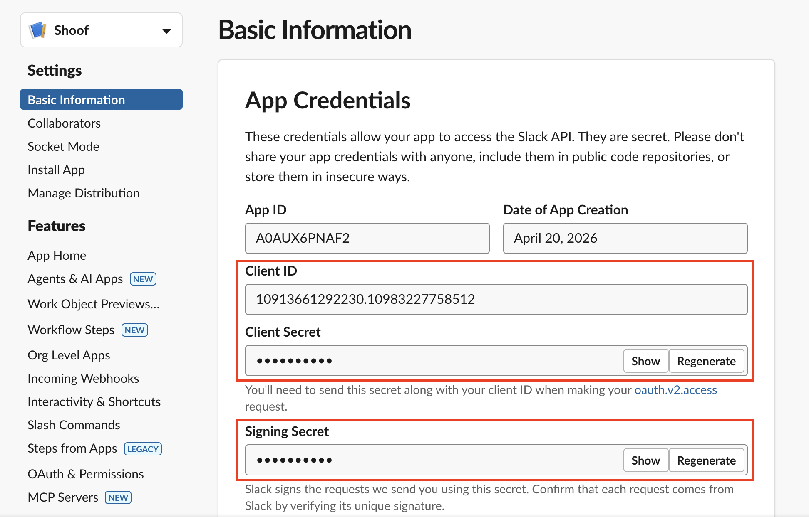
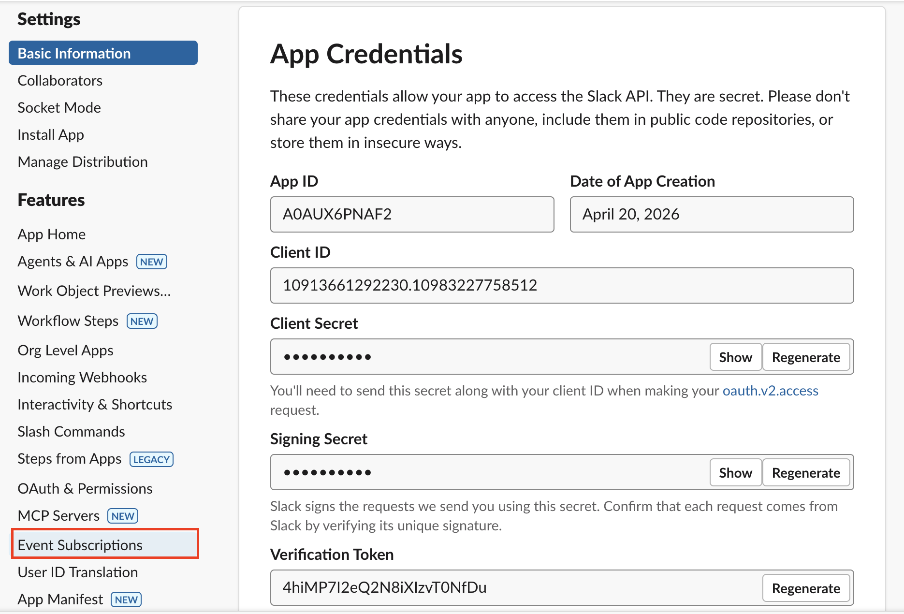
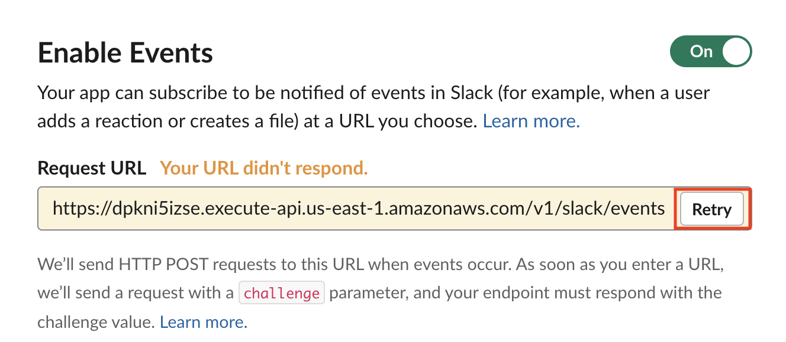
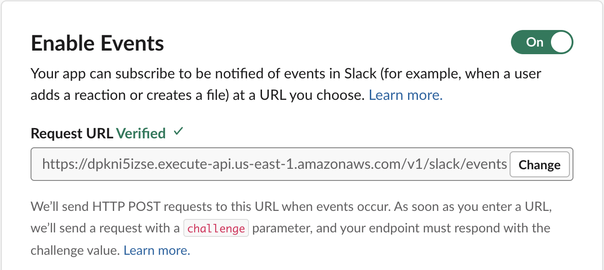

# Slack integration setup guide

This guide walks through setting up the ABCA Slack integration. Once configured, your team can submit tasks by mentioning `@Shoof` in any channel and receive real-time notifications as tasks progress.

## Prerequisites

- ABCA CDK stack deployed (see [Developer guide](./DEVELOPER_GUIDE.md))
- A Cognito user account configured (see [User guide](./USER_GUIDE.md))
- A Slack workspace where you can install apps (use a personal free workspace if your corporate Slack restricts app installs)
- AWS CLI configured with credentials for your ABCA account

## Quick start

```bash
bgagent slack setup
```

This single command handles everything: deploying the stack (if needed), generating the Slack App manifest URL, prompting for credentials, and showing the install link. Follow the on-screen instructions.

## How it works

- **@Shoof mentions**: `@Shoof fix the bug in org/repo#42` submits a task. Reactions on your message show progress: :eyes: (received) → :hourglass_flowing_sand: (working) → :white_check_mark: (done)
- **DMs**: Message Shoof directly for private task submissions
- **Notifications**: Threaded messages show task_created → completed (with PR link, duration, cost). The Cancel button lets you stop a running task.
- **Multi-workspace**: Each workspace installs via OAuth and gets its own bot token

## Step-by-step setup

### Step 1: Run the setup wizard

```bash
bgagent slack setup
```

If the stack isn't deployed yet, it will offer to deploy for you.

### Step 2: Create the Slack App

The wizard outputs a URL that opens Slack's "Create New App" page with everything pre-filled (scopes, events, commands, URLs). Click the link, select your workspace, and create the app.

### Step 3: Enter credentials

The wizard prompts for three values from your new app's **Basic Information → App Credentials** page:

| Field | Format |
|-------|--------|
| Signing Secret | 32 hex characters |
| Client Secret | 32 hex characters |
| Client ID | Numeric (e.g. 12345.67890) |



Format validation catches obvious typos (wrong length, non-hex characters). If the format is wrong, it loops back to re-enter. Note: the actual values cannot be verified until the app is installed — if you paste the wrong secret by mistake, you'll get an error at install time.

### Step 4: Verify Event Subscriptions

In the Slack App dashboard, go to **Event Subscriptions**:



1. The Request URL may show "Your URL didn't respond" — click **Retry**
2. Wait for the green "Verified" checkmark
3. Click **Save Changes**



Click **Retry** and wait for the green checkmark:



The first attempt may time out due to Lambda cold start. The retry always succeeds.

### Step 5: Install the app

The wizard outputs an OAuth install URL. Open it in your browser — do **not** use the "Install App" button in the Slack dashboard (it won't connect to your backend).

After clicking **Allow**, you'll see a success page. The bot token is now stored and Shoof can respond to messages.

### Step 6: Link your account

In Slack:
```
/bgagent link
```

In your terminal:
```bash
bgagent slack link <CODE>
```

This one-time step connects your Slack identity to your ABCA (Cognito) account. The code expires in 10 minutes.

### Step 7: Test it

In any channel where Shoof is added:
```
@Shoof fix the README typo in org/repo#1
```

You should see:
- :eyes: reaction on your message immediately
- A "Task submitted" message in the thread
- :hourglass_flowing_sand: reaction when the agent starts
- :white_check_mark: reaction and "Task completed" with a View PR button when done

## Usage

### Submit a task

Mention Shoof with a repo and description:
```
@Shoof fix the login bug in org/repo#42
@Shoof update the README in org/repo
```

For private submissions, DM Shoof directly:
```
fix the login bug in org/repo#42
```

### Cancel a task

Click the **Cancel Task** button in the thread while the agent is working.

### Get help

```
/bgagent help
```

### Slash commands

| Command | Purpose |
|---------|---------|
| `/bgagent link` | Link your Slack account (one-time) |
| `/bgagent help` | Show usage instructions |

## Troubleshooting

### @Shoof doesn't respond

1. Is Shoof added to the channel? Use `/invite @Shoof` or add via channel settings.
2. Were credentials entered correctly? Delete the app and re-run `bgagent slack setup`.
3. Check CloudWatch logs for the `SlackEventsFn` Lambda — look for "Invalid Slack event signature" (wrong signing secret).

### "Your Slack account is not linked"

Run `/bgagent link` in Slack, then `bgagent slack link <code>` in your terminal.

### "Repository not onboarded"

The repo must be registered with a Blueprint before submitting tasks. See the [User guide](./USER_GUIDE.md).

### OAuth install fails (bad_client_secret)

The credentials stored don't match your app. Delete the app and re-run `bgagent slack setup`, making sure to paste the correct values.

### Event Subscriptions URL doesn't verify

Click **Retry** — the first attempt times out due to Lambda cold start. The retry succeeds.

## Multi-workspace support

The integration supports multiple Slack workspaces. Each workspace admin opens the OAuth install URL from `bgagent slack setup` output. Per-workspace bot tokens are stored separately. Users in each workspace link their accounts independently.

## Removing the integration

To uninstall from a workspace: **Slack → Settings → Manage Apps → Shoof → Remove App**. The bot token is automatically scheduled for deletion.

To remove the Slack integration from your ABCA deployment entirely, delete the Slack App and redeploy without it.
