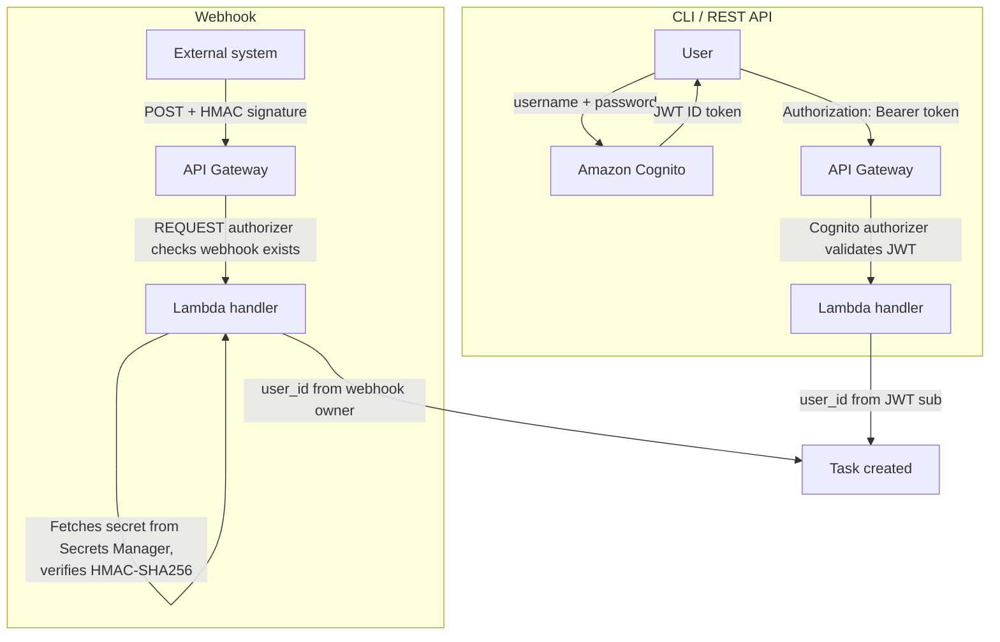
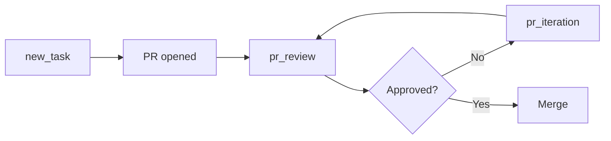
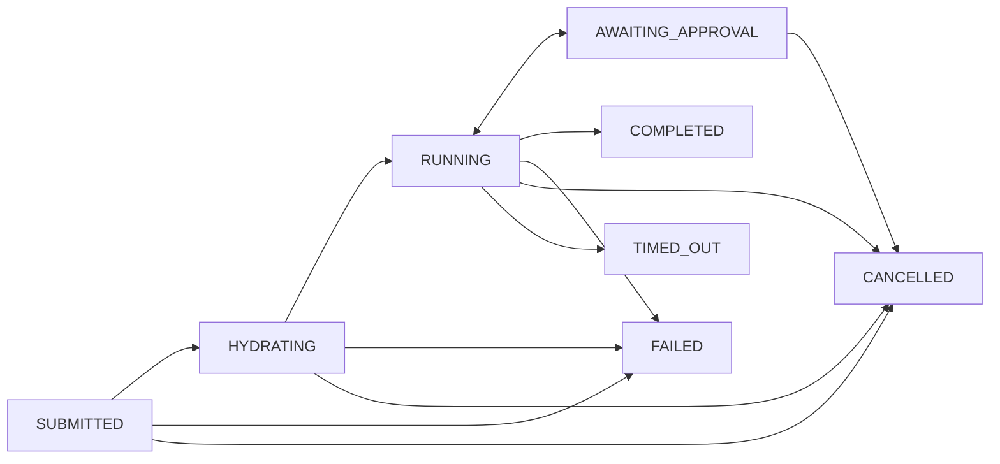

# User guide

## Overview

ABCA is a platform for running autonomous background coding agents on AWS. You submit a task (a GitHub repository + a task description or issue number), an agent works autonomously in an isolated environment, and delivers a pull request when done. This guide covers how to submit coding tasks, monitor their progress, and get the most out of the platform.

There are five ways to interact with the platform. You can use them independently or combine them for different workflows:

1. **CLI** (recommended) - The `bgagent` CLI authenticates via Cognito and calls the Task API. Best for individual developers submitting tasks from the terminal. Handles login, token caching, and output formatting.
2. **REST API** (direct) - Call the Task API endpoints directly with a JWT token. Best for building custom integrations, dashboards, or internal tools on top of the platform. Full validation, audit logging, and idempotency support.
3. **Webhook** - External systems (CI pipelines, GitHub Actions) can create tasks via HMAC-authenticated HTTP requests. Best for automated workflows where tasks should be triggered by events (e.g., a new issue is labeled, a PR needs review). No Cognito credentials needed; uses a shared secret per integration.
4. **Slack** - Submit tasks by @mentioning the bot and receive threaded progress notifications with reaction-based status. See the [Slack setup guide](./SLACK_SETUP_GUIDE.md).
5. **Linear** - Apply a label to a Linear issue to trigger a task; the agent posts progress comments back on the issue via Linear's MCP server. See the [Linear setup guide](./LINEAR_SETUP_GUIDE.md).

For example, a team might use the **CLI** for ad-hoc tasks, **webhooks** to auto-trigger `pr_review` on every new PR via GitHub Actions, **Slack** for quick team-wide requests, **Linear** for tickets that already live in the PM tool, and the **REST API** to build a dashboard that tracks task status across repositories.

## Prerequisites

- The CDK stack deployed (see [Developer guide](./DEVELOPER_GUIDE.md))
- A Cognito user account (see [Authentication](#authentication) below)
- **Repositories must be onboarded** before tasks can target them (see [Repository onboarding](#repository-onboarding) below)
- For the **CLI**: Node.js installed; build the CLI with `cd cli && mise run build`

## Authentication

The platform uses two authentication mechanisms depending on the channel:

- **CLI / REST API** - Amazon Cognito User Pool with JWT tokens. Self-signup is disabled; an administrator must create your account.
- **Webhooks** - HMAC-SHA256 signatures using per-integration shared secrets stored in AWS Secrets Manager.

Both channels are protected by AWS WAF at the API Gateway edge (rate limiting, common exploit protection). Downstream services never see raw tokens or secrets - the gateway extracts the user identity and attaches it to internal messages.



**CLI / REST API flow:**

1. **Authenticate** - The user sends username and password to Amazon Cognito via the CLI (`bgagent login`) or the AWS SDK (`initiate-auth`).
2. **Receive token** - Cognito validates credentials and returns a JWT ID token. The CLI caches it locally (`~/.bgagent/credentials.json`) and auto-refreshes on expiry.
3. **Call the API** - Every request includes the token in the `Authorization: Bearer <token>` header.
4. **Validate** - API Gateway's Cognito authorizer verifies the JWT signature, expiration, and audience. Invalid tokens are rejected with `401`.
5. **Extract identity** - The Lambda handler reads the `sub` claim from the validated JWT and uses it as `user_id` for task ownership and audit.

**Webhook flow:**

1. **Send request** - The external system (CI pipeline, GitHub Actions) sends a `POST` to `/v1/webhooks/tasks` with two headers: `X-Webhook-Id` (identifies the integration) and `X-Webhook-Signature` (`sha256=<hex>`).
2. **Check webhook exists** - A Lambda REQUEST authorizer verifies that the webhook ID exists and is active in DynamoDB. Revoked or unknown webhooks are rejected with `403`.
3. **Verify signature** - The handler fetches the webhook's shared secret from AWS Secrets Manager, computes `HMAC-SHA256(secret, raw_request_body)`, and compares it to the provided signature using constant-time comparison (`crypto.timingSafeEqual`). Mismatches are rejected with `403`.
4. **Extract identity** - The `user_id` is the Cognito user who originally created the webhook integration. Tasks created via webhook are owned by that user.

### Get stack outputs

After deployment, retrieve the API URL and Cognito identifiers. Set `REGION` to the AWS region where you deployed the stack (for example `us-east-1`). Use the same value for all `aws` and `bgagent configure` commands below  - a mismatch often surfaces as a confusing Cognito “app client does not exist” error.

```bash
REGION=<your-deployment-region>

API_URL=$(aws cloudformation describe-stacks --stack-name backgroundagent-dev \
  --region "$REGION" \
  --query 'Stacks[0].Outputs[?OutputKey==`ApiUrl`].OutputValue' --output text)
USER_POOL_ID=$(aws cloudformation describe-stacks --stack-name backgroundagent-dev \
  --region "$REGION" \
  --query 'Stacks[0].Outputs[?OutputKey==`UserPoolId`].OutputValue' --output text)
APP_CLIENT_ID=$(aws cloudformation describe-stacks --stack-name backgroundagent-dev \
  --region "$REGION" \
  --query 'Stacks[0].Outputs[?OutputKey==`AppClientId`].OutputValue' --output text)
```

### Create a user (admin)

```bash
aws cognito-idp admin-create-user \
  --region "$REGION" \
  --user-pool-id $USER_POOL_ID \
  --username user@example.com \
  --user-attributes Name=email,Value=user@example.com Name=email_verified,Value=true \
  --temporary-password 'TempPass123!@' \
  --message-action SUPPRESS

aws cognito-idp admin-set-user-password \
  --region "$REGION" \
  --user-pool-id $USER_POOL_ID \
  --username user@example.com \
  --password 'YourPerm@nent1Pass!' \
  --permanent
```

**Pool constraints** (enforced server-side; ignoring them yields cryptic Cognito errors at login):

- **Username MUST be an email address.** The pool is configured with email as the sign-in alias, so `--username` has to be a valid email — short handles like `alice` are rejected at create time.
- **Password policy**: minimum 12 characters, with at least one uppercase letter, one lowercase letter, one digit, and one symbol.
- **`email_verified=true` attribute is required** for the account to log in. Creating a user without it leaves the account in `FORCE_CHANGE_PASSWORD` state and subsequent `initiate-auth` calls fail with `User is not confirmed`.
- **`--message-action SUPPRESS`** stops Cognito from trying to email the temporary password. If SES isn't configured on the account, omitting this flag causes `admin-create-user` to fail with `NotAuthorizedException`. Safe for non-prod; omit only if you have a working SES sender identity.

The first command creates the user with a temporary password and pre-verifies the email. The second sets a permanent password so you do not have to go through a password change flow on first login.

### Obtain a JWT token

```bash
TOKEN=$(aws cognito-idp initiate-auth \
  --region "$REGION" \
  --client-id $APP_CLIENT_ID \
  --auth-flow USER_PASSWORD_AUTH \
  --auth-parameters USERNAME=user@example.com,PASSWORD='YourPerm@nent1Pass!' \
  --query 'AuthenticationResult.IdToken' --output text)
```

Use this token in the `Authorization` header for all API requests.

## Repository onboarding

Before submitting tasks against a repository, the repository must be **onboarded** to the platform. Onboarding is managed by the platform administrator through CDK  - each repository is registered as a `Blueprint` construct in the CDK stack, which writes a configuration record to the `RepoTable` DynamoDB table.

If you submit a task against a repository that has not been onboarded, the API returns a `422` error with code `REPO_NOT_ONBOARDED`:

```json
{
  "error": {
    "code": "REPO_NOT_ONBOARDED",
    "message": "Repository 'owner/repo' is not onboarded. Register it with a Blueprint before submitting tasks."
  }
}
```

Contact your platform administrator to onboard a new repository. For details on how administrators register repositories, see the [Developer guide](./DEVELOPER_GUIDE.md#repository-onboarding).

## Per-repo overrides

Blueprints can configure per-repository settings that override platform defaults:

| Setting | Description | Default |
|---|---|---|
| `compute_type` | Compute strategy (`agentcore` or `ecs`) | `agentcore` |
| `runtime_arn` | AgentCore runtime ARN override | Platform default |
| `model_id` | Foundation model ID | Platform default |
| `max_turns` | Default turn limit for tasks | 100 |
| `max_budget_usd` | Default cost budget in USD per task | None (unlimited) |
| `system_prompt_overrides` | Additional system prompt instructions | None |
| `github_token_secret_arn` | Per-repo GitHub token (Secrets Manager ARN) | Platform default |
| `poll_interval_ms` | Poll interval for awaiting completion (5000–300000) | 30000 |

When you specify `--max-turns` (CLI) or `max_turns` (API) on a task, your value takes precedence over the Blueprint default. If neither is specified, the platform default (100) is used. The same override pattern applies to `--max-budget` / `max_budget_usd`, except there is no platform default  - if neither the task nor the Blueprint specifies a budget, no cost limit is applied.

## Task types

The platform supports three task types that cover the full lifecycle of a code change:

| Type | Description | Outcome |
|---|---|---|
| `new_task` (default) | Create a new branch, implement changes, and open a new PR. | New pull request |
| `pr_iteration` | Check out an existing PR's branch, read review feedback, address it, and push updates. | Updated pull request |
| `pr_review` | Check out an existing PR's branch, analyze the changes read-only, and post a structured review. | Review comments on the PR |

### When to use each type

**`new_task`** - You have a feature request, bug report, or task description and want the agent to implement it from scratch. The agent creates a fresh branch, writes code, runs tests, and opens a new PR. Use this for greenfield work: adding features, fixing bugs, writing tests, refactoring, or updating documentation.

**`pr_iteration`** - A reviewer left feedback on an existing PR and you want the agent to address it. The agent reads the review comments, makes targeted changes, and pushes to the same branch. Use this to accelerate the review-fix-push cycle without context-switching from your current work.

**`pr_review`** - You want a structured code review of an existing PR before a human reviewer looks at it. The agent reads the changes and posts review comments without modifying code. Use this as a first-pass review to catch issues early, especially for large PRs or when reviewers are busy.

### Combining task types

The three task types work together as a development loop:



1. Submit a `new_task` - the agent implements the change and opens a PR.
2. Submit a `pr_review` on the new PR - the agent posts structured review comments.
3. Submit a `pr_iteration` - the agent addresses the review feedback and pushes updates.
4. Repeat steps 2-3 until the PR is ready to merge.

You can automate this loop with webhooks: trigger `pr_review` automatically when a PR is opened, and `pr_iteration` when review comments are posted.

## Using the REST API

The Task API exposes 5 endpoints under the base URL from the `ApiUrl` stack output. All endpoints require Cognito JWT authentication (`Authorization: Bearer <token>`).

| Method | Endpoint | Description |
|---|---|---|
| `POST` | `/tasks` | Create a new task (new_task, pr_iteration, or pr_review) |
| `GET` | `/tasks` | List your tasks with optional filters (status, repo, pagination) |
| `GET` | `/tasks/{task_id}` | Get full detail for a specific task |
| `DELETE` | `/tasks/{task_id}` | Cancel a running or queued task |
| `GET` | `/tasks/{task_id}/events` | Get the chronological audit log for a task |

### Create a task

```bash
curl -X POST "$API_URL/tasks" \
  -H "Authorization: $TOKEN" \
  -H "Content-Type: application/json" \
  -d '{
    "repo": "owner/repo",
    "task_description": "Add input validation to the /users POST endpoint"
  }'
```

**Example response** right after submit (`status` is `SUBMITTED`; `branch_name` is reserved up front; `session_id`, `pr_url`, cost, and timing stay `null` until the orchestrator and agent progress):

```bash
curl -X POST "$API_URL/tasks" \
  -H "Authorization: $TOKEN" \
  -H "Content-Type: application/json" \
  -d '{"repo": "krokoko/agent-plugins", "task_description": "add codeowners field to RFC issue template"}'
```

```json
{"data":{"task_id":"01KN36YGQV6BEPDD7CVMKP1PF3","status":"SUBMITTED","repo":"krokoko/agent-plugins","issue_number":null,"task_description":"add codeowners field to RFC issue template","branch_name":"bgagent/01KN36YGQV6BEPDD7CVMKP1PF3/add-codeowners-field-to-rfc-issue-template","session_id":null,"pr_url":null,"error_message":null,"error_classification":null,"created_at":"2026-04-01T00:26:30.011Z","updated_at":"2026-04-01T00:26:30.011Z","started_at":null,"completed_at":null,"duration_s":null,"cost_usd":null,"build_passed":null,"max_turns":null,"max_budget_usd":null,"prompt_version":null}}
```

To create a task from a GitHub issue:

```bash
curl -X POST "$API_URL/tasks" \
  -H "Authorization: $TOKEN" \
  -H "Content-Type: application/json" \
  -d '{"repo": "owner/repo", "issue_number": 42}'
```

To iterate on an existing pull request (address review feedback):

```bash
curl -X POST "$API_URL/tasks" \
  -H "Authorization: $TOKEN" \
  -H "Content-Type: application/json" \
  -d '{"repo": "owner/repo", "task_type": "pr_iteration", "pr_number": 42}'
```

You can optionally include `task_description` with `pr_iteration` to provide additional instructions alongside the review feedback:

```bash
curl -X POST "$API_URL/tasks" \
  -H "Authorization: $TOKEN" \
  -H "Content-Type: application/json" \
  -d '{"repo": "owner/repo", "task_type": "pr_iteration", "pr_number": 42, "task_description": "Focus on the null check Alice flagged in the auth module"}'
```

To request a read-only review of an existing pull request:

```bash
curl -X POST "$API_URL/tasks" \
  -H "Authorization: $TOKEN" \
  -H "Content-Type: application/json" \
  -d '{"repo": "owner/repo", "task_type": "pr_review", "pr_number": 55}'
```

You can optionally include `task_description` with `pr_review` to focus the review on specific areas:

```bash
curl -X POST "$API_URL/tasks" \
  -H "Authorization: $TOKEN" \
  -H "Content-Type: application/json" \
  -d '{"repo": "owner/repo", "task_type": "pr_review", "pr_number": 55, "task_description": "Focus on security implications and error handling"}'
```

**Request body fields:**

| Field | Type | Required | Description |
|---|---|---|---|
| `repo` | string | Yes | GitHub repository in `owner/repo` format |
| `issue_number` | number | One of these | GitHub issue number |
| `task_description` | string | is required | Free-text task description |
| `pr_number` | number | | PR number to iterate on or review (required for `pr_iteration` and `pr_review`) |
| `task_type` | string | No | `new_task` (default), `pr_iteration`, or `pr_review`. |
| `max_turns` | number | No | Maximum agent turns (1–500). Overrides the per-repo Blueprint default. Platform default: 100. |
| `max_budget_usd` | number | No | Maximum cost budget in USD (0.01–100). When reached, the agent stops regardless of remaining turns. Overrides the per-repo Blueprint default. If omitted, no budget limit is applied. |

**Content screening:** Task descriptions are automatically screened by Amazon Bedrock Guardrails for prompt injection before the task is created. If content is blocked, you receive a `400 GUARDRAIL_BLOCKED` error  - revise the description and retry. If the screening service is temporarily unavailable, you receive a `503` error  - retry after a short delay. For PR tasks (`pr_iteration`, `pr_review`), the assembled prompt (including PR body and review comments) is also screened during context hydration; if blocked, the task transitions to `FAILED`.

**Idempotency:** Include an `Idempotency-Key` header (alphanumeric, dashes, underscores, max 128 chars) to prevent duplicate task creation on retries:

```bash
curl -X POST "$API_URL/tasks" \
  -H "Authorization: $TOKEN" \
  -H "Content-Type: application/json" \
  -H "Idempotency-Key: my-unique-key-123" \
  -d '{"repo": "owner/repo", "task_description": "Fix bug"}'
```

### List tasks

```bash
curl "$API_URL/tasks" -H "Authorization: $TOKEN"
```

**Query parameters:**

| Parameter | Description |
|---|---|
| `status` | Filter by status (e.g., `RUNNING` or `RUNNING,SUBMITTED`) |
| `repo` | Filter by repository |
| `limit` | Max results per page (default: 20, max: 100) |
| `next_token` | Pagination token from a previous response |

Example with filters:

```bash
curl "$API_URL/tasks?status=RUNNING,SUBMITTED&limit=10" -H "Authorization: $TOKEN"
```

### Get task detail

```bash
curl "$API_URL/tasks/<TASK_ID>" -H "Authorization: $TOKEN"
curl "$API_URL/tasks/01KJDSS94G3VA55CW1M534EC7Q" -H "Authorization: $TOKEN"
```

Returns the full task record including status, timestamps, PR URL, cost, and error details.

**Example** (after a successful run  - `status` is `COMPLETED`, `pr_url` populated):

```bash
curl "$API_URL/tasks/01KN36YGQV6BEPDD7CVMKP1PF3" -H "Authorization: $TOKEN"
```

```json
{"data":{"task_id":"01KN36YGQV6BEPDD7CVMKP1PF3","status":"COMPLETED","repo":"krokoko/agent-plugins","issue_number":null,"task_description":"add codeowners field to RFC issue template","branch_name":"bgagent/01KN36YGQV6BEPDD7CVMKP1PF3/add-codeowners-field-to-rfc-issue-template","session_id":"3eb8f3fb-808d-47d6-8557-309fb9369ea7","pr_url":"https://github.com/krokoko/agent-plugins/pull/59","error_message":null,"error_classification":null,"created_at":"2026-04-01T00:26:30.011Z","updated_at":"2026-04-01T00:26:35.350Z","started_at":"2026-04-01T00:26:35.350Z","completed_at":"2026-04-01T00:30:32Z","duration_s":125.9,"cost_usd":0.15938219999999997,"build_passed":null,"max_turns":null,"max_budget_usd":null,"prompt_version":"1c9c10e027a2"}}
```

### Cancel a task

```bash
curl -X DELETE "$API_URL/tasks/<TASK_ID>" -H "Authorization: $TOKEN"
```

Transitions the task to `CANCELLED` and records a cancellation event. Only tasks in non-terminal states can be cancelled.

### Get task events (audit log)

```bash
curl "$API_URL/tasks/<TASK_ID>/events" -H "Authorization: $TOKEN"
```

Returns the chronological event log for a task (e.g., `task_created`, `preflight_failed`, `session_started`, `task_completed`). Supports `limit` and `next_token` pagination parameters. If the task failed before the agent ran, inspect `preflight_failed` entries for `reason` and `detail` (see **Task events** under **Task lifecycle**).

## Using the CLI

The `bgagent` CLI is the recommended way to interact with the platform. It authenticates via Cognito, manages token caching, and provides formatted output.

**This repository** builds the CLI under `cli/`; after compile, run the entrypoint as `node lib/bin/bgagent.js` from the `cli` directory (the path `package.json` exposes as `bin`). If you install a published package or link `bgagent` onto your `PATH`, you can call `bgagent` directly  - the subcommands are the same.

### Setup

```bash
cd cli
mise run build

# Configure with your stack outputs (run from cli/)
node lib/bin/bgagent.js configure \
  --api-url $API_URL \
  --region "$REGION" \
  --user-pool-id $USER_POOL_ID \
  --client-id $APP_CLIENT_ID

# Log in
node lib/bin/bgagent.js login --username user@example.com
```

### Submitting a task

```bash
# From cli/  - from a GitHub issue
node lib/bin/bgagent.js submit --repo owner/repo --issue 42

# From a text description
node lib/bin/bgagent.js submit --repo owner/repo --task "Add input validation to the /users POST endpoint"

# Iterate on an existing pull request (address review feedback)
node lib/bin/bgagent.js submit --repo owner/repo --pr 42

# Iterate on a PR with additional instructions
node lib/bin/bgagent.js submit --repo owner/repo --pr 42 --task "Focus on the null check Alice flagged"

# Review an existing pull request (read-only  - posts structured review comments)
node lib/bin/bgagent.js submit --repo owner/repo --review-pr 55

# Review a PR with a specific focus area
node lib/bin/bgagent.js submit --repo owner/repo --review-pr 55 --task "Focus on security and error handling"

# Submit and wait for completion
node lib/bin/bgagent.js submit --repo owner/repo --issue 42 --wait
```

**Example** (default `text` output immediately after a successful submit  - task is `SUBMITTED`, branch name reserved):

```bash
node lib/bin/bgagent.js submit --repo krokoko/agent-plugins --task "add codeowners field to RFC issue template"
```

```text
Task:        01KN37PZ77P1W19D71DTZ15X6X
Status:      SUBMITTED
Repo:        krokoko/agent-plugins
Description: add codeowners field to RFC issue template
Branch:      bgagent/01KN37PZ77P1W19D71DTZ15X6X/add-codeowners-field-to-rfc-issue-template
Created:     2026-04-01T00:39:51.271Z
```

**Options:**

| Flag | Description |
|---|---|
| `--repo` | GitHub repository (`owner/repo`). Required. |
| `--issue` | GitHub issue number. |
| `--task` | Task description text. |
| `--pr` | PR number to iterate on. Sets task type to `pr_iteration`. The agent checks out the PR's branch, reads review feedback, and pushes updates. |
| `--review-pr` | PR number to review. Sets task type to `pr_review`. The agent checks out the PR's branch, analyzes changes read-only, and posts structured review comments. |
| `--max-turns` | Maximum agent turns (1–500). Overrides per-repo Blueprint default. Platform default: 100. |
| `--max-budget` | Maximum cost budget in USD (0.01–100). Overrides per-repo Blueprint default. No default limit. |
| `--idempotency-key` | Idempotency key for deduplication. |
| `--trace` | Enable detailed tracing: raises progress preview cap to 4 KB and uploads full NDJSON trajectory to S3 on completion. Download with `bgagent trace download`. |
| `--approval-timeout` | Cedar HITL per-task approval timeout in seconds (default 300). A matching rule with its own `@approval_timeout_s` annotation still takes the minimum. See [Approval gates](#approval-gates-cedar-hitl). |
| `--pre-approve` | Cedar HITL scope to approve up-front (repeatable). Same scope forms as `bgagent approve --scope`. Hard-deny rules are always enforced. |
| `--wait` | Poll until the task reaches a terminal status. |
| `--output` | Output format: `text` (default) or `json`. |

At least one of `--issue`, `--task`, `--pr`, or `--review-pr` is required. The `--pr` and `--review-pr` flags are mutually exclusive.

### Checking task status

Run these from the `cli/` directory (same as in **Setup**).

#### Single task

```bash
node lib/bin/bgagent.js status <TASK_ID>

# Poll until completion
node lib/bin/bgagent.js status <TASK_ID> --wait
```

**Example** (default `text` output once the task has finished  - `COMPLETED`, with session id, PR link, duration, and cost):

```bash
node lib/bin/bgagent.js status 01KN37PZ77P1W19D71DTZ15X6X
```

```text
Task:        01KN37PZ77P1W19D71DTZ15X6X
Status:      COMPLETED
Repo:        krokoko/agent-plugins
Description: add codeowners field to RFC issue template
Branch:      bgagent/01KN37PZ77P1W19D71DTZ15X6X/add-codeowners-field-to-rfc-issue-template
Session:     9891af91-bfc6-488f-bfe6-ce8f8c9a63cf
PR:          https://github.com/krokoko/agent-plugins/pull/60
Created:     2026-04-01T00:39:51.271Z
Started:     2026-04-01T00:39:56.647Z
Completed:   2026-04-01T00:43:49Z
Duration:    148.6s
Cost:        $0.1751
```

#### All tasks

```bash
node lib/bin/bgagent.js list
node lib/bin/bgagent.js list --status RUNNING,SUBMITTED
node lib/bin/bgagent.js list --repo owner/repo --limit 10
```

### Viewing task events

```bash
node lib/bin/bgagent.js events <TASK_ID>
node lib/bin/bgagent.js events <TASK_ID> --limit 20
node lib/bin/bgagent.js events <TASK_ID> --output json
```

Use **`--output json`** to see the full payload for **`preflight_failed`** (`reason`, `detail`, and per-check metadata). See **Task events** under **Task lifecycle** for how to interpret common `reason` values.

### Watching a task in real time

Stream progress events (turns, tool calls, tool results, milestones, cost updates) from a running task and exit automatically when it reaches a terminal state.

```bash
node lib/bin/bgagent.js watch <TASK_ID>

# JSON output (one event per line) — useful for scripting
node lib/bin/bgagent.js watch <TASK_ID> --output json
```

Exit codes: `0` on `COMPLETED`, `1` on `FAILED` / `CANCELLED` / `TIMED_OUT`. Press Ctrl+C to exit early without affecting the task.

### Steering a running task (nudge)

Send a mid-run message to the agent while it is working. The agent emits a `nudge_acknowledged` milestone before incorporating your guidance into its next turn.

```bash
node lib/bin/bgagent.js nudge <TASK_ID> "Focus on the auth module first"

# Example: redirect scope mid-task
node lib/bin/bgagent.js nudge <TASK_ID> "Skip the docs update, just fix the handler"
```

Nudges are delivered between turns — the agent finishes its current tool call before reading the message. You can send multiple nudges; each one is acknowledged in order.

### Tracing a task

Submit a task with `--trace` to enable detailed tracing. This raises the progress-writer preview cap from 200 chars to 4 KB and uploads a full gzipped NDJSON trajectory to S3 when the task finishes.

```bash
# Submit with tracing enabled
node lib/bin/bgagent.js submit --repo owner/repo --issue 42 --trace

# Download the trace after the task completes
node lib/bin/bgagent.js trace download <TASK_ID>

# Pipe to jq for analysis
node lib/bin/bgagent.js trace download <TASK_ID> | gunzip | jq -s .

# Save raw gzip to a file
node lib/bin/bgagent.js trace download <TASK_ID> -o trace.ndjson.gz

# Overwrite existing file
node lib/bin/bgagent.js trace download <TASK_ID> -o trace.ndjson.gz --force
```

### Debug output

Add `--verbose` to any `bgagent` command to emit the full HTTP request/response cycle on stderr. This is useful for diagnosing auth, network, or API contract issues.

```bash
node lib/bin/bgagent.js --verbose status <TASK_ID>
node lib/bin/bgagent.js --verbose submit --repo owner/repo --task "Fix the bug"
```

### Cancelling a task

```bash
node lib/bin/bgagent.js cancel <TASK_ID>
```

## Approval gates (Cedar HITL)

The platform evaluates every tool call the agent is about to make (Bash, Write, Edit, WebFetch, ...) against a Cedar policy set. Most calls resolve to a plain **Allow** or **Deny** with no human involvement. For a small, explicitly-marked set of rules, the decision is **require-approval**: the agent pauses, the task transitions to `AWAITING_APPROVAL`, and you are asked to make the call.

The mechanism is Cedar HITL gates — "Human-In-The-Loop." It is the same policy language you can already author at the blueprint level, with one added annotation (`@tier("soft")`) that flips a rule from hard-deny to require-approval.

For the full design and guarantees (atomicity, fail-closed posture, timeout semantics, late-approval handling), see [Cedar HITL gates design doc](../design/CEDAR_HITL_GATES.md). For writing policies, see the [Cedar policy guide](./CEDAR_POLICY_GUIDE.md).

### When a gate fires

When a rule marked `@tier("soft")` matches a tool call:

1. The agent stops before invoking the tool.
2. A row is atomically written to the approvals table and the task status flips to `AWAITING_APPROVAL`.
3. A progress event (`approval_requested`) is emitted so `bgagent watch` shows the gate in real time.
4. The task waits for your decision up to the rule's timeout (default 300 s, configurable per-rule and per-task).
5. On approval, the agent proceeds; on denial, the deny reason is best-effort injected back into the agent's context so it can adapt; on timeout, the gate is treated as a denial with `timed_out` as the reason.

A decision is recorded at most once per request. Replaying approve/deny on the same `(task_id, request_id)` is idempotent.

### Listing pending approvals

```bash
node lib/bin/bgagent.js pending
```

Lists every approval across your tasks that is currently awaiting your decision. The default text output gives you the `request_id`, tool, severity, the reason the rule matched, the tool-input preview, the expiry time, and ready-to-run `approve` / `deny` command lines. Pipe through `--output json` for scripting.

```text
1 pending approval(s):

  task_id:    01KN37PZ77P1W19D71DTZ15X6X
  request_id: 01R...
  tool:       Bash    severity: high
  reason:     Bash command matches force-push pattern
  rules:      force_push_any
  preview:    git push --force origin feature/xyz
  created:    2026-05-13T12:04:12Z
  expires:    2026-05-13T12:09:12Z (timeout_s=300)
  approve:    bgagent approve 01KN37PZ77P1W19D71DTZ15X6X 01R...
  deny:       bgagent deny 01KN37PZ77P1W19D71DTZ15X6X 01R... --reason "..."
```

### Approving a gate

```bash
node lib/bin/bgagent.js approve <TASK_ID> <REQUEST_ID>
node lib/bin/bgagent.js approve <TASK_ID> <REQUEST_ID> --scope tool_type:Bash
node lib/bin/bgagent.js approve <TASK_ID> <REQUEST_ID> --scope rule:force_push_any
node lib/bin/bgagent.js approve <TASK_ID> <REQUEST_ID> --scope all_session --yes
```

The `--scope` flag controls how long the approval carries forward within the running task:

| Scope | Effect |
|---|---|
| `this_call` | Default. Approves only the exact tool call that is waiting. The next matching gate will ask again. |
| `tool_type_session` | Approves every call to the same tool type (e.g. `Bash`) for the rest of this task. |
| `tool_type:<name>` | Same as `tool_type_session`, but pinned to a specific tool (`tool_type:Bash`). |
| `tool_group_session` / `tool_group:<name>` | Same pattern by tool group (`Edit` + `Write` are grouped as file-write, etc.). |
| `bash_pattern:<glob>` | Approves Bash commands matching a glob (e.g. `bash_pattern:pytest*`). |
| `write_path:<glob>` | Approves Write/Edit calls whose target path matches the glob (e.g. `write_path:tests/**`). |
| `rule:<rule_id>` | Approves every future gate fired by a specific rule. |
| `all_session` | Nuclear option — approves every subsequent gate in the task. Requires `--yes`. |

Approvals only affect the current task; they do not persist across tasks.

### Denying a gate

```bash
node lib/bin/bgagent.js deny <TASK_ID> <REQUEST_ID>
node lib/bin/bgagent.js deny <TASK_ID> <REQUEST_ID> --reason "run the migration dry-run first"
node lib/bin/bgagent.js deny <TASK_ID> <REQUEST_ID> --reason-file deny.txt
```

The optional `--reason` text is sanitized and truncated server-side, then best-effort injected into the agent's Stop-hook context so it can adapt (try a different approach, ask you a question, or stop gracefully) instead of retrying blindly. Use `--reason-file` when the reason is multi-line and would otherwise require careful shell quoting.

### Discovering repo policies

Before submitting a task you can list the rules that apply to the target repository:

```bash
node lib/bin/bgagent.js policies list --repo owner/repo
node lib/bin/bgagent.js policies list --repo owner/repo --tier soft
node lib/bin/bgagent.js policies show --repo owner/repo --rule force_push_any
```

`policies list` prints both tiers: **hard-deny** rules are absolute (even `--pre-approve` cannot bypass them), **soft-deny** rules are the approvable ones. `policies show` prints the full detail for a specific rule (severity, timeout, category, summary).

### Pre-approving scopes at submit time

If you trust a task to make a certain class of changes without interactive confirmation, pre-approve them up front:

```bash
node lib/bin/bgagent.js submit --repo owner/repo --issue 42 \
  --pre-approve tool_type:Bash \
  --pre-approve write_path:tests/**

# Per-task timeout override (platform default is 300s)
node lib/bin/bgagent.js submit --repo owner/repo --issue 42 --approval-timeout 600
```

`--pre-approve` can be repeated up to the platform limit (see `bgagent submit --help` for the current cap). Valid scope forms are the same as the `approve --scope` table above. Hard-deny rules are still enforced — `--pre-approve` only short-circuits soft-deny rules.

`--approval-timeout` sets the task-wide default; a rule with its own `@approval_timeout_s` annotation still takes the minimum of the two.

## Webhook integration

Webhooks allow external systems (CI pipelines, GitHub Actions, custom automation) to create tasks without Cognito credentials. Each webhook integration has its own HMAC-SHA256 shared secret.

### Managing webhooks (CLI)

The `bgagent webhook` commands manage webhook integrations directly from the terminal:

```bash
# Create a webhook — returns the secret (shown once)
node lib/bin/bgagent.js webhook create --name "My CI Pipeline"

# List active webhooks
node lib/bin/bgagent.js webhook list

# Revoke a webhook (soft delete — 7-day secret recovery window)
node lib/bin/bgagent.js webhook revoke <WEBHOOK_ID>
```

### Managing webhooks (REST API)

Webhook management requires Cognito authentication (same as the REST API).

#### Create a webhook

```bash
curl -X POST "$API_URL/webhooks" \
  -H "Authorization: $TOKEN" \
  -H "Content-Type: application/json" \
  -d '{"name": "My CI Pipeline"}'
```

The response includes a `secret` field  - **store it securely, it is only shown once**:

```json
{
  "data": {
    "webhook_id": "01HYX...",
    "name": "My CI Pipeline",
    "secret": "<webhook-secret-64-hex-characters>",
    "created_at": "2025-03-15T10:30:00Z"
  }
}
```

Webhook names must be 1-64 characters: alphanumeric, spaces, hyphens, or underscores, starting and ending with an alphanumeric character.

#### List webhooks

```bash
curl "$API_URL/webhooks" -H "Authorization: $TOKEN"
```

By default, revoked webhooks are excluded. To include them:

```bash
curl "$API_URL/webhooks?include_revoked=true" -H "Authorization: $TOKEN"
```

Supports `limit` and `next_token` pagination parameters.

#### Revoke a webhook

```bash
curl -X DELETE "$API_URL/webhooks/<WEBHOOK_ID>" -H "Authorization: $TOKEN"
```

Revocation is a soft delete: the webhook record is marked `revoked` and the secret is scheduled for deletion (7-day recovery window). Revoked webhooks can no longer authenticate requests. Revoked webhook records are automatically deleted from DynamoDB after 30 days (configurable via `webhookRetentionDays`).

### Submitting tasks via webhook

Use the webhook endpoint with HMAC-SHA256 authentication instead of a JWT:

```bash
WEBHOOK_ID="01HYX..."
WEBHOOK_SECRET="a1b2c3d4..."
BODY='{"repo": "owner/repo", "task_description": "Fix the login bug"}'

# Compute HMAC-SHA256 signature
SIGNATURE=$(echo -n "$BODY" | openssl dgst -sha256 -hmac "$WEBHOOK_SECRET" | cut -d' ' -f2)

curl -X POST "$API_URL/webhooks/tasks" \
  -H "Content-Type: application/json" \
  -H "X-Webhook-Id: $WEBHOOK_ID" \
  -H "X-Webhook-Signature: sha256=$SIGNATURE" \
  -d "$BODY"
```

The request body is identical to `POST /v1/tasks` (same `repo`, `issue_number`, `task_description`, `task_type`, `pr_number`, `max_turns`, `max_budget_usd` fields). The `Idempotency-Key` header is also supported. You can submit `pr_iteration` tasks via webhook to automate PR feedback loops, or `pr_review` tasks to trigger automated code reviews.

**Example response** (same shape as a successful `POST /tasks`  - `status` is `SUBMITTED`; session, PR, and cost fields are `null` until the run progresses):

```json
{"data":{"task_id":"01KN38AB1SE79QA4MBNAHFBQAN","status":"SUBMITTED","repo":"krokoko/agent-plugins","issue_number":null,"task_description":"add codeowners field to RFC issue template","branch_name":"bgagent/01KN38AB1SE79QA4MBNAHFBQAN/add-codeowners-field-to-rfc-issue-template","session_id":null,"pr_url":null,"error_message":null,"error_classification":null,"created_at":"2026-04-01T00:50:25.977Z","updated_at":"2026-04-01T00:50:25.977Z","started_at":null,"completed_at":null,"duration_s":null,"cost_usd":null,"build_passed":null,"max_turns":null,"max_budget_usd":null,"prompt_version":null}}
```

**Required headers:**

| Header | Description |
|---|---|
| `X-Webhook-Id` | The webhook integration ID |
| `X-Webhook-Signature` | `sha256=` followed by the hex-encoded HMAC-SHA256 of the raw request body using the webhook secret |

Tasks created via webhook are owned by the Cognito user who created the webhook integration. They appear in that user's task list and can be managed (status, cancel, events) through the normal REST API or CLI.

### Webhook authentication flow

1. The caller sends `POST /v1/webhooks/tasks` with `X-Webhook-Id` and `X-Webhook-Signature` headers.
2. A Lambda REQUEST authorizer extracts the `X-Webhook-Id` header, looks up the webhook record in DynamoDB, and verifies `status: active`. On success it returns an Allow policy with `context: { userId, webhookId }`.
3. The webhook handler fetches the shared secret from Secrets Manager (cached in-memory with a 5-minute TTL).
4. The handler computes `HMAC-SHA256(secret, request_body)` and performs a constant-time comparison with the provided signature.
5. On success, the task is created under the webhook owner's identity. On failure, a `401 Unauthorized` response is returned.

**Note:** HMAC verification is performed by the handler (not the authorizer) because API Gateway REST API v1 does not pass the request body to Lambda REQUEST authorizers. Authorizer result caching is disabled (`resultsCacheTtl: 0`) because each request has a unique signature.

## Task lifecycle

When you create a task, the platform orchestrates it through these states:



The orchestrator uses Lambda Durable Functions to manage the lifecycle durably - long-running tasks (up to 9 hours) survive transient failures and Lambda timeouts. The agent commits work regularly, so partial progress is never lost.

| Status | Meaning |
|---|---|
| `SUBMITTED` | Task accepted; orchestrator invoked asynchronously |
| `HYDRATING` | Orchestrator passed admission control; assembling the agent payload |
| `RUNNING` | Agent session started and actively working on the task |
| `AWAITING_APPROVAL` | Agent paused at a Cedar HITL gate; waiting for your `approve` or `deny` decision. See [Approval gates](#approval-gates-cedar-hitl). |
| `COMPLETED` | Agent finished and created a PR (or determined no changes were needed) |
| `FAILED` | Something went wrong - pre-flight check failed, concurrency limit reached, guardrail blocked the content, or the agent encountered an error |
| `CANCELLED` | Task was cancelled by the user |
| `TIMED_OUT` | Task exceeded the maximum allowed duration (~9 hours) |

Terminal states: `COMPLETED`, `FAILED`, `CANCELLED`, `TIMED_OUT`. `AWAITING_APPROVAL` is not terminal — a decision (or an approval-timeout) always flips it back to `RUNNING` or onto a terminal state.

Task records in terminal states are automatically deleted after 90 days (configurable via `taskRetentionDays`).

### Concurrency limits

Each user can run up to 3 tasks concurrently by default (configurable via `maxConcurrentTasksPerUser` on the `TaskOrchestrator` CDK construct). If you exceed the limit, the task fails with a concurrency message. Wait for an active task to complete, or cancel one, then retry.

There is no system-wide cap - the theoretical maximum is `number_of_users * per_user_limit`. The hard ceiling is the AgentCore concurrent sessions quota for your AWS account (check the [AWS Service Quotas console](https://console.aws.amazon.com/servicequotas/) for Bedrock AgentCore in your region).

### Task events

Each lifecycle transition is recorded as an audit event. Query them with:

```bash
curl "$API_URL/tasks/<TASK_ID>/events" -H "Authorization: $TOKEN"
```

Available events:

- **Lifecycle** - `task_created`, `session_started`, `task_completed`, `task_failed`, `task_cancelled`, `task_timed_out`
- **Orchestration** - `admission_rejected`, `hydration_started`, `hydration_complete`
- **Checks** - `preflight_failed`, `guardrail_blocked`
- **Interactive** - `nudge_acknowledged`, `agent_milestone`
- **Approvals (Cedar HITL)** - `approval_requested`, `approval_recorded`, `approval_timed_out`
- **Output** - `pr_created`, `pr_updated`

**Error classifiers** on terminal failure events provide a specific reason:

| Classifier | Meaning |
|---|---|
| `error_max_turns` | Agent exhausted its turn limit without completing |
| `error_max_budget_usd` | Agent hit the cost budget ceiling |
| `error_during_execution` | Agent encountered a runtime error during execution |

Event records follow the same 90-day retention as task records.

### Troubleshooting preflight failures

If a task fails with a `preflight_failed` event, the platform rejected the run before the agent started - no compute was consumed. Check the event's `reason` field to understand what went wrong:

- `GITHUB_UNREACHABLE` - The platform could not reach the GitHub API. Check network connectivity and GitHub status.
- `REPO_NOT_FOUND_OR_NO_ACCESS` - The GitHub PAT does not have access to the target repository, or the repo does not exist.
- `INSUFFICIENT_GITHUB_REPO_PERMISSIONS` - The PAT lacks the required permissions for the task type. For `new_task` and `pr_iteration`, you need Contents (read/write) and Pull requests (read/write). For `pr_review`, Triage or higher is enough.
- `PR_NOT_FOUND_OR_CLOSED` - The specified PR does not exist or is already closed.

To fix permission issues, update the GitHub PAT in AWS Secrets Manager and submit a new task. See [Developer guide - Repository preparation](./DEVELOPER_GUIDE.md#repository-preparation) for the full permissions table.

### Viewing logs

Each task record includes a `logs_url` field with a direct link to filtered CloudWatch logs. You can get this URL from the task status output or from the `GET /tasks/{task_id}` API response.

Alternatively, the application logs are in the CloudWatch log group:

```
/aws/vendedlogs/bedrock-agentcore/runtime/APPLICATION_LOGS/jean_cloude
```

Filter by task ID to find logs for a specific task.

### Notifications (GitHub edit-in-place)

When a task targets a pull request (`pr_iteration` or `pr_review`), the platform automatically posts a status comment on the PR and edits it in place as the task progresses. This gives collaborators visibility into the agent's work without polling the CLI or API.

The notification plane uses DynamoDB Streams to fan out task events to channel-specific dispatchers. Currently the GitHub edit-in-place dispatcher is active; Slack and Email dispatchers are planned.

The status comment shows: current phase, last milestone, cost so far, and a link to the task. It updates on key events (`session_started`, `pr_created`, `task_completed`, `task_failed`, `nudge_acknowledged`, and routable agent milestones).

## What the agent does

The agent is the part of the platform that actually writes code. When the orchestrator finishes preparing a task (admission, context hydration, pre-flight checks), it hands off to an agent running inside an isolated compute environment. Today the platform supports **Amazon Bedrock AgentCore Runtime** as the default compute backend - each agent session runs in a Firecracker MicroVM with session-scoped storage and automatic cleanup. The architecture is designed to support additional compute backends (ECS on Fargate, ECS on EC2) for repositories that need more resources or custom toolchains beyond the AgentCore 2 GB image limit. See the [Compute design](/sample-autonomous-cloud-coding-agents/architecture/compute) for the full comparison.

Inside the compute environment, the agent has access to the repository, a foundation model (Claude), and a set of developer tools (file editing, terminal, GitHub CLI). It works autonomously - reading code, making changes, running builds, and interacting with GitHub - until the task is done or a limit is reached.

Every agent session starts the same way: clone the repo, install dependencies, load project configuration (`CLAUDE.md`, `.claude/` settings, agents, rules), and understand the codebase. What happens next depends on the task type.

### New task

The agent creates a branch (`bgagent/<task-id>/<short-description>`), reads the codebase to understand the project structure, and implements the requested changes. It runs the build and tests throughout, commits incrementally so progress is never lost, and opens a pull request when done. The PR includes a summary of changes, build results, and key decisions.

### PR iteration

The agent checks out the existing PR branch and reads all review feedback - inline comments, conversation comments, and the current diff. It makes focused changes to address the feedback, runs the build and tests, and pushes to the same branch. It does not create a new PR; it updates the existing one and posts a comment summarizing what was addressed.

### PR review

The agent checks out the PR branch in read-only mode - file editing and writing tools are disabled. It analyzes the diff, description, and existing comments, optionally using repository memory (codebase patterns from past tasks) for additional context. It composes structured findings with a severity level (minor, medium, major, critical) and posts them as a single batch review via the GitHub Reviews API, followed by a summary comment.

## Tips for being a good citizen

The platform is a shared resource - compute, model tokens, and GitHub API calls cost money and consume quotas. These practices help you get better results while keeping the platform healthy for everyone.

### Set up your repository for success

The agent is only as good as the context it receives. A well-prepared repository leads to faster, higher-quality results.

- **Onboard first** - Repositories must be registered via a Blueprint construct before tasks can target them. If you get a `REPO_NOT_ONBOARDED` error, contact your platform administrator.
- **Add a CLAUDE.md** - This is the single most impactful thing you can do. The agent loads project configuration from `CLAUDE.md`, `.claude/rules/*.md`, `.claude/settings.json`, and `.mcp.json` in your repository. Use these to document build commands, coding conventions, architecture decisions, and constraints. A good `CLAUDE.md` prevents the agent from guessing and reduces wasted turns. See the [Prompt guide](./PROMPT_GUIDE.md#repo-level-customization) for examples.
- **Keep your PAT aligned** - If tasks fail with `preflight_failed`, the GitHub PAT likely lacks the permissions the task type needs. Check the event's `reason` field and update the secret in Secrets Manager. See [Repository preparation](./DEVELOPER_GUIDE.md#repository-preparation) for the full permissions table.

### Write effective task descriptions

The quality of your task description directly affects the quality of the output. A vague description means more agent turns (higher cost) and less predictable results.

- **Prefer issues over free text** - When using `--issue` (CLI) or `issue_number` (API), the agent fetches the full issue body including labels, comments, and linked context. This is usually richer than a short text description and gives the agent more to work with.
- **Be specific about scope** - "Fix the auth bug" is expensive because the agent has to explore. "Fix the null pointer in `src/auth/validate.ts` when the token is expired" is cheap because the agent knows exactly where to look.
- **Mention acceptance criteria** - If you know what "done" looks like (tests pass, specific behavior changes, a file gets created), say so. The agent will use these as exit conditions.

### Control cost and resource usage

Every task consumes model tokens, compute time, and GitHub API calls. Setting limits upfront prevents runaway costs and keeps the platform available for your teammates.

- **Set turn limits** - Use `--max-turns` (CLI) or `max_turns` (API) to cap the number of agent iterations (1-500). If not specified, the per-repo Blueprint default applies, falling back to the platform default of 100. Start low for simple tasks and increase if needed.
- **Set cost budgets** - Use `--max-budget` (CLI) or `max_budget_usd` (API) to set a hard cost limit in USD ($0.01-$100). When the budget is reached, the agent stops regardless of remaining turns. If neither the task nor the Blueprint specifies a budget, no cost limit is applied - be intentional about this.
- **Check cost after completion** - The task status includes reported cost. Use this to calibrate your limits for future similar tasks.
- **Don't waste compute on doomed tasks** - If your PAT is wrong, the repo isn't onboarded, or the PR is closed, the task will fail at pre-flight. Fix the setup before retrying.

### Handle edge cases gracefully

- **Content screening** - Task descriptions and PR context are screened by Bedrock Guardrails for prompt injection. If your task is unexpectedly blocked, check the task events for a `guardrail_blocked` entry and revise your description.
- **Idempotency** - If you're creating tasks via the API and might retry on network errors, include an `Idempotency-Key` header to prevent duplicate tasks.
- **Concurrency** - You share a per-user concurrency limit (default: 3 tasks). If you hit the limit, wait for a task to finish or cancel one you no longer need before submitting more.
