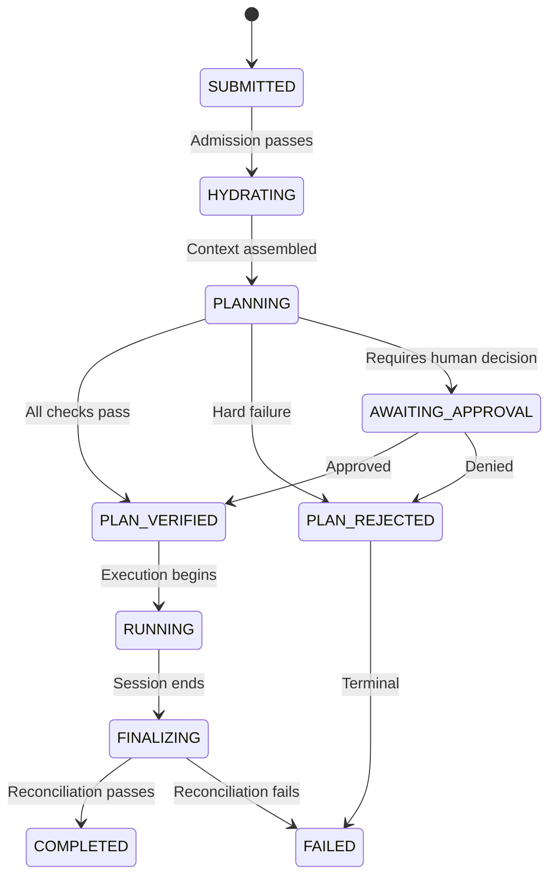
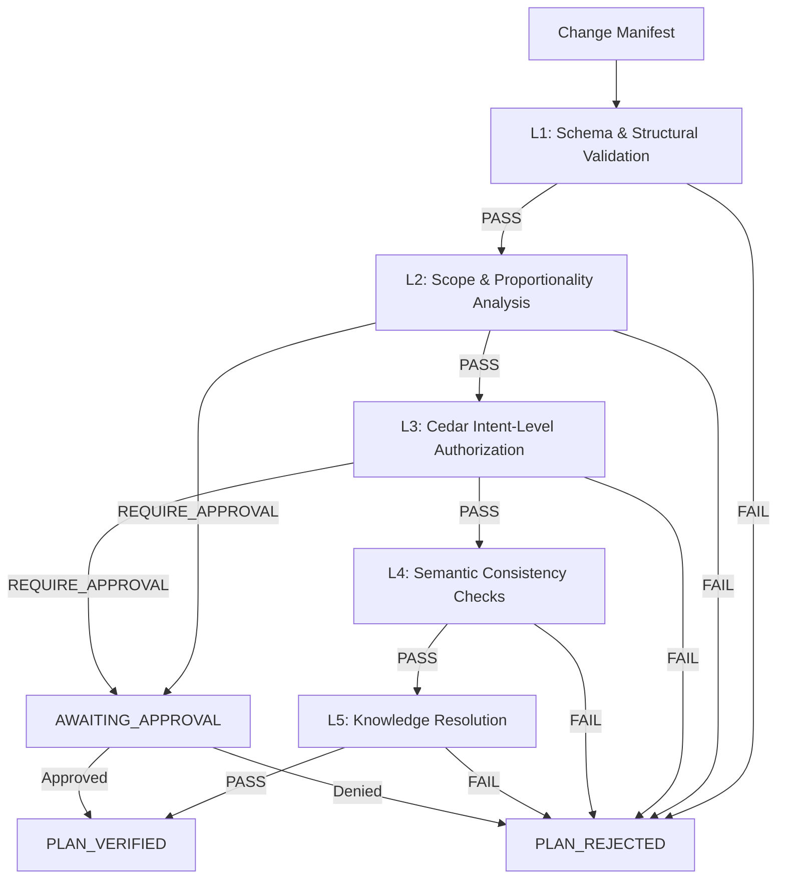
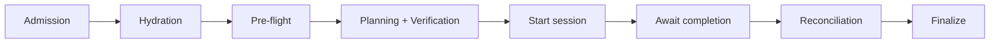
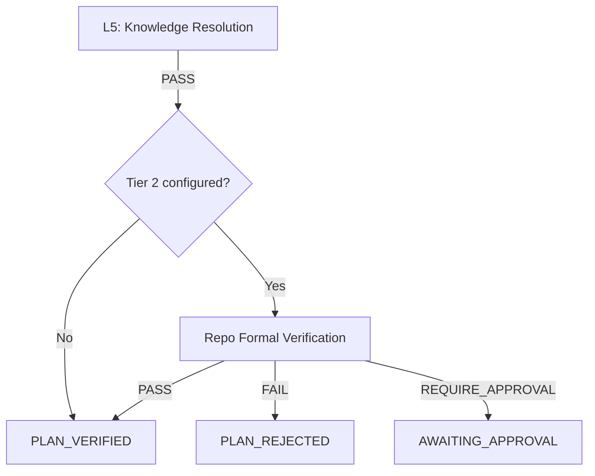

# Change Manifest

A structured intermediate representation between task intent and code execution. The agent produces a verifiable plan (the **Change Manifest**) before writing any code. The manifest is validated through multiple verification layers, then constrains execution so drift is detected early rather than discovered at PR review time.

- **Use this doc for:** understanding the planning phase, manifest schema, verification pipeline, drift enforcement, and reconciliation.
- **Related docs:** [ORCHESTRATOR.md](/architecture/orchestrator) for the task lifecycle this extends, [SECURITY.md](/architecture/security) for Cedar policy enforcement, [COMPUTE.md](/architecture/compute) for the agent runtime, [REPO_ONBOARDING.md](/architecture/repo-onboarding) for per-repo configuration.

## Motivation

Today the agent receives a task and immediately begins writing code. The platform has no visibility into the agent's intent until after execution completes. This creates three problems:

1. **Late failure detection** — A scope creep or wrong approach is only caught at PR review, after 10-30 minutes of compute.
2. **Opaque progress** — `bgagent watch` shows tool calls but not meaningful progress toward the goal.
3. **Coarse-grained governance** — Cedar policies govern tool-level access (can this agent use `Write`?) but not intent-level actions (should this agent modify the CI pipeline for a "fix typo" task?).

The Change Manifest solves all three by inserting a verifiable planning phase between task receipt and code execution.

## Design principle

**Verify intent before permitting execution.** The manifest is a structured claim about what the agent intends to do. Verification checks whether that intent is consistent, proportionate, and authorized. Execution is then constrained to the verified intent, with drift detection enforcing adherence.

The manifest is a guardrail, not a straitjacket. The agent can amend the manifest mid-execution when it discovers something unexpected, but amendments trigger re-verification.

## Pipeline overview



### New states

| State | Description | Duration |
|---|---|---|
| `PLANNING` | Agent has produced a manifest; verification is running | Seconds |
| `PLAN_VERIFIED` | Manifest passed all verification layers | Transient (immediate transition to RUNNING) |
| `PLAN_REJECTED` | Manifest failed verification; task cannot proceed | Terminal |
| `AWAITING_APPROVAL` | Manifest requires human approval before execution | Minutes to hours |

## Change Manifest schema

The manifest is a JSON document produced by the agent using structured output (tool_use response with a JSON schema). JSON is chosen over YAML because:

- LLMs produce valid JSON reliably via constrained decoding / structured output modes
- JSON has no implicit type coercion, no indentation sensitivity, no anchors — fewer parsing surprises
- Schema validation is native (JSON Schema), well-tooled, and battle-tested
- The manifest is machine-produced and machine-consumed; human readability is secondary

The agent emits the manifest as a tool call response to a `produce_change_manifest` tool, ensuring schema conformance at generation time rather than requiring post-hoc parsing and error recovery.

```json
{
  "version": 1,
  "task_id": "01J5X7...",
  "task_type": "new_task",
  "intent": {
    "summary": "Add rate limiting to the /tasks endpoint",
    "category": "feature"
  },
  "scope": {
    "files_to_create": [
      {
        "path": "cdk/src/constructs/rate-limiter.ts",
        "purpose": "L2 construct wrapping WAF rate-limit rule"
      },
      {
        "path": "cdk/test/constructs/rate-limiter.test.ts",
        "purpose": "Unit tests for rate limiter construct"
      }
    ],
    "files_to_modify": [
      {
        "path": "cdk/src/stacks/api-stack.ts",
        "reason": "Attach rate limiter to API Gateway stage",
        "sections": ["TaskApi construct instantiation"]
      }
    ],
    "files_to_delete": []
  },
  "approach": {
    "strategy": "WAF-based rate limiting per Cognito user sub",
    "alternatives_considered": [
      {
        "description": "API Gateway throttling",
        "rejected_because": "Per-stage not per-user"
      }
    ],
    "risks": ["WAF rule count limit (current: 4/10)"],
    "dependencies": [
      {
        "type": "npm_package",
        "name": "@aws-cdk/aws-wafv2",
        "action": "add"
      }
    ]
  },
  "knowledge_requirements": [
    {
      "domain": "aws-wafv2",
      "description": "WAF v2 CDK constructs: WebACL, RateBasedStatement, association to API Gateway",
      "sources": ["@aws-cdk/aws-wafv2 API reference"],
      "tool_needed": "awsdocs"
    },
    {
      "domain": "cdk-patterns",
      "description": "L2 construct authoring conventions in this repo",
      "sources": ["cdk/src/constructs/task-orchestrator.ts"],
      "tool_needed": null
    }
  ],
  "assertions": {
    "max_files_changed": 5,
    "no_changes_to": ["agent/", "cli/", ".github/"],
    "must_pass": ["mise //cdk:test", "mise //cdk:synth"]
  },
  "verification": null
}
```

### Schema constraints

| Field | Required | Validation |
|---|---|---|
| `version` | Yes | Must be `1` |
| `task_id` | Yes | Must match the running task |
| `intent.summary` | Yes | 10-200 characters |
| `intent.category` | Yes | Enum: feature, bugfix, refactor, docs, test, chore |
| `scope.files_to_create` | Yes (may be empty) | Each entry needs `path` and `purpose` |
| `scope.files_to_modify` | Yes (may be empty) | Each entry needs `path` and `reason` |
| `scope.files_to_delete` | Yes (may be empty) | Each entry needs `path` and `reason` |
| `approach.strategy` | Yes | Non-empty string |
| `knowledge_requirements` | Yes (may be empty) | Each entry needs `domain` and `description` |
| `assertions.max_files_changed` | Yes | Integer, >= total declared files |
| `assertions.must_pass` | Yes | At least one command |

## Verification pipeline

The manifest passes through five verification layers in sequence. Each layer can produce one of three outcomes: **PASS**, **FAIL** (hard rejection), or **REQUIRE_APPROVAL** (pause for human decision). If any layer fails, subsequent layers are skipped and the task transitions to `PLAN_REJECTED`.



### L1: Schema and structural validation

**Purpose:** Ensure the manifest is well-formed and internally consistent.

**Duration:** <100ms (in-process, no I/O)

**Checks:**

| Check | Failure condition | Outcome |
|---|---|---|
| JSON parsing | Invalid JSON (should not happen with structured output, but fail-safe) | FAIL |
| Schema conformance | Missing required fields, wrong types | FAIL |
| Task ID match | `manifest.task_id` != running task ID | FAIL |
| Path syntax | Paths contain `..`, absolute paths, or null bytes | FAIL |
| Self-consistency | `max_files_changed` < total declared files | FAIL |
| Assertion validity | `must_pass` contains unknown or disallowed commands | FAIL |
| Category coherence | `task_type=pr_review` but `category=feature` | FAIL |
| Knowledge source validity | `tool_needed` references a tool not in the known tool registry | FAIL |

**Implementation:** Pure function, no external dependencies. JSON Schema validation plus custom rules. Runs in the agent container before any network calls.

### L2: Scope and proportionality analysis

**Purpose:** Detect scope creep, disproportionate changes, and out-of-bounds modifications relative to the task description and blueprint configuration.

**Duration:** <500ms (reads blueprint config from memory, no external calls)

**Checks:**

| Check | Logic | Outcome |
|---|---|---|
| Allowed paths | All declared paths match blueprint's `allowed_paths` patterns | FAIL if outside boundary |
| Protected paths | Any declared path matches blueprint's `protected_paths` | REQUIRE_APPROVAL |
| Proportionality | File count vs. task complexity heuristic (see below) | REQUIRE_APPROVAL if disproportionate |
| Scope containment | Files outside the task's primary domain (e.g., task says "fix API bug" but manifest modifies `agent/`) | REQUIRE_APPROVAL |
| Deletion guard | Any `files_to_delete` entry | REQUIRE_APPROVAL (deletions are high-risk) |
| Dependency changes | `approach.dependencies` includes additions or removals | REQUIRE_APPROVAL |

**Proportionality heuristic:**

The proportionality check prevents a "fix typo" task from declaring 20 file modifications. The heuristic uses a lookup based on task category and description length as a proxy for complexity:

| Category | Baseline file budget | Multiplier for long descriptions (>500 chars) |
|---|---|---|
| docs | 3 | 2x |
| bugfix | 5 | 1.5x |
| chore | 5 | 1.5x |
| test | 8 | 2x |
| refactor | 10 | 2x |
| feature | 15 | 2x |

If the manifest declares more files than the budget, the check returns REQUIRE_APPROVAL (not FAIL — the agent might be right, but a human should confirm).

**Blueprint configuration:**

```json
{
  "change_manifest": {
    "allowed_paths": ["cdk/src/**", "cdk/test/**", "agent/src/**", "agent/tests/**"],
    "protected_paths": [".github/**", "**/package.json", "cdk/cdk.json", "Dockerfile"],
    "auto_approve_categories": ["docs", "test"]
  }
}
```

### L3: Cedar intent-level authorization

**Purpose:** Evaluate high-level intent actions against Cedar policies. This elevates governance from "can the agent use the Write tool?" to "should the agent modify CI configuration for this task type?"

**Duration:** <50ms (in-process Cedar evaluation via cedarpy)

**New Cedar actions (intent-level):**

| Action | Triggered when | Resource |
|---|---|---|
| `Agent::Action::"create_file"` | Manifest declares `files_to_create` | `Agent::FileDomain::"<domain>"` |
| `Agent::Action::"modify_file"` | Manifest declares `files_to_modify` | `Agent::FileDomain::"<domain>"` |
| `Agent::Action::"delete_file"` | Manifest declares `files_to_delete` | `Agent::FileDomain::"<domain>"` |
| `Agent::Action::"add_dependency"` | `approach.dependencies` includes additions | `Agent::Dependency::"<name>"` |
| `Agent::Action::"remove_dependency"` | `approach.dependencies` includes removals | `Agent::Dependency::"<name>"` |
| `Agent::Action::"modify_ci"` | Any path matches `.github/**` or CI-related patterns | `Agent::CIDomain::"ci"` |

**Domain derivation:** File paths are mapped to domains using a simple prefix table:

| Path prefix | Domain |
|---|---|
| `cdk/src/` | `cdk_source` |
| `cdk/test/` | `cdk_test` |
| `agent/src/` | `agent_source` |
| `agent/tests/` | `agent_test` |
| `cli/src/` | `cli_source` |
| `.github/` | `ci` |
| `docs/` | `docs` |
| Other | `other` |

**Example Cedar policies (intent-level):**

```cedar
// pr_review tasks cannot create or modify source files
forbid (
    principal == Agent::TaskAgent::"pr_review",
    action == Agent::Action::"create_file",
    resource == Agent::FileDomain::"cdk_source"
);
forbid (
    principal == Agent::TaskAgent::"pr_review",
    action == Agent::Action::"modify_file",
    resource == Agent::FileDomain::"cdk_source"
);

// No task type can modify CI without approval
forbid (
    principal,
    action == Agent::Action::"modify_ci",
    resource
);

// Only new_task can add dependencies
forbid (
    principal == Agent::TaskAgent::"pr_iteration",
    action == Agent::Action::"add_dependency",
    resource
);
```

**Three-outcome model:** This layer uses Phase 3's `REQUIRE_APPROVAL` outcome (see `Phase3-cedar-hitl.md`). The Cedar evaluation returns:

- **Allow** (no applicable forbid) → PASS
- **Deny** (hard forbid, no `@advice("require_approval")`) → FAIL
- **Deny with `@advice("require_approval")` annotation** → REQUIRE_APPROVAL

### L4: Semantic consistency checks

**Purpose:** Verify that the manifest makes sense given the current repository state. Unlike L1-L3 (which are purely structural or policy-based), L4 inspects the actual filesystem.

**Duration:** <2s (reads files, runs lightweight checks)

**Checks:**

| Check | Logic | Outcome |
|---|---|---|
| Existing file check | `files_to_create` paths must NOT already exist | FAIL (would overwrite) |
| Modify target exists | `files_to_modify` paths MUST exist | FAIL (can't modify what's not there) |
| Delete target exists | `files_to_delete` paths MUST exist | FAIL (can't delete what's not there) |
| Import graph impact | Modified files are imported by N other files; if N > threshold (default 10), flag | REQUIRE_APPROVAL |
| Test coverage | Every `files_to_create` in a source dir has a corresponding test entry | WARN (non-blocking, logged) |
| Circular scope | Manifest modifies a file that is part of the verification pipeline itself | FAIL |

**Implementation:** Runs inside the agent container after the repo is cloned. Uses `glob` and basic AST-level import tracing (language-specific; TypeScript first via regex, extensible).

### L5: Knowledge resolution

**Purpose:** Detect what domain knowledge the agent will need during execution and verify that appropriate knowledge sources are available. This prevents the agent from hallucinating APIs, using deprecated patterns, or spending turns groping in the dark for documentation that could have been provided upfront.

**Duration:** <3s (checks tool availability, fetches documentation indexes, validates sources exist)

**Inputs:** The `knowledge_requirements` array from the manifest. Each entry declares:

| Field | Description |
|---|---|
| `domain` | Short identifier for the knowledge area (e.g., `aws-wafv2`, `jest-mocks`, `cdk-nag`) |
| `description` | What specifically the agent needs to know (e.g., "WAF v2 RateBasedStatement configuration") |
| `sources` | Where this knowledge lives — can be documentation URLs, local file paths, or named references |
| `tool_needed` | Which documentation tool the agent requires access to (e.g., `awsdocs`, `npm-docs`, `mcp-server-name`), or `null` if the source is local |

**Checks:**

| Check | Logic | Outcome |
|---|---|---|
| Tool availability | Every non-null `tool_needed` must be in the agent's configured tool set | FAIL |
| Source reachability | Local file `sources` must exist in the cloned repo | FAIL |
| Documentation index match | External `sources` must resolve to known documentation packages or MCP server endpoints | WARN (non-blocking) |
| Knowledge gap detection | Cross-reference declared dependencies against knowledge requirements — a new dependency without a corresponding knowledge requirement is suspicious | WARN (non-blocking) |
| Redundant tool check | If `tool_needed` is declared but the agent already has the relevant knowledge embedded via repo examples (existing usage of the same library in-tree) | INFO (logged, may skip tool injection) |

**Resolution actions:**

When a knowledge requirement is validated, the verification layer produces a **tool provisioning plan** that the execution phase uses to configure the agent's environment:

```json
{
  "knowledge_resolution": {
    "resolved": [
      {
        "domain": "aws-wafv2",
        "tool": "awsdocs",
        "action": "inject",
        "config": {
          "scope": "@aws-cdk/aws-wafv2",
          "version": "latest"
        }
      },
      {
        "domain": "cdk-patterns",
        "tool": null,
        "action": "context_inject",
        "config": {
          "files": ["cdk/src/constructs/task-orchestrator.ts"],
          "inject_as": "reference_example"
        }
      }
    ],
    "unresolved": [],
    "warnings": []
  }
}
```

**Tool provisioning categories:**

| Action | Effect |
|---|---|
| `inject` | Enable an MCP server or documentation tool for this session |
| `context_inject` | Pre-load specific files or documentation snippets into the agent's context at execution start |
| `fetch_and_cache` | Download documentation to the sandbox filesystem before execution begins |
| `skip` | Knowledge is already available (in-tree examples found); no action needed |

**How this prevents hallucination:**

Without knowledge resolution, a typical failure mode is:

1. Agent needs to use `@aws-cdk/aws-wafv2`
2. Agent's training data has outdated API signatures
3. Agent writes code using non-existent constructs
4. Build fails after 5 minutes
5. Agent tries 3 more variations, all wrong
6. Task fails after 15 minutes of wasted compute

With knowledge resolution:

1. Agent declares `knowledge_requirements: [{domain: "aws-wafv2", tool_needed: "awsdocs"}]`
2. L5 verifies `awsdocs` tool is available and the package exists
3. Execution starts with `awsdocs` MCP server configured and scoped to `@aws-cdk/aws-wafv2`
4. Agent queries actual API docs before writing code
5. First attempt uses correct construct names and properties

**Blueprint configuration for knowledge tools:**

```json
{
  "change_manifest": {
    "knowledge_tools": {
      "available": ["awsdocs", "npm-docs", "gh-docs"],
      "mcp_servers": {
        "awsdocs": {
          "command": "npx",
          "args": ["-y", "@anthropic/awsdocs-mcp-server"],
          "scoped": true
        },
        "npm-docs": {
          "command": "npx",
          "args": ["-y", "@anthropic/npm-docs-mcp-server"],
          "scoped": true
        }
      },
      "max_tools_per_task": 3,
      "auto_detect_from_dependencies": true
    }
  }
}
```

**Auto-detection:** When `auto_detect_from_dependencies` is enabled, the verification layer cross-references declared `approach.dependencies` against the tool registry. If an agent adds a dependency but does not declare a knowledge requirement for it, L5 emits a warning and optionally auto-injects the relevant documentation tool (configurable: `warn` | `auto_inject` | `ignore`).

**Interaction with Cedar policies:**

Tool injection from knowledge resolution is subject to Cedar authorization. A new action is evaluated:

```cedar
// Allow documentation tools to be injected for new_task
permit (
    principal == Agent::TaskAgent::"new_task",
    action == Agent::Action::"inject_knowledge_tool",
    resource
);

// pr_review can only use read-only documentation tools
permit (
    principal == Agent::TaskAgent::"pr_review",
    action == Agent::Action::"inject_knowledge_tool",
    resource == Agent::KnowledgeTool::"awsdocs"
);
forbid (
    principal == Agent::TaskAgent::"pr_review",
    action == Agent::Action::"inject_knowledge_tool",
    resource == Agent::KnowledgeTool::"npm-docs"
);
```

## Verification report

After all five layers execute, a structured verification report is attached to the manifest and persisted to the TaskEvents table:

```json
{
  "verification": {
    "status": "VERIFIED",
    "timestamp": "2026-05-09T14:32:01Z",
    "duration_ms": 1247,
    "layers": [
      {
        "name": "schema_validation",
        "status": "PASS",
        "duration_ms": 12,
        "checks_run": 8,
        "checks_passed": 8
      },
      {
        "name": "scope_proportionality",
        "status": "PASS",
        "duration_ms": 203,
        "checks_run": 6,
        "checks_passed": 6,
        "notes": ["File budget: 5/15 (feature category)"]
      },
      {
        "name": "cedar_intent_authorization",
        "status": "PASS",
        "duration_ms": 38,
        "checks_run": 4,
        "checks_passed": 4
      },
      {
        "name": "semantic_consistency",
        "status": "PASS",
        "duration_ms": 594,
        "checks_run": 6,
        "checks_passed": 5,
        "warnings": [
          "cdk/src/constructs/rate-limiter.ts has no corresponding test in manifest (non-blocking)"
        ]
      },
      {
        "name": "knowledge_resolution",
        "status": "PASS",
        "duration_ms": 400,
        "checks_run": 3,
        "checks_passed": 3,
        "tools_injected": ["awsdocs"],
        "context_files_loaded": ["cdk/src/constructs/task-orchestrator.ts"],
        "notes": ["awsdocs scoped to @aws-cdk/aws-wafv2"]
      }
    ],
    "approved_scope": {
      "files_hash": "sha256:abc123...",
      "assertions_hash": "sha256:def456..."
    }
  }
}
```

The `files_hash` and `assertions_hash` are used during execution to detect manifest tampering — if the agent somehow modifies the manifest without going through the amendment flow, the hashes won't match and execution is halted.

## Execution constraint: drift detection

Once the manifest is verified, it constrains execution. The PreToolUse hook gains a manifest-aware layer that runs after Cedar tool-level checks pass:

### Drift detection rules

| Agent action | Manifest check | On violation |
|---|---|---|
| `Write` to a new file | Path must be in `files_to_create` | Block + prompt agent to amend manifest |
| `Edit` an existing file | Path must be in `files_to_modify` | Block + prompt agent to amend manifest |
| `Bash` that deletes a file | Path must be in `files_to_delete` | Block |
| `Write`/`Edit` any file | Total unique files touched <= `max_files_changed` | Block |
| `Write`/`Edit` any file | Path must not match `no_changes_to` patterns | Block (hard, no amendment) |
| `Bash` that runs tests | Allowed regardless (read-only observation) | Allow always |
| `Read`/`Glob`/`Grep` | No restriction (reading is non-destructive) | Allow always |

### Manifest amendment flow

When the agent discovers that its plan was incomplete (e.g., a file needs modification that wasn't in the original manifest), it can amend the manifest:

1. Agent produces an updated manifest with new entries
2. The delta (new entries only) goes through L1-L5 verification
3. If verified, the execution constraint updates with the expanded scope
4. If rejected or requires approval, the agent must find an alternative approach or the task fails

Amendments are tracked in the verification report so reviewers can see what changed during execution:

```json
{
  "amendments": [
    {
      "timestamp": "2026-05-09T14:45:12Z",
      "added": {
        "files_to_modify": [
          {
            "path": "cdk/src/constructs/api-gateway.ts",
            "reason": "Rate limiter requires WAF association on the gateway construct"
          }
        ]
      },
      "verification": {
        "status": "VERIFIED",
        "duration_ms": 312
      }
    }
  ]
}
```

**Amendment budget:** The blueprint can limit how many amendments are allowed per task (default: 3). Excessive amendments suggest the planning phase produced a poor plan, and the task should fail with a clear signal for prompt improvement.

## Reconciliation

After execution completes, reconciliation compares the actual diff against the manifest. This produces a structured report that becomes part of the PR description and is stored for learning.

### Reconciliation checks

| Check | Logic | Outcome |
|---|---|---|
| Completeness | Every `files_to_create` was created | Partial completion warning |
| Completeness | Every `files_to_modify` was modified | Partial completion warning |
| Scope adherence | No files outside manifest were touched | Violation (should not happen if drift detection works) |
| Assertion checks | All `must_pass` commands succeed | FAIL if any fails |
| Unused declarations | Manifest declared files that were never touched | Note (over-planning) |

### Reconciliation report

```json
{
  "reconciliation": {
    "plan_adherence_score": 92,
    "manifest_items": 5,
    "items_completed": 4,
    "items_skipped": 1,
    "scope_violations": 0,
    "amendments_used": 1,
    "knowledge_tools_used": ["awsdocs"],
    "knowledge_queries": 4,
    "assertions": [
      { "command": "mise //cdk:test", "status": "PASS", "duration_ms": 12400 },
      { "command": "mise //cdk:synth", "status": "PASS", "duration_ms": 8200 }
    ],
    "skipped_items": [
      {
        "path": "cdk/test/constructs/rate-limiter.test.ts",
        "declared_as": "files_to_create",
        "reason": "Agent determined existing test file covered the construct"
      }
    ]
  }
}
```

The `plan_adherence_score` is computed as: `(items_completed / manifest_items) * 100`, penalized by `-10` per scope violation and `-5` per unused amendment.

## Human approval flow

When verification returns `REQUIRE_APPROVAL`, the task pauses and waits for a human decision.

### Approval request

Written to the TaskEvents table and surfaced via `bgagent status` and notifications:

```json
{
  "event_type": "approval_required",
  "metadata": {
    "manifest_summary": "Add rate limiting: 3 files created, 1 modified",
    "trigger_layer": "cedar_intent_authorization",
    "trigger_reason": "Task modifies CI domain (.github/workflows/ci.yml)",
    "scope_options": {
      "narrow": "Approve this specific file only",
      "medium": "Approve all .github/ modifications for this task",
      "broad": "Approve CI modifications for all tasks in this repo"
    }
  }
}
```

### Approval scopes

| Scope | Effect | Duration |
|---|---|---|
| `narrow` | Approve only the specific action in this manifest | This task only |
| `medium` | Approve the action category for this task | This task only |
| `broad` | Add a persistent Cedar permit rule to the blueprint | All future tasks |

Broad approvals generate a Cedar policy that is appended to the blueprint's `security.cedarPolicies` array and persisted to the RepoTable.

### Timeout

If no approval is received within the configured timeout (default: 4 hours), the task transitions to `PLAN_REJECTED` with reason `approval_timeout`.

## Integration with existing orchestrator

The planning phase inserts between hydration and session start in the existing blueprint execution:



### Implementation boundaries

| Component | Changes |
|---|---|
| `orchestrator.ts` | New states (`PLANNING`, `PLAN_VERIFIED`, `PLAN_REJECTED`, `AWAITING_APPROVAL`), new steps in blueprint execution |
| `agent/src/pipeline.py` | Split into two-phase execution: planning call + constrained execution call |
| `agent/src/hooks.py` | Manifest-aware drift detection in PreToolUse hook |
| `agent/src/policy.py` | New intent-level Cedar actions and domain-mapping logic |
| `agent/prompts/` | Planning prompt variant that instructs agent to produce manifest before code |
| Blueprint / RepoConfig | `change_manifest` configuration block (allowed_paths, protected_paths, amendment_budget, etc.) |
| TaskEvents table | New event types: `manifest_produced`, `manifest_verified`, `approval_required`, `approval_granted`, `manifest_amended`, `reconciliation_complete` |
| `bgagent watch` | Display manifest items as structured progress |
| `types.ts` | New task states, manifest types, reconciliation report types |

### Opt-in rollout

The planning phase is enabled per-repo via blueprint configuration:

```json
{
  "change_manifest": {
    "enabled": true,
    "require_approval_for_protected": true,
    "amendment_budget": 3,
    "approval_timeout_hours": 4,
    "proportionality_check": true,
    "skip_for_categories": ["docs", "chore"]
  }
}
```

When disabled (default for existing repos), the orchestrator skips directly from pre-flight to session start, preserving current behavior.

## Two-tier verification model

The verification pipeline operates at two tiers, cleanly separating concerns:

### Tier 1: Generic structural verification (platform-provided)

Layers L1-L5 as described above. These run on every task regardless of the target codebase. They answer universal questions:

- Is the plan well-formed? (L1)
- Is the scope proportionate and within bounds? (L2)
- Is the intent authorized? (L3)
- Does the plan match filesystem reality? (L4)
- Does the agent have the knowledge it needs? (L5)

The manifest format is JSON because Tier 1 is a **coordination artifact** — it describes intent at a level meaningful across any tech stack. A TLA+ codebase and a React app both benefit from scope checking, Cedar authorization, and knowledge resolution.

### Tier 2: Repo-specific formal verification (blueprint-provided)

Some codebases have their own verification tooling — TLA+ specs, Alloy models, property-based test frameworks, Stateright model checkers, strict type systems with refinement types. For these repos, the manifest should declare what formal artifacts the agent will produce, and the repo's own verification pipeline should run before execution proceeds.

Tier 2 hooks into the pipeline as a **custom verification step** between L5 and `PLAN_VERIFIED`:



**How it works:**

The manifest gains an optional `formal_artifacts` field when Tier 2 is configured:

```json
{
  "formal_artifacts": [
    {
      "type": "tla_plus",
      "path": "specs/rate-limiter.tla",
      "purpose": "Prove mutual exclusion on concurrent rate limit counter updates",
      "verifier": "tlc"
    },
    {
      "type": "proptest",
      "path": "cdk/test/constructs/rate-limiter.proptest.ts",
      "purpose": "Property: rate limit never exceeds configured max under concurrent requests",
      "verifier": "jest"
    }
  ]
}
```

**Tier 2 verification flow:**

1. The agent produces the formal artifact during the planning phase (alongside the manifest)
2. The blueprint specifies which verifier to run and its expected output format
3. The platform executes the verifier in the sandbox (time-bounded, sandboxed)
4. Pass/fail is determined by exit code and structured output

**Blueprint configuration for Tier 2:**

```json
{
  "change_manifest": {
    "formal_verification": {
      "enabled": true,
      "verifiers": {
        "tlc": {
          "command": "java -jar tla2tools.jar -deadlock",
          "timeout_seconds": 60,
          "required_for": ["feature", "refactor"]
        },
        "jest": {
          "command": "npx jest --testPathPattern=proptest",
          "timeout_seconds": 30,
          "required_for": ["feature", "bugfix"]
        },
        "cargo_test": {
          "command": "cargo test --lib -- --include-ignored formal_",
          "timeout_seconds": 120,
          "required_for": ["feature"]
        }
      },
      "skip_for_categories": ["docs", "chore", "test"]
    }
  }
}
```

**Key design decisions:**

- **The manifest does NOT try to be the formal spec.** It's the envelope that declares "I will produce a TLA+ spec proving X." The spec itself is a separate file in the repo's native format.
- **The platform has no opinion about verification semantics.** It knows how to run a command, check the exit code, and capture output. TLC, Alloy, Z3, proptest, Stateright — all look the same from the platform's perspective: `command → exit code → pass/fail`.
- **Tier 2 is fully opt-in.** Most repos don't have formal methods tooling. The generic Tier 1 checks still provide meaningful governance without any special setup.
- **Formal artifacts become part of the PR.** The TLA+ spec or property test produced during planning is committed alongside the implementation code, providing ongoing verification value beyond the initial task.

**Interaction with knowledge resolution (L5):**

When Tier 2 is configured, L5 automatically adds knowledge requirements for the verification tooling. If the blueprint declares a `tlc` verifier, L5 ensures the agent has access to TLA+ documentation and examples from the repo's existing specs (via `context_inject`). This prevents the agent from producing syntactically invalid formal artifacts.

**When Tier 2 adds value vs. when it's overhead:**

| Scenario | Tier 2 appropriate? | Rationale |
|---|---|---|
| Concurrent state machine changes | Yes | TLA+/Stateright catches race conditions static analysis misses |
| New API endpoint with CRUD | No | Generic scope + type checking is sufficient |
| Distributed system coordination | Yes | Model checking explores interleavings humans can't reason about |
| UI component addition | No | Property tests on render are lower value than integration tests |
| Security-critical auth changes | Maybe | Depends on whether the repo has formal security properties |

## Observability

### New CloudWatch metrics

| Metric | Dimensions | Purpose |
|---|---|---|
| `ManifestVerificationDuration` | Layer, Outcome | Track verification latency |
| `ManifestOutcome` | Outcome (VERIFIED/REJECTED/APPROVAL_REQUIRED) | Rejection rate |
| `DriftDetectionBlocks` | Repo, TaskType | How often agents try to exceed scope |
| `AmendmentRate` | Repo, TaskType | Planning quality signal |
| `PlanAdherenceScore` | Repo, TaskType, Category | Execution quality signal |
| `ApprovalLatency` | Scope | Time humans take to respond |
| `KnowledgeToolsInjected` | Tool, Repo | Which doc tools are actually used |
| `KnowledgeQueriesPerTask` | Tool, TaskType | How much agents use injected docs |
| `KnowledgeGapDetected` | Repo, Domain | Dependencies declared without matching knowledge requirements |

### Learning signal

The `(manifest, actual_diff, PR_outcome)` triple is stored for post-hoc analysis:

- **High adherence + merged PR** → Good planning, reinforce prompt patterns
- **High adherence + rejected PR** → Plan was wrong; improve verification heuristics
- **Low adherence (many amendments) + merged PR** → Planning prompt needs improvement
- **Frequent REQUIRE_APPROVAL for same action** → Consider adding a persistent permit
- **Knowledge tool injected + zero queries** → Agent didn't need it; remove from auto-detect for this domain
- **No knowledge tool + build failure on unknown API** → Missing knowledge requirement; improve planning prompt to declare dependencies

## Cost impact

| Component | Additional cost per task | Notes |
|---|---|---|
| Planning phase (extra model call) | ~$0.02-0.08 | Short context, structured output |
| Verification L1-L4 (in-process) | ~$0 | CPU-only, <2s |
| Knowledge resolution L5 | ~$0-0.01 | MCP server startup + index fetch; cached after first use |
| Knowledge tool usage during execution | ~$0.01-0.05 | Per-query cost to doc servers; bounded by query budget |
| Manifest storage | Negligible | Small JSON in DynamoDB |
| Drift detection | ~$0 | In-memory check per tool call |
| Reconciliation | ~$0.01 | Runs `must_pass` commands (would run anyway) |

**Net impact:** ~$0.04-0.15 per task. Offset by:
- Reduced wasted compute from early scope-creep detection (estimated 15-20% of tasks drift and get rejected at PR review)
- Fewer retry loops from API hallucination when knowledge tools are available (estimated 2-4 turns saved per task involving unfamiliar libraries)

## Security considerations

- **Manifest injection** — The manifest is agent-produced. A compromised or jailbroken agent could craft a manifest that passes verification but is misleading. Mitigation: verification checks the manifest against actual filesystem state (L4), and drift detection constrains execution to declared scope regardless of what the manifest claims.
- **Amendment abuse** — An agent could repeatedly amend to gradually expand scope. Mitigation: amendment budget, full re-verification on each amendment, all amendments logged.
- **Approval fatigue** — Too many approval requests train humans to auto-approve. Mitigation: `auto_approve_categories` for low-risk work, proportionality thresholds tuned to minimize false positives, `broad` scope option to permanently resolve recurring patterns.
- **Hash tampering** — The verification report hashes are computed server-side (in the hook, not by the agent) from the verified manifest content. The agent cannot modify the hashes without re-triggering verification.
- **Knowledge tool as exfiltration channel** — An injected MCP server could be used to send data out of the sandbox. Mitigation: knowledge tools must be from the blueprint's allowlist (`knowledge_tools.available`), Cedar gates every injection, and MCP servers run in read-only mode (no write/execute actions exposed). Network egress is already constrained by the MicroVM sandbox.
- **Poisoned documentation** — If a knowledge tool returns malicious content (prompt injection in docs), the agent could be manipulated. Mitigation: documentation responses pass through the same content screening as PR comments (Bedrock Guardrails for prompt attack detection), and the manifest's scope constraints limit what the agent can do regardless of what it's told.
