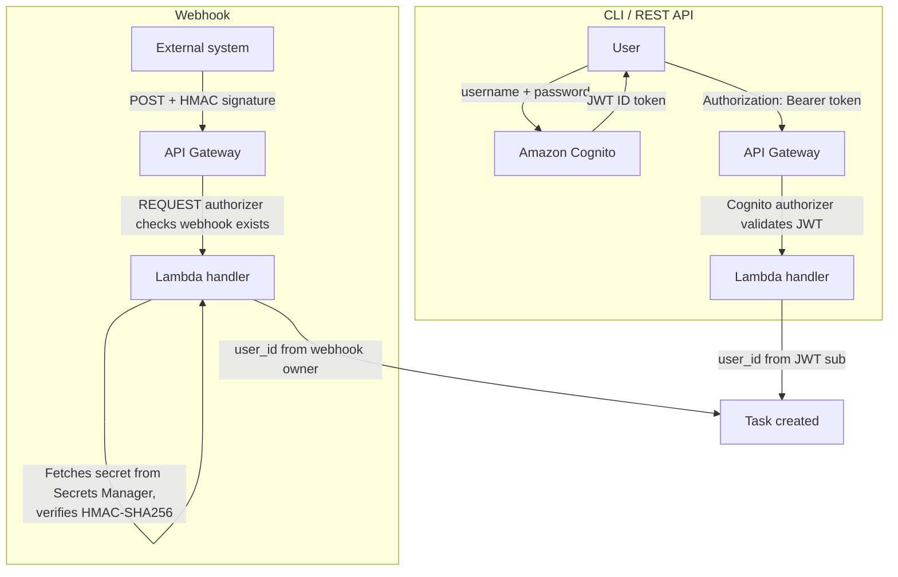

The platform uses two authentication mechanisms depending on the channel:

- **CLI / REST API** - Amazon Cognito User Pool with JWT tokens. Self-signup is disabled; an administrator must create your account.
- **Webhooks** - HMAC-SHA256 signatures using per-integration shared secrets stored in AWS Secrets Manager.

Both channels are protected by AWS WAF at the API Gateway edge (rate limiting, common exploit protection). Downstream services never see raw tokens or secrets - the gateway extracts the user identity and attaches it to internal messages.



**CLI / REST API flow:**

1. **Authenticate** - The user sends username and password to Amazon Cognito via the CLI (`bgagent login`) or the AWS SDK (`initiate-auth`).
2. **Receive token** - Cognito validates credentials and returns a JWT ID token. The CLI caches it locally (`~/.bgagent/credentials.json`) and auto-refreshes on expiry.
3. **Call the API** - Every request includes the token in the `Authorization: Bearer <token>` header.
4. **Validate** - API Gateway's Cognito authorizer verifies the JWT signature, expiration, and audience. Invalid tokens are rejected with `401`.
5. **Extract identity** - The Lambda handler reads the `sub` claim from the validated JWT and uses it as `user_id` for task ownership and audit.

**Webhook flow:**

1. **Send request** - The external system (CI pipeline, GitHub Actions) sends a `POST` to `/v1/webhooks/tasks` with two headers: `X-Webhook-Id` (identifies the integration) and `X-Webhook-Signature` (`sha256=<hex>`).
2. **Check webhook exists** - A Lambda REQUEST authorizer verifies that the webhook ID exists and is active in DynamoDB. Revoked or unknown webhooks are rejected with `403`.
3. **Verify signature** - The handler fetches the webhook's shared secret from AWS Secrets Manager, computes `HMAC-SHA256(secret, raw_request_body)`, and compares it to the provided signature using constant-time comparison (`crypto.timingSafeEqual`). Mismatches are rejected with `403`.
4. **Extract identity** - The `user_id` is the Cognito user who originally created the webhook integration. Tasks created via webhook are owned by that user.

### Joining an existing deployment

If your team already has ABCA deployed and someone (the "stack admin") has invited you, this is your path. You will **not** run `cdk deploy`, will **not** run `bgagent linear setup`, and will not need AWS credentials. You're a tenant on a shared deployment.

Three steps:

1. **Get a config bundle from your admin.** They run `bgagent admin invite-user your-email@example.com` and send you the output via Slack / 1Password / email. The output looks like:

   ```
   ✓ Created Cognito user your-email@example.com
   ✓ Set permanent password (no first-login change required)

   Share with the new teammate:
   ────────────────────────────────────────────────────────────────
     email:    your-email@example.com
     password: K9$mPq2nL!vXf3Hb
     bundle:   eyJhcGlfdXJsIjoiaHR0cHM6Ly9hYmMxMjM…
   ────────────────────────────────────────────────────────────────
   ```

   The `bundle` is a base64 blob carrying the four config fields (API URL, region, user pool ID, app client ID) so you don't have to type them as separate flags.

2. **Configure your CLI from the bundle:**

   ```bash
   bgagent configure --from-bundle <paste the base64 string>
   ```

3. **Log in with the temp password:**

   ```bash
   bgagent login --username your-email@example.com
   # paste the temp password
   ```

   The CLI caches your tokens in `~/.bgagent/credentials.json` and auto-refreshes them.

You're in. `bgagent submit`, `bgagent list`, `bgagent status` work against the shared stack. Tasks you submit are attributed to your Cognito user; concurrency caps and budgets are scoped to you.

**You do not run** `bgagent linear setup` or `bgagent slack setup` — those are workspace-level operations performed once by the stack/workspace admin. If you want Linear-triggered tasks to be attributed to *you* (not auto-dropped), the admin needs to map your Linear identity to your Cognito user; ask them about [Linear user linking](/using/linear-setup-guide#step-6-link-your-linear-account).

If something looks broken (commands fail with `Not configured` or `401 Unauthorized`), re-paste the bundle and re-run `bgagent login`. The bundle holds no secrets — your password (separate) is the credential.

### Get stack outputs

After deployment, retrieve the API URL and Cognito identifiers. Set `REGION` to the AWS region where you deployed the stack (for example `us-east-1`). Use the same value for all `aws` and `bgagent configure` commands below  - a mismatch often surfaces as a confusing Cognito “app client does not exist” error.

```bash
REGION=<your-deployment-region>

API_URL=$(aws cloudformation describe-stacks --stack-name backgroundagent-dev \
  --region "$REGION" \
  --query 'Stacks[0].Outputs[?OutputKey==`ApiUrl`].OutputValue' --output text)
USER_POOL_ID=$(aws cloudformation describe-stacks --stack-name backgroundagent-dev \
  --region "$REGION" \
  --query 'Stacks[0].Outputs[?OutputKey==`UserPoolId`].OutputValue' --output text)
APP_CLIENT_ID=$(aws cloudformation describe-stacks --stack-name backgroundagent-dev \
  --region "$REGION" \
  --query 'Stacks[0].Outputs[?OutputKey==`AppClientId`].OutputValue' --output text)
```

### Invite a teammate (admin)

```bash
bgagent admin invite-user teammate@example.com
```

This wraps Cognito `admin-create-user` + `admin-set-user-password` with the right defaults (email-verified, password set as permanent so the teammate doesn't hit a password-change flow on first login, suppress-email so SES isn't required) and prints a shareable config bundle plus an auto-generated strong temp password. Send the bundle + password to the teammate; they paste them into `bgagent configure --from-bundle <bundle>` + `bgagent login --username <email>` and they're in.

The CLI command requires the running shell to have AWS credentials with `cognito-idp:AdminCreateUser` and `cognito-idp:AdminSetUserPassword` on the configured user pool — i.e. you're acting as the stack admin, not as a Cognito-authenticated end-user.

**Pool constraints** (enforced server-side; the CLI handles them, but useful to know if you ever need to bypass it with raw AWS CLI):

- **Username MUST be an email address.** The pool is configured with email as the sign-in alias.
- **Password policy**: minimum 12 characters, with at least one uppercase, lowercase, digit, and symbol.
- **`email_verified=true` attribute is required**, otherwise the account stays in `FORCE_CHANGE_PASSWORD` state and `initiate-auth` fails with `User is not confirmed`.
- **`--message-action SUPPRESS`** stops Cognito from trying to email the temp password — required unless you've set up SES verified identities.

#### Raw AWS CLI fallback

If you can't run `bgagent admin invite-user` (e.g., you're scripting this from CI without the CLI installed), the underlying calls are:

```bash
aws cognito-idp admin-create-user \
  --region "$REGION" \
  --user-pool-id $USER_POOL_ID \
  --username user@example.com \
  --user-attributes Name=email,Value=user@example.com Name=email_verified,Value=true \
  --temporary-password 'TempPass123!@' \
  --message-action SUPPRESS

aws cognito-idp admin-set-user-password \
  --region "$REGION" \
  --user-pool-id $USER_POOL_ID \
  --username user@example.com \
  --password 'YourPerm@nent1Pass!' \
  --permanent
```

The first command creates the user with a temporary password and pre-verifies the email. The second sets a permanent password so the teammate does not have to go through a password change flow on first login. After running these, hand the teammate the four config fields manually (or build the bundle: `echo '{"api_url":"…","region":"…","user_pool_id":"…","client_id":"…"}' | base64`).

### Obtain a JWT token

```bash
TOKEN=$(aws cognito-idp initiate-auth \
  --region "$REGION" \
  --client-id $APP_CLIENT_ID \
  --auth-flow USER_PASSWORD_AUTH \
  --auth-parameters USERNAME=user@example.com,PASSWORD='YourPerm@nent1Pass!' \
  --query 'AuthenticationResult.IdToken' --output text)
```

Use this token in the `Authorization` header for all API requests.