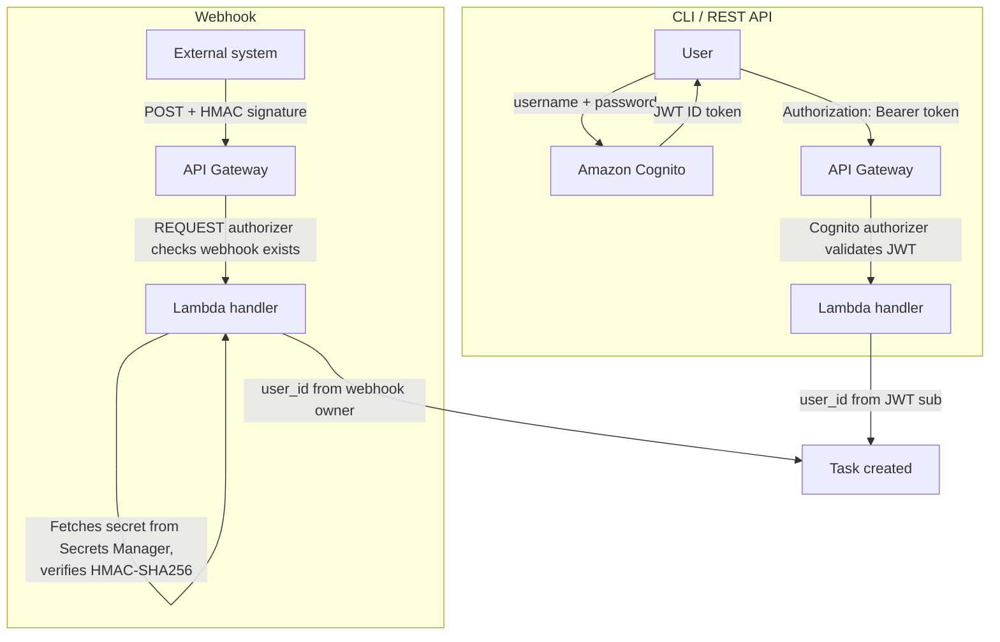

The platform uses two authentication mechanisms depending on the channel:

- **CLI / REST API** - Amazon Cognito User Pool with JWT tokens. Self-signup is disabled; an administrator must create your account.
- **Webhooks** - HMAC-SHA256 signatures using per-integration shared secrets stored in AWS Secrets Manager.

Both channels are protected by AWS WAF at the API Gateway edge (rate limiting, common exploit protection). Downstream services never see raw tokens or secrets - the gateway extracts the user identity and attaches it to internal messages.



**CLI / REST API flow:**

1. **Authenticate** - The user sends username and password to Amazon Cognito via the CLI (`bgagent login`) or the AWS SDK (`initiate-auth`).
2. **Receive token** - Cognito validates credentials and returns a JWT ID token. The CLI caches it locally (`~/.bgagent/credentials.json`) and auto-refreshes on expiry.
3. **Call the API** - Every request includes the token in the `Authorization: Bearer <token>` header.
4. **Validate** - API Gateway's Cognito authorizer verifies the JWT signature, expiration, and audience. Invalid tokens are rejected with `401`.
5. **Extract identity** - The Lambda handler reads the `sub` claim from the validated JWT and uses it as `user_id` for task ownership and audit.

**Webhook flow:**

1. **Send request** - The external system (CI pipeline, GitHub Actions) sends a `POST` to `/v1/webhooks/tasks` with two headers: `X-Webhook-Id` (identifies the integration) and `X-Webhook-Signature` (`sha256=<hex>`).
2. **Check webhook exists** - A Lambda REQUEST authorizer verifies that the webhook ID exists and is active in DynamoDB. Revoked or unknown webhooks are rejected with `403`.
3. **Verify signature** - The handler fetches the webhook's shared secret from AWS Secrets Manager, computes `HMAC-SHA256(secret, raw_request_body)`, and compares it to the provided signature using constant-time comparison (`crypto.timingSafeEqual`). Mismatches are rejected with `403`.
4. **Extract identity** - The `user_id` is the Cognito user who originally created the webhook integration. Tasks created via webhook are owned by that user.

### Get stack outputs

After deployment, retrieve the API URL and Cognito identifiers. Set `REGION` to the AWS region where you deployed the stack (for example `us-east-1`). Use the same value for all `aws` and `bgagent configure` commands below  - a mismatch often surfaces as a confusing Cognito “app client does not exist” error.

```bash
REGION=<your-deployment-region>

API_URL=$(aws cloudformation describe-stacks --stack-name backgroundagent-dev \
  --region "$REGION" \
  --query 'Stacks[0].Outputs[?OutputKey==`ApiUrl`].OutputValue' --output text)
USER_POOL_ID=$(aws cloudformation describe-stacks --stack-name backgroundagent-dev \
  --region "$REGION" \
  --query 'Stacks[0].Outputs[?OutputKey==`UserPoolId`].OutputValue' --output text)
APP_CLIENT_ID=$(aws cloudformation describe-stacks --stack-name backgroundagent-dev \
  --region "$REGION" \
  --query 'Stacks[0].Outputs[?OutputKey==`AppClientId`].OutputValue' --output text)
```

### Create a user (admin)

```bash
aws cognito-idp admin-create-user \
  --region "$REGION" \
  --user-pool-id $USER_POOL_ID \
  --username user@example.com \
  --user-attributes Name=email,Value=user@example.com Name=email_verified,Value=true \
  --temporary-password 'TempPass123!@' \
  --message-action SUPPRESS

aws cognito-idp admin-set-user-password \
  --region "$REGION" \
  --user-pool-id $USER_POOL_ID \
  --username user@example.com \
  --password 'YourPerm@nent1Pass!' \
  --permanent
```

**Pool constraints** (enforced server-side; ignoring them yields cryptic Cognito errors at login):

- **Username MUST be an email address.** The pool is configured with email as the sign-in alias, so `--username` has to be a valid email — short handles like `alice` are rejected at create time.
- **Password policy**: minimum 12 characters, with at least one uppercase letter, one lowercase letter, one digit, and one symbol.
- **`email_verified=true` attribute is required** for the account to log in. Creating a user without it leaves the account in `FORCE_CHANGE_PASSWORD` state and subsequent `initiate-auth` calls fail with `User is not confirmed`.
- **`--message-action SUPPRESS`** stops Cognito from trying to email the temporary password. If SES isn't configured on the account, omitting this flag causes `admin-create-user` to fail with `NotAuthorizedException`. Safe for non-prod; omit only if you have a working SES sender identity.

The first command creates the user with a temporary password and pre-verifies the email. The second sets a permanent password so you do not have to go through a password change flow on first login.

### Obtain a JWT token

```bash
TOKEN=$(aws cognito-idp initiate-auth \
  --region "$REGION" \
  --client-id $APP_CLIENT_ID \
  --auth-flow USER_PASSWORD_AUTH \
  --auth-parameters USERNAME=user@example.com,PASSWORD='YourPerm@nent1Pass!' \
  --query 'AuthenticationResult.IdToken' --output text)
```

Use this token in the `Authorization` header for all API requests.